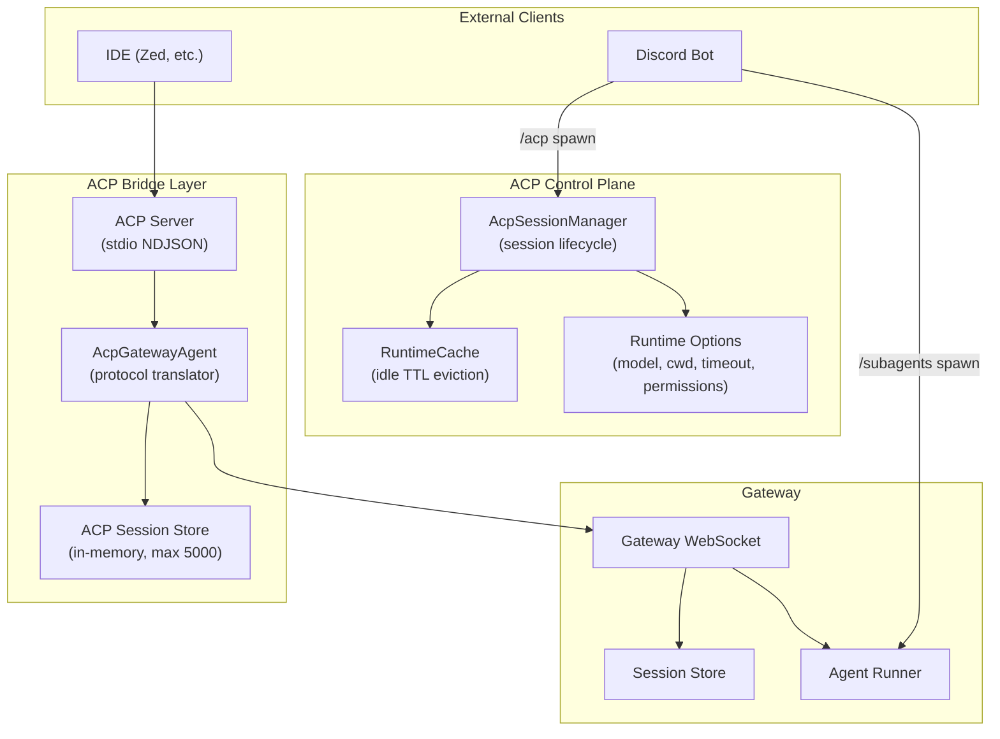
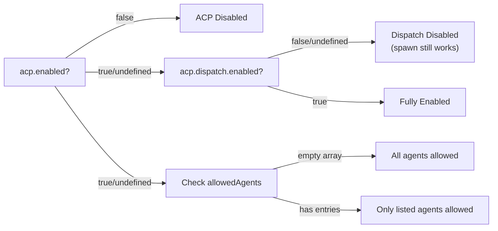
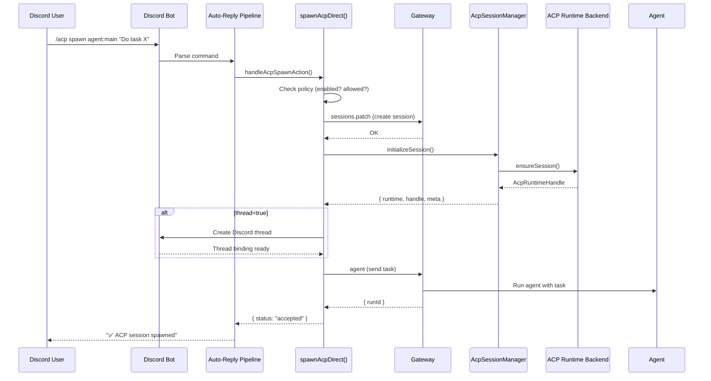
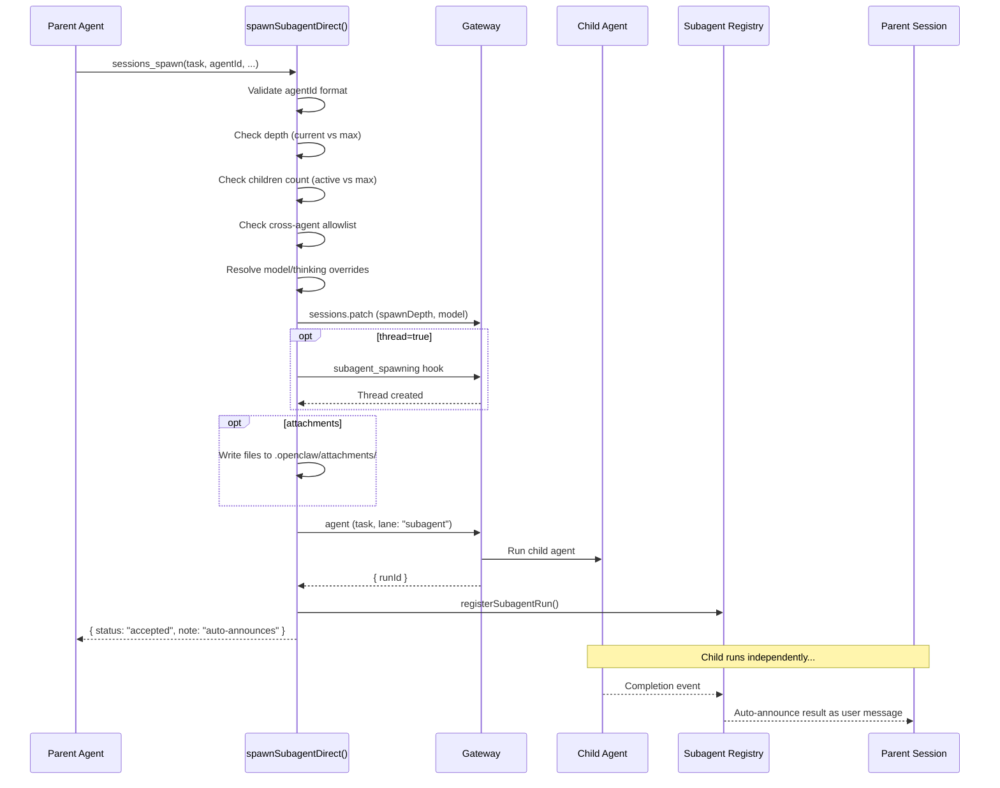
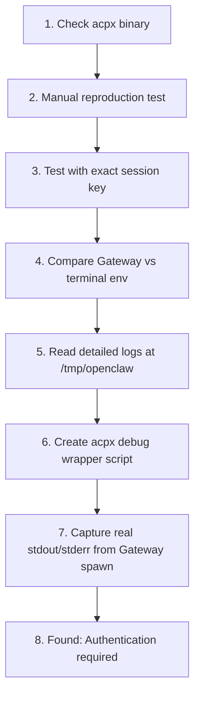

# ACP (Agent Client Protocol) Deep-Dive from Source Code

## Architecture Overview

ACP in OpenClaw is a **bridge layer** that connects external clients (IDEs, Discord, etc.) to the internal Gateway, translating between the ACP protocol and Gateway session operations.



---

## Key Source Files

| Layer | File | Purpose |
|---|---|---|
| Server | `src/acp/server.ts` | stdio NDJSON server, Gateway WebSocket client |
| Translator | `src/acp/translator.ts` | Maps ACP ↔ Gateway protocol messages |
| Session Store | `src/acp/session.ts` | In-memory session tracking with TTL/eviction |
| Config | `src/config/types.acp.ts` | ACP configuration shape |
| Policy | `src/acp/policy.ts` | Enable/disable gating, agent allowlists |
| Control Plane | `src/acp/control-plane/manager.core.ts` | Session lifecycle, turn execution, cancellation |
| Runtime Types | `src/acp/runtime/types.ts` | `AcpRuntime` interface, events, capabilities |
| ACP Spawn | `src/agents/acp-spawn.ts` | `/acp spawn` implementation |
| Subagent Spawn | `src/agents/subagent-spawn.ts` | `/subagents spawn` / `sessions_spawn` tool |

---

## Subagent vs ACP Spawn: What's Actually Different

Both create child sessions and delegate tasks, but they operate at **different abstraction levels**.

### `sessions_spawn` (Subagent)

> **Source**: `subagent-spawn.ts:246-879`

This is the **native tool** that agents use during conversation. It's the Gateway-internal mechanism.

**What happens behind the scenes:**

1. **Validate agent ID** — checks `agentId` format against `[a-z0-9][a-z0-9_-]{0,63}`
2. **Depth check** — enforces `maxSpawnDepth` (default from `DEFAULT_SUBAGENT_MAX_SPAWN_DEPTH`)
3. **Children limit** — enforces `maxChildrenPerAgent` (default 5) per session
4. **Cross-agent allowlist** — if targeting a different agent, checks `subagents.allowAgents` config
5. **Sandbox enforcement** — sandboxed parents can't spawn unsandboxed children
6. **Create child session** — key format: `agent:<targetAgentId>:subagent:<uuid>`
7. **Patch session** — sets `spawnDepth`, `model`, `thinkingLevel`
8. **Thread binding** (if `thread: true`) — creates a Discord/Slack thread via `subagent_spawning` hook
9. **Materialize attachments** — writes files to `.openclaw/attachments/<uuid>/`
10. **Build system prompt** — includes subagent context, depth, task
11. **Send to Gateway** — `callGateway({ method: "agent", ... })` with `deliver: false`, `lane: "subagent"`
12. **Register run** — tracked in the subagent registry for monitoring/kill/steer
13. **Auto-announce** — On completion, results are announced back to the requester as a user message

**Key features:**
- ✅ Model override (`model` param, per-agent defaults)
- ✅ Thinking level control
- ✅ Run timeout (`runTimeoutSeconds`)
- ✅ Sandbox inheritance/requirement
- ✅ File attachments (base64 or utf8)
- ✅ Depth-limited recursion
- ✅ Completion auto-announcement
- ✅ Registry tracking (list/kill/steer)

### `/acp spawn` (ACP)

> **Source**: `acp-spawn.ts:220-430`

This is the **control plane** mechanism that spins up an ACP runtime session, backed by an external ACP backend (like `acpx`).

**What happens behind the scenes:**

1. **Policy check** — `acp.enabled` must not be `false`
2. **Resolve target agent** — from param or `acp.defaultAgent` config
3. **Agent allowlist** — checks `acp.allowedAgents`
4. **Create Gateway session** — key format: `agent:<targetAgentId>:acp:<uuid>`
5. **Initialize ACP runtime** — `acpManager.initializeSession()` starts the runtime backend
6. **Thread binding** (if `thread: true`) — uses `SessionBindingService` directly (not hooks)
7. **Send initial task** — `callGateway({ method: "agent", ... })` with `deliver: true` (delivers to thread)

**Key features:**
- ✅ Separate runtime process (external ACP backend like `acpx`)
- ✅ Runtime state management (idle TTL, eviction)
- ✅ Session modes: `persistent` or `oneshot`
- ✅ Runtime options (model, cwd, permissionProfile, timeoutSeconds, backendExtras)
- ✅ Rich control commands (steer, cancel, close, set-mode, model, cwd, permissions, timeout)
- ✅ Doctor/diagnostics
- ❌ No depth tracking
- ❌ No sandbox mode
- ❌ No file attachments
- ❌ No auto-announce (results delivered to bound thread)

### Side-by-Side Comparison

| Feature | `sessions_spawn` (Subagent) | `/acp spawn` |
|---|---|---|
| **Execution** | Same Gateway process | Separate ACP runtime backend |
| **Session key** | `agent:X:subagent:<uuid>` | `agent:X:acp:<uuid>` |
| **Spawn depth limits** | ✅ Yes (recursive) | ❌ No |
| **Max children per session** | ✅ Yes (default 5) | ❌ No |
| **Model override** | ✅ Per-spawn param | ✅ Via runtime options |
| **Thinking control** | ✅ Thinking level param | ❌ Not directly |
| **Run timeout** | ✅ Per-spawn + config default | ✅ Via runtime options |
| **Sandbox** | ✅ inherit / require | ❌ N/A |
| **Attachments** | ✅ Files with SHA verification | ❌ No |
| **Thread binding** | Via plugin hooks | Via SessionBindingService |
| **Result delivery** | Auto-announce back to parent | Delivered to bound thread |
| **Cross-agent targeting** | Via `allowAgents` config | Via `allowedAgents` config |
| **CLI commands** | `/subagents list/kill/steer/...` | `/acp status/cancel/close/...` |
| **Persistent sessions** | ✅ `mode: "session"` | ✅ `mode: "session"` |
| **Runtime mode control** | ❌ | ✅ `set-mode` command |

---

## Spawn Modes: `run` vs `session`

Both systems support two modes, defined in source:

```typescript
// subagent-spawn.ts:30
export const SUBAGENT_SPAWN_MODES = ["run", "session"] as const;

// acp-spawn.ts:36  
export const ACP_SPAWN_MODES = ["run", "session"] as const;
```

### `run` mode (default)
- **One-shot execution** — agent runs the task and completes
- For subagents: maps to `cleanup: "keep"` (keeps session after run)
- For ACP: maps to `oneshot` runtime session mode
- No thread binding required

### `session` mode
- **Persistent session** — agent stays alive for follow-up messages
- **Requires `thread: true`** — both systems enforce this:

```typescript
// Both files have identical logic:
if (spawnMode === "session" && !requestThreadBinding) {
  return {
    status: "error",
    error: 'mode="session" requires thread=true ...',
  };
}
```

- For subagents: creates a Discord thread via `subagent_spawning` hooks
- For ACP: creates a thread via `SessionBindingService`

---

## ACP Configuration Reference

From `src/config/types.acp.ts`:

```jsonc
{
  "acp": {
    // Master switch - set to false to disable all ACP features
    "enabled": true,

    // ACP runtime backend plugin ID (e.g., "acpx")
    "backend": "acpx",

    // Default agent for /acp spawn when agentId is omitted
    "defaultAgent": "main",

    // Restrict which agents can be spawned via ACP
    // Empty array = all agents allowed
    "allowedAgents": ["main", "design"],

    // Max concurrent ACP sessions
    "maxConcurrentSessions": 10,

    "dispatch": {
      // Enable ACP turn dispatch in the reply pipeline
      "enabled": true
    },

    "stream": {
      // Coalescer idle flush window (ms) for streamed text
      "coalesceIdleMs": 200,
      // Max characters per streamed chunk
      "maxChunkChars": 4000,
      // Suppress repeated status/tool projection lines
      "repeatSuppression": true,
      // "live" streams chunks, "final_only" waits for completion
      "deliveryMode": "live",
      // Max assistant output chars forwarded per turn
      "maxOutputChars": 50000,
      // Per-tag visibility overrides
      "tagVisibility": {
        "tool_call": true,
        "usage_update": false
      }
    },

    "runtime": {
      // Idle TTL in minutes for ACP sessions before eviction
      "ttlMinutes": 60,
      // Optional install command shown by /acp install
      "installCommand": "pip install acpx"
    }
  }
}
```

---

## ACP Policy System

From `src/acp/policy.ts`:



> [!IMPORTANT]
> **`acp.enabled`** defaults to **true** (not explicitly set = enabled). You only need to set it if you want to **disable** ACP.
> 
> **`acp.dispatch.enabled`** defaults to **false** — you must explicitly set it to `true` to enable ACP turn dispatch in the reply pipeline.
> 
> **`acp.allowedAgents`** with an empty array (or unset) means **all agents are allowed**. Only add entries to restrict.

---

## Behind the Scenes: What Happens When You `/acp spawn`



---

## Behind the Scenes: What Happens When You `sessions_spawn`



---

## Best Practices for Your Discord Setup

### 1. When to Use `/subagents spawn` (sessions_spawn)

Use this when:
- An **agent needs to delegate subtasks** during its conversation
- You want **auto-announcement** of results back to the parent
- You need **depth control** (prevent runaway recursive spawning)
- You need **model overrides** per-spawn
- You want to pass **file attachments** to the child
- You want the parent to **track and manage** children (list/kill/steer)

### 2. When to Use `/acp spawn`

Use this when:
- You want an **independent ACP runtime** (separate process)
- You need **persistent sessions** that outlive the parent conversation
- You want **runtime-level controls** (set-mode, model, cwd, permissions, timeout)
- You want **thread-bound conversations** where users interact directly with the spawned agent
- You're building an **IDE-like experience** via Discord threads

### 3. Configuration Best Practices

```jsonc
// In your openclaw.json
{
  // For subagent spawning
  "agents": {
    "defaults": {
      "subagents": {
        // Prevent infinite spawn loops
        "maxSpawnDepth": 3,
        // Run timeout for safety (seconds, 0 = no timeout)
        "runTimeoutSeconds": 300,
        // Thinking level default
        "thinking": "medium"
      }
    },
    // Per-agent overrides
    "main": {
      "subagents": {
        // Allow cross-agent spawning
        "allowAgents": ["design", "qa", "*"]
      }
    }
  },

  // For ACP
  "acp": {
    "enabled": true,
    "dispatch": { "enabled": true },
    "defaultAgent": "main",
    // Only allow specific agents via ACP
    "allowedAgents": ["main"],
    "runtime": {
      "ttlMinutes": 60
    },
    "stream": {
      "deliveryMode": "live",
      "maxOutputChars": 50000
    }
  }
}
```

### 4. Discord-Specific Notes

> [!TIP]
> - **Thread binding** is the key to persistent sessions in Discord. Both `sessions_spawn` and `/acp spawn` support `thread: true` to create dedicated Discord threads.
> - For `sessions_spawn`, thread support requires the Discord channel plugin to register `subagent_spawning` hooks.
> - For `/acp spawn`, thread support uses the `SessionBindingService` directly.
> - In `session` mode (persistent), the child session stays alive and can receive follow-up messages in the thread.
> - In `run` mode (default), the child completes its task and auto-announces back.

> [!CAUTION]
> - **`sessions_spawn` does NOT deliver to Discord** by default (`deliver: false`). Results come back via auto-announce to the parent agent.
> - **`/acp spawn` DOES deliver to Discord** (`deliver: true`) when thread binding is active. The response goes directly to the thread.
> - If you want users to see subagent output in Discord, use `thread: true` with `mode: "session"`.

---

## Available Commands

### `/acp` Commands
| Command | Purpose |
|---|---|
| `/acp spawn` | Spawn an ACP session |
| `/acp cancel` | Cancel active ACP turn |
| `/acp steer` | Send a steer message (redirect) |
| `/acp close` | Close an ACP session |
| `/acp status` | Show ACP session status |
| `/acp set-mode` | Change runtime mode |
| `/acp model` | Set model |
| `/acp cwd` | Set working directory |
| `/acp permissions` | Set permission profile |
| `/acp timeout` | Set timeout |
| `/acp set` | Set arbitrary config option |
| `/acp reset-options` | Reset runtime options |
| `/acp sessions` | List ACP sessions |
| `/acp doctor` | Run diagnostics |
| `/acp install` | Show install instructions |

### `/subagents` Commands
| Command | Purpose |
|---|---|
| `/subagents spawn` | Spawn a subagent |
| `/subagents list` | List active/recent subagents |
| `/subagents kill` | Kill a subagent |
| `/subagents steer` | Redirect a running subagent |
| `/subagents send` | Send message to subagent |
| `/subagents info` | Show subagent details |
| `/subagents log` | View subagent log |
| `/subagents focus` | Focus on a subagent |
| `/subagents unfocus` | Unfocus from subagent |
| `/subagents agents` | List available agents |

---

## Debugging Case Study: `acpx exited with code 1` (2026-03-03)

### Problem

ACP sessions consistently crashed with:
```
AcpRuntimeError: acpx exited with code 1: code=ACP_TURN_FAILED
```
Every message sent to a Claude ACP thread in Discord failed immediately. The error appeared in Gateway logs with no additional detail — stderr was empty, making the root cause opaque.

### Insights Discovered During Investigation

1. **ACP config vs acpx plugin config are separate scopes**
   - `acp.defaultAgent` and `acp.allowedAgents` refer to **external ACP runtime agents** (Claude Code, Codex, Gemini CLI) — NOT internal OpenClaw agents (main, youtube, writer, etc.)
   - Permission settings (`permissionMode`, `nonInteractivePermissions`) belong in `plugins.entries.acpx.config`, NOT in the `acp` section

2. **The acpx binary was correctly installed** at `{OPENCLAW_INSTALL}/extensions/acpx/node_modules/.bin/acpx` (v0.1.15) — not in the source repo

3. **Multiple config files exist**: `~/.clawdbot/openclaw.json` and `~/.openclaw/openclaw.json` — the Gateway reads from `~/.openclaw/openclaw.json`

4. **Gateway.log is condensed** — verbose/debug ACP logs go to `/tmp/openclaw/openclaw-{date}.log` (structured JSON format)

5. **`nonInteractivePermissions: "fail"` (default) was NOT the root cause** — changing to `"deny"` didn't fix it, because the crash happened before any permission prompt

6. **The actual message flow** for thread-bound ACP sessions:
   - Discord thread message → coo agent (parent channel) → `sessions_spawn` tool → creates ACP child session → `acpManager.runTurn()` → acpx subprocess → **exit code 1**

### Method



**Key technique**: Created a wrapper script at the acpx `command` config path that logged all args, environment, stdout, and stderr to `/tmp/acpx-debug/`:

```bash
#!/bin/bash
mkdir -p /tmp/acpx-debug
TS=$(date +%s%N)
LOG="/tmp/acpx-debug/run-${TS}"
echo "ARGS: $@" > "${LOG}.meta"
env >> "${LOG}.meta"
/path/to/acpx "$@" \
  > >(tee "${LOG}.stdout") \
  2> >(tee "${LOG}.stderr" >&2)
EXIT=$?
echo "EXIT_CODE: $EXIT" >> "${LOG}.meta"
exit $EXIT
```

Config to use the wrapper:
```json
"acpx": {
  "enabled": true,
  "config": {
    "command": "/path/to/debug-acpx-wrapper.sh",
    "expectedVersion": "any",
    "permissionMode": "approve-all",
    "nonInteractivePermissions": "deny"
  }
}
```

### Result

The captured stdout revealed the **smoking gun**:

```json
{"jsonrpc":"2.0","id":2,"method":"session/prompt","params":{"sessionId":"...","prompt":[{"type":"text","text":"hey"}]}}
{"jsonrpc":"2.0","id":2,"error":{"code":-32000,"message":"Authentication required"}}
{"action":"status_snapshot","status":"dead","summary":"queue owner unavailable"}
```

**Root cause**: Claude Code CLI's authentication had expired. The ACP session initialized and loaded correctly, but when it tried to send the actual prompt, Claude Code returned `"Authentication required"` (error code -32000), causing acpx to exit with code 1.

**Fix**: Run `claude /login` in the terminal to re-authenticate Claude Code CLI.

### Recommended acpx Plugin Config (for Discord)

```json
"plugins": {
  "entries": {
    "acpx": {
      "enabled": true,
      "config": {
        "permissionMode": "approve-all",
        "nonInteractivePermissions": "deny"
      }
    }
  }
}
```

> [!WARNING]
> When `acpx exited with code 1` appears with **empty stderr**, the real error is in acpx's **stdout** JSON-RPC stream. Use the debug wrapper technique above to capture it.

> [!TIP]
> Periodically run `claude /login` to keep auth tokens fresh, especially if the Gateway runs as a long-lived daemon.
