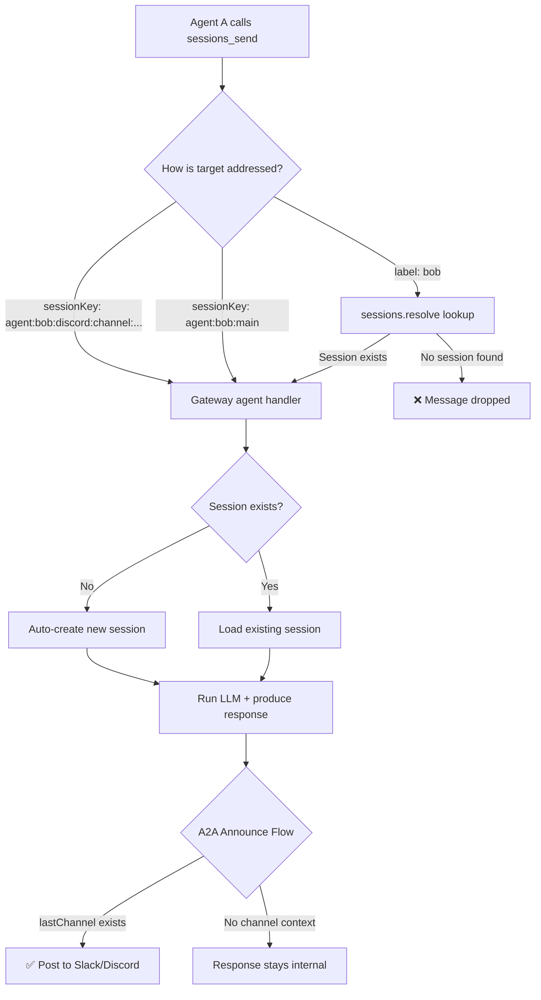

# Agent-to-Agent Collaboration Research

**Date:** 2026-03-19  
**Context:** Deep codebase investigation into `sessions_send` and `sessions_spawn` to understand how agents hand off tasks, why sessions stall, and how to make inter-agent communication reliable.

---

## Issue 1: `session_send` Requires an "Active Session"

### Problem
When Agent A uses `sessions_send` to pass work to Agent B, Agent B may not process it if it doesn't have an existing session — the message gets dropped or stalls.

### Root Cause (Code-Level)

The behavior depends on **how you address Agent B**:

| Addressing Method | Requires Existing Session? | Code Path |
|:---|:---|:---|
| `label: "bob"` | ✅ Yes — `sessions.resolve` searches the store | `sessions-resolve.ts` → `listSessionsFromStore` |
| `sessionKey: "agent:bob"` (2 segments) | ❌ Rejected as malformed | `session-key-utils.ts:20` requires `parts.length >= 3` |
| `sessionKey: "agent:bob:main"` (3 segments) | ❌ No — auto-creates | `agent.ts:416-418` creates new session on-the-fly |
| `sessionKey: "agent:bob:discord:channel:<id>"` | ❌ No — auto-creates | Same gateway path as above |

**Key code** in `session-key-utils.ts`:
```typescript
const parts = raw.split(":").filter(Boolean);
if (parts.length < 3) return null; // ← "agent:cpo" fails here (only 2 segments)
```

**Key code** in gateway `agent.ts`:
```typescript
isNewSession = !entry;                       // detects no prior session
const sessionId = entry?.sessionId ?? randomUUID(); // auto-creates one
```

### Test Results ✅

| Key Format | Example | Result |
|:---|:---|:---|
| `agent:<id>` (2 segments) | `agent:cpo` | ❌ Malformed — rejected |
| `agent:<id>:main` (3 segments) | `agent:cpo:main` | ✅ Works, auto-creates, responds |
| Channel-scoped (5 segments) | `agent:cpo:discord:channel:<id>` | ✅ Works, auto-creates, responds |

### Recommendation

**Use `agent:<id>:main` as the default** for inter-agent handoff:
- Simpler, no channel ID needed
- Auto-creates sessions on demand
- Agent B wakes up immediately

**Use channel-scoped keys** when you need delivery to a **specific** channel.

Both require Agent B to have chatted on the target channel at least once for automatic Slack/Discord delivery (so `lastChannel`/`lastTo` is populated in the session store).

---

## Issue 2: Subagents Lack Channel Context and Memory Logging

### Problem
When Agent A spawns a subagent (using `sessions_spawn`), the subagent doesn't post to Slack/Discord and its work doesn't get logged in memory plugins.

### Root Cause (Code-Level)

**Channel Isolation:** Subagents run on `INTERNAL_MESSAGE_CHANNEL` with `lane: AGENT_LANE_SUBAGENT` (`subagent-spawn.ts:668`). This forces all communication to happen internally, bypassing the channel delivery pipeline entirely.

**Memory Exclusion:** Memory plugins (like the custom DB Memory Plugin) hook into channel-bound lifecycle events (`agent_end`, `message_sending`). Since subagents operate in the `AGENT_LANE_SUBAGENT` lane on `INTERNAL_MESSAGE_CHANNEL`, channel-bound hooks never see the subagent's text stream. The subagent's learnings are sandboxed and discarded when the session is archived.

### Why It Was Built This Way

- **Channel isolation** prevents subagent "thinking" noise from flooding the human's chat channel
- **Memory exclusion** prevents intermediate scratchpad data from polluting long-term memory
- Subagents are designed as ephemeral workers that report results back to the parent

### Workarounds

1. **For Memory:** Modify the DB Memory Plugin to also listen to `AGENT_LANE_SUBAGENT` lifecycle events, or have the parent agent summarize and persist the subagent's output.
2. **For Channel Context:** Have Agent A explicitly pass Slack/Discord context as text in the `task` parameter when spawning the subagent.

---

## Architecture Summary



---

## Key Files Reference

| File | Role |
|:---|:---|
| `src/agents/tools/sessions-send-tool.ts` | `sessions_send` tool implementation |
| `src/agents/tools/sessions-send-tool.a2a.ts` | A2A ping-pong and announce flow |
| `src/agents/subagent-spawn.ts` | Subagent spawning with `AGENT_LANE_SUBAGENT` |
| `src/gateway/server-methods/agent.ts` | Gateway handler — auto-creates sessions |
| `src/sessions/session-key-utils.ts` | Session key parser (3-segment minimum) |
| `src/gateway/sessions-resolve.ts` | Label/sessionId resolution logic |
| `src/agents/lanes.ts` | Lane constants (`NESTED`, `SUBAGENT`) |
