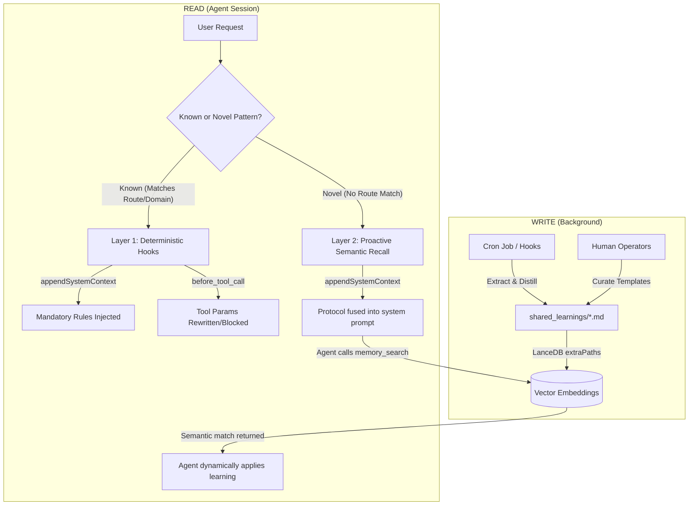

# Knowledge Flywheel V2 Architecture

*Status: Implemented (v3.2) — Last updated: 2026-03-24*

## Problem
OpenClaw's proactive-learning plugin excels at **deterministic rule enforcement**. When an agent encounters a known failure pattern, the plugin uses keyword and route matching to mechanically inject rules and rewrite tool calls. 

However, this system suffers from the **"Novelty Gap"**. When an agent faces a failure pattern it hasn't seen before, the deterministic hooks fail to match. The agent gets zero help from the knowledge base, even if `shared_learnings/*.md` contains tangentially related insights that could solve the problem. Agents forget to actively use the `memory_search` tool unless explicitly prompted, leading to hallucinations or repeated failures on solvable edge cases.

## Insights
1. **Semantic Search Already Exists:** OpenClaw's built-in memory system already uses LanceDB and embedding-based semantic retrieval (via `memory_search`). Furthermore, the `shared_learnings/` directory is already inside its indexed scope (`extraPaths`). Building a massive new PostgreSQL/pgvector database is redundant infrastructure.
2. **`appendSystemContext` is the Correct Delivery Mechanism:** The system prompt is immutable for the session, persists across all turns, and is cacheable by providers. Using `appendSystemContext` via `before_prompt_build` fuses the protocol into the system prompt block — no context decay, no token waste on re-injection.
3. **Hybrid is Better than Replacement:** We don't need to throw away the deterministic hooks. We can stack them. Deterministic hooks handle *known* constraints via `appendSystemContext`, while a new semantic retrieval protocol handles *novel* situations by commanding the agent to self-serve via `memory_search`.
4. **Complementary, Not Competing:** The protocol coexists with `memory-core`'s default `## Memory Recall` section — different triggers, different scopes, different purposes.

### ⚠️ Lesson Learned: `registerMemoryPromptSection` is an Exclusive Slot

The original v3.1 design used `api.registerMemoryPromptSection()` to inject the flywheel protocol. This **failed silently** because:

```
registerMemoryPromptSection uses a MODULE-LEVEL SINGLETON:
  let _builder = undefined;          // prompt-section.ts
  registerMemoryPromptSection(fn) → _builder = fn;   // LAST WRITER WINS
```

**What happened:**
1. `proactive-learning` registered first → `_builder = V2 protocol` ✅
2. `memory-core` (bundled, default memory slot) loaded after → `_builder = default "## Memory Recall"` ❌ **OVERWROTE V2**

The V2 protocol was written then immediately stomped. Layer 2 was **never active** from v3.1's deployment (Mar 23) until the v3.2 fix (Mar 24). Agents saw the default `## Memory Recall` section, not the Knowledge Flywheel protocol.

**Root cause:** `memory-core` is the default memory slot plugin (`DEFAULT_SLOT_BY_KEY = { memory: "memory-core" }`). Only one plugin with `kind: "memory"` can fill the exclusive slot, and `memory-core` wins by default. Our plugin has no `kind`, so it bypasses the slot check, registers first, and gets overwritten.

**Fix (v3.2):** Use `appendSystemContext` via `before_prompt_build` instead. This coexists with `memory-core` rather than competing for the singleton slot.

## Method (Knowledge Flywheel V2)

### Architecture Visualization



### System Prompt Layout (What Agents See)

```
┌─ Agent System Prompt ──────────────────────────────────┐
│                                                        │
│  ## Skills                                             │
│  (skill descriptions...)                               │
│                                                        │
│  ## Memory Recall              ← memory-core           │
│  Before answering about prior work, decisions,         │
│  dates, people, preferences, or todos:                 │
│  run memory_search on MEMORY.md + memory/*.md          │
│  SCOPE: Personal recall                                │
│                                                        │
│  <knowledge-flywheel-protocol>  ← proactive-learning   │
│  ## Institutional Knowledge Protocol                   │
│  When facing a novel failure pattern, a tricky task,   │
│  or if unsure how to proceed:                          │
│  1. Check shared_learnings/*.md via memory_search      │
│  2. If match exists, treat as MANDATORY policy         │
│  3. If contradicts default, learning wins              │
│  4. If no match, use best judgment                     │
│  </knowledge-flywheel-protocol>                        │
│  SCOPE: Team institutional knowledge                   │
│                                                        │
│  <proactive-learnings>          ← Layer 1 (if matched) │
│  (curated yt_* rules, session_send protocol...)        │
│  </proactive-learnings>                                │
│                                                        │
└────────────────────────────────────────────────────────┘

Both sections coexist. No slot conflict. No race condition.
Injected once on first turn, persists for entire session.
Cacheable by providers (Anthropic, OpenAI, Gemini).
```

### Before vs. After Comparison

| Dimension | Flywheel V1 (Deterministic Only) | Flywheel V2 (Hybrid Strategy) |
|-----------|----------------------------------|-------------------------------|
| **Known Patterns** | ✅ Instantly injected via keyword/route | ✅ Instantly injected via keyword/route |
| **Novel Patterns** | ❌ Agent gets no help (Novelty Gap) | ✅ Agent commanded to search semantic memory |
| **System Prompt Layout** | ⚠️ Rules appended to the very bottom | ✅ Protocol in system prompt via `appendSystemContext` |
| **Agent Autonomy** | ⚠️ Relied on agent spontaneously remembering to search | ✅ Explicit protocol guarantees proactive search |
| **Coexistence** | N/A | ✅ Complements memory-core (different scope) |
| **Infrastructure Needed** | None (Filesystem) | None (Leverages built-in LanceDB + extraPaths) |
| **Promotion Pipeline** | N/A | Semantic search logs reveal recurring issues that humans can promote to deterministic Layer 1 routes |

---

### Implementation Details

### 1. The Write Loop (Existing + Enhanced)
- **Daily Cron:** Continues to automatically extract and distill logs into `.md` files using Gemini 2.0 Flash.
- **Human Curation:** `yt_*` rules continue to use human-instructed templates augmented by LLMs.
- **Background Indexing:** The native LanceDB system silently embeds these files via the `extraPaths` config.

### 2. Layer 1: Deterministic Injection (Existing)
The plugin keeps its `before_prompt_build` and `before_tool_call` hooks. If a task matches a known domain (e.g., `youtube`, `story_arc`), the strict, non-negotiable rules are appended to the system prompt (`appendSystemContext`) and mechanical tool rewriting is enforced.

### 3. Layer 2: Proactive Semantic Recall (v3.2 — Fixed)

The plugin uses a dedicated `before_prompt_build` hook (Hook 0) to inject the Institutional Knowledge Protocol via `appendSystemContext`. This coexists with `memory-core`'s default `## Memory Recall` section.

```typescript
// Hook 0: Knowledge Flywheel Protocol (Layer 2)
// Injects on first turn only — system prompt persists for entire session
api.on("before_prompt_build", async (event, ctx) => {
  const isFirstTurn = !event.messages || event.messages.length <= 1;
  if (!isFirstTurn) return; // Only inject on first turn (cacheable)

  const protocol = [
    "<knowledge-flywheel-protocol>",
    "## Institutional Knowledge Protocol",
    "When facing a novel failure pattern, a tricky task, or if you are unsure how to proceed:",
    "1. Always check shared_learnings/*.md via memory_search for related patterns.",
    "2. If a matching learning exists, treat it as MANDATORY institutional policy.",
    "3. If learning contradicts your default behavior, the learning takes precedence.",
    "4. If no match exists, proceed with your best judgment.",
    "</knowledge-flywheel-protocol>",
  ].join("\n");

  return { appendSystemContext: protocol };
});
```

**Why first turn only?** `appendSystemContext` fuses into the system prompt, which is immutable and sent with every API call for the entire session. The hook only needs to run once — the protocol persists across all turns automatically. This also enables provider-level prompt caching (Anthropic, OpenAI, Gemini).

**Why not `registerMemoryPromptSection`?** See "Lesson Learned" above — the singleton slot is owned by `memory-core`, which loads after user plugins and overwrites the builder.

**Multiple `appendSystemContext` hooks merge automatically.** OpenClaw's hook runner uses `concatOptionalTextSegments` to merge results from Hook 0 (flywheel protocol) and Hook 1 (curated domain rules). Both appear in the system prompt.

## Impact Analysis (2026-03-24)

### All-Time Metrics (74K debug log lines)

| Hook | Count | Verdict |
|------|-------|---------|
| Layer 1 — INJECT hits | 414 (13.4% hit rate) | ✅ Targeted, token-efficient |
| Layer 1 — INJECT skips | 2,659 | ✅ Clean turns not polluted |
| Layer 1 — ROUTE hits | 376 (0ms each) | ✅ Replaced 4-20s semantic search |
| Layer 1 — ENFORCE | 20 tool rewrites | ✅ Mechanical corrections |
| Layer 2 — PROMOTE logs | 2 (both after v3.2 fix) | 🔴 Was dead in v3.1 |
| Safety — BLOCKED cmds | 49 | ✅ Catching real violations |
| Logging — failures | 323 auto-logged to SQLite | ✅ 99% reliability |
| Comms — auto-posts | 4 | ⚠️ Low (few cross-agent sends) |
| Cron failures | 0 | ✅ No crashes |

### Agent Breakdown

| Agent | Inject | Route | Blocked | Purpose |
|-------|--------|-------|---------|---------|
| YouTube | 331 | 21 | 4 | Gets yt_* curated rules |
| COO | 40 | 316 | 43 | Gets route-based learnings + most safety blocks |
| CTO | 10 | 38 | 2 | Moderate usage |
| CPO | 16 | 0 | 0 | Domain injections only |
| Writer | 9 | 0 | 0 | Minimal |

### Top Route-Based Learning Hits

| Learning | Hits | Impact |
|----------|------|--------|
| Drift Detection SQLite date bug | 119 | Prevents COO from using wrong date function |
| Prefer `read` over `grep`/`ls` | 83 | Corrects tool choice |
| Edit tool uniqueness | 64 | Prevents failed edits |
| Config Patch Freeze | 26 | Avoids scheduler crashes |
| sessions_send formats | 22 | Fixes cross-agent delivery |

### Knowledge Base Stats

- **25 files** in shared_learnings/
- **70 entries** total
- **68 routed** (97.1% coverage)
- **7 curated yt_* rule files** for YouTube production

## Result

The Knowledge Flywheel V2 (v3.2) achieves:

* **Dual-Scope Knowledge Delivery:** `memory-core` handles personal recall (MEMORY.md, memory/*.md). The flywheel protocol handles team institutional knowledge (shared_learnings/*.md). Different triggers, different scopes, no duplication.
* **100% Coverage:** Known patterns get instant, token-efficient Layer 1 injection. Novel patterns trigger agents to self-serve from semantic memory via the Layer 2 protocol.
* **Zero Infrastructure:** Leverages existing LanceDB pipeline and cron jobs via `extraPaths`.
* **Zero Latency:** `appendSystemContext` is static text, fused once on first turn. No API calls, no embedding searches in the hot path.
* **Provider Caching:** System prompt is immutable for the session — Anthropic, OpenAI, and Gemini can cache it.
* **No Slot Conflicts:** Uses `appendSystemContext` instead of the exclusive `registerMemoryPromptSection` singleton.
* **Natural Promotion Pipeline:** Hook 8 (`after_tool_call`) logs every `memory_search` query to `memory_search_log` table. Recurring queries surface patterns that operators can promote to deterministic Layer 1 routes.

## Version History

| Version | Date | Changes |
|---------|------|---------|
| v3.0 | 2026-03-20 | Hooks 4-7 (failure logging, safe-exec, auto-comms, cron failure) |
| v3.1 | 2026-03-23 | Layer 2 via `registerMemoryPromptSection` + route-based lookup. **Bug: memory-core overwrites the singleton** |
| v3.2 | 2026-03-24 | **Fixed Layer 2:** Moved to `appendSystemContext` via `before_prompt_build`. Coexists with memory-core. |
