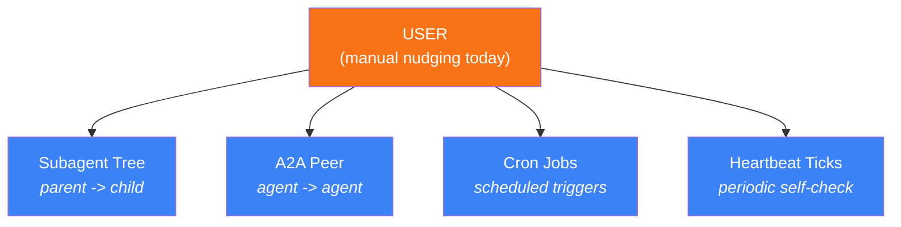
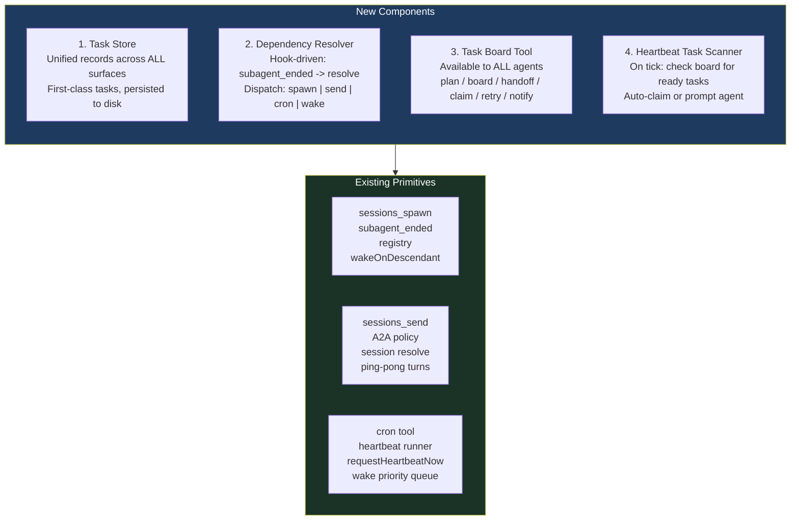
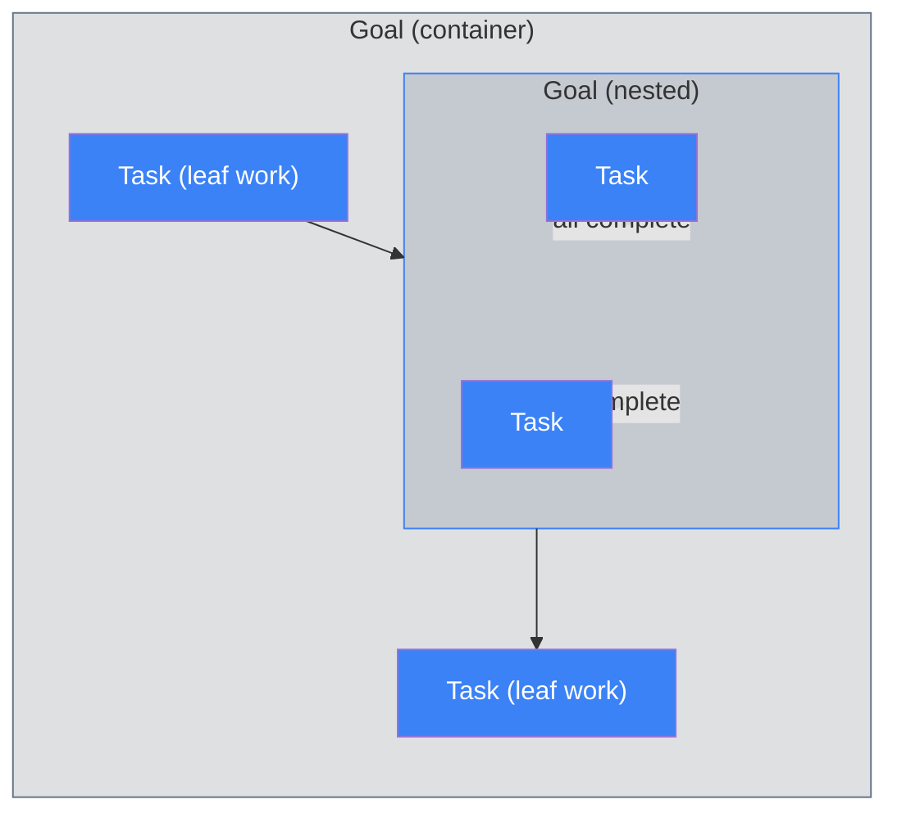
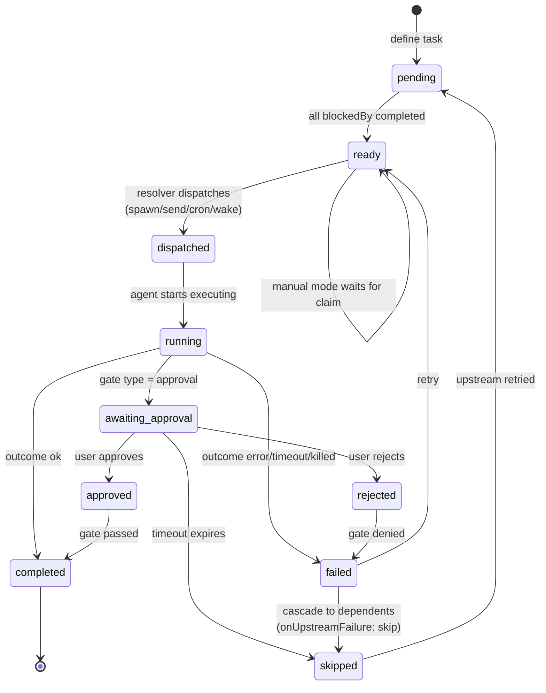
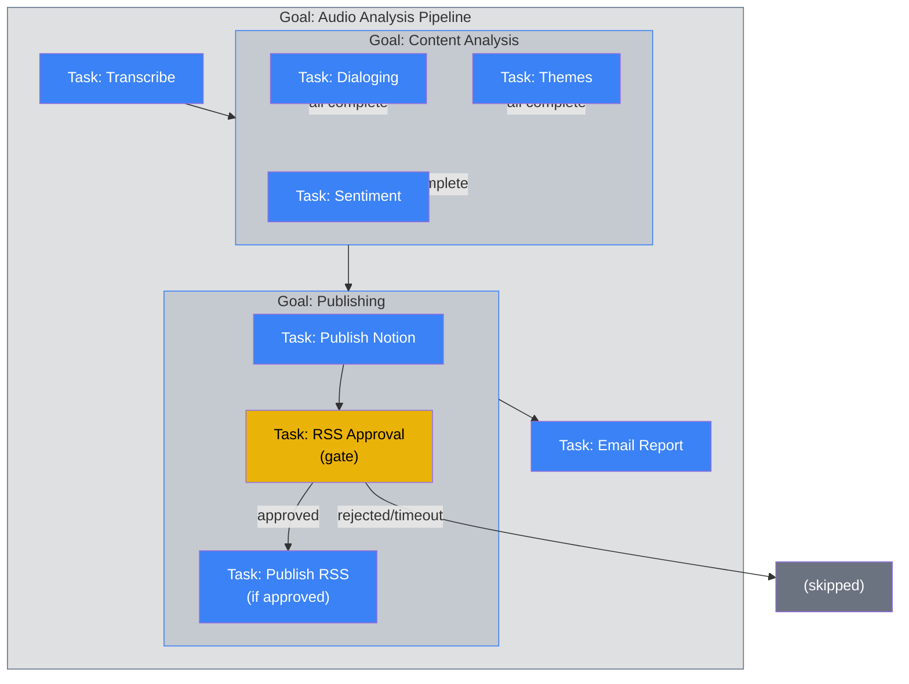
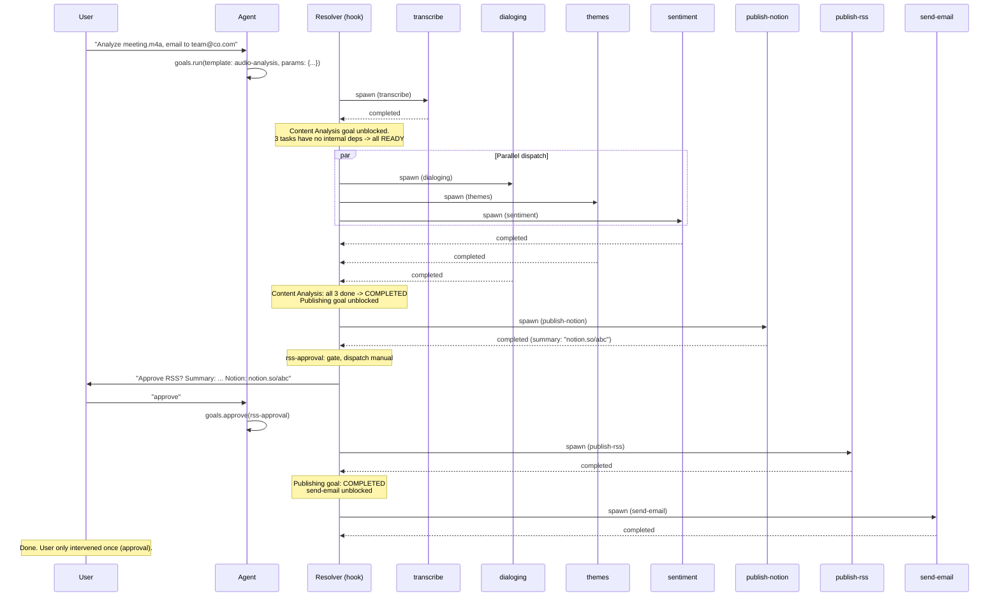
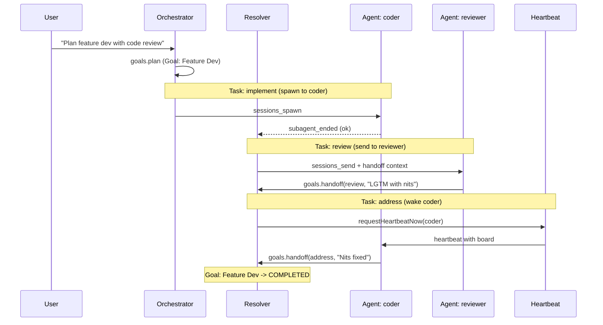
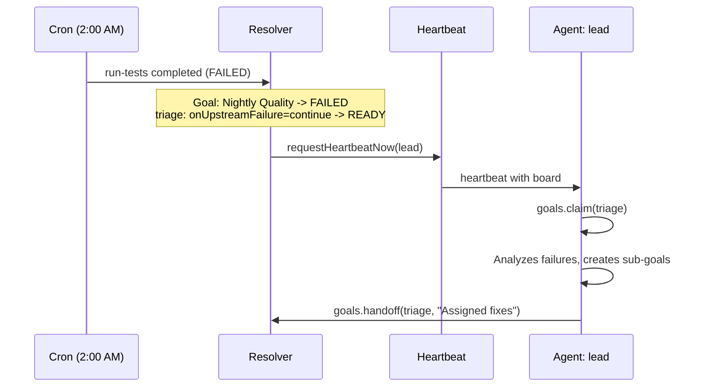
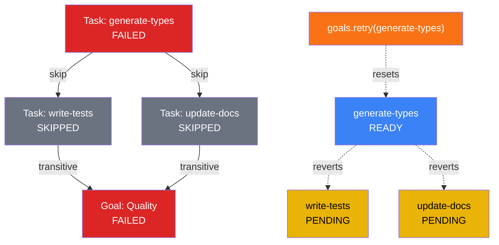

# Task Dependency Graph for OpenClaw Multi-Agent Orchestration

> **Date:** 2026-03-26 (v4: Goal/Task hierarchy, unified model for human + agent workflows)
> **Status:** Design proposal
> **Implementation:** Plugin-based (`extensions/task-graph/`) -- no core source changes, survives `git pull`
> **Motivation:** Eliminate the need to manually nudge agents for task handoff and follow-up. Inspired by ClawTeam's task system, but grounded in OpenClaw's existing architecture.
> **Companion:** [OpenClaw vs ClawTeam Comparison](./2026-03-26_openclaw_vs_clawteam_comparison.md)

---

## 1. The Problem

Today, multi-agent coordination is **fire-and-forget with manual nudging** at every level:

1. **Subagent tree**: Each `SubagentRunRecord` tracks its own lifecycle independently -- no way to say "task B starts after task A"
2. **Peer agents**: Independent main agents (e.g., "coder" and "reviewer") have no shared task board -- the user must manually tell the reviewer "coder is done, go review"
3. **Scheduled work**: Cron jobs and heartbeats run in isolation -- no awareness of a task graph; can't auto-trigger follow-up work
4. **No shared visibility**: No single place where any agent (or the user) can see what's pending, ready, running, or blocked across the entire system

**Result:** The user becomes the human scheduler across all four collaboration surfaces.

### Four Collaboration Surfaces in OpenClaw



The task dependency graph must unify all four, not just the subagent tree.

### Pain Point Examples (Today)

**Subagent handoff** (parent must nudge children):
```
User: "Agent, extract the API schema"       -> spawns subagent
      ... wait for completion ...
User: "OK done. Now generate types"          -> spawns another subagent
```

**Peer agent handoff** (user must relay between agents):
```
User to coder:    "Implement the auth module"
      ... wait ...
User to reviewer: "Coder finished auth. Review the PR"
      ... wait ...
User to coder:    "Reviewer has comments. Address them"
```

**Scheduled follow-up** (user must set up cron manually):
```
User: "Run the integration suite every night"
      ... tests fail ...
      Nobody notices until user checks next morning
      User: "Tests failed. Coder, fix the regression"
```

Each handoff requires the user to notice completion, gather context, and trigger the next step.

---

## 2. Design Principles

1. **Extend, don't replace** -- build on `SubagentRunRecord` and existing hooks, not a parallel system
2. **The orchestrator agent should be the scheduler** -- not a new daemon or service
3. **Opt-in complexity** -- simple spawns stay simple; dependencies are additive
4. **Leverage existing primitives** -- hooks (`subagent_ended`), registry, spawn tool, cron/heartbeat

---

## 3. The Four Collaboration Surfaces

Before designing, we need to map the existing OpenClaw primitives that the task graph must integrate with. Each surface has different mechanics, latency characteristics, and constraints.

### Surface 1: Subagent Tree (Parent -> Child)

**Existing primitives:**
- `sessions_spawn` tool (run/session modes)
- `SubagentRunRecord` in registry
- `subagent_ended` hook (fires once, guarded by `endedHookEmittedAt`)
- `wakeOnDescendantSettle` (parent wakes when all children finish)
- Auto-announce (completion delivered to requester's channel)
- Max depth: 2 levels (main -> orchestrator -> leaf)
- Concurrency: per-agent limit (default 5), global lane cap (default 8)

**Handoff gap:** Parent spawns child, child finishes, parent gets announce. But there's no "now spawn the next child because this one finished" automation.

### Surface 2: Peer Agent A2A (Agent <-> Agent)

**Existing primitives:**
- `sessions_send` tool with A2A flow (`sessions-send-tool.a2a.ts`)
- Policy: `tools.agentToAgent.enabled` + `tools.agentToAgent.allow` allowlist
- Ping-pong turns: 0-15 (default 5, recently raised to 15)
- Session resolution: `sessions.resolve({label, agentId})` -> canonical session key
- Session key format: `agent:<agentId>:<runtime>:<identifier>`
- Runs in `AGENT_LANE_NESTED` to avoid blocking main turns
- Message provenance: `inputProvenance.kind = "inter_session"`

**Handoff gap:** Agent A can send a message to Agent B, but there's no way to say "when Agent A's task finishes, automatically trigger Agent B's task." The user must relay between peer agents.

### Surface 3: Cron Jobs (Scheduled Triggers)

**Existing primitives:**
- `cron` tool: add/update/remove/run/list/wake
- **Session targets:**
  - `"main"` -- runs in agent's main session (requires `systemEvent` payload)
  - `"isolated"` -- ephemeral session per run (`agentTurn` payload, `forceNew: true`)
  - `"current"` -- binds to creating session (resolved at creation time)
  - `"session:custom-id"` -- persistent named session
- **Payload types:**
  - `systemEvent` -- text injected into main session history
  - `agentTurn` -- full agent run with model, thinking, timeout, fallbacks
- **Delivery:** `"none"` | `"announce"` (to channel) | `"webhook"` (HTTP POST)
- **Cron can spawn subagents:** `senderIsOwner: true` enables `sessions_spawn` from cron agents
- **Interim ack retry:** If cron agent just acknowledges ("on it") without completing, runner auto-continues with "Complete the task now"

**Handoff gap:** Cron jobs run in isolation. A nightly test job can't automatically create follow-up tasks for the coder agent when tests fail. There's no task board awareness.

### Surface 4: Heartbeat (Periodic Self-Check)

**Existing primitives:**
- Config: `agents.defaults.heartbeat.{enabled, interval, prompt, ackMaxChars, activeHours, session}`
- Per-agent override: `agents.list[].heartbeat`
- **Runner** (`heartbeat-runner.ts`): timer fires at interval, runs agent with heartbeat prompt
- **Wake system** (`heartbeat-wake.ts`):
  - `requestHeartbeatNow({reason, coalesceMs, agentId, sessionKey})`
  - Priority levels: RETRY(0) < INTERVAL(1) < DEFAULT(2) < ACTION(3)
  - Coalescence: multiple wake requests merged within time window (default 250ms)
  - Called from: agent runs, cron jobs, ACP, subagent completion events
- **Heartbeat flag:** `isHeartbeat: true` on agent run context (for filtering/suppression)

**Handoff gap:** Heartbeat runs the agent periodically, but the agent has nothing to check. There's no "what tasks are assigned to me and ready?" query available.

---

## 4. Architecture Overview

Four components, mapped to all four collaboration surfaces:



### Key Design Decision: Task Store vs. Extending SubagentRunRecord

The original design proposed extending `SubagentRunRecord` directly. But that only covers the subagent tree. Cross-agent tasks (where agent "coder" finishes and agent "reviewer" should start) don't have a shared `SubagentRunRecord` -- they're independent sessions.

**Solution: A separate but lightweight Task Store** that:
- Lives alongside the subagent registry (same persistence layer)
- References `SubagentRunRecord.runId` when a task is backed by a subagent run (linking, not duplication)
- Supports tasks assigned to any agent, not just children of the planning agent
- Is queryable by any agent via the `tasks` tool

This is closer to ClawTeam's approach (separate task store) but avoids their sync problem because:
- Task status is **derived from** the linked run record when one exists (not manually updated)
- Tasks without a linked run (not yet spawned) track status independently
- The resolver is the single writer for status transitions -- no cooperative/advisory locking needed

---


## 5. The Goal/Task Hierarchy: Unified Model

### Why This Is Better Than Flat Task Graphs + TOML Templates

The previous design (v3) had a **template/instance split**: TOML templates are authored separately, then instantiated into flat `TaskRecord` entries at runtime. This creates:
- Two representations of the same pipeline (template vs. running instance)
- No nesting (flat DAG can't express "stage X is done when all its parts are done")
- Separate authoring models for human workflows vs. agent plans

The unified Goal/Task hierarchy eliminates all three problems:

| Previous Design (v3, 3 concepts) | Unified Model (v4, 1 concept) |
|---|---|
| `TaskRecord` (flat graph) | Task (leaf work unit) |
| TOML workflow template (static file) | Human-created Goal (saved, re-runnable) |
| `tasks.plan()` (agent ad-hoc) | Agent-created Goal (same format) |
| No nesting | Goals nest Goals + Tasks recursively |
| Template != Instance | Goal = template when saved, instance when running |

### Core Concepts



- **Goal** = a named objective. Contains children (Tasks and/or sub-Goals). Status derived from children. Tracks time. Can be saved and re-run.
- **Task** = a leaf unit of work dispatched to an agent. Has dependencies, dispatch mode, handoff context. Same as v3 `TaskRecord`.
- **Nesting** = Goals inside Goals. A sub-goal completes when all its children complete. A sub-goal can be a dependency for sibling tasks.

---

## 6. Data Model

### GoalRecord

```typescript
type GoalRecord = {
  // --- Identity ---
  id: string;                    // Unique run ID (e.g., "audio-analysis-2026-03-26-001")
  templateId?: string;           // Source template (e.g., "audio-analysis") if from saved goal
  parentId?: string;             // Parent goal ID (null = top-level)
  name: string;

  // --- Authorship ---
  createdBy: "human" | "agent";
  createdBySession?: string;     // Session key (if agent-created)
  createdAt: number;

  // --- Parameters (for reusable goals) ---
  params?: Record<string, GoalParam>;
  paramValues?: Record<string, string>;  // Bound values at run time

  // --- Status (DERIVED from children -- not set manually) ---
  status: GoalStatus;

  // --- Built-in tracking ---
  startedAt?: number;
  completedAt?: number;
  totalWallTimeMs?: number;      // Wall-clock: start to completion
  totalAgentTimeMs?: number;     // Sum of all descendant task execution times
  approvalWaitTimeMs?: number;   // Time spent waiting on approval gates

  // --- Children (ordered) ---
  children: Array<GoalRef | TaskRef>;  // References by ID; actual records in store
};

type GoalParam = {
  type: "string" | "number" | "boolean";
  required: boolean;
  default?: string;
  description?: string;
};

type GoalStatus = "pending" | "active" | "completed" | "failed" | "paused";
```

### TaskRecord

```typescript
type TaskRecord = {
  // --- Identity ---
  id: string;                    // Unique within parent goal (e.g., "transcribe")
  parentId: string;              // Parent goal ID
  name: string;

  // --- What to do ---
  task: string;                  // Prompt (supports {{param}} and {{upstream.id.summary}})

  // --- Dependencies ---
  blockedBy: string[];           // Sibling task/goal IDs that must complete first

  // --- Dispatch ---
  dispatch: TaskDispatch;        // spawn | send | wake | cron | manual

  // --- Status ---
  status: TaskStatus;

  // --- Gate (optional) ---
  gate?: { type: "approval"; approver: "user" | string; timeout: string; onTimeout: "skip" | "fail" };
  gateCondition?: "approved";
  onUpstreamFailure: "skip" | "wait" | "continue";

  // --- Execution link ---
  linkedRunId?: string;          // SubagentRunRecord.runId
  linkedSessionKey?: string;

  // --- Handoff ---
  outputSummary?: string;
  handoffContext?: Record<string, unknown>;

  // --- Tracking ---
  priority: "low" | "normal" | "high" | "urgent";
  startedAt?: number;
  completedAt?: number;
  executionTimeMs?: number;      // Actual agent run time
  retryCount: number;
  failureReason?: string;
};

type TaskStatus =
  | "pending"            // waiting on blockers
  | "ready"              // all blockers done
  | "dispatched"         // dispatch initiated
  | "running"            // agent executing
  | "awaiting_approval"  // gate: waiting for human
  | "approved"           // gate passed
  | "rejected"           // gate denied
  | "completed"
  | "failed"
  | "skipped";

type TaskDispatch =
  | { mode: "spawn"; agentId?: string; model?: string; thinking?: string;
      sandbox?: "inherit" | "require"; thread?: boolean }
  | { mode: "send"; targetAgentId: string; targetSessionLabel?: string;
      maxPingPongTurns?: number }
  | { mode: "cron"; cronJobId?: string; sessionTarget?: string; schedule?: string }
  | { mode: "wake"; targetAgentId: string; reason?: string }
  | { mode: "manual" };
```

### Goal Status: Derived From Children

A Goal has no execution of its own. Its status is **computed**:

```typescript
function deriveGoalStatus(goal: GoalRecord, store: Store): GoalStatus {
  const children = store.getChildren(goal.id);

  if (children.every(c => c.status === "completed"))                          return "completed";
  if (children.some(c => c.status === "failed" || c.status === "rejected"))   return "failed";
  if (children.some(c => c.status === "awaiting_approval"))                   return "paused";
  if (children.some(c => ["running","dispatched","ready"].includes(c.status))) return "active";
  return "pending";
}
```

**This gives you free roll-up**: a parent goal knows its status, total time, and progress without extra bookkeeping.

---

## 7. Task Status State Machine



---

## 8. Dependency Resolver

The resolver is a **deterministic function** (not an LLM) registered on the `subagent_ended` hook. It runs in-process in the gateway.

Two resolution triggers:
1. **Task completes** (subagent_ended hook or handoff call) -- resolve sibling dependents
2. **All children of a goal complete** -- mark goal completed, resolve goal's dependents in parent scope

```typescript
async function onItemCompleted(completedItem: TaskRecord | GoalRecord) {
  const parent = store.getGoal(completedItem.parentId);
  if (!parent) return;

  // 1. Check if completing this item makes a sibling goal/task ready
  const siblings = store.getChildren(parent.id);
  for (const sibling of siblings) {
    if (sibling.status !== "pending") continue;
    if (!sibling.blockedBy?.includes(completedItem.id)) continue;

    const allBlockersDone = sibling.blockedBy.every(id => {
      const blocker = store.get(id);
      return blocker?.status === "completed" ||
        (blocker?.status === "failed" && sibling.onUpstreamFailure === "continue");
    });

    if (allBlockersDone) {
      sibling.status = "ready";
      if (sibling.type === "task") await dispatchTask(sibling);
      // If sibling is a goal, its first children (no blockers) become ready
      if (sibling.type === "goal") await activateGoal(sibling);
    }
  }

  // 2. Check if parent goal is now complete (all children done)
  const parentStatus = deriveGoalStatus(parent, store);
  if (parentStatus !== parent.status) {
    parent.status = parentStatus;
    if (parentStatus === "completed" || parentStatus === "failed") {
      // Recurse up: this goal completing may unblock siblings in grandparent
      await onItemCompleted(parent);
    }
  }

  store.persist();
}
```

**Key insight: resolution bubbles up.** When the last task in "Content Analysis" completes -> Content Analysis goal becomes "completed" -> resolver checks parent scope -> "Publishing" goal was `blockedBy: ["content-analysis"]` -> Publishing becomes "ready" -> its first task dispatches.

---

## 9. Human-Created Goals: Your Stable Workflows

### How It Works

1. **You define a goal** as a TOML file in `~/.openclaw/goals/`
2. **It's saved** with `createdBy: "human"` and a stable `templateId`
3. **You run it**: `goals.run({ template: "audio-analysis", params: {...} })`
4. **Same execution every time** -- deterministic structure, only the work inside tasks uses LLM
5. **Built-in tracking** compares runs over time

### Your Audio Pipeline

```toml
# ~/.openclaw/goals/audio-analysis.toml

[goal]
id = "audio-analysis"
name = "Audio Analysis Pipeline"
created_by = "human"

[goal.params]
audio_file = { type = "string", required = true }
notion_db = { type = "string", default = "Audio Reports" }
rss_feed = { type = "string", default = "main" }
email_recipients = { type = "string", required = true }

# --- Stage 1: Transcription ---
[[goal.tasks]]
id = "transcribe"
name = "Transcribe Audio"
task = """
Transcribe the audio file at {{audio_file}}.
Output clean transcript with timestamps and speaker labels.
"""
dispatch = { mode = "spawn" }
priority = "high"

# --- Stage 2: Content Analysis (sub-goal, 3 parallel tasks) ---
[goal.goals.content-analysis]
name = "Content Analysis"
blocked_by = ["transcribe"]

  [[goal.goals.content-analysis.tasks]]
  id = "dialoging"
  name = "Dialog Structuring"
  task = "Structure transcript into dialog format. Identify speakers, turns, topics."
  dispatch = { mode = "spawn" }

  [[goal.goals.content-analysis.tasks]]
  id = "themes"
  name = "Theme Extraction"
  task = "Extract key themes, insights, action items, and decisions."
  dispatch = { mode = "spawn" }

  [[goal.goals.content-analysis.tasks]]
  id = "sentiment"
  name = "Sentiment Analysis"
  task = "Analyze sentiment, engagement patterns, and emotional tone."
  dispatch = { mode = "spawn" }

# --- Stage 3: Publishing (sub-goal with approval gate) ---
[goal.goals.publishing]
name = "Publishing"
blocked_by = ["content-analysis"]

  [[goal.goals.publishing.tasks]]
  id = "publish-notion"
  name = "Publish to Notion"
  task = 'Publish analysis to Notion database "{{notion_db}}". Return the page URL.'
  dispatch = { mode = "spawn" }

  [[goal.goals.publishing.tasks]]
  id = "rss-approval"
  name = "Request RSS Approval"
  task = "Analysis ready for RSS. Review and approve/reject."
  blocked_by = ["publish-notion"]
  dispatch = { mode = "manual" }
  gate = { type = "approval", approver = "user", timeout = "48h", on_timeout = "skip" }

  [[goal.goals.publishing.tasks]]
  id = "publish-rss"
  name = "Publish to RSS"
  task = "Publish to RSS feed '{{rss_feed}}'. Notion: {{upstream.publish-notion.summary}}"
  blocked_by = ["rss-approval"]
  dispatch = { mode = "spawn" }
  gate_condition = "approved"

# --- Stage 4: Distribution ---
[[goal.tasks]]
id = "send-email"
name = "Email Report"
task = """
Email report to {{email_recipients}}.
Include: executive summary, Notion link, RSS link (if published).
"""
blocked_by = ["publishing"]
dispatch = { mode = "spawn" }
on_upstream_failure = "continue"
```

### Visual Structure



### Execution Flow



---

## 10. Built-In Tracking: What You Get For Free

### Board Output with Timing

```
goals.board({ goalId: "audio-analysis-2026-03-26-001", timing: true })

Goal: Audio Analysis Pipeline                      COMPLETED
  Wall: 2h 6m 20s | Agent: 6m 20s | Approval: 1h 59m 55s

  COMPLETED  Transcribe                            3m 12s
  COMPLETED  Content Analysis                      1m 18s  (3 tasks, parallel)
    COMPLETED  Dialoging                           1m 18s
    COMPLETED  Themes                              1m 06s
    COMPLETED  Sentiment                           0m 53s
  COMPLETED  Publishing                            2h 0m 30s  (includes approval)
    COMPLETED  Publish Notion                      0m 45s
    APPROVED   RSS Approval                        1h 59m 55s  (gate)
    COMPLETED  Publish RSS                         0m 30s
  COMPLETED  Email Report                          0m 35s
```

### What Nesting Gives You That Flat Graphs Cannot

1. **Per-stage timing** -- "Content Analysis took 1m 18s" is a single number, not 3 separate task times to mentally aggregate
2. **Bottleneck identification** -- "Approval wait is 97% of wall-clock time" is obvious from the tree
3. **Parallel efficiency** -- 3 tasks ran in 1m 18s wall-clock (longest child), not 3m 17s if sequential
4. **Run-over-run comparison** -- "This week's Content Analysis averaged 2m, up from 1m 18s last week -- dialoging is getting slower"

### History Across Runs

```
goals.history({ template: "audio-analysis", last: 5 })

Run                          Date         Wall       Agent    Bottleneck
audio-analysis-001           2026-03-20   1h 42m     5m 48s  Approval (1h 36m)
audio-analysis-002           2026-03-22   2h 06m     6m 20s  Approval (1h 59m)
audio-analysis-003           2026-03-24   0h 08m     5m 55s  Transcribe (3m 30s)
audio-analysis-004           2026-03-25   0h 07m     5m 10s  Content Analysis (1m 40s)
audio-analysis-005           2026-03-26   REJECTED   4m 45s  RSS Approval (rejected)

Average agent time: 5m 36s | Fastest stage: Sentiment (avg 0m 51s)
```

---

## 11. Agent-Created Goals

Agents use the same model. The difference is `createdBy: "agent"` and the structure is decided by the LLM at plan time instead of pre-defined.

```typescript
// Agent calls goals.plan() -- same hierarchy, dynamic structure
goals.plan({
  name: "Refactor Auth Module",
  children: [
    { type: "task", id: "analyze", name: "Analyze current auth code",
      task: "Read src/auth/ and identify issues", dispatch: { mode: "spawn" } },
    { type: "goal", id: "implementation", name: "Implementation",
      blockedBy: ["analyze"],
      children: [
        { type: "task", id: "refactor-middleware", name: "Refactor middleware",
          task: "...", dispatch: { mode: "spawn" } },
        { type: "task", id: "update-types", name: "Update types",
          task: "...", dispatch: { mode: "spawn" } },
      ]
    },
    { type: "task", id: "test", name: "Write tests",
      blockedBy: ["implementation"], dispatch: { mode: "spawn" } },
  ]
})
```

**An agent can also save its plan as a reusable template:**

```typescript
goals.save({
  goalId: "refactor-auth-2026-03-26-001",
  templateId: "auth-refactor",
})
```

This promotes a one-off plan into a stable, repeatable workflow.

---

## 12. Plugin Architecture (No Core Changes)

### Why Plugin

| Need | Plugin SDK Method | Proven By |
|---|---|---|
| Register `goals` tool | `api.registerTool()` | memory-core, proactive-learning |
| Listen to `subagent_ended` | `api.on("subagent_ended", handler)` | Discord extension |
| Detect heartbeat | `ctx.trigger === "heartbeat"` in `before_prompt_build` | Built into hook context |
| Inject board into prompt | `before_prompt_build` returning `appendSystemContext` | memory-core |
| Spawn subagents | `api.runtime.subagent.run()` | Available in all handlers |
| Persist store | SQLite via plugin-local database | proactive-learning |

### What Each Component Actually Is

| Component | What it is | LLM? |
|---|---|---|
| **Orchestrator** | Any agent calling `goals.plan()` or `goals.run()` | Yes |
| **Resolver** | Function on `subagent_ended` hook via `api.on()` | **No** -- deterministic |
| **Goal Store** | SQLite in plugin data dir | No |
| **Heartbeat scanner** | `before_prompt_build` hook checking for ready tasks | No |
| **Worker** | Agent that receives dispatched task | Yes |

### Plugin Structure

```
extensions/task-graph/
  openclaw.plugin.json
  package.json
  index.ts                      # Register tool + hooks
  src/
    store.ts                    # SQLite: GoalRecord + TaskRecord CRUD
    store.types.ts              # Type definitions
    resolver.ts                 # subagent_ended hook: dependency resolution + goal roll-up
    dispatcher.ts               # Multi-surface dispatch (spawn/send/wake/cron/manual)
    board.ts                    # Board formatting + heartbeat injection
    templates.ts                # TOML loader + param interpolation
    gates.ts                    # Approval gate logic
    tracking.ts                 # Timing aggregation + history
    tools/
      goals-tool.ts             # Tool: plan/run/board/handoff/claim/approve/reject/retry/save/history
  tests/
    resolver.test.ts
    store.test.ts
    templates.test.ts
```

### Hook Registration

```typescript
export default function taskGraphPlugin(api: OpenClawPlugin) {
  const store = new GoalStore(api.dataDir);

  api.registerTool((ctx) => createGoalsTool(store, ctx, api), {
    names: ["goals"],
  });

  api.on("subagent_ended", async (event) => {
    await resolveOnTaskCompleted(store, api, event);
  });

  api.on("before_prompt_build", async (event, ctx) => {
    if (ctx.trigger !== "heartbeat") return {};
    const ready = store.getReadyTasksForAgent(ctx.agentId);
    if (ready.length === 0) return {};
    return { appendSystemContext: formatBoardForHeartbeat(ready) };
  });
}
```

---

## 13. Tool Surface: `goals`

### Actions

| Action | Who uses it | What it does |
|---|---|---|
| `run` | User/agent | Instantiate a saved goal template with params |
| `plan` | Agent | Create an ad-hoc goal hierarchy |
| `board` | User/agent | View goal tree with status + timing |
| `handoff` | Agent | Signal task completion with summary + context |
| `claim` | Agent | Pick up a ready task (for wake/manual dispatch) |
| `approve` | User | Approve an approval gate |
| `reject` | User | Reject an approval gate |
| `retry` | User/agent | Retry a failed task (reverts downstream skips) |
| `save` | User/agent | Save a completed goal as a reusable template |
| `history` | User | View timing history across runs of a template |
| `notify` | User/agent | Post board summary to a channel |

---

## 14. End-to-End Flows (Cross-Agent + Cron)

The flows from v3 remain valid. The only change: tasks are now children of goals, and goal completion triggers resolution in the parent scope.

### Cross-Agent Feature Development



### Cron + Heartbeat Nightly Pipeline



---

## 15. Failure Cascade + Retry



---

## 16. Implementation Plan

### Phase 1 -- Goal Store + Board + Templates

- Plugin scaffold (`extensions/task-graph/`)
- `GoalRecord` + `TaskRecord` types, SQLite persistence
- `goals` tool: `run`, `plan`, `board`
- TOML template loader with param interpolation
- DAG validation, goal status derivation
- Manual dispatch only

### Phase 2 -- Resolver + Auto-Dispatch + Handoff

- `subagent_ended` hook handler
- Multi-surface dispatch (spawn, send)
- `handoff` action + upstream context interpolation
- Goal completion roll-up (children done -> goal done -> unblock parent siblings)

### Phase 3 -- Approval Gates + Heartbeat + Tracking

- `approve`/`reject` actions with timeout
- `gate_condition` for conditional tasks
- Heartbeat board injection
- Wall-clock + agent-time tracking per goal/task
- `history` action for run-over-run comparison

### Phase 4 -- Cron + Save + Notifications

- `cron` dispatch mode
- `save` action (promote goal to template)
- `notify` action for channel summaries
- Failure cascade + `retry` with downstream revert

---

## 17. Open Questions

1. **Goal storage:** `~/.openclaw/goals/` for human TOML templates? Or plugin data dir?

2. **Nesting depth:** Max 3-4 levels practical? Or unlimited?

3. **Cross-goal dependencies:** Can a task in Goal A depend on a task in Goal B? Start with same-goal only?

4. **Approval UX:** Discord/Telegram buttons? Or text-based in chat?

5. **Run comparison:** Show "this run vs. average" on the board?

6. **Sub-goal reuse:** Can a sub-goal (like "Content Analysis") be extracted and embedded in other goals? Template composition.

7. **Concurrent goal runs:** Can two instances of `audio-analysis` run simultaneously? (Yes, each gets a unique run ID, but should there be a concurrency limit?)
