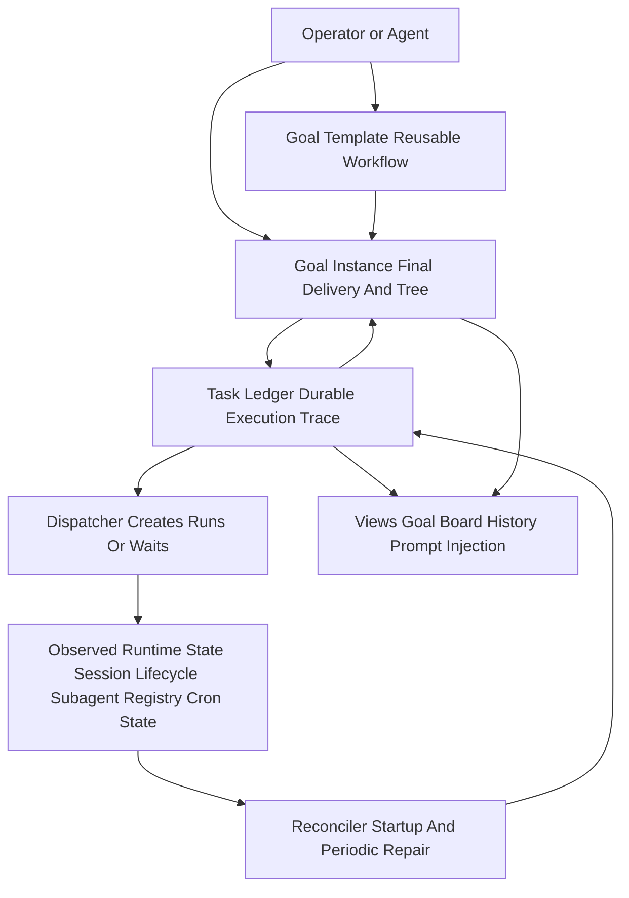
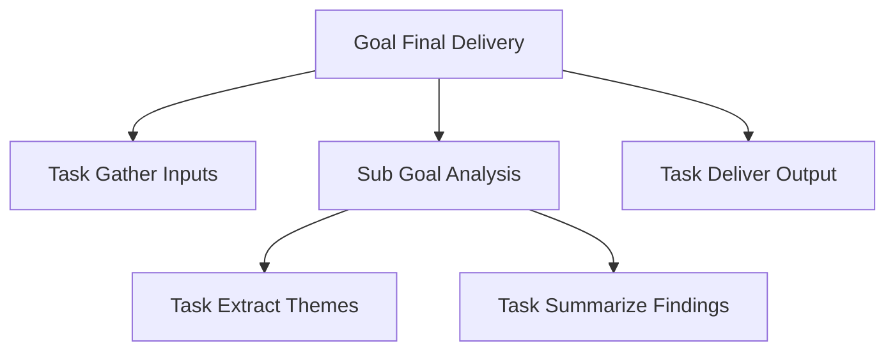
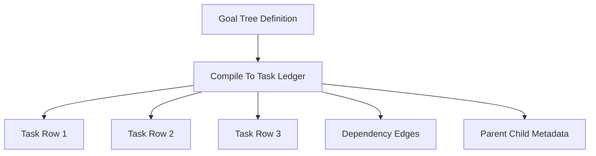
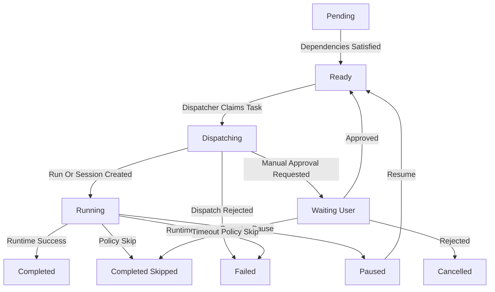
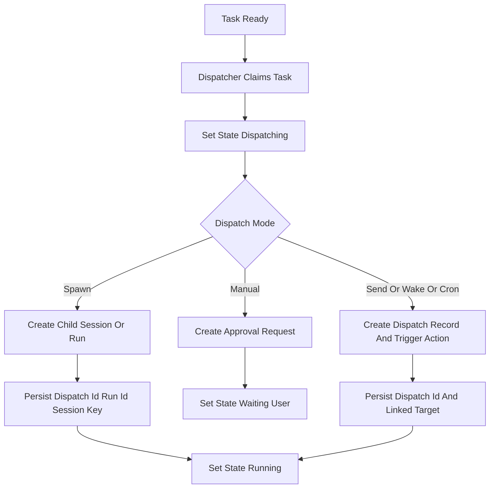
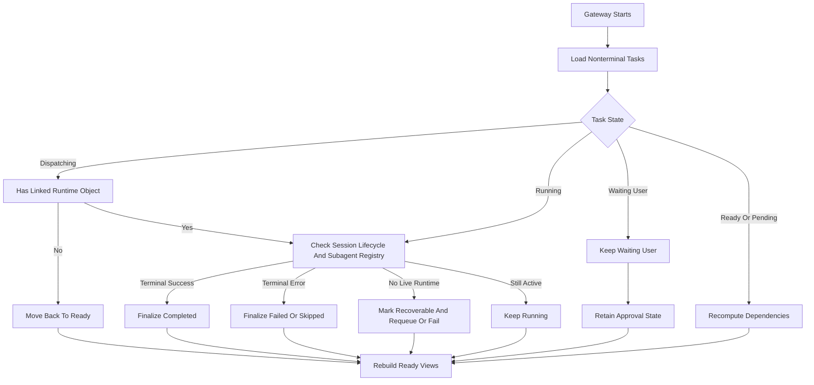
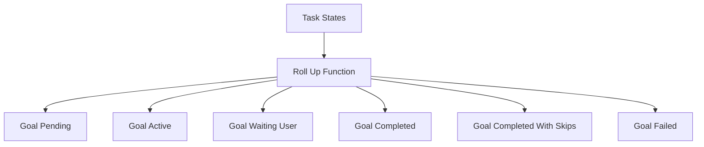
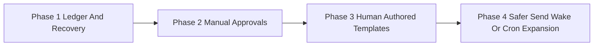

# Goal-Centered Reliable Task Management Design for OpenClaw

> **Date:** 2026-03-27
> **Status:** Proposed design
> **Goal:** Make goals, tasks, and reusable workflows restart-safe, observable, and predictable without turning OpenClaw into a heavy default manager-of-managers framework.
> **Scope:** OpenClaw task management for subagents, peer-agent handoff, cron-triggered work, and operator approvals.

---

## 1. Executive Summary

OpenClaw already has most of the runtime primitives needed for orchestration:

- Session lifecycle state persisted to the session store
- Subagent spawn and completion tracking
- A2A messaging
- Cron scheduling
- Heartbeat wakeup
- Hook-based extensibility

What it does **not** have is a durable goal and task execution record that survives restarts and can answer:

- What goal is being delivered?
- What tasks and sub-tasks belong to that goal?
- What is blocked?
- What is ready now?
- What run or session currently owns this task?
- What final delivery has been produced so far?
- What should happen if the gateway restarts halfway through?

The right design is **not** a general agent hierarchy framework.
It is a **goal-first workflow model** backed by a **small, durable task ledger** with strict state transitions, explicit correlation IDs, and a recovery loop.

The goal hierarchy should be first-class, not cosmetic:

- Humans think in terms of goals, final deliverables, and visible progress
- Agents benefit from seeing the parent goal, sibling tasks, and expected final output
- Saved goals are a natural reusable workflow format

So the right design is:

- **Goal hierarchy as the canonical collaboration model**
- **Task ledger as the execution trace under that model**
- **Saved goals as reusable workflow templates**

The safest path is:

1. Start with **human-authored, deterministic goals**
2. Support **spawn-only tasks first**
3. Add **manual approvals**
4. Add **reconciliation on startup**
5. Only then expand to `send`, `wake`, and `cron` dispatch

---

## 2. Source-Grounded Constraints

The design must fit the current codebase rather than an idealized orchestration system.

### Constraint A: Nested orchestration is not the default

- Default subagent spawn depth is `1`, which makes depth-1 subagents leaves by default
- Leaf subagents cannot use `sessions_spawn`, `sessions_list`, `sessions_history`, or `subagents`
- This means the default system is optimized for **main-session orchestration**, not nested planner trees

### Constraint B: OpenClaw already uses multiple persistence surfaces

- Session state persists to the session store
- Subagent runs are kept in memory and also persisted to disk
- Cron jobs persist separately
- Followup queues are in-memory only

This means reliability cannot depend on a single in-memory resolver.
The system needs explicit reconciliation across stores.

### Constraint C: Hooks are signals, not durable truth

- `subagent_ended` is useful, but it is only one completion signal
- `sessions_send`, heartbeat-driven work, approvals, and cron do not naturally map to the same hook shape
- Hook delivery failure must not lose task truth

### Constraint D: Project direction rejects heavy default orchestration

The design must remain:

- Opt-in
- Narrow
- Workflow-oriented
- Compatible with the current session/tool model

---

## 3. Design Principles

1. **Ledger first, prompt second**
   Reliability comes from durable state and deterministic transitions, not from prompt instructions.

2. **Source of truth must be singular**
   The task ledger owns task state. Session lifecycle, subagent registry, and cron state are observed inputs.

3. **Every dispatch must have a correlation key**
   A task is not reliable unless a later event can be mapped back to it deterministically.

4. **Operator decisions are not failures**
   Approval rejection, cancellation, and skip must not be collapsed into runtime failure.

5. **Recovery is a required feature, not a nice-to-have**
   If the gateway restarts during execution, the system must re-evaluate every nonterminal task.

6. **Scope creep is the main risk**
   Support the fewest dispatch modes possible at first.

---

## 4. Recommended Architecture



### Core idea

Use three layers:

1. **Conceptual layer**
   This is what humans and agents see.
   It includes:
   - Goal
   - Task
   - Sub-goal
   - Final delivery
   - Reusable saved goal templates

2. **Workflow definition layer**
   This is what gets saved and reused.
   It includes:
   - Goal templates
   - Parameter schemas
   - Default task trees
   - Delivery contracts

3. **Execution layer**
   This is what the runtime uses.
   It includes:
   - Task instances
   - Dependency edges
   - Dispatch records
   - Correlation IDs
   - Recovery state

The conceptual layer should feel intuitive.
The template layer should feel reusable.
The execution layer should feel boring and deterministic.

### Components

#### 1. Goal Store

A durable store containing:

- Goal templates
- Goal instances
- Goal tree metadata
- Final delivery metadata
- Goal-level summaries

This is the collaboration object operators and agents care about.

#### 2. Task Ledger

A durable store containing:

- Task definitions
- Dependency edges
- Dispatch metadata
- Correlation IDs
- Ownership
- State transitions
- Timestamps
- Recovery hints

The ledger is the only place that says whether a task is `ready`, `running`, `waiting_user`, `completed`, or `failed`.
It is the execution truth behind a goal instance.

#### 3. Dispatcher

A deterministic component that:

- Claims a `ready` task
- Moves it to `dispatching`
- Starts the appropriate runtime action
- Records correlation metadata
- Moves it to `running` or `waiting_user`

The dispatcher should be idempotent.
If it retries the same dispatch request, it should reuse the same correlation key.

#### 4. Reconciler

A deterministic repair loop that:

- Runs on startup
- Can also run periodically
- Examines every nonterminal task
- Looks at session lifecycle state, subagent registry state, and cron state
- Repairs stale task states

This is the critical piece missing from the current note set.

#### 5. Views

Read-only projections:

- Board view
- Task history
- Per-agent ready queue
- Prompt injection for heartbeat

Views must never be the write path.

---

## 5. Minimal Core Additions

This system can be mostly plugin-owned, but not exactly as the earlier note claimed.

The smallest useful core additions are:

1. **A stable runtime or gateway method for session creation / subagent spawn**
   The current plugin runtime surface does not directly expose `sessions_spawn` semantics.

2. **A stable runtime or gateway method for session send with correlation metadata**
   `sessions_send` needs task-level correlation, not just session-level provenance.

3. **A stable way to resolve plugin-local durable storage paths**
   The plugin should not guess where its operational database belongs.

4. **Optional: a task event envelope**
   A small shared type for `taskId`, `dispatchId`, `runId`, `sessionKey`, and `outcome`.

These are not a heavy orchestration layer.
They are narrow capabilities that make reliable workflow plugins possible.

---

## 6. Goal And Task Mental Model

Your goal/task direction is valid.
It is the best model for collaboration and traceability.

### Why goals matter

- A goal gives the whole workflow a clear final delivery target
- A goal lets the operator trace end-to-end execution
- A goal gives subagents context about what their local task contributes to
- A saved goal becomes a reusable workflow template

### Recommended interpretation

- **Goal**: user-facing objective with a final delivery
- **Task**: executable unit of work that advances the goal
- **Sub-goal**: intermediate delivery boundary and grouping construct
- **Saved goal**: reusable workflow template for future runs

That means a goal hierarchy is first-class, but its runtime projection should still be simple.

### Conceptual view



### Collaboration view

Each participant should be able to answer:

- What is the final delivery?
- Which part of the goal tree is currently active?
- Which tasks are blocked?
- Which tasks produced which outputs?
- Can this goal be saved and reused later?

### Execution view

The runtime does not need to execute nested containers.
It only needs:

- executable tasks
- dependency edges
- goal-tree metadata
- delivery checkpoints
- views that reconstruct the goal tree

So a nested goal can be compiled into task rows plus parent-child metadata.



This gives you all three:

- intuitive goal tracing for humans and agents
- reusable saved goals for future runs
- reliable execution state for the runtime

---

## 7. Data Model

Use a goal hierarchy as the authoring and viewing model.
Project it into a durable execution ledger.

### GoalTemplate

Saved reusable workflow definition.

```ts
type GoalTemplate = {
  id: string;
  title: string;
  finalDelivery: string;
  description?: string;
  parameterSchema?: Record<string, unknown>;
  createdBy: "user" | "agent";
  createdAt: number;
  definition: GoalNode;
};
```

### GoalInstance

Runtime instance of a goal template or ad-hoc goal.

```ts
type GoalInstance = {
  id: string;
  templateId?: string;
  title: string;
  finalDelivery: string;
  state:
    | "pending"
    | "active"
    | "waiting_user"
    | "paused"
    | "completed"
    | "completed_with_skips"
    | "failed"
    | "cancelled";
  createdBy: "user" | "agent";
  createdAt: number;
  updatedAt: number;
  latestSummary?: string;
  deliveryRef?: string;
};
```

### GoalNode

```ts
type GoalNode =
  | {
      kind: "goal";
      id: string;
      title: string;
      finalDelivery?: string;
      expectedOutput?: string;
      blockedBy?: string[];
      children: GoalNode[];
    }
  | {
      kind: "task";
      id: string;
      title: string;
      instruction: string;
      expectedOutput?: string;
      blockedBy?: string[];
      dispatchMode: "spawn" | "send" | "wake" | "cron" | "manual";
    };
```

### TaskInstance Ledger Row

```ts
type TaskInstance = {
  id: string;
  goalInstanceId: string;
  goalNodeId: string;
  parentGoalNodeId?: string;
  title: string;
  instruction: string;
  expectedOutput?: string;

  state:
    | "pending"
    | "ready"
    | "dispatching"
    | "running"
    | "waiting_user"
    | "paused"
    | "completed"
    | "completed_skipped"
    | "cancelled"
    | "failed";

  dispatchMode: "spawn" | "send" | "wake" | "cron" | "manual";

  blockedBy: string[];
  unblockPolicy: "all" | "any";

  ownerAgentId?: string;
  ownerSessionKey?: string;

  dispatchId?: string;
  linkedRunId?: string;
  linkedSessionKey?: string;
  linkedCronJobId?: string;

  attemptCount: number;
  maxAttempts: number;
  lastError?: string;

  summary?: string;
  outputRef?: string;

  createdAt: number;
  updatedAt: number;
  startedAt?: number;
  completedAt?: number;
};
```

### Why this hybrid is better

- Humans and agents can still reason in goals and sub-goals
- Final delivery stays attached to the goal
- Saved goals naturally become reusable workflows
- Runtime recovery stays simple because execution happens on task rows
- Goal roll-up can be recomputed from task state instead of manually maintained
- Every execution can still be traced back to the visible goal tree

---

## 8. State Machine



### Important semantics

- `dispatching` is distinct from `running`
  This protects against restart during run creation.

- `waiting_user` is distinct from `paused`
  Waiting for approval is not the same as operator-paused execution.

- `cancelled` is distinct from `failed`
  A rejected publication step is not a runtime fault.

- `completed_skipped` is distinct from `completed`
  This matters for reporting and downstream policy.

---

## 9. Dispatch Flow



This boundary is where reliability is won or lost.
The system must never jump directly from `ready` to `running` without a durable `dispatching` step.

---

## 10. Correlation Model

This is the most important reliability rule.

Every dispatch gets a `dispatchId`.
That `dispatchId` must be recorded in both:

- The ledger
- The runtime surface that will later complete

### By dispatch mode

#### Spawn

Record:

- `dispatchId`
- `linkedRunId`
- `linkedSessionKey`

Completion can be correlated via:

- `subagent_ended`
- session lifecycle state
- subagent registry state

#### Send

Record:

- `dispatchId`
- `linkedSessionKey`

Require the target side to complete through a task-aware handoff or explicit reply protocol that includes `dispatchId`.

Without this, `send` is not reliable enough for automated dependency resolution.

#### Wake

Wake is not task completion.
Wake is only a nudge.

Use wake only when:

- a task is already owned by an agent
- the agent will later complete it through an explicit handoff path

Do not treat heartbeat execution itself as proof of completion.

#### Cron

Cron should create or wake tasks, not own the workflow state machine.

Record:

- `linkedCronJobId`
- last scheduled timestamp

Then require either:

- a spawned task to do the actual work
- or a reconciliation rule that reads cron completion state

#### Manual

Manual tasks never enter `running`.
They move to `waiting_user`, then to `ready`, `cancelled`, or `completed_skipped`.

---

## 11. Recovery Model

On startup:

1. Load all goals and tasks with nonterminal states
2. For each task:
   - If `dispatching` with no linked runtime object, move back to `ready`
   - If `running` with linked subagent run that has already ended, finalize it
   - If `running` with linked session that has terminal lifecycle state, finalize it
   - If `waiting_user`, keep it as-is
   - If ownership is stale and no live runtime is associated, mark it recoverable
3. Recompute dependency readiness
4. Rebuild per-agent ready views
5. Recompute goal roll-up state from task state

### Required repair rules

- `dispatching` is recoverable
- stale `running` without live runtime becomes `ready` or `failed` by policy
- duplicate finalize calls must be safe
- dependency recomputation must be pure and repeatable

### Recovery flow



---

## 12. Goal Roll Up

Goal state should be derived, not hand-maintained.

### Suggested rule

- If all executable descendants are `completed` or `completed_skipped`, the goal is complete
- If some descendants are skipped but the final delivery exists, the goal is `completed_with_skips`
- If any executable descendant is `failed` and policy says terminal, the goal is failed
- If any executable descendant is `waiting_user`, the goal is waiting on user
- If any executable descendant is `running` or `dispatching`, the goal is active
- Otherwise the goal is pending



This preserves your intuitive goal trace without forcing the goal object itself to behave like a fragile low-level runtime state machine.

### Final delivery rule

A goal should not be considered fully complete until it has:

- terminal task state consistent with success
- a recorded final delivery or delivery reference
- a latest summary that explains what was produced

That makes the board useful for both human tracking and later reuse.

---

## 13. Recommended First Release

To maximize consistency, release only this subset:

### Supported

- Human-authored goal templates
- `spawn` dispatch
- Manual approval steps
- Goal board view
- Final delivery tracking
- Startup reconciliation
- Task retry

### Explicitly not supported yet

- Cross-agent `send` dependencies
- Heartbeat-owned claiming
- Cron-owned task completion
- Agent-authored reusable plans
- Cross-agent dependency automation before correlation is explicit

This sounds conservative because it is.
That is the point.

Reliable task management should first solve:

- durable state
- correct recovery
- correct dependency unlocking
- operator clarity

---

## 14. Rollout Diagram



The ordering matters.
If phase 1 is weak, later phases only make failure states harder to understand.

---

## 15. How This Fits Current OpenClaw Code

### Existing primitives to reuse

- Session lifecycle persistence
- Subagent registry persistence
- `subagent_ended` hook
- heartbeat wake APIs
- cron store and scheduler
- session store locking

### Existing primitives to avoid overloading

- In-memory followup queues
  These are useful for conversational smoothing, not workflow truth.

- Prompt-only agent planning
  Good for brainstorming, weak for deterministic task execution.

### Safe integration point

Use a plugin or extension service that owns:

- the ledger
- the dispatcher
- the reconciler
- the board projection

Use hooks and runtime calls as inputs and outputs.
Do not treat hooks as the primary database.

---

## 16. Operator Experience

The user-facing contract should be simple:

### Commands or tool actions

- `goal_run(template, params)`
- `goal_board(goalId)`
- `task_approve(taskId)`
- `task_reject(taskId)`
- `task_retry(taskId)`
- `task_cancel(taskId)`

### Board example

```text
Goal: nightly-quality-2026-03-27
State: active
Final delivery: triaged nightly quality report
Latest summary: test execution done, triage pending

Goal tree
  collect-inputs
  analyze-failures
    extract-themes
    summarize-findings
  publish-report

READY         triage-regressions
RUNNING       execute-test-suite
WAITING_USER  publish-release-notes
COMPLETED     collect-build-artifacts
FAILED        push-tag
```

No hidden magic.
Every nonterminal state should be visible.
The goal should also show:

- final delivery
- saved-template origin
- task tree
- current blockers
- latest task summaries
- final delivery reference when available

---

## 17. Implementation Plan

### Phase 1: Ledger and recovery

- Durable task table
- `spawn` dispatch only
- startup reconciliation
- board view

### Phase 2: Manual approvals

- `waiting_user`
- approve/reject/skip semantics
- clear distinction between cancellation and failure

### Phase 3: Goal templates and reusable workflows

- human-authored templates
- parameter binding
- deterministic dependency expansion
- goal roll-up views
- save-goal-from-run flow

### Phase 4: Safer expansion

- task-aware `send`
- wake as secondary trigger, not completion path
- cron integration only after correlation semantics are explicit

---

## 18. Final Recommendation

If the real goal is **consistent and reliable task management**, do not start by building:

- nested goal hierarchies
- agent-authored reusable plans
- multi-surface dispatch all at once
- analytics/history dashboards

Start by building:

1. A goal-first authoring model that humans and agents can follow
2. A reusable saved-goal format
3. A small durable task ledger underneath
4. A strict task state machine
5. Explicit correlation IDs
6. A startup reconciler
7. A spawn-only first workflow path

Once that is solid, everything else becomes possible.
If that is not solid, everything else becomes misleading UI on top of unreliable execution.
