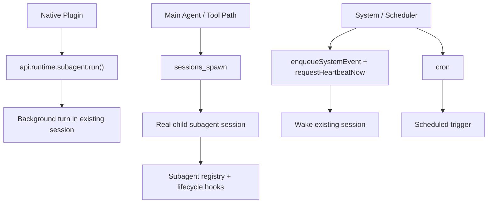
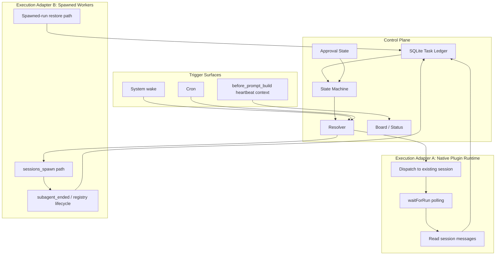
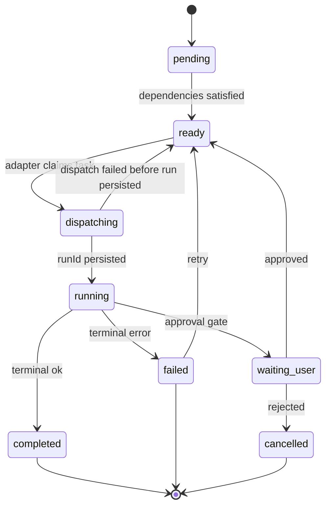

# Corrected Task Management Architecture for OpenClaw

> **Date:** 2026-03-28
> **Status:** Source-grounded correction and replacement for the March 28 synthesis note
> **Scope:** A revised task-management design based on the actual boundaries between native plugin runtime APIs, `sessions_spawn` subagent lifecycle, and system wake flows

---

## 1. Executive Summary

The prior synthesis note had the right instinct about reliability, but it conflated three different OpenClaw mechanisms:

1. **Native plugin runtime background runs** via `api.runtime.subagent.*`
2. **True spawned subagents** via the `sessions_spawn` / subagent registry path
3. **Advisory wake or scheduled automation** via system events and cron

Those are **not** interchangeable.

The corrected recommendation is:

- Use a **native plugin** for the durable goal/task ledger, board, approval state, and prompt injection
- Use **`api.runtime.subagent.run()` only for background turns in already-known sessions**
- Use **`waitForRun()` as the authoritative completion path** for that native-plugin execution adapter
- Treat **`sessions_spawn` as a separate orchestration surface** for true child-session workers
- Treat **wake/cron as triggers**, not as equivalent task-worker transports

The design should be boring about boundaries:

- **Plugin runtime run** = "run a turn in a specific session"
- **Spawned subagent** = "create/manage a real child worker session"
- **Wake/cron** = "trigger attention later", not "durable worker execution"

---

## 2. What The Source Actually Provides

### Native Plugin API Surface

Verified in `SourceCode/openclaw/src/plugins/types.ts`, `src/plugins/runtime/types.ts`, and `src/plugins/runtime/types-core.ts`.

The native plugin API gives you:

- `api.registerTool(...)`
- `api.on(...)` for hooks such as `before_prompt_build`, `subagent_ended`, `gateway_start`
- `api.runtime.subagent.run({ sessionKey, message, ... })`
- `api.runtime.subagent.waitForRun({ runId, timeoutMs })`
- `api.runtime.subagent.getSessionMessages({ sessionKey, limit })`
- `api.runtime.subagent.deleteSession({ sessionKey })`
- `api.runtime.system.enqueueSystemEvent(...)`
- `api.runtime.system.requestHeartbeatNow(...)`
- `api.runtime.state.resolveStateDir()`
- `api.registerGatewayMethod(...)`

What it does **not** give native plugins:

- A generic public `callGateway(...)` on `api.runtime`
- A generic public native-plugin RPC client for built-in gateway methods like `cron.add` or `"agent"`

That omission matters. It means a native plugin should not be designed as though it can freely invoke arbitrary built-in gateway RPCs.

### Plugin Runtime `subagent.run()` Is Not `sessions_spawn`

`api.runtime.subagent.run()` is defined as:

```typescript
type SubagentRunParams = {
  sessionKey: string;
  message: string;
  provider?: string;
  model?: string;
  extraSystemPrompt?: string;
  lane?: string;
  deliver?: boolean;
  idempotencyKey?: string;
};
```

The gateway implementation forwards that to the `"agent"` method using the same `sessionKey`.

That means:

- The caller must already know the target `sessionKey`
- This is a **background agent run API**
- It is **not** the same as auto-creating a fresh `agent:<id>:subagent:<uuid>` child session
- It does **not** expose the attachment materialization path used by `sessions_spawn`

### Real Subagent Lifecycle Lives Elsewhere

The actual spawned-subagent lifecycle is implemented through:

- `src/agents/subagent-spawn.ts`
- `src/agents/subagent-registry.ts`
- `src/agents/subagent-registry-completion.ts`
- `src/agents/subagent-announce.ts`

That path:

- creates/registers real child sessions
- persists run metadata to disk
- resumes/restores after restart
- emits `subagent_ended` with subagent-registry bookkeeping

This is the path you should think of as "real spawned workers".

### Hook Reliability Is Nuanced

It is true that `runVoidHook()` catches handler errors and does not rethrow.

But the broader statement "a missed `subagent_ended` is lost forever" is too strong for the real spawned-subagent path, because OpenClaw persists subagent run state and resumes it from disk.

So the correct conclusion is:

- **Plugin hook handlers are not durable by themselves**
- **The spawned-subagent runtime already has some durability machinery**
- **A plugin-specific reconciler is still useful, but it is not the only reliability layer in the system**

---

## 3. The Three Execution Primitives



### Primitive 1: Native Plugin Background Run

Best for:

- running work in an already-known session
- deterministic plugin-owned polling via `waitForRun()`
- extracting completion summaries with `getSessionMessages()`

Not best for:

- creating fresh child worker sessions
- assuming `subagent_ended` is your completion signal
- emulating `sessions_spawn`

### Primitive 2: Spawned Subagent

Best for:

- true worker-session creation
- nested subagent lifecycle
- push-based child completion semantics
- using the existing subagent registry and restore logic

Not best for:

- pretending it is the same API surface as native plugin runtime

### Primitive 3: Wake / Cron

Best for:

- nudging a session
- prompting a heartbeat
- scheduling a future reminder or periodic work

Not best for:

- serving as a reliable task-worker transport
- claiming task completion by itself

---

## 4. Corrected Recommendation

## Recommendation A: Native Plugin Control Plane + Existing-Session Runs

This is the most source-grounded native plugin design available today.

The plugin should own:

- goal/task definitions
- task state machine
- retry counts
- board rendering
- approvals and user-facing status
- prompt injection for heartbeat visibility

The execution adapter should be narrow:

1. choose a target **existing session key**
2. mark task as `dispatching`
3. call `api.runtime.subagent.run(...)`
4. persist `{ runId, sessionKey }`
5. mark task as `running`
6. resolve completion through `waitForRun()`
7. read latest messages from the session
8. store a result summary

This design is compatible with the real native plugin API.

## Recommendation B: Tool-Driven Spawned Workers For True Child Sessions

If the requirement is "create real leaf workers with spawned child sessions", the clean path is not a pure native plugin runtime adapter.

Instead:

- keep the ledger/control-plane in a plugin or tool
- use the existing `sessions_spawn` path for worker creation
- treat `subagent_ended` as part of the spawned-worker lifecycle, not as the generic completion signal for all task execution

In other words:

- **background run adapter** and **spawned worker adapter** should be modeled as two different backends
- do not merge them into one fictional "dispatch mode" abstraction too early

---

## 5. Revised Architecture



### Key Architectural Rule

The ledger can be unified.

The execution adapters should stay separate until OpenClaw exposes a truly unified public runtime for them.

---

## 6. Corrected State Machine

The `dispatching` intermediate state is still a good idea.



But the correlation rule changes:

- For **plugin runtime runs**, `runId` correlates to `waitForRun()`
- For **spawned subagents**, `runId` correlates to subagent-registry lifecycle and hooks

Do not assume one `runId` semantics model across both backends.

---

## 7. Recommended Phase Plan

### Phase 1: Native Plugin Ledger Only

Build:

- SQLite storage
- deterministic resolver
- board output
- approvals
- heartbeat injection
- retry / cancel / history

No autonomous dispatch yet.

### Phase 2: Existing-Session Background Run Adapter

Add:

- `api.runtime.subagent.run()`
- `waitForRun()` polling
- `getSessionMessages()` summary capture
- plugin-owned reconciliation timer

This is the first fully source-grounded execution layer for a native plugin.

### Phase 3: Spawned Worker Adapter

Only add this if you truly need:

- fresh worker sessions
- push-style child completion
- nested worker trees

At that point, explicitly build around the existing `sessions_spawn` / subagent registry path rather than pretending the native plugin runtime already gives you the same thing.

### Phase 4: Optional Trigger Integrations

Add:

- cron-triggered reevaluation
- wake-on-failure notifications
- external HTTP entrypoints via `registerHttpRoute()` or `registerGatewayMethod()`

But keep those as triggers, not as fake worker transports.

---

## 8. A Correct Native Plugin Skeleton

### Manifest

The manifest should only describe metadata and config schema.

```json
{
  "id": "task-graph",
  "name": "Task Graph",
  "description": "Goal/task ledger and status tooling for OpenClaw",
  "version": "0.1.0",
  "configSchema": {
    "type": "object",
    "additionalProperties": false,
    "properties": {
      "reconcileIntervalMs": { "type": "number" },
      "staleThresholdMs": { "type": "number" }
    }
  }
}
```

Do **not** put runtime registration like hooks/tools in the manifest.

### Entry Point

```typescript
import { definePluginEntry } from "openclaw/plugin-sdk/plugin-entry";

export default definePluginEntry({
  id: "task-graph",
  name: "Task Graph",
  description: "Goal/task ledger and status tooling for OpenClaw",
  register(api) {
    api.registerTool(createGoalsTool(api));

    api.on("before_prompt_build", async (_event, ctx) => {
      if (ctx.trigger !== "heartbeat") return {};
      const ready = store.getReadyTasksForAgent(ctx.agentId);
      if (ready.length === 0) return {};
      return { appendSystemContext: formatBoardForHeartbeat(ready) };
    });

    api.on("gateway_start", async () => {
      await reconcileLedger(store, api);
    });

    setInterval(() => {
      void reconcileLedger(store, api);
    }, reconcileIntervalMs).unref?.();
  },
});
```

### Correct Background Dispatch Pattern

```typescript
async function dispatchExistingSessionTask(task: Task, api: OpenClawPluginApi) {
  store.transition(task.id, "dispatching");

  const run = await api.runtime.subagent.run({
    sessionKey: task.sessionKey,
    message: task.message,
    extraSystemPrompt: buildTaskContext(task),
    idempotencyKey: task.dispatchId,
  });

  store.markRunning(task.id, {
    runId: run.runId,
    sessionKey: task.sessionKey,
  });
}

async function reconcileLedger(store: GoalStore, api: OpenClawPluginApi) {
  for (const task of store.getRunningTasks()) {
    const result = await api.runtime.subagent.waitForRun({
      runId: task.runId,
      timeoutMs: 0,
    });

    if (result.status === "timeout") continue;

    const { messages } = await api.runtime.subagent.getSessionMessages({
      sessionKey: task.sessionKey,
      limit: 20,
    });

    const summary = extractLatestAssistantText(messages);
    if (result.status === "ok") {
      store.complete(task.id, summary);
    } else {
      store.fail(task.id, result.error ?? "error", summary);
    }
  }
}
```

This is the correct source-grounded native-plugin completion loop.

---

## 9. What To Avoid

Avoid these assumptions:

1. "`api.runtime.subagent.run()` creates fresh subagent worker sessions"
2. "`runId` from plugin runtime runs naturally feeds `subagent_ended`"
3. "wake/send/cron are just additional task dispatch modes with the same semantics"
4. "native plugins can freely call arbitrary built-in gateway RPC methods"
5. "manifest metadata should declare runtime hooks/tools"

Each of those pushes the design away from what the source code actually supports.

---

## 10. Final Recommendation

If the goal is a **reliable task-management plugin today**, build this:

- **Control plane:** native plugin + SQLite ledger
- **Execution backend 1:** existing-session background runs via `api.runtime.subagent.*`
- **Completion authority:** `waitForRun()` plus session-message readback
- **Visibility:** `before_prompt_build` heartbeat board
- **Recovery:** startup + periodic reconciliation

If the goal is **true spawned-worker orchestration**, treat that as a separate backend centered on `sessions_spawn` and the subagent registry path.

The important correction is not "be less ambitious."

It is:

**Model the boundaries honestly, because OpenClaw already has multiple execution systems, and reliability depends on not pretending they are the same system.**
