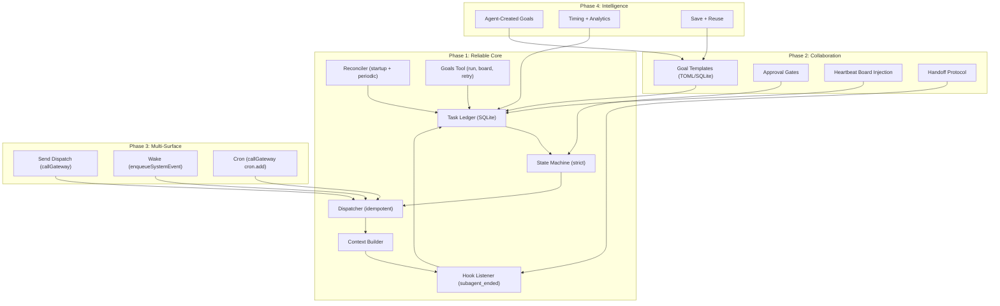
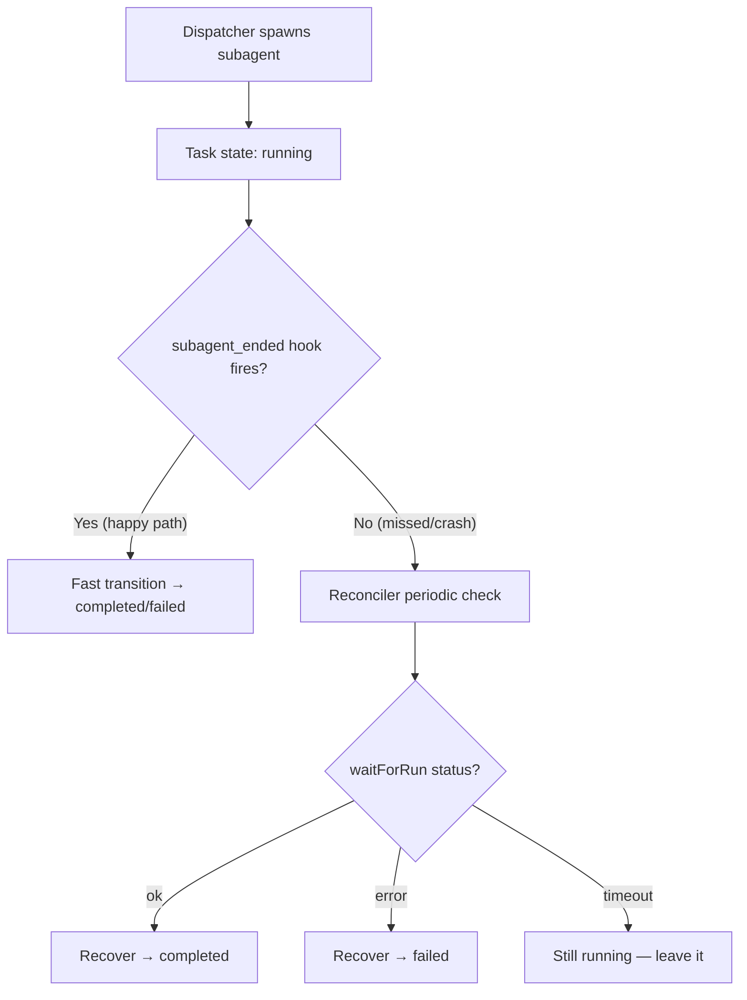
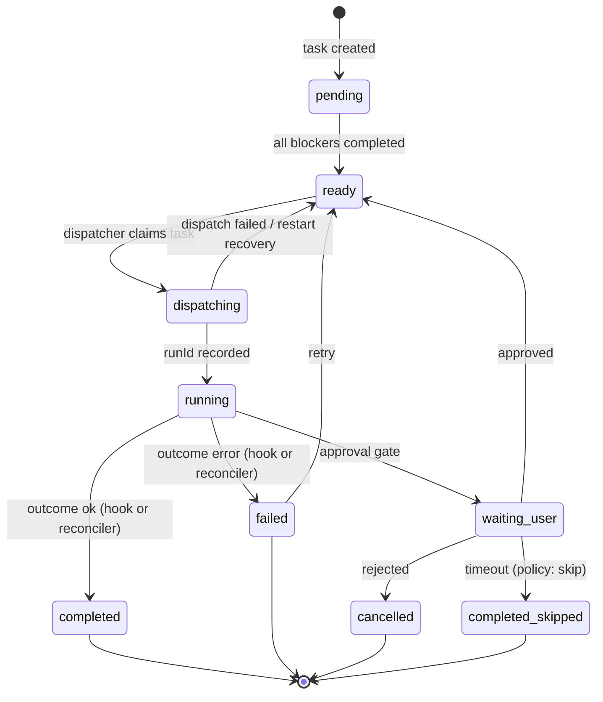
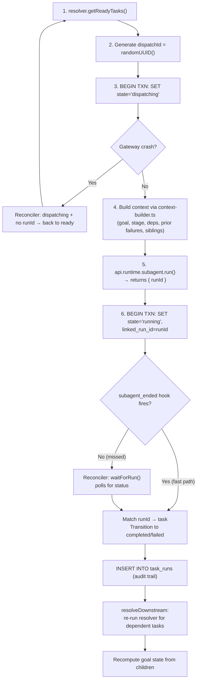
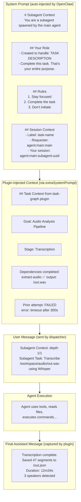

# Synthesized Best Practices: Reliable Task Management Plugin for OpenClaw

> **Date:** 2026-03-28 (Updated: 2026-03-28 — corrected after latest git pull)
> **Status:** Source-grounded recommendation
> **Builds on:** [Task Dependency Graph Design (March 26)](./2026-03-26_task_dependency_graph_design.md), [Reliable Task Management Design (March 27)](./2026-03-27_reliable_task_management_design.md)
> **Scope:** Comparative analysis of both approaches, grounded in OpenClaw source code verification, with a synthesized recommendation

---

## 1. Executive Summary

Both designs share the same ambition — a plugin-based, goal-first task management system — but differ in **where they place the trust boundary** and **how they handle failure**.

**The recommended approach: Design B's reliability foundation + Design A's user-facing model.**

- **From Design B**: Durable ledger, `dispatching` intermediate state, correlation IDs, startup reconciliation, explicit separation of `waiting_user` vs `paused` vs `cancelled`
- **From Design A**: Goal/Task hierarchy, TOML templates, rich board output with timing rollups, agent-created goals, run-over-run comparison, comprehensive tool surface

**The ordering principle**: If the execution layer is unreliable, the collaboration layer is fiction. Build boring correctness first, then elegant UX on top.

---

## 2. Design A vs Design B: Side-by-Side

### Philosophical Difference

| Dimension | Design A (March 26) | Design B (March 27) |
|---|---|---|
| **Core philosophy** | Full orchestration surface, trust hooks as event bus | Reliability first, trust durable state |
| **Trust boundary** | `subagent_ended` hook is the primary signal | Hook as fast path, reconciler as safety net |
| **State machine** | `pending → ready → dispatched → running → completed` | `pending → ready → dispatching → running → completed` |
| **Dispatch scope** | spawn, send, wake, cron, manual from Phase 1 | spawn-first; all 4 feasible via `callGateway()` but expand after spawn correlation is proven |
| **Recovery model** | Not addressed | Required feature — startup reconciliation |
| **Goal hierarchy** | First-class at runtime | First-class at authoring/viewing, flat at execution |
| **Phasing** | Features first, reliability assumed | Reliability first, features incremental |

### Where Design A Excels

1. **Rich Goal/Task hierarchy** with arbitrary nesting, timing rollups, run history
2. **Unified authoring model** — human TOML templates and agent plans use identical format
3. **Comprehensive tool surface** — `plan`, `board`, `handoff`, `claim`, `approve`, `retry`, `save`, `history`, `notify`
4. **Multi-surface dispatch** vision covering all four collaboration surfaces
5. **Beautiful board output** with per-stage timing and bottleneck identification

### Where Design B Excels

1. **`dispatching` intermediate state** — protects against restart during run creation
2. **Startup reconciliation** as a required feature
3. **Correlation ID discipline** — every dispatch gets a `dispatchId` linked to runtime objects
4. **State semantics precision** — `waiting_user` ≠ `paused`, `cancelled` ≠ `failed`, `completed_skipped` ≠ `completed`
5. **Honest constraint assessment** — acknowledges reliability limits
6. **Conservative phasing** — reliability-first is the right ordering

---

## 3. Source Code Verification

### What the Plugin SDK Actually Provides

Verified by reading the actual source files (latest `main` as of 2026-03-28):

| Capability | Available? | Source File |
|---|---|---|
| `api.registerTool(factory, { names })` | ✅ Direct | `src/plugins/types.ts` L1514–1517 |
| `api.on("subagent_ended", handler)` | ✅ Direct | `src/plugins/types.ts` L1580–1584 |
| `api.on("before_prompt_build", handler)` | ✅ Direct | Returns `appendSystemContext` for injection |
| `api.on("gateway_start", handler)` | ✅ Direct | For startup reconciliation |
| `api.runtime.subagent.run(params)` | ✅ Direct | `src/plugins/runtime/types.ts` L8–21, returns `{ runId }` |
| `api.runtime.subagent.waitForRun(params)` | ✅ Direct | Returns `{ status: "ok" \| "error" \| "timeout" }` |
| `api.runtime.system.requestHeartbeatNow()` | ✅ Direct | `src/plugins/runtime/types-core.ts` L50 |
| `api.runtime.system.enqueueSystemEvent()` | ✅ Direct | `src/plugins/runtime/types-core.ts` L49 |
| `api.runtime.state.resolveStateDir()` | ✅ Direct | For plugin-local storage path |
| Session Send (inter-agent messaging) | ✅ Via Gateway RPC | `callGateway({ method: "agent", params })` — same mechanism `sessions_send` tool uses internally (`src/agents/tools/sessions-send-tool.ts` L66) |
| Cron CRUD (add/update/remove/list/run) | ✅ Via Gateway RPC | Gateway methods: `cron.add`, `cron.update`, `cron.remove`, `cron.run`, `cron.list` (`src/gateway/server-methods/cron.ts` L44–225) |
| `callGateway` importable by extensions | ✅ Proven | Browser extension imports `callGatewayTool` from `openclaw/plugin-sdk/browser-support` — established pattern |

### Dispatch Mode Feasibility (All 4 Modes Are Achievable)

| Mode | Mechanism | Correlation | Reliability |
|---|---|---|---|
| **Spawn** | `api.runtime.subagent.run()` → returns `{ runId }` | ✅ Strong — `runId` links to `subagent_ended` hook | ✅ High — reconciler can poll via `waitForRun()` |
| **Send** | `callGateway({ method: "agent", params: { sessionKey, message, ... } })` | ⚠️ Medium — returns `runId`, can `agent.wait`, but no automatic `subagent_ended` hook | ⚠️ Medium — need custom completion polling |
| **Wake** | `enqueueSystemEvent(text, { sessionKey })` + `requestHeartbeatNow()` | ⚠️ Weak — fire-and-forget, no direct completion signal | ⚠️ Low — best for advisory nudges, not deterministic dispatch |
| **Cron** | `callGateway({ method: "cron.add", params: { name, schedule, payload, ... } })` | ⚠️ Weak — job fires independently, requires convention for completion | ⚠️ Low — recurring schedules, not one-shot task dispatch |

**Key correction from earlier analysis**: `sessions_send` and `cron` do NOT have direct methods on `api.runtime`, but they ARE reachable through the `callGateway()` RPC client. This is the same mechanism the built-in `sessions_send` tool uses internally (it calls `callGateway({ method: "agent", ... })`) and the browser extension already demonstrates the import pattern via `openclaw/plugin-sdk/browser-support`.

### Critical Finding: `subagent_ended` Is Fire-and-Forget

**Source**: `src/plugins/hooks.ts` L947–952

```typescript
async function runSubagentEnded(
  event: PluginHookSubagentEndedEvent,
  ctx: PluginHookSubagentContext,
): Promise<void> {
  return runVoidHook("subagent_ended", event, ctx);
}
```

And `runVoidHook` (L264–285):

```typescript
async function runVoidHook<K extends PluginHookName>(
  hookName: K,
  event: ...,
  ctx: ...,
): Promise<void> {
  const hooks = getHooksForName(registry, hookName);
  const promises = hooks.map(async (hook) => {
    try {
      await (hook.handler as ...)(event, ctx);
    } catch (err) {
      handleHookError({ hookName, pluginId: hook.pluginId, error: err });
      // ^^^ catches and logs — does NOT rethrow when catchErrors=true (default)
    }
  });
  await Promise.all(promises);  // All handlers run in parallel
}
```

**Implications**:
- If a handler throws, the error is swallowed (logged only)
- If the gateway restarts between subagent completion and hook delivery, the event is **lost forever**
- Hook is useful for the happy path but **cannot be the sole source of truth**

### Critical Finding: `PluginHookSubagentEndedEvent` Has Enough Data for Correlation

**Source**: `src/plugins/types.ts` L2137–2147

```typescript
export type PluginHookSubagentEndedEvent = {
  targetSessionKey: string;
  targetKind: PluginHookSubagentTargetKind;
  reason: string;
  sendFarewell?: boolean;
  accountId?: string;
  runId?: string;          // ← This is the correlation key
  endedAt?: number;
  outcome?: "ok" | "error" | "timeout" | "killed" | "reset" | "deleted";
  error?: string;
};
```

The `runId` maps back to the `runId` returned by `api.runtime.subagent.run()`, so correlation IS possible — but only if the task ledger records the `runId` at dispatch time.

### Critical Finding: `gateway_start` Is Also Fire-and-Forget

Same `runVoidHook` pattern. So reconciliation should NOT solely depend on `gateway_start`. A fallback timer (e.g., 60s periodic check) is needed as a safety net.

---

## 4. The `dispatching` Gap: Why It Matters

Design A's state machine goes: `ready → dispatched → running`
Design B adds: `ready → dispatching → running`

The difference is critical:

### Without `dispatching` (Design A's race condition)

```
1. Task is "ready"
2. Plugin calls api.runtime.subagent.run({ sessionKey, message })
3. Gateway crashes BEFORE the returned runId is persisted
4. Gateway restarts
5. Task is "ready" → gets dispatched AGAIN (duplicate work)
   OR: Task was flipped to "running" optimistically → no runId → orphaned forever
```

### With `dispatching` (Design B's solution)

```
1. Generate dispatchId, move task to "dispatching" (persisted to disk)
2. Plugin calls api.runtime.subagent.run()
3. If crash: reconciler sees "dispatching" with no linkedRunId → moves back to "ready"
4. If success: record runId → move to "running"
```

This is the single most important reliability decision in the entire design.

---

## 5. Recommended Architecture

### High-Level Component Diagram



### Dual Completion Path



### State Machine (Synthesized)



### Dispatcher Sequence (Step-by-Step)



---

## 6. Plugin Structure

```
extensions/task-graph/
  openclaw.plugin.json            # Plugin manifest (see below)
  package.json
  tsconfig.json
  index.ts                        # Register tool + hooks
  src/
    db.ts                         # SQLite database init + migrations (WAL mode)
    store.ts                      # GoalStore: CRUD over SQLite tables
    store.types.ts                # Type definitions for all data models
    state-machine.ts              # Strict transition validation
    resolver.ts                   # Dependency resolution (deterministic, no LLM)
    dispatcher.ts                 # Multi-mode dispatch (spawn → Phase 1; send/wake/cron → Phase 3)
    reconciler.ts                 # Startup + periodic repair loop
    board.ts                      # Board formatting + heartbeat injection
    context-builder.ts            # Build rich context for spawned subagents
    templates.ts                  # TOML loader + param interpolation (Phase 2)
    gates.ts                      # Approval gate logic (Phase 2)
    tracking.ts                   # Timing aggregation via task_runs queries (Phase 4)
    gateway-rpc.ts                # callGateway wrappers for send/cron dispatch (Phase 3)
    tools/
      goals-tool.ts               # Tool: run/board/handoff/approve/reject/retry/save
  tests/
    state-machine.test.ts         # Every valid/invalid transition pair
    resolver.test.ts              # DAG with various blocker patterns, cycle detection
    reconciler.test.ts            # Mock subagent states → verify task state repairs
    store.test.ts                 # Persistence round-trip, restart simulation
    dispatcher.test.ts            # Dispatch flow + crash recovery
    context-builder.test.ts       # Context injection correctness
```

### Plugin Manifest (`openclaw.plugin.json`)

```json
{
  "id": "task-graph",
  "name": "Task Graph",
  "version": "0.1.0",
  "description": "Goal-first reliable task management for multi-agent workflows",
  "entry": "./index.ts",
  "tools": ["goals"],
  "hooks": ["subagent_ended", "gateway_start", "before_prompt_build"]
}
```

### SQLite Table Design

SQLite is chosen over JSON for analytics robustness: querying time spent, failure rates, and token consumption is a SQL query, not a full-file parse.

```sql
-- Saved goal/task definitions (reusable workflows)
CREATE TABLE templates (
  id             TEXT PRIMARY KEY,
  name           TEXT NOT NULL,
  description    TEXT,
  source         TEXT NOT NULL DEFAULT 'human',  -- 'human' | 'agent'
  definition     TEXT NOT NULL,                  -- JSON blob (goal/stage/task tree)
  created_at_ms  INTEGER NOT NULL,
  updated_at_ms  INTEGER NOT NULL
);

-- Currently running goal instances
CREATE TABLE active_goals (
  id             TEXT PRIMARY KEY,
  template_id    TEXT,                           -- NULL if ad-hoc
  name           TEXT NOT NULL,
  state          TEXT NOT NULL DEFAULT 'pending', -- derived from children
  params         TEXT,                           -- JSON: interpolated template params
  created_at_ms  INTEGER NOT NULL,
  updated_at_ms  INTEGER NOT NULL
);

-- Task instances within goals (state machine)
CREATE TABLE tasks (
  id             TEXT PRIMARY KEY,
  goal_id        TEXT NOT NULL REFERENCES active_goals(id),
  parent_id      TEXT,                           -- stage ID for nesting
  name           TEXT NOT NULL,
  state          TEXT NOT NULL DEFAULT 'pending',
  agent_id       TEXT,                           -- target agent
  dispatch_mode  TEXT DEFAULT 'spawn',           -- spawn|send|wake|cron
  dispatch_id    TEXT,                           -- pre-dispatch correlation
  linked_run_id  TEXT,                           -- post-dispatch subagent runId
  session_key    TEXT,                           -- child session key
  depends_on     TEXT,                           -- JSON array of task IDs
  task_message   TEXT,                           -- the prompt/instruction sent
  extra_context  TEXT,                           -- JSON: injected context for subagent
  result_summary TEXT,                           -- captured from subagent output
  error          TEXT,
  created_at_ms  INTEGER NOT NULL,
  updated_at_ms  INTEGER NOT NULL
);

-- Execution history: audit trail for analytics
CREATE TABLE task_runs (
  id             INTEGER PRIMARY KEY AUTOINCREMENT,
  task_id        TEXT NOT NULL REFERENCES tasks(id),
  goal_id        TEXT NOT NULL REFERENCES active_goals(id),
  run_id         TEXT,                           -- subagent runId
  session_key    TEXT,
  state          TEXT NOT NULL,                  -- terminal state for this run
  started_at_ms  INTEGER,
  ended_at_ms    INTEGER,
  duration_ms    INTEGER,
  input_tokens   INTEGER,
  output_tokens  INTEGER,
  total_tokens   INTEGER,
  model          TEXT,
  provider       TEXT,
  error          TEXT,
  result_summary TEXT
);

CREATE INDEX idx_task_runs_goal ON task_runs(goal_id);
CREATE INDEX idx_task_runs_task ON task_runs(task_id);
CREATE INDEX idx_tasks_goal ON tasks(goal_id);
CREATE INDEX idx_tasks_state ON tasks(state);
```

**Analytics queries enabled by this design:**

```sql
-- Time spent per goal
SELECT goal_id, SUM(duration_ms) as total_ms FROM task_runs GROUP BY goal_id;

-- Failure rate per agent
SELECT agent_id,
  COUNT(*) FILTER (WHERE state = 'failed') * 100.0 / COUNT(*) as failure_pct
FROM tasks GROUP BY agent_id;

-- Token consumption per goal
SELECT goal_id, SUM(total_tokens) FROM task_runs GROUP BY goal_id;

-- Average run duration by task name (cross-goal)
SELECT t.name, AVG(tr.duration_ms)
FROM task_runs tr JOIN tasks t ON tr.task_id = t.id
GROUP BY t.name;
```

### Hook Registration

```typescript
export default definePluginEntry({
  id: "task-graph",
  name: "Task Graph",
  description: "Goal-first reliable task management for multi-agent workflows",
  register(api) {
    const stateDir = api.runtime.state.resolveStateDir();
    const db = initDatabase(path.join(stateDir, "task-graph", "task-graph.db"));
    const store = new GoalStore(db);

    // Tool: goals.run(), goals.board(), goals.handoff(), etc.
    api.registerTool(
      (ctx) => createGoalsTool(store, ctx, api),
      { names: ["goals"] },
    );

    // Fast completion path
    api.on("subagent_ended", async (event) => {
      await resolveOnTaskCompleted(store, api, event);
    });

    // Heartbeat injection: show ready tasks in agent prompt
    api.on("before_prompt_build", async (event, ctx) => {
      if (ctx.trigger !== "heartbeat") return {};
      const ready = store.getReadyTasksForAgent(ctx.agentId);
      if (ready.length === 0) return {};
      return { appendSystemContext: formatBoardForHeartbeat(ready) };
    });

    // Recovery on startup
    api.on("gateway_start", async () => {
      await reconcileOnStartup(store, api);
    });

    // Periodic reconciliation fallback (safety net for missed hooks)
    setInterval(() => reconcilePeriodic(store, api), 60_000);
  },
});
```

---

## 7. Subagent Memory & Transcript: What Delegated Agents See

### Source-Grounded Analysis

Verified by reading `subagent-spawn.ts` and `subagent-announce.ts`.

When the plugin dispatches a task via `api.runtime.subagent.run()`, OpenClaw creates a **fresh subagent session** with session key `agent:<targetAgentId>:subagent:<uuid>`. Here's exactly what the spawned agent gets:

#### What the Subagent SEES (Its Context Window)

| Context Layer | Included? | Source |
|---|---|---|
| **Task message** | ✅ | `[Subagent Task]: <task text>` — sent as the user message |
| **Agent bootstrap files** | ✅ | AGENTS.md, SOUL.md, TOOLS.md, HEARTBEAT.md of `targetAgentId` |
| **Subagent system prompt** | ✅ | Auto-injected: role, depth, rules, requester session key |
| **Extra system prompt** | ✅ | Our plugin can inject via `extraSystemPrompt` parameter |
| **Attachments** | ✅ | Files can be attached via `attachments` parameter |
| **Memory (if memory-core active)** | ✅ | Agent has its own memory. Shared if same `agentId` is used |
| **Tools** | ✅ | All tools registered for that agent (including our `goals` tool) |

#### What the Subagent DOES NOT SEE (Lost Context)

| Context | Included? | Impact |
|---|---|---|
| **Parent's conversation history** | ❌ | Subagent starts with empty transcript |
| **Other tasks' results** | ❌ | No cross-task context unless explicitly injected |
| **Goal-level context** | ❌ | Doesn't know about the broader goal hierarchy |
| **Prior run history for same task** | ❌ | On retry, subagent doesn't know what failed before |
| **Other agents' outputs** | ❌ | Parallel tasks are isolated from each other |

#### What the Subagent's Transcript Looks Like



### Context Compensation Strategy

Our plugin compensates for the "lost context" problem via the **context-builder** module:

```typescript
// context-builder.ts — builds rich context for each dispatched task
function buildTaskContext(store: GoalStore, task: Task): string {
  const lines: string[] = [];

  // 1. Goal-level context
  const goal = store.getGoal(task.goalId);
  lines.push(`## Task Context (from task-graph plugin)`);
  lines.push(`Goal: "${goal.name}"`);
  if (task.parentId) {
    const stage = store.getTask(task.parentId);
    lines.push(`Stage: "${stage.name}"`);
  }

  // 2. Dependency outputs — inject completed predecessors' results
  const deps = store.getCompletedDependencies(task.id);
  if (deps.length > 0) {
    lines.push(`\nCompleted dependencies:`);
    for (const dep of deps) {
      lines.push(`- ${dep.name} ✅: ${dep.resultSummary || '(no summary)'}`);
    }
  }

  // 3. Prior failure context (for retries)
  const priorRuns = store.getTaskRuns(task.id);
  const lastFailed = priorRuns.filter(r => r.state === 'failed').at(-1);
  if (lastFailed) {
    lines.push(`\n⚠️ Prior attempt FAILED: ${lastFailed.error}`);
    lines.push(`   Duration: ${lastFailed.duration_ms}ms`);
  }

  // 4. Sibling awareness (parallel tasks in same stage)
  const siblings = store.getSiblingTasks(task.id);
  if (siblings.length > 0) {
    lines.push(`\nParallel tasks in this stage:`);
    for (const s of siblings) {
      lines.push(`- ${s.name}: ${s.state}`);
    }
  }

  return lines.join('\n');
}
```

This context is injected as `extraSystemPrompt` when calling `subagent.run()`, so the subagent sees it in its system prompt even though it has no conversation history.

---

## 8. Escalation & Memory Enforcement

Designing a reliable task graph requires treating agents as fallible workers rather than omniscient orchestrators. The plugin acts as the infallible supervisor.

### Prompt vs. Code: System-Driven Escalation

When an error occurs (e.g., a fix cron fails, or a subagent hits a token limit), relying on the LLM to understand the failure and proactively message the main agent via the `sessions_send` tool is highly unreliable ("Prompt Escalation"). If the session times out, the failure is lost forever.

The plugin enforces **Code Escalation**:
1. When a task fails or times out, the OpenClaw runtime terminates the session.
2. The `task-graph` plugin's reconciler detects the failure in SQLite.
3. The plugin executes deterministic TypeScript code to handle it:
   - For a standard task: `store.transition(taskId, 'failed')` and increment retry logic.
   - For an escalation: `api.runtime.system.enqueueSystemEvent("[ESCALATION] Task failed. Needs intervention.")` + `requestHeartbeatNow()` to instantly wake the main agent with the failure logs.

**Rule:** Never trust an agent to reliably report its own failure. The plugin monitors from the outside.

### Short-Term vs. Long-Term Memory Strategy

Subagents spawn with an empty conversational transcript (Short-Term Memory). However, they inherit the exact same File System workspace as the main agent (Long-Term Memory). The plugin enforces two patterns to persist context:

1. **System Prompt Enforcement (The "Stick")**
   The `context-builder.ts` automatically injects a strict requirement into every subagent's `extraSystemPrompt`:
   > *Rule: Before announcing completion, you MUST write any significant findings, architectural decisions, or reusable knowledge to a markdown file in the `UnderStanding/` or `Memory/` directory. Your final announcement must include the absolute path to the file you created/updated.*

2. **Template Validation (The Verification)**
   For mission-critical tasks, the TOML template allows specifying an `expected_artifacts` array. If the subagent announces it is done, the plugin cross-checks the filesystem. If the required file was not modified during the runtime window, the plugin rejects the completion and fails the task.

---

## 9. Nesting: Plugin Hierarchy vs Subagent Depth

### Critical Distinction

Our Goal → Stage → Task hierarchy lives **in the SQLite database**, NOT in subagent nesting depth.

```mermaid
flowchart LR
    subgraph WRONG["❌ NOT this: chained subagent nesting"]
        direction TB
        WA["main agent\n(depth 0)"] -->|spawns| WB["goal orchestrator\n(depth 1)"]
        WB -->|spawns| WC["stage runner\n(depth 2)"]
        WC -->|spawns| WD["task worker\n(depth 3)"]
    end

    subgraph RIGHT["✅ THIS: flat dispatch from plugin"]
        direction TB
        R1["Plugin orchestrator\n(in-process)"] -->|"api.runtime.subagent.run()"| R2["Task A\n(depth 1, leaf)"]
        R1 -->|"api.runtime.subagent.run()"| R3["Task B\n(depth 1, leaf)"]
        R1 -->|"api.runtime.subagent.run()"| R4["Task C\n(depth 1, leaf)"]
        R2 -->|result| R5[("SQLite\nrecords result")]
        R3 -->|result| R5
        R4 -->|result| R5
        R5 -->|"resolve next"| R1
    end

    style WRONG fill:#3d1111,stroke:#ff4444
    style RIGHT fill:#113d11,stroke:#44ff44
```



**Source verification** (`config/agent-limits.ts` L6):
```typescript
export const DEFAULT_SUBAGENT_MAX_SPAWN_DEPTH = 1;
// depth 0 = "main" (can spawn)
// depth >= maxDepth = "leaf" (CANNOT spawn further)
```

The default `maxSpawnDepth: 1` is fine because:
- All tasks dispatch at depth 1 (leaf workers)
- The plugin orchestrator is in-process, not a subagent
- No chained nesting needed
- **Zero config changes required** — fully compatible with `git pull`

If an orchestrator subagent needs to spawn its own children (e.g., a complex multi-step task), set `maxSpawnDepth: 2` in `openclaw.yaml` — this is a user config file, not source code.

---

## 10. Git Pull Compatibility

The entire plugin is user-space code. **Zero core source changes required.**

| Component | Location | In Git Repo? | Git Pull Safe? |
|---|---|---|---|
| Plugin code | `extensions/task-graph/` | User-managed | ✅ Not in upstream repo |
| SQLite database | `<stateDir>/task-graph/task-graph.db` | Runtime file | ✅ Not tracked |
| Config entries | `openclaw.yaml` (user config) | User file | ✅ Not in repo |
| Core source | `src/` | Upstream repo | ✅ No modifications |

All plugin API features used (`registerTool`, `subagent.run`, hooks, `resolveStateDir`, `callGateway`) are stable public interfaces.

---

## 11. Reconciliation Mechanism (Detailed)

Two complementary repair loops, both **our plugin's code**:

### 10.1 Startup Reconciliation (`gateway_start` hook)

Fires once when the OpenClaw gateway boots/restarts:

```typescript
api.on("gateway_start", async () => {
  const stale = store.getNonterminalTasks();
  for (const task of stale) {
    // Case 1: Dispatching interrupted — no runId recorded
    if (task.state === "dispatching" && !task.linkedRunId) {
      store.transition(task.id, "ready"); // safe to retry
    }
    // Case 2: Running task — check if it actually finished
    if (task.state === "running" && task.linkedRunId) {
      const result = await api.runtime.subagent.waitForRun({
        runId: task.linkedRunId,
        timeoutMs: 0, // instant check, no waiting
      });
      if (result.status === "ok") {
        store.transition(task.id, "completed");
        store.recordRun(task, result); // audit trail to task_runs
        await resolveDownstream(task); // unlock dependent tasks
      } else if (result.status === "error") {
        store.transition(task.id, "failed", { error: result.error });
        store.recordRun(task, result);
      }
      // "timeout" = still running, leave it alone
    }
  }
  store.recomputeGoalStates();
});
```

⚠️ This hook is fire-and-forget (`runVoidHook`) — if it throws, the error is swallowed.

### 10.2 Periodic Timer (Safety Net)

```typescript
setInterval(() => reconcilePeriodic(store, api), reconcileIntervalMs);
```

Runs every N seconds (default 60s). Same logic as startup, but incremental — only checks tasks that have been in a non-terminal state longer than a staleness threshold.

**Configurable via `openclaw.yaml`:**
```yaml
plugins:
  task-graph:
    reconcileIntervalMs: 60000       # how often to check (default: 60s)
    staleThresholdMs: 300000         # consider tasks stale after 5 min
```

---

## 12. Tool Surface

The plugin exposes a single `goals` tool with subcommands:

| Subcommand | Phase | Description |
|---|---|---|
| `goals.run(goalName, params?)` | P1 | Create a goal instance from a template or ad-hoc definition. Instantiates tasks, resolves dependencies, dispatches ready tasks. |
| `goals.board(goalId?)` | P1 | Display current goal/task status board. Shows state, agent, timing, errors. If no goalId, shows all active goals. |
| `goals.retry(taskId)` | P1 | Move a failed task back to `ready` for re-dispatch. Clears error, increments retry count. |
| `goals.cancel(goalId or taskId)` | P1 | Cancel a goal or individual task. Cascades to dependent tasks. |
| `goals.save(goalId, name)` | P2 | Save a running/completed goal as a reusable template in the `templates` table. |
| `goals.approve(taskId)` | P2 | Approve a task in `waiting_user` state. Moves to `ready`. |
| `goals.reject(taskId)` | P2 | Reject a task in `waiting_user` state. Moves to `cancelled`. |
| `goals.handoff(taskId, agentId)` | P2 | Reassign a pending/ready task to a different agent. |
| `goals.plan(definition)` | P4 | Agent creates a goal definition programmatically (ad-hoc, not from template). |
| `goals.history(goalId?)` | P4 | Show execution history with timing, token usage, failure rates from `task_runs` table. |

### Board Output Format

```
╔══════════════════════════════════════════════════════════════╗
║ Goal: Audio Analysis Pipeline          Status: IN_PROGRESS ║
║ Template: audio-analysis-v2            Started: 5m ago     ║
╠══════════════════════════════════════════════════════════════╣
║ Stage 1: Preparation                                  ✅   ║
║   ├─ [✅] extract-audio        main    12s   3.2k tokens   ║
║   └─ [✅] normalize-volume     main     8s   1.8k tokens   ║
║ Stage 2: Processing                                   🔄   ║
║   ├─ [🔄] transcribe          main    running (2m)         ║
║   ├─ [⏳] speaker-diarize     main    waiting on transcribe ║
║   └─ [⏳] sentiment-analysis  main    waiting on transcribe ║
║ Stage 3: Synthesis                                    ⏳   ║
║   └─ [⏳] generate-report     main    waiting on Stage 2   ║
╚══════════════════════════════════════════════════════════════╝
```

---

## 13. TOML Template Example (Phase 2)

```toml
[goal]
name = "Audio Analysis Pipeline"
description = "End-to-end audio analysis: extract, transcribe, analyze, report"

[[stages]]
name = "Preparation"

[[stages.tasks]]
name = "extract-audio"
agent = "main"
message = "Extract audio from {{input_file}} and save as WAV to {{workspace}}/audio/"

[[stages.tasks]]
name = "normalize-volume"
agent = "main"
depends_on = ["extract-audio"]
message = "Normalize audio volume of the extracted WAV file"

[[stages]]
name = "Processing"

[[stages.tasks]]
name = "transcribe"
agent = "main"
depends_on = ["normalize-volume"]
message = "Transcribe {{workspace}}/audio/*.wav using Whisper. Save JSON to {{workspace}}/transcripts/"

[[stages.tasks]]
name = "speaker-diarize"
agent = "main"
depends_on = ["transcribe"]
message = "Run speaker diarization on the transcription output"

[[stages.tasks]]
name = "sentiment-analysis"
agent = "main"
depends_on = ["transcribe"]
message = "Analyze sentiment of each transcript segment"

[[stages]]
name = "Synthesis"

[[stages.tasks]]
name = "generate-report"
agent = "main"
depends_on = ["speaker-diarize", "sentiment-analysis"]
message = "Generate a comprehensive analysis report combining transcription, speakers, and sentiment"
expected_artifacts = ["{{workspace}}/reports/audio_analysis.md"]
approval_required = true
```

Usage: `goals.run("Audio Analysis Pipeline", { input_file: "/data/meeting.mp4", workspace: "/workspace" })`

---

## 14. Recommended Phasing

| Phase | Scope | Why This Order |
|---|---|---|
| **P1: Ledger + Recovery + Spawn** | SQLite store, state machine, `dispatching` state, spawn dispatch, context-builder, `subagent_ended` hook, startup + periodic reconciler, `goals.board()`, `goals.run()`, `goals.retry()`, `goals.cancel()` | The reliable execution layer must work correctly before anything else |
| **P2: Templates + Save + Approvals** | Saved templates table, TOML import, `goals.save()`, `goals.approve/reject`, `goals.handoff()`, `waiting_user` state, heartbeat board injection | Makes the system reusable for both humans and agents |
| **P3: Multi-Surface Dispatch** | Send via `callGateway({ method: "agent" })`, wake via `enqueueSystemEvent` + `requestHeartbeatNow`, cron via `callGateway({ method: "cron.add" })` | Reliable correlation for spawn is proven; extend to other modes |
| **P4: Agent Plans + Analytics** | `goals.plan()` (agent-created goals), `goals.history()`, timing rollup via `task_runs` table, failure rate dashboards, token consumption reports | Makes the system self-improving and observable |

---

## 15. Verification Plan

### Automated Tests

| Test Suite | What It Verifies |
|---|---|
| `state-machine.test.ts` | Every valid/invalid transition pair. `ready→dispatching` ✅, `pending→running` ❌, etc. |
| `resolver.test.ts` | DAG resolution with linear chains, fan-out, fan-in, diamond deps, cycle detection |
| `reconciler.test.ts` | Mock subagent registry states → verify `dispatching` without `runId` → `ready`, `running` with completed `runId` → `completed` |
| `store.test.ts` | SQLite persistence round-trip: write → restart (close + reopen DB) → read → verify |
| `dispatcher.test.ts` | Dispatch flow including crash simulation between `dispatching` and `running` |
| `context-builder.test.ts` | Dependency output injection, prior failure inclusion, sibling awareness |

### Manual Verification

1. **Crash recovery**: Deploy plugin, run a 3-stage goal, kill gateway mid-execution, restart, verify tasks recover correctly
2. **Approval gates**: Run approval gate workflow, verify `waiting_user` survives restart
3. **Heartbeat injection**: Verify heartbeat board injection shows ready tasks to correct agent
4. **Concurrent goals**: Run 2+ goals simultaneously, verify isolation and correct board display
5. **Cross-agent dispatch**: Dispatch tasks to different `agentId`s, verify context injection works

---

## 16. Key Takeaways

1. **The hook is the fast path; the reconciler is the truth** — never rely solely on `subagent_ended`
2. **`dispatching` between `ready` and `running`** — the single most important reliability decision
3. **All 4 dispatch modes are feasible** — spawn is direct API, send/cron are via `callGateway()` RPC, wake is via `enqueueSystemEvent` + `requestHeartbeatNow`
4. **Spawn first, then expand** — spawn has the strongest correlation; prove reliability before adding send/cron
5. **Plugin hierarchy ≠ subagent depth** — Goal→Stage→Task lives in SQLite, all tasks dispatch as depth-1 leaf workers
6. **Subagents start with empty transcripts** — the context-builder must inject dependency outputs, prior failures, and goal context via `extraSystemPrompt`
7. **Recovery is Phase 1, not Phase N** — if you can't recover from a gateway restart, you don't have task management
8. **SQLite for analytics** — `task_runs` table enables time spent, failure rate, and token queries without in-memory parsing
9. **Zero core changes** — entire plugin is user-space, fully compatible with `git pull`
10. **`completed_skipped` ≠ `completed`, `cancelled` ≠ `failed`** — state precision enables accurate reporting

---

## 17. Design Questions — Resolved

| Question | Decision | Rationale |
|---|---|---|
| **Storage format** | SQLite (WAL mode) | Analytics queries (time, failure rate, tokens), transactional state transitions, audit trail via `task_runs` table. Located at `<stateDir>/task-graph/task-graph.db`. |
| **Template storage** | `templates` table in same SQLite DB | Saved goal/task flows, referenced by ID. Both human and agent can save/load. Single DB file simplifies backup. |
| **Reconciliation frequency** | `gateway_start` hook + configurable periodic timer (default 60s) | `gateway_start` is fire-and-forget, timer is safety net. Both are plugin code, fully configurable. |
| **Subagent context** | `extraSystemPrompt` injection via context-builder | Compensates for empty transcript: injects goal context, dependency outputs, prior failure info. |
| **Nesting** | 3-level hierarchy in SQLite, flat dispatch at depth 1 | No `maxSpawnDepth` config change needed. Plugin orchestrator dispatches all tasks directly. Default `maxSpawnDepth: 1` is sufficient. |
| **Git pull compatibility** | ✅ Zero core changes | Plugin lives in user-managed `extensions/`, SQLite in state dir, config in user's `openclaw.yaml`. |
| **Cross-goal dependencies** | Defer to Phase 4+ | Same-goal only for Phases 1–3. Cross-goal introduces hard ordering problems. |
| **Concurrent goal runs** | Allowed, no hard limit | Plugin tracks each as independent instance. Board view shows all active goals. |
