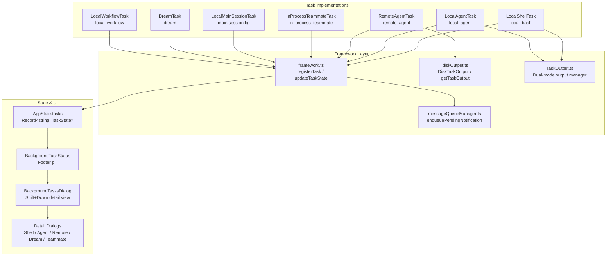
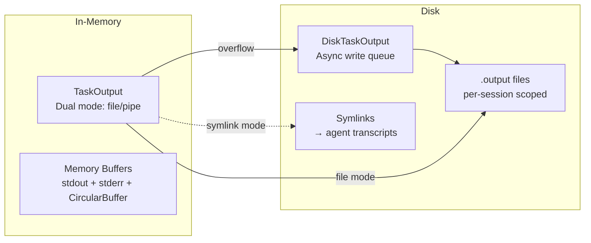
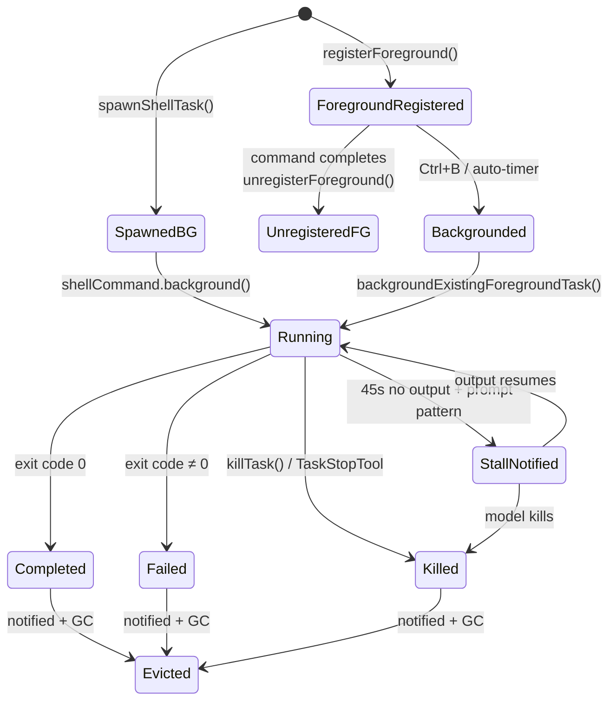
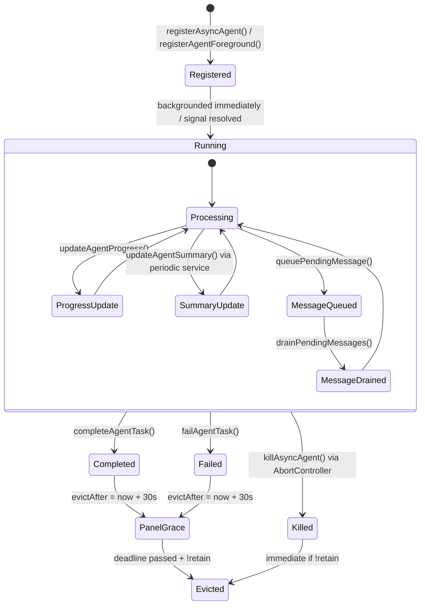
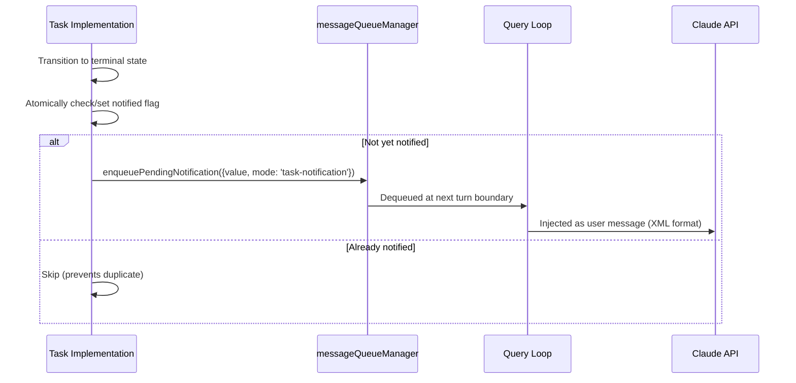

# Claude Code Task Management System — Deep Dive

## Table of Contents
1. [Architecture Overview](#architecture-overview)
2. [Core Abstractions](#core-abstractions)
3. [Task Types In Detail](#task-types-in-detail)
4. [Task Framework & State Management](#task-framework--state-management)
5. [Output Persistence Layer](#output-persistence-layer)
6. [Task Lifecycle Flows](#task-lifecycle-flows)
7. [Notification System](#notification-system)
8. [UI Integration](#ui-integration)
9. [Cross-Cutting Concerns](#cross-cutting-concerns)

---

## Architecture Overview

The task management system is the backbone for tracking, running, and displaying all "background work" in Claude Code. It supports seven distinct task types, a unified state store, disk-persisted output, a notification queue, and a comprehensive TUI rendering layer.



---

## Core Abstractions

### Task Interface ([Task.ts](file:///Users/jingshi/Documents/claude_code_source_code/src/Task.ts))

The `Task` interface is minimal — a name, a type discriminant, and a `kill()` method:

```typescript
type Task = {
  name: string
  type: TaskType
  kill(taskId: string, setAppState: SetAppState): Promise<void>
}
```

### TaskStateBase

Every task in `AppState.tasks` extends `TaskStateBase`:

| Field | Type | Purpose |
|-------|------|---------|
| `id` | `string` | Unique, prefixed by type (e.g., `local_bash_abc123`) |
| `type` | `TaskType` | Discriminant: `local_bash`, `local_agent`, `remote_agent`, `in_process_teammate`, `local_workflow`, `monitor_mcp`, `dream` |
| `status` | `TaskStatus` | `pending`, `running`, `completed`, `failed`, `killed` |
| `description` | `string` | Human-readable summary |
| `startTime` | `number` | `Date.now()` at creation |
| `endTime?` | `number` | Set on terminal transition |
| `toolUseId?` | `string` | Links back to the tool_use block that spawned it |
| `outputOffset` | `number` | Byte position for delta reads |
| `notified` | `boolean` | Guards duplicate notification delivery |

### TaskType Union ([types.ts](file:///Users/jingshi/Documents/claude_code_source_code/src/tasks/types.ts))

```typescript
type TaskState =
  | LocalShellTaskState
  | LocalAgentTaskState
  | RemoteAgentTaskState
  | InProcessTeammateTaskState
  | LocalWorkflowTaskState
  | MonitorMCPTaskState
  | DreamTaskState
```

---

## Task Types In Detail

### 1. LocalShellTask (`local_bash`)

**Files:** [guards.ts](file:///Users/jingshi/Documents/claude_code_source_code/src/tasks/LocalShellTask/guards.ts) · [LocalShellTask.tsx](file:///Users/jingshi/Documents/claude_code_source_code/src/tasks/LocalShellTask/LocalShellTask.tsx) · [killShellTasks.ts](file:///Users/jingshi/Documents/claude_code_source_code/src/tasks/LocalShellTask/killShellTasks.ts)

Wraps a background shell command (e.g., `npm run dev`, `make build`). The process's stdio streams are routed to a file via `TaskOutput`.

**Extended State:**
| Field | Purpose |
|-------|---------|
| `command` | The shell command string |
| `shellCommand` | Live `ShellCommand` handle (null when completed) |
| `isBackgrounded` | `false` = foreground running, `true` = backgrounded |
| `agentId?` | If spawned by a subagent — used to kill orphans on agent exit |
| `kind?` | `'bash'` or `'monitor'` — affects pill label and stall detection |
| `lastReportedTotalLines` | For computing output deltas |
| `completionStatusSentInAttachment` | Prevents double-reporting in attachments |

**Key Mechanisms:**

- **Stall Watchdog:** `startStallWatchdog()` polls the output file every 5s. If output hasn't grown for 45s AND the tail matches interactive prompt patterns (`(y/n)`, `Continue?`, etc.), it fires a notification recommending the model kill and retry with piped input.
- **Foreground → Background:** Commands start as foreground (`registerForeground()`). When the user presses Ctrl+B or the auto-background timer fires, `backgroundTask()` / `backgroundExistingForegroundTask()` flips `isBackgrounded = true` and sets up the result handler.
- **Agent Orphan Cleanup:** `killShellTasksForAgent(agentId)` is called from `runAgent.ts` finally block. It kills all `local_bash` tasks with a matching `agentId`, preventing 10-day zombie processes. It also purges queued notifications for the dead agent via `dequeueAllMatching()`.

---

### 2. LocalAgentTask (`local_agent`)

**File:** [LocalAgentTask.tsx](file:///Users/jingshi/Documents/claude_code_source_code/src/tasks/LocalAgentTask/LocalAgentTask.tsx)

Represents a background subagent running in the same process. This is the workhorse for Claude's `/agent` tool calls.

**Extended State:**
| Field | Purpose |
|-------|---------|
| `agentId` | Unique agent identifier |
| `prompt` | The initial prompt given to the agent |
| `selectedAgent?` | The `AgentDefinition` (custom agent config) |
| `agentType` | `'general-purpose'` or `'main-session'` |
| `abortController?` | For cancellation (supports parent→child cascading) |
| `progress?` | `{ toolUseCount, tokenCount, lastActivity, summary }` |
| `messages?` | Transcript for the zoomed panel view |
| `pendingMessages` | Messages queued mid-turn via `SendMessage` tool |
| `retain` | UI-held: blocks eviction while user is viewing |
| `diskLoaded` | One-shot: JSONL transcript bootstrapped into messages |
| `evictAfter?` | Panel grace period deadline (30s default `PANEL_GRACE_MS`) |
| `isBackgrounded` | `false` = foreground, `true` = backgrounded |

**Key Mechanisms:**

- **Progress Tracking:** `ProgressTracker` accumulates `latestInputTokens` (cumulative in API) + `cumulativeOutputTokens` (per-turn summed). `updateProgressFromMessage()` is called on each assistant message. Recent tool activities are kept in a sliding window of 5.
- **Background Signal:** `registerAgentForeground()` returns a `backgroundSignal: Promise<void>` that the agent loop can `await`. When the user backgrounds the task or the auto-background timer fires, the promise resolves, interrupting the synchronous agent loop.
- **Panel Retention:** When a user selects an agent in the coordinator panel, `retain = true` is set. This blocks eviction — when the agent completes, `evictAfter` is set to `Date.now() + 30_000` only if `!retain`. The panel GC timer in `evictTerminalTask()` checks this deadline.
- **Notification Deduplication:** The `notified` flag is atomically checked-and-set inside `updateTaskState`. If `TaskStopTool` already marked it, the completion handler skips the enqueue.

---

### 3. RemoteAgentTask (`remote_agent`)

**File:** [RemoteAgentTask.tsx](file:///Users/jingshi/Documents/claude_code_source_code/src/tasks/RemoteAgentTask/RemoteAgentTask.tsx)

Represents work dispatched to a remote Anthropic cloud environment (CCR session). Supports subtypes: `ultraplan`, `ultrareview`, `autofix-pr`, `background-pr`.

**Extended State:**
| Field | Purpose |
|-------|---------|
| `remoteTaskType` | `'remote-agent' | 'ultraplan' | 'ultrareview' | 'autofix-pr' | 'background-pr'` |
| `sessionId` | CCR session ID for API calls |
| `todoList` | Extracted from `TodoWriteTool` usage in remote log |
| `log` | Accumulated `SDKMessage[]` from remote events |
| `pollStartedAt` | When local poller started — timeout clocks from here |
| `isRemoteReview?` | Spawned by `/ultrareview` |
| `reviewProgress?` | `{ stage, bugsFound, bugsVerified, bugsRefuted }` from heartbeat echoes |
| `isUltraplan?` | Plan mode — result(success) doesn't drive completion |
| `ultraplanPhase?` | `'needs_input' | 'plan_ready'` for pill badge |

**Key Mechanisms:**

- **SSE Polling:** `startRemoteSessionPolling()` polls at 1s intervals via `pollRemoteSessionEvents()`. It accumulates a log, detects terminal states (`archived`, `result`, `stableIdle`), and enqueues appropriate notifications.
- **Stable Idle Detection:** Remote sessions briefly flip to `'idle'` between tool turns. To avoid false completion signals, the poller requires 5 consecutive idle polls with no log growth before considering the session done.
- **Session Restoration:** `restoreRemoteAgentTasks()` runs on `--resume`. It reads persisted metadata from the session sidecar (`listRemoteAgentMetadata()`), fetches live CCR status via `fetchSession()`, and re-registers still-running sessions.
- **Completion Checkers:** `registerCompletionChecker(remoteTaskType, checker)` allows external code (e.g., autofix-pr) to register custom completion logic invoked on every poll tick.

---

### 4. InProcessTeammateTask (`in_process_teammate`)

**Files:** [types.ts](file:///Users/jingshi/Documents/claude_code_source_code/src/tasks/InProcessTeammateTask/types.ts) · [InProcessTeammateTask.tsx](file:///Users/jingshi/Documents/claude_code_source_code/src/tasks/InProcessTeammateTask/InProcessTeammateTask.tsx)

Represents a teammate agent in the "swarm" system, running in the same Node.js process with isolation via `AsyncLocalStorage`.

**Extended State:**
| Field | Purpose |
|-------|---------|
| `identity` | `{ agentId, agentName, teamName, color?, planModeRequired, parentSessionId }` |
| `awaitingPlanApproval` | Plan mode gate |
| `permissionMode` | Independent permission cycling (Shift+Tab when viewing) |
| `inProgressToolUseIDs?` | `Set<string>` for animation in transcript view |
| `pendingUserMessages` | Queue of typed messages from the user when viewing |
| `isIdle` | Waiting for work (leader can poll efficiently via `onIdleCallbacks`) |
| `shutdownRequested` | Graceful shutdown signal |
| `spinnerVerb?` / `pastTenseVerb?` | Stable random verbs for spinner display |

**Key Design:** Messages are capped at `TEAMMATE_MESSAGES_UI_CAP = 50` via `appendCappedMessage()` to prevent RSS explosion. BQ analysis showed ~20MB RSS per agent at 500+ turns. A whale session with 292 agents hit 36.8GB — the dominant cost was holding a second full copy of every message in `task.messages`.

---

### 5. DreamTask (`dream`)

**File:** [DreamTask.ts](file:///Users/jingshi/Documents/claude_code_source_code/src/tasks/DreamTask/DreamTask.ts)

Background "dreaming" — memory consolidation subagent. UI-only surfacing via the task registry (no model-facing notification path).

**Extended State:**
| Field | Purpose |
|-------|---------|
| `phase` | `'starting' | 'updating'` — flips when first Edit/Write tool_use lands |
| `sessionsReviewing` | Count of historical sessions being consolidated |
| `filesTouched` | Paths from Edit/Write tool_use blocks (incomplete reflection) |
| `turns` | `DreamTurn[]` — text + toolUseCount, capped at 30 recent |
| `priorMtime` | For lock rollback on kill (same as fork-failure path) |

**Kill Behavior:** On kill, the `AbortController` fires, then `rollbackConsolidationLock(priorMtime)` rewinds the lock mtime so the next session can retry the dream.

---

### 6. LocalMainSessionTask

**File:** [LocalMainSessionTask.ts](file:///Users/jingshi/Documents/claude_code_source_code/src/tasks/LocalMainSessionTask.ts)

Special case: backgrounding the current main query. Uses `initTaskOutputAsSymlink()` to symlink the task output to the agent transcript, so the backgrounded query's output persists even if the main session clears.

---

## Task Framework & State Management

### [framework.ts](file:///Users/jingshi/Documents/claude_code_source_code/src/utils/task/framework.ts) — The Central Coordinator

#### Core Functions

| Function | Purpose |
|----------|---------|
| `registerTask(task, setAppState)` | Inserts task into `AppState.tasks`, emits `task_started` SDK event. On re-register (resume), carries forward `retain`, `startTime`, `messages`, `diskLoaded`, `pendingMessages`. |
| `updateTaskState<T>(taskId, setAppState, updater)` | Generic updater. If the updater returns the same reference → early-return no-op → no subscriber re-render. |
| `evictTerminalTask(taskId, setAppState)` | Eagerly removes terminal+notified tasks. Respects `retain` + `evictAfter` deadline for panel agents. |
| `getRunningTasks(state)` | Filter helper. |
| `generateTaskAttachments(state)` | Main polling loop output: scans all tasks for terminal→evict, running→delta-read. |
| `applyTaskOffsetsAndEvictions(setAppState, offsets, evictions)` | Merges offset patches against FRESH state (not stale snapshot), preventing TOCTOU bugs. |
| `pollTasks(getAppState, setAppState)` | Entry point called from the query loop. |

#### Constants

| Constant | Value | Purpose |
|----------|-------|---------|
| `POLL_INTERVAL_MS` | 1000 | Standard polling interval |
| `STOPPED_DISPLAY_MS` | 3000 | How long killed tasks show before eviction |
| `PANEL_GRACE_MS` | 30000 | Grace period for terminal `local_agent` tasks in coordinator panel |

---

## Output Persistence Layer

### Two-Tier Architecture



### [TaskOutput.ts](file:///Users/jingshi/Documents/claude_code_source_code/src/utils/task/TaskOutput.ts) — Dual-Mode Output Manager

Two operational modes:

1. **File Mode (bash commands):** stdout/stderr go directly to a file via stdio fds — never enters JS. Progress is extracted by polling the file tail via a shared poller (`#tick()`).
2. **Pipe Mode (hooks):** Data flows through `writeStdout()`/`writeStderr()`, buffered in memory up to 8MB, then spills to `DiskTaskOutput`.

**Shared Poller:** A single `setInterval` polls ALL registered file-mode instances. React components call `startPolling(taskId)` / `stopPolling(taskId)` from `useEffect` hooks. This avoids per-task timers.

### [diskOutput.ts](file:///Users/jingshi/Documents/claude_code_source_code/src/utils/task/diskOutput.ts) — Async Disk Writer

`DiskTaskOutput` uses a flat array as a write queue processed by a single drain loop. Key design decisions:
- **No chained `.then()` closures** — each chunk is GC'd immediately after write
- **`#queueToBuffers()`** is in a separate method so GC doesn't keep the buffer alive longer than necessary
- **`O_NOFOLLOW`** prevents symlink-following attacks from the sandbox
- **5GB disk cap** (`MAX_TASK_OUTPUT_BYTES`) — shared between file mode (watchdog kills process) and pipe mode (drops chunks)

**Session Scoping:** Output directory includes session ID (`getProjectTempDir()/sessionId/tasks/`) so concurrent sessions don't clobber each other. The session ID is captured at first call — `regenerateSessionId()` from `/clear` won't orphan existing output files.

---

## Task Lifecycle Flows

### Shell Task Lifecycle



### Agent Task Lifecycle



---

## Notification System

Notifications are the bridge between background tasks and the model's conversation loop.

### Flow



### XML Notification Format

```xml
<task_notification>
  <task_id>local_bash_abc123</task_id>
  <tool_use_id>toolu_xyz</tool_use_id>
  <output_file>/tmp/project/.session/tasks/local_bash_abc123.output</output_file>
  <status>completed</status>
  <summary>Background command "npm test" completed (exit code 0)</summary>
</task_notification>
```

### Priority Levels

| Priority | When Used | Effect |
|----------|-----------|--------|
| `'next'` | Stall watchdog, Monitor tool | Injected at next possible turn |
| `'later'` | Standard bash completion | Batched with other notifications |

### Speculation Abort

When a background task completes, `abortSpeculation(setAppState)` is called. This discards any pre-computed response from the prompt suggestion service, since the speculated result may reference stale task output.

---

## UI Integration

### Component Hierarchy

| Component | Purpose |
|-----------|---------|
| [BackgroundTaskStatus.tsx](file:///Users/jingshi/Documents/claude_code_source_code/src/components/tasks/BackgroundTaskStatus.tsx) | Footer pill showing task count and status |
| [BackgroundTasksDialog.tsx](file:///Users/jingshi/Documents/claude_code_source_code/src/components/tasks/BackgroundTasksDialog.tsx) | Shift+Down dialog listing all tasks |
| [ShellDetailDialog.tsx](file:///Users/jingshi/Documents/claude_code_source_code/src/components/tasks/ShellDetailDialog.tsx) | Detailed view for shell tasks |
| [AsyncAgentDetailDialog.tsx](file:///Users/jingshi/Documents/claude_code_source_code/src/components/tasks/AsyncAgentDetailDialog.tsx) | Detailed view for agent tasks |
| [RemoteSessionDetailDialog.tsx](file:///Users/jingshi/Documents/claude_code_source_code/src/components/tasks/RemoteSessionDetailDialog.tsx) | Detailed view for remote tasks |
| [DreamDetailDialog.tsx](file:///Users/jingshi/Documents/claude_code_source_code/src/components/tasks/DreamDetailDialog.tsx) | Detailed view for dream tasks |
| [InProcessTeammateDetailDialog.tsx](file:///Users/jingshi/Documents/claude_code_source_code/src/components/tasks/InProcessTeammateDetailDialog.tsx) | Detailed view for teammate tasks |
| [pillLabel.ts](file:///Users/jingshi/Documents/claude_code_source_code/src/tasks/pillLabel.ts) | Generates status text for footer pill |
| [taskStatusUtils.tsx](file:///Users/jingshi/Documents/claude_code_source_code/src/components/tasks/taskStatusUtils.tsx) | Shared status rendering utilities |

### Pill Label Logic

The pill in the footer aggregates task status. Panel agent tasks (`isPanelAgentTask`) are filtered out — they render in the coordinator panel instead. The pill shows:
- Running count with spinner
- Completed/failed/killed counts  
- Monitor tasks with distinct label (`'monitor'` kind)

---

## Cross-Cutting Concerns

### Cleanup Registry

All tasks register with `registerCleanup(async () => killTask(...))`. This ensures that if the process exits unexpectedly, all running tasks are killed. The cleanup function is stored in task state (`unregisterCleanup`) and called outside state updaters to avoid side effects during state transitions.

### SDK Event Emission

`registerTask()` emits `task_started` via `enqueueSdkEvent()`. Task completion emits `task_terminated` via `emitTaskTerminatedSdk()`. These are consumed by IDE extensions (VS Code) and the SDK streaming interface.

### TOCTOU Safety

The framework uses a two-phase approach for async operations:
1. `generateTaskAttachments()` reads state and performs async disk I/O
2. `applyTaskOffsetsAndEvictions()` merges patches against FRESH state, not the stale pre-await snapshot

This prevents a classic bug: task completes during the async `getTaskOutputDelta` call → spreading the stale snapshot would clobber the terminal status, zombifying the task.

### Memory Management

- **Agent messages capped** at 50 (`TEAMMATE_MESSAGES_UI_CAP`)
- **DiskTaskOutput** uses splice-and-GC pattern for write queue
- **Progress polling** is visibility-driven (React `useEffect`), not always-on
- **Task eviction** is both lazy (GC in `generateTaskAttachments`) and eager (`evictTerminalTask`)
- **Symlinked output** avoids duplicating agent transcripts on disk

### Security

- `O_NOFOLLOW` on all output file opens prevents sandbox symlink attacks
- `O_EXCL` on `initTaskOutput()` ensures no existing file is overwritten
- Workspace trust and permission rules govern all task-related shell execution
