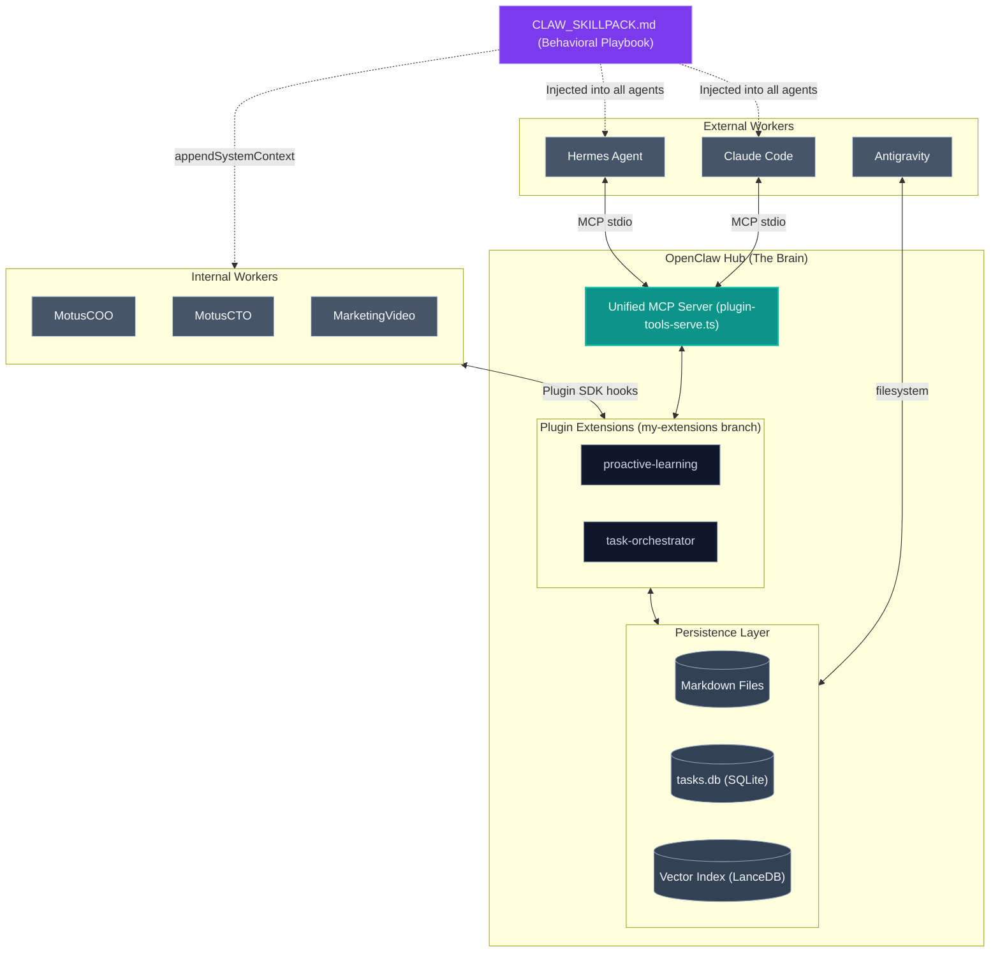

# Digital Me: Technical Design Document

> **Date:** 2026-04-14
> **Status:** Design-ready
> **Prerequisites:** OpenClaw `my-extensions` branch, Hermes Agent, Claude Code
> **Companion:** [Digital Me Vision](./2026-04-14_digital_me_vision.md)

---

## 1. Design Goal

Build a **cross-platform Living Knowledge + Project Manager** by exposing two OpenClaw extensions (`proactive-learning` and `task-orchestrator`) as MCP tools. External agents (Claude Code, Hermes Agent, Antigravity) connect to this single MCP endpoint and operate under the same unified workflow: read context, execute work, write back learnings, and manage tasks from a central ledger.

---

## 2. What Already Exists (Source-Grounded)

### 2.1 OpenClaw MCP Infrastructure

OpenClaw already ships **two separate MCP servers**:

| Server | File | Transport | What It Exposes |
|---|---|---|---|
| **Channel Bridge** | `src/mcp/channel-server.ts` | stdio | `conversations_list`, `messages_read`, `messages_send`, `permissions_list_open`, `permissions_respond` |
| **Plugin Tools** | `src/mcp/plugin-tools-serve.ts` | stdio | All plugin-registered tools (e.g., `memory_recall`, `memory_store`) |

**Key insight:** `plugin-tools-serve.ts` already auto-discovers all tools registered by plugins and exposes them over stdio MCP. This means that if our `proactive-learning` and `task-orchestrator` extensions register their tools via `api.registerTool(...)`, they are **automatically exposed** to any MCP client connecting to `openclaw mcp serve-tools`.

### 2.2 Hermes Agent MCP Infrastructure

Hermes Agent has native MCP client support:

```yaml
# config.yaml
mcp_servers:
  openclaw-brain:
    command: "openclaw"
    args: ["mcp", "serve-tools"]
```

Hermes auto-discovers MCP tools at startup via `tools/mcp_tool.py` → `discover_mcp_tools()` and hot-reloads when `config.yaml` changes (`cli.py:6508`).

### 2.3 Claude Code MCP Infrastructure

Claude Code reads MCP server config from its standard `.mcp.json` files or via `claude mcp add`:

```json
{
  "mcpServers": {
    "openclaw-brain": {
      "command": "openclaw",
      "args": ["mcp", "serve-tools"]
    }
  }
}
```

### 2.4 Current OpenClaw Config (from `openclaw.json`)

```
Gateway:        localhost:18789
Memory Search:  Gemini embedding (gemini-embedding-001)
Extra Paths:    ~/.clawdbot/shared_learnings, ~/.clawdbot/skills
Plugins:        proactive-learning ✅, task-orchestrator ✅
Agents:         MotusCTO, MarketingVideo, MarketingWriter, MotusCPO, MotusCOO, PodcastCoach, ReadingMaster, Board, GeminiWorker
```

---

## 3. Architecture

### 3.1 System Topology



### 3.2 The MCP Tool Surface

When a worker (Claude Code, Hermes, etc.) connects to the unified MCP server, it sees a flat list of tools. These tools are the **cross-platform API** for the Digital Me:

#### Living Knowledge Tools (from `proactive-learning`)

| Tool | Type | Description |
|---|---|---|
| `memory_search` | Read | Semantic search across all shared learnings |
| `memory_recall` | Read | Retrieve a specific memory by key/topic |
| `memory_store` | Write | Store a new learning, insight, or preference |
| `memory_forget` | Write | Remove outdated or incorrect knowledge |
| `memory_list_topics` | Read | Browse the knowledge taxonomy |

#### Project Manager Tools (from `task-orchestrator`)

| Tool | Type | Description |
|---|---|---|
| `tasks_plan_goal` | Write | Decompose a high-level objective into tasks |
| `tasks_run_goal` | Write | Create and immediately dispatch a goal |
| `tasks_board` | Read | View all active goals and task statuses |
| `tasks_status` | Read | Get detailed status of a specific task |
| `tasks_checkpoint` | Write | Save intermediate progress on a running task |
| `tasks_handoff` | Write | Complete a task with structured output |
| `tasks_claim` | Write | Claim an unclaimed task for execution |
| `tasks_retry` | Write | Retry a failed/stalled task (restart or resume) |

---

## 4. The Cross-Platform Workflow

Every agent — whether internal OpenClaw subagent or external — follows the same lifecycle:

```mermaid
sequenceDiagram
    participant User
    participant Worker as Worker (Claude/Hermes/Antigravity)
    participant MCP as OpenClaw MCP Server
    participant Brain as Living Knowledge
    participant PM as Task Orchestrator

    User->>Worker: "Build the new auth module"

    rect rgb(15, 23, 42)
        Note over Worker,Brain: Phase 1: READ (Context Loading)
        Worker->>MCP: memory_search("auth module patterns")
        MCP->>Brain: semantic query
        Brain-->>MCP: prior auth decisions, preferences
        MCP-->>Worker: context payload
    end

    rect rgb(30, 58, 95)
        Note over Worker,PM: Phase 2: PLAN (Task Registration)
        Worker->>MCP: tasks_plan_goal("Build auth module")
        MCP->>PM: create goal + decompose
        PM-->>MCP: goal_id, task_ids
        MCP-->>Worker: planned tasks
        Worker->>MCP: tasks_claim(task_id)
        MCP->>PM: assign worker
        PM-->>Worker: claimed
    end

    rect rgb(15, 23, 42)
        Note over Worker: Phase 3: EXECUTE (Do the work)
        Worker->>Worker: implement auth module
        Worker->>MCP: tasks_checkpoint(task_id, "schema designed")
        MCP->>PM: save progress
    end

    rect rgb(30, 58, 95)
        Note over Worker,Brain: Phase 4: WRITE (Knowledge + Handoff)
        Worker->>MCP: memory_store("auth: use JWT with refresh tokens")
        MCP->>Brain: persist learning
        Worker->>MCP: tasks_handoff(task_id, {summary, artifacts})
        MCP->>PM: mark completed, unlock downstream
    end

    PM->>MCP: next task ready (edge-triggered)
    MCP-->>User: "Task 1 complete. Task 2 dispatched to Hermes."
```



### 4.1 Why This Works for ALL Agents

| Agent | Connection Method | Same Workflow? |
|---|---|---|
| **OpenClaw subagents** (COO, CTO, etc.) | Direct Plugin SDK hooks | ✅ Yes — tools are native |
| **Claude Code** | `openclaw mcp serve-tools` via `.mcp.json` | ✅ Yes — tools appear as MCP tools |
| **Hermes Agent** | `openclaw mcp serve-tools` via `config.yaml` | ✅ Yes — tools appear via `mcp_tool.py` |
| **Antigravity** | Filesystem access + future MCP | ✅ Partial — reads markdown, writes via fs |
| **Future agent X** | Any MCP client | ✅ Yes — just connect to the endpoint |

---

## 5. The Behavioral Playbook (`CLAW_SKILLPACK.md`)

A shared behavioral contract injected into every agent's system prompt. This is **critical** — without it, agents have tools but no discipline to use them consistently.

```markdown
# CLAW_SKILLPACK — Digital Me Protocol

## MANDATORY: Before Every Task
1. Call `memory_search` with the task topic
2. Call `tasks_board` to check if related work exists
3. If a matching task exists, call `tasks_claim` instead of starting fresh

## MANDATORY: During Execution
4. Call `tasks_checkpoint` every significant milestone
5. Never discard partial work — checkpoints preserve progress

## MANDATORY: After Completion
6. Call `tasks_handoff` with structured output
7. Call `memory_store` for any reusable insight discovered
8. Generalize: store the *pattern*, not just the *instance*

## FORBIDDEN
- Never start work without checking the brain first
- Never complete a task without a structured handoff
- Never store raw conversation — store distilled knowledge only
```

### 5.1 How the Playbook Is Injected

| Agent | Injection Method |
|---|---|
| OpenClaw subagents | `before_prompt_build` → `appendSystemContext` (enforced by plugin) |
| Claude Code | Project-level `CLAUDE.md` includes the playbook |
| Hermes Agent | `system_prompt` field in `config.yaml` includes the playbook |
| Antigravity | Skill file (`~/.agents/skills/digital-me/SKILL.md`) |

---

## 6. Implementation Phases

### Phase 1: Wire the MCP Bridge
- [ ] Verify `openclaw mcp serve-tools` exposes `proactive-learning` and `task-orchestrator` tools
- [ ] Add `tasks_claim` tool to `task-orchestrator` (new: allows external agents to claim unclaimed tasks)
- [ ] Test: run `openclaw mcp serve-tools` and verify tool list via `mcp-inspector`

### Phase 2: Connect External Agents
- [ ] Add MCP server config to Claude Code (`.mcp.json` or `claude mcp add`)
- [ ] Add MCP server config to Hermes Agent (`config.yaml` → `mcp_servers`)
- [ ] Create `CLAW_SKILLPACK.md` and inject into all agent system prompts
- [ ] Test: Claude Code can call `memory_search` and `tasks_board`

### Phase 3: Cross-Agent Task Flow
- [ ] Run end-to-end test: User creates goal via Claude Code → Task 1 dispatched to Hermes → Hermes checkpoints → Hermes hands off → Task 2 dispatched to OpenClaw subagent
- [ ] Verify edge-triggered dispatch (no duplicate spawns)
- [ ] Verify checkpoint persistence across agent crashes

### Phase 4: Dream Cycle (Autonomous Evolution)
- [ ] Configure `task-orchestrator` cron to run nightly knowledge consolidation
- [ ] Auto-extract entities and cross-references from daily conversation logs
- [ ] Build knowledge graph connections in the vector index

---

## 7. Key Design Decisions

| Decision | Rationale |
|---|---|
| **Use `plugin-tools-serve.ts` (existing)** instead of building new MCP server | Zero new infra — plugin tools are auto-discovered |
| **stdio transport** (not HTTP) for MCP | Simpler, no auth needed, works with both Claude and Hermes out of the box |
| **SQLite for task state** (not Postgres) | Local-first, no Docker dependency, matches OpenClaw's existing storage patterns |
| **Markdown + Vector for knowledge** (not DB-only) | Human-readable AND machine-queryable — best of both worlds |
| **Playbook as system prompt injection** (not hardcoded logic) | Flexible, agent-specific, and easily iterable without code changes |
| **`tasks_claim` as explicit action** (not auto-assign) | External agents must opt-in — prevents accidental task stealing |

---

## 8. Risk Assessment

| Risk | Mitigation |
|---|---|
| Agents ignore the playbook | Phase 4: Add `before_tool_call` hook that gates execution behind `memory_search` |
| MCP stdio process crashes | OpenClaw gateway auto-restarts; agents reconnect |
| Duplicate task claims | `task-orchestrator` resolver enforces Rule 2 (at most one active attempt) |
| Knowledge pollution (storing garbage) | `proactive-learning` validates quality via LLM advisor before writing |
| Antigravity can't use MCP | Antigravity reads Markdown directly; add MCP support when available |

---

## 9. File Map

```
~/.clawdbot/
├── openclaw.json                  # OpenClaw config (plugins, gateway, agents)
├── shared_learnings/              # Living Knowledge (Markdown SOT)
│   ├── concepts/
│   ├── entities/
│   ├── preferences/
│   └── patterns/
├── skills/                        # Agent skills (static, read-only)
└── workspace/                     # OpenClaw agent workspaces

~/openclaw/src/
├── mcp/
│   ├── plugin-tools-serve.ts      # ★ THE MCP BRIDGE — auto-exposes all plugin tools
│   ├── channel-server.ts          # Channel bridge (conversations, messages)
│   ├── channel-bridge.ts          # Gateway WebSocket client
│   └── channel-tools.ts           # Channel-specific MCP tools
├── plugins/
│   ├── tools.ts                   # resolvePluginTools() — discovers all plugin-registered tools
│   └── (extensions)/
│       ├── proactive-learning/    # Living Knowledge plugin
│       └── task-orchestrator/     # Project Manager plugin

~/.claude/
└── projects/
    └── .mcp.json                  # Claude Code MCP config → openclaw-brain

~/Documents/hermes-agent/
└── hermes-agent/
    └── config.yaml                # Hermes config → mcp_servers.openclaw-brain
```
