# OpenClaw Architecture & Understanding

*Created at: 2026-02-12*

## 1. Analysis & Critique of Common Misconceptions
(Based on comparison with initial architectural sketches)

To truly understand OpenClaw, it's helpful to clarify some common misconceptions:
1.  **"Claude API" is NOT the Executor**: It is easy to think the AI API runs the tools. In reality, the **Agent Runner** (`pi-embedded-runner`) running locally on your machine is the execution engine. It sends prompts to the Model, receives text instructions back, and executes them locally.
2.  **Gateway vs. Runner**: Everything is not just "The Gateway". The **Gateway** (`server.impl.ts`) is merely the control plane (routing, sessions). The **Agent Runner** is the distinct intelligence loop that does the actual work.
3.  **Session != Tool**: Memory is not just a tool you call. It is the **Session Context** (filesystem-based logs) that wraps the entire interaction.

## 2. High-Level Mental Model
Imagine OpenClaw as a **Personal AI Operating System**.

*   **The Gateway ("The Orchestrator")**:
    *   **Role**: It is the system's "Pacemaker". It doesn't solve problems itself; it decides *who* should solve them and *when*.
    *   **Proactivity Note**: Because OpenClaw runs on *your* infrastructure (the Gateway), it can own the clock (Cron). Cloud agents like Claude Code usually shut down when the session ends to save costs/state, making true "background agency" ("run continuously") much harder/expensive for them to offer.
    *   **Proactive Life**: Through **Crons** and **Heartbeats**, it wakes up the system even without user input. It handles the "boring" stuff: routing, security, scheduling, and keeping the lights on.

*   **The Agent Runner ("The Thinker & Doer")**:
    *   **Role**: This is the intelligence engine. It is the only component that can:
        1.  **Think** (Reason with the LLM)
        2.  **Do** (Execute Tools like `exec` or `browser`)
    *   **Workflow**: The Gateway hands it a job, and the Runner executes the loop: *Observe -> Think -> Act -> Repeat* until the job is done.

*   **Tools ("The Hands")**: The capabilities (shell, browser) that the Runner uses to affect the world.

### Simplified View (Corrected)

```mermaid
graph TD
    subgraph User["👤 You"]
        Msg["Send Message"]
    end

    subgraph Gateway["🎛️ Gateway (The Receptionist)"]
        Router["Message Router"]
        Session["Session Manager"]
        Cron["⏰ Cron (Alarm Clock)"]
    end

    subgraph Agent["🧠 Agent Runner (The Brain)"]
        Loop["Think + Do Loop"]
        Tools["🛠️ Tools: Browser, Exec, Skills"]
    end

    subgraph Infra["💾 Memory"]
        FS["Files & Logs"]
    end

    Msg -->|"Your question"| Router
    Router --> Session
    Session --> Loop
    
    Cron -->|"Wake up!"| Loop
    
    Loop -->|"Use tool"| Tools
    Tools -->|"Result"| Loop
    Loop -->|"Save"| FS
    Loop -->|"Reply"| Msg
```

**Intuitive Analogy:**
*   **Gateway = Hotel Receptionist**: Takes your request, finds your room (session), but doesn't solve your problem.
*   **Agent Runner = The Expert You Hired**: Actually thinks about your request and does the work.
*   **Cron = Your Alarm Clock**: Wakes up the Expert at scheduled times, even when you're asleep.

## Architecture Diagram

The following diagram maps out how these components interact:

## Key Components Breakdown

### 1. Gateway Server (`src/gateway`)
The backbone of the system. It doesn't "think"—it orchestrates.
- **Responsibility**: Manages WebSocket connections, handles HTTP requests, and maintains the `NodeRegistry` (keeping track of connected mobile/desktop nodes).

### 2. Agent Runner (`src/agents/pi-embedded-runner`)
The intelligence loop.
- **Responsibility**: Takes a user message + history, prompts the LLM, parses the response, and executes tools. It repeats this cycle (Loop) until the task is done.

### 3. Session Manager
- **Location**: Lives inside the **Gateway Layer**.
- **Role**: It is the "Librarian". It *uses* the Infrastructure (SQLite/FS) to store data, but the logic of *how* to store it (e.g. sessions, context limits) is part of the Gateway's code.

### 4. Tools (`src/agents/pi-tools`)
The capabilities library.
- **Responsibility**: Defines what the agent *can* do. Includes `exec` (running shell commands), `browser` (viewing web pages), and `skills` (user-defined plugins like this one!).

## 3. Comparative Critique: The "Agent Loop" as the Differentiator

### What is the "Loop"? (The ReAct Cycle)
The "Loop" is the heartbeat of any agent. It is the infinite cycle of:
1.  **Observe**: See the user's message or the result of a command.
2.  **Think**: Ask the LLM "What should I do next?"
3.  **Act**: Execute a tool (run code, search web).
4.  **Repeat**: Go back to step 1.

You asked if **Antigravity**, **Claude Code**, and **Coworker** are essentially just "Agent Runners".
**Critique: Yes, but the *location* of this Loop defines the product.**

### The Core Difference: Who Owns the Loop?

| Product | Loop Location | Proactivity (Run by itself?) | "Gateway" Responsibilities | User Control |
| :--- | :--- | :--- | :--- | :--- |
| **OpenClaw** | **Your Machine (Full Runtime)** | **YES (High)**. Can wake itself up via Cron/Heartbeat to work while you sleep. | **You run it.** Your machine handles crons, sessions, and routing. | **100%**. |
| **Claude Code** | **Your Terminal (Adapter Only)** | **NO (Reactive)**. Runs only when you type a command. Stops when the terminal closes. | **Anthropic runs it.** The CLI is just a terminal interface. | **Low**. |
| **Antigravity** | **Google Cloud (Remote)** | **Maybe (Low)**. Mostly reactive to IDE events. Can't easily script "wake up at 3AM and check my PRs". | **Google runs it.** The IDE extension is just a view. | **Medium**. |

### Why OpenClaw is Different
Most "Copilots" are just **Remote Controls** for a Brain in the cloud.
OpenClaw is **The Brain in a Box**. You are running the *Agent Runner* and the *Gateway* on your own metal.

*   **Antigravity/Claude Code**: The product *is* the Service. The local tool is just an adapter.
*   **OpenClaw**: The product *is* the Local Runtime. The Service (Anthropic/Google) is just a raw intelligence provider.

## 4. Scenario Walkthrough: The "Daily Digest" Lifecycle
To make this concrete, let's trace your specific request:
> "Set a cron job to write a daily report sent to discord channel daily digest at 8am."

### Phase 1: The Instruction (User -> Agent)
1.  **User (`Discord`)**: Sends the message.
2.  **Gateway (`Router`)**: Receives the message, finds your active session in `SessionMgr`.
3.  **Agent Runner (`Loop`)**: Wakes up.
    *   **LLM**: "I need to schedule a task."
    *   **Tool**: Calls `CronService.add("0 8 * * *", "Browse <news_site>, summarize, and send to Discord")`.
4.  **Gateway (`Cron`)**: Saves this instruction to memory/disk (`FS`).
5.  **Agent**: Replies "Done! I'll report back at 8 AM."

### Phase 2: The Execution (Cron -> Agent)
*Fast forward to 8:00 AM...*

1.  **Gateway (`Cron`)**: The alarm clock rings! ⏰
2.  **Direct Wake**: The Cron bypasses the Router and injects the *saved instruction* directly into the **Agent Runner (`Loop`)**.
3.  **The Loop Runs (Autonomous Mode)**:
    *   **Cycle 1 (Read)**:
        *   **Loop**: "Instruction says browse news."
        *   **Tool**: `Browser` -> Opens website -> Extracts text.
    *   **Cycle 2 (Think)**:
        *   **Loop**: "I have the news text. Now I must summarize it and send it to Discord."
        *   **LLM**: Generates the summary.
    *   **Cycle 3 (Act)**:
        *   **Tool**: `Discord.send(summary)` (or distinct output action).
4.  **Result**: The message appears in your channel. The Agent goes back to sleep.

### Visual Flow (Sequence Diagram)

