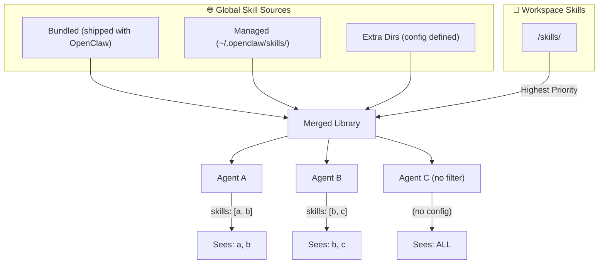

# Skills & Agents Understanding

*Created at: 2026-02-12*


This document explains how **Skills** and **Agents** work together in the OpenClaw architecture.

## Mental Model

*   **Skills = Apps** (capabilities like "browser", "exec", "discord-poster")
*   **Agents = People** (personas configured with specific skills, models, workspaces)
*   **One agent can use many skills**
*   **Many agents can share the same skill**

---

## Skill Loading Architecture



### Skill Sources (Priority Order)

| Source | Path | Scope |
| :--- | :--- | :--- |
| **Extra** | `config.skills.load.extraDirs` | Global |
| **Bundled** | `src/skills/bundled/` | Global |
| **Managed** | `~/.openclaw/skills/` | Global |
| **Workspace** | `<workspace>/skills/` | Per-project (overrides all) |

**Merge Rule**: If multiple sources have a skill with the same name, the later source wins.
`workspace > managed > bundled > extra`

---

## Agent Configuration

Agents are defined in `config.yaml`:

```yaml
agents:
  list:
    - id: code-expert
      name: Code Expert
      skills: [browser, exec, understanding-knowledge]  # Allowlist!
      model: claude-3-5-sonnet
      workspace: ~/code-projects
      
    - id: news-bot
      skills: [browser, web-search, discord-poster]
      model: claude-3-haiku
      
    - id: general-assistant
      # No skills filter = access to ALL global skills
      model: claude-3-opus
```

### Key Fields

| Field | Purpose |
| :--- | :--- |
| `id` | Unique identifier for routing |
| `skills` | **Allowlist** of skills this agent can use (if omitted, agent gets ALL skills) |
| `model` | LLM model to use |
| `workspace` | Working directory for this agent |

---

## How Filtering Works

From `agent-scope.ts` and `skills/workspace.ts`:

```typescript
// If agent defines skills: [...], it acts as an allowlist
if (skillFilter !== undefined) {
  filtered = allSkills.filter(s => skillFilter.includes(s.name));
} else {
  filtered = allSkills;  // No filter = global access!
}
```

### Filtering Matrix

| Agent Config | Result |
| :--- | :--- |
| `skills: [a, b, c]` | Can only use skills a, b, c |
| `skills: []` | Can use NO skills |
| (no `skills` field) | Can use ALL available skills |

---

## Summary

```
┌─────────────────────────────────────────────────────────────┐
│                 🛠️ Skills Library (Shared)                  │
│   All skills merged from: bundled + managed + workspace     │
└────────────────────────────┬────────────────────────────────┘
                             │
          ┌──────────────────┼──────────────────┐
          │                  │                  │
          ▼                  ▼                  ▼
    ┌───────────┐      ┌───────────┐      ┌───────────┐
    │ Agent A   │      │ Agent B   │      │ Agent C   │
    │ skills:   │      │ skills:   │      │ (no filter)│
    │ [browser] │      │ [browser] │      │           │
    │ [exec]    │      │ [search]  │      │           │
    └───────────┘      └───────────┘      └───────────┘
         │                  │                  │
         ▼                  ▼                  ▼
    Only sees:         Only sees:         Sees ALL:
    browser, exec      browser, search    Everything!
```

**Key Takeaway**: Skills are shared capabilities; Agents are configured personas that filter which skills they can access.
