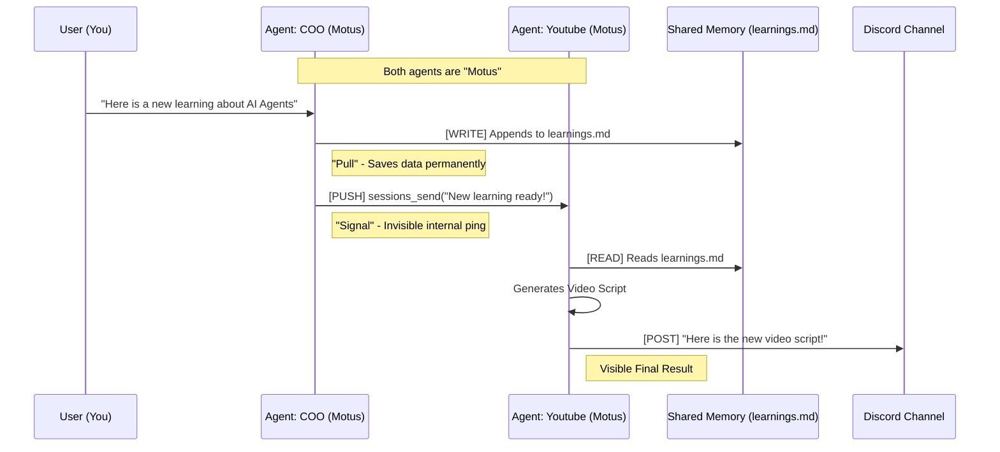

*Created at: 2026-02-13*

# Agent Collaboration: High-Level Insights & Visualization

## The Core Problem
You have multiple specialized agents (COO, Writer, Youtube) sharing **one Discord bot** ("Motus").
- **Challenge:** They cannot "see" each other's messages in shared channels due to anti-loop safety checks.
- **Solution:** Use **Internal Direct Messaging** (`sessions_send`) instead of public chatting.

## Architectural Recommendation: Hybrid Event Bus

**Why?**
The "Hybrid" model combines the speed of direct notifications with the permanence of shared memory, all while keeping your Discord clean and using a single bot token.

### The Workflow Visualization

## Key Insights

| Strategy | Mechanism | Pros | Cons | Best For |
| :--- | :--- | :--- | :--- | :--- |
| **Shared Bot (Hybrid)** | `sessions_send` + Files | Clean Discord, Simple Config, Permanent Memory | "Invisible" teamwork (unless logged) | **Most Users** (Efficiency Focus) |
| **Shared Bot (Chat)** | Public Discord Msgs | Simple Config | **BROKEN** (Agents ignore self) | **Do Not Use** |
| **Separate Bots** | Public Discord Msgs | Highly Visible Teamwork, Distinct Identities | Complex Config, Noisy, Rate Limits | **Simulation/Demo** (Visual Focus) |

## Implementation Steps (Hybrid)

1.  **Config:** Ensure `tools.agentToAgent.enabled = true` in your `openclaw.json`.
2.  **Memory:** Create a shared file (e.g., `workspace/learnings.md`).
3.  **Instruction:** Tell your agents:
    *   *COO:* "When you find a learning, write it to `learnings.md` AND utilize `sessions_send` to notify the Youtube Agent."
    *   *Youtube:* "When you receive a notification, read `learnings.md` and start your task."
