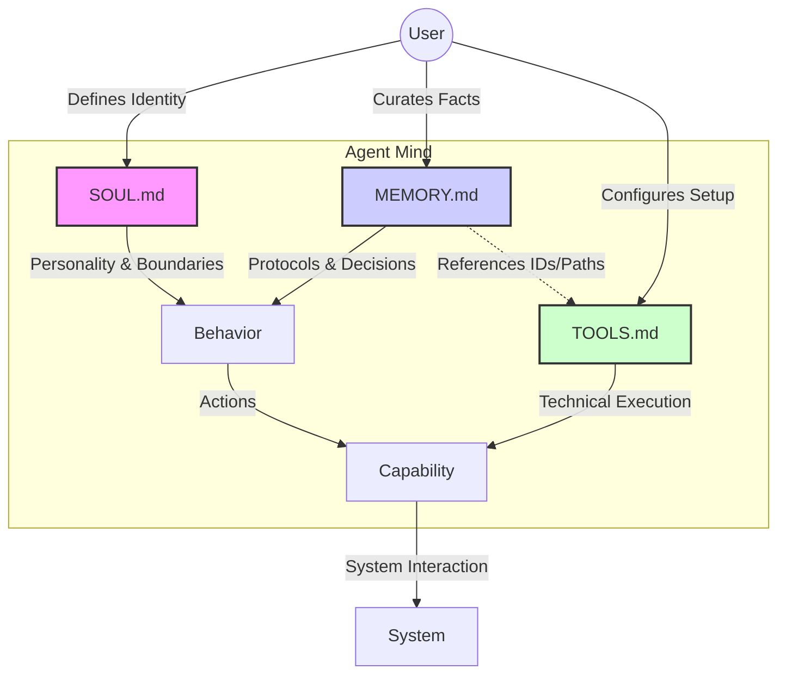

# Relationship between tools, memory, soul

*Created at: 2026-02-13*


This guide provides a deep understanding of the core configuration files—`TOOLS.md`, `Memory.md`, and `SOUL.md`—and how to leverage them for an efficient agent setup.

## Visualization of Relationships



## 1. Deep Dive: The Core Files

### `TOOLS.md` (Local Environment Configuration)
**Location:** `docs/reference/templates/TOOLS.md` (Template)

**Purpose:** 
`TOOLS.md` acts as the bridge between your specific physical/digital environment and the agent's general skills. While "Skills" define *how* to do something (e.g., "how to use SSH"), `TOOLS.md` defines *what* to use it on (e.g., "ssh into user@192.168.1.5").

**Key Concepts:**
- **Separation of Concerns:** Keeps your private infrastructure details (IP definitions, passwords, device names) separate from shared/public skills code.
- **Context injection:** This file is meant to be read by the agent to understand available resources.

**Efficient Setup Strategy:**
- **Don't hardcode IPs in skills.** Write generic skills and put the specific targets in `TOOLS.md`.
- **Group by Category:** Organize by `### Cameras`, `### Servers`, `### Audio` for easier parsing.
- **Use Aliases:** Map complex connection strings to simple names (e.g., `home-server`) so you can speak naturally to the agent ("Check the home server").

### `Memory.md` (The Memory System)
**Location:** `docs/concepts/memory.md` (Documentation), `MEMORY.md` (The actual file)

**Purpose:**
This defines how your agent persists information across sessions. It's the "hard drive" of the agent's mind.

**Recommended Structure (The "Jing Schema"):**
This structure ensures comprehensive coverage of the agent's lifecycle and context.

```markdown
## Setup
- **Role:** [Purpose of this specific agent]
- **Context:** [Why it was created]

## Protocols
- **SOPs:** Operational rules (e.g., "Dual-Write to #agent-comms").
- **Reference:** See `TOOLS.md` for technical execution details (IDs, paths).

## Preferences
- **User Alignment:** Specific constraints and style guides.
- **Examples:** "No consultant fluff", "Code block tables only".

## Decisions
- **Record of Truth:** Key architectural or strategic decisions.
- **Why:** Prevents re-litigating settled topics (e.g., "Removed Opus 4.6 due to deadlocks").

## Lessons Learned
- **Post-Mortems:** Mistakes and corrections.
- **Heuristics:** "Verify before blocking," "Test before deploy."

## Active Projects
- **Status:** What is currently in flight.
- **Next Steps:** Immediate actions pending.
```

**Efficient Setup Strategy:**
- **Curate Manually:** Periodically review and consolidate important facts into this structure.
- **Link to Tools:** Keep the *policy* here ("Dual-Write is mandatory") and the *implementation* in `TOOLS.md` ("Channel ID is 123").

### `SOUL.md` (Identity & Directives)
**Location:** `docs/reference/templates/SOUL.md` (Template)

**Purpose:**
Defines the "ghost in the machine." It sets the personality, ethical boundaries, and behavioral vibe of the agent.

**Key Concepts:**
- **Persona:** Defines if the agent is formal, casual, sassy, etc.
- **Boundaries:** Explicitly states what the agent *cannot* do (e.g., "Never tweet without asking").
- **Continuity:** Reminds the agent that it is a persistent entity, not a one-off session.

**Efficient Setup Strategy:**
- **Be Explicit about "Vibe":** If you hate verbosity, write "Be concise. No filler." in `SOUL.md`. This saves tokens and time.
- **Evolve it:** As you interact, if the agent annoys you, update `SOUL.md` to correct the behavior globally.

---

## 2. Integrated Workflow for Efficiency

To set up efficiently, treat these three files as a hierarchy of stability:

1.  **`SOUL.md` (Most Stable):** Set this up once. Define *who* the agent is. Change rarely.
2.  **`TOOLS.md` (Environment Dependent):** Update this when you buy new gear or change IPs.
3.  **`Memory.md` (Highly Dynamic):** This evolves daily.

### Recommended Setup Steps

1.  **Bootstrap:** Copy the templates for `TOOLS.md` and `SOUL.md` into your workspace root.
2.  **Define Identity (`SOUL.md`):**
    *   Add a directive: "You are a high-efficiency engineering partner. Prioritize code correctness and brevity."
    *   Add a boundary: "Do not modify files outside of `/src` without permission."
3.  **Map Environment (`TOOLS.md`):**
    *   List your key servers/devices.
    *   *Pro Tip:* Add a "Cheatsheet" section in `TOOLS.md` for commands you often forget but want the agent to know.
4.  **Initialize Memory:**
    *   Create an empty `MEMORY.md`.
    *   Add high-level project goals: "We are building X. The deadline is Y. Key constraints are Z."
5.  **Routine Maintenance:**
    *   Once a week, read `memory/YYYY-MM-DD.md` files.
    *   Move key decisions ("We decided to use Postgres") into `MEMORY.md`.
    *   Delete the old daily logs or let them rot if you have plenty of storage.

## 3. "SOAL" vs "SOUL"
*Note: The user request mentioned `SOAL.md`. In OpenClaw, the standard template is `SOUL.md`. If you have a specific file named `SOAL.md` in your setup, it might be a custom file (perhaps "Source Of All Learning"?), but standard practice is `SOUL.md`. Check for typos.*
