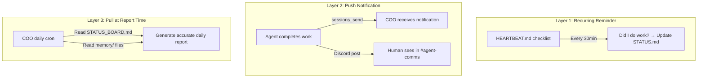

# Workflow Enforcement: Root Cause Analysis & Best Practices

*Created at: 2026-02-17*


## The Problem

Your YouTube and Writer agents write detailed daily memory logs (`memory/YYYY-MM-DD.md`) but **never update `STATUS.md`**. Their `AGENTS.md` files say "Maintain STATUS.md as inter-agent contract" — but there is **no enforcement mechanism**. It's a suggestion buried at the bottom.

The COO daily summary cron reads memory files and session history, but runs as an isolated session that **cannot read other agents' files directly**. If agents didn't update STATUS.md or post to `#agent-comms`, the COO report has nothing fresh to pull from.

---

## Root Cause: Zero Platform Support for STATUS.md

After investigating the codebase, the core finding is:

> **`STATUS.md` is never referenced anywhere in OpenClaw's source code, documentation, or templates.** It is a purely user-defined convention with no enforcement whatsoever.

### Evidence

| Layer | STATUS.md References | What Actually Exists |
|:---|:---|:---|
| [workspace.ts](file:///Volumes/Motus_SSD/mac_mini/ClawdBot_Github/openclaw/src/agents/workspace.ts) | **None** | Only manages: AGENTS, SOUL, TOOLS, IDENTITY, USER, HEARTBEAT, BOOTSTRAP, MEMORY |
| [system-prompt.ts](file:///Volumes/Motus_SSD/mac_mini/ClawdBot_Github/openclaw/src/agents/system-prompt.ts) | **None** | STATUS.md is never injected into system prompt |
| [AGENTS.md template](file:///Volumes/Motus_SSD/mac_mini/ClawdBot_Github/openclaw/docs/reference/templates/AGENTS.md) | **None** | Template has no concept of inter-agent contracts |
| Heartbeat system | **None** | Checks HEARTBEAT.md content only |
| Hooks system | **None** | Fires on `command:new` etc., no workflow enforcement |
| Cron system | **None** | Isolated sessions, can't cross-read agent workspaces |

### Why "Just Add It to AGENTS.md" Fails

The instruction `"Update STATUS.md when state changes"` in each agent's AGENTS.md is a **soft suggestion**. It fails because:

1. **No reminder at the right moment** — Agents receive the instruction at session start, but by the time they finish a 20-turn work session, they've forgotten about it
2. **No validation** — Nothing checks _whether_ the file was updated
3. **No consequence** — If STATUS.md isn't updated, nothing breaks _for that agent_. The pain is felt by _other agents_ who never read it
4. **Cron isolation** — The COO agent's cron job runs in its own isolated session and literally cannot access `~/.openclaw/agents/youtube/workspace/STATUS.md`

---

## Best Practices for Workflow Enforcement

### Strategy 1: HEARTBEAT.md as Enforcement Point ⭐ (Recommended)

**Use the existing heartbeat system** to make STATUS.md updates a routine obligation, not a one-time instruction.

Add to each agent's `HEARTBEAT.md`:

```markdown
# Heartbeat Checklist

- [ ] Check if any work was done this session → update STATUS.md
  - Current phase (brainstorm/production/review/done)
  - Last deliverable path
  - Next action needed
  - Updated timestamp
- [ ] If STATUS.md changed → sessions_send COO agent with summary
```

**Why this works:** The heartbeat fires every 30 minutes. The agent re-reads `HEARTBEAT.md` each time, so the reminder is **recurring**, not a one-shot instruction.

---

### Strategy 2: Push-Based Updates via `sessions_send`

**Don't rely on STATUS.md as a polling target.** Instead, make agents **push** updates to interested parties.

Add to each agent's `AGENTS.md`:

```markdown
## Post-Work Notification Protocol
After completing any significant work:
1. Update STATUS.md with current state
2. sessions_send → COO agent: "YouTube status: [phase] | Last: [deliverable] | Next: [action]"
3. Post to #agent-comms for human visibility
```

**Why**: Even if STATUS.md gets stale, the COO gets a direct notification it can act on. `sessions_send` is guaranteed delivery, unlike hoping someone reads a shared file.

---

### Strategy 3: COO Cron Job Reads Agents' Memory Directly

The COO daily report cron runs in isolation, but you can work around this:

**Option A**: Point the COO cron's `message` to explicitly reference agent workspace paths:

```json
{
  "cron": {
    "jobs": [{
      "name": "daily-report",
      "message": "Read the following files for agent status:\n- ~/.openclaw/agents/youtube/workspace/STATUS.md\n- ~/.openclaw/agents/writer/workspace/STATUS.md\n- ~/.openclaw/agents/youtube/workspace/memory/ (last 2 days)\n- ~/.openclaw/agents/writer/workspace/memory/ (last 2 days)\nGenerate daily report."
    }]
  }
}
```

**Option B**: Use a shared `STATUS_BOARD.md` at a path ALL agents can read/write:

```
~/.openclaw/workspace/STATUS_BOARD.md
```

Each agent appends to their section. COO reads the whole file.

---

### Strategy 4: Session-End Hook (Future-Proof)

OpenClaw has internal hooks that fire on events like `command:new`. A hypothetical `session:end` hook could enforce STATUS.md updates. This doesn't exist today, but is architecturally possible.

**Current hook events available**: `command:new`

For now, the closest equivalent is adding a line to `AGENTS.md`:

```markdown
## Session Wrap-Up
Before ending any session or going idle:
1. Write today's memory log
2. Update STATUS.md
3. Notify COO via sessions_send if anything changed
```

---

## Recommended Approach: Layered Enforcement

Don't rely on any single mechanism. Use all three layers:



### Implementation Checklist

| Step | File to Edit | What to Add |
|:---|:---|:---|
| 1 | Each agent's `HEARTBEAT.md` | STATUS.md update check in heartbeat checklist |
| 2 | Each agent's `AGENTS.md` | Post-work notification protocol with `sessions_send` |
| 3 | Shared workspace | Create `STATUS_BOARD.md` that all agents write to |
| 4 | COO cron job config | Update cron message to reference STATUS_BOARD.md + memory files |
| 5 | Each agent's `AGENTS.md` | Session wrap-up protocol |

---

## Key Insight

> **The fundamental design gap is not in OpenClaw's code — it's in how the multi-agent workflow is configured.** OpenClaw provides all the building blocks (heartbeats, cron, hooks, `sessions_send`, shared files) but no opinionated "inter-agent workflow" template. The user must wire these building blocks together deliberately.

The platform's `AGENTS.md` template is designed for a **single-agent** setup. Multi-agent coordination requires explicit protocols that go beyond what the default template suggests.

---

## What's Actually Enforceable?

`AGENTS.md` is loaded once at session start — by the time the agent finishes a long conversation, those instructions have drifted out of attention. **Only gateway-level mechanisms are enforceable:**

| Mechanism | Enforcement Level | Why |
|:---|:---|:---|
| `AGENTS.md` instructions | ❌ **Hope** | Read once at session start, drifts out of attention |
| `HEARTBEAT.md` checklist | ✅ **Recurring** | Re-read every 30 min — the agent gets re-prompted each cycle |
| **Cron job** | ✅ **Guaranteed** | Fires at exact time, isolated session, does exactly what the prompt says |
| **Hooks** (`command:new`) | ✅ **Event-triggered** | Fires on specific events, runs automatically |

---

## Heartbeat vs Cron for Session Reflection

| | **Heartbeat** | **Cron** |
|:---|:---|:---|
| **Has conversation context** | ✅ Yes — inside the main session | ❌ No — isolated, starts cold |
| **Timing** | ~Every 30min (drifts) | Exact schedule |
| **Can reflect on "what just happened"** | ✅ Yes | ❌ Must reconstruct from files |
| **Token cost** | Lower — appends to existing session | Higher — builds new session from scratch |
| **Runs even if no session is active** | ❌ Needs recent activity | ✅ Fires regardless |
| **Model override** | ❌ Uses agent's default | ✅ Can use a cheaper model |
| **Risk of interrupting work** | ⚠️ Can feel intrusive | ✅ None — completely isolated |

### Use Heartbeat For: Session Reflection

Heartbeat has conversation context, so it can genuinely reflect on what happened. Best for near-real-time wrap-up.

### Use Cron For: Cross-Agent Reporting

Cron can read multiple agents' files, runs at specific times, and doesn't need session context. Best for COO daily reports.

### The Catch

Heartbeat only fires while the gateway is running and the agent has had recent activity. After context compaction, reflection quality degrades. So: **heartbeat = near-real-time wrap-up**, **cron = scheduled synthesis**. They complement, not compete.
