# Two-Layer Exec Security Flow

*Created at: 2026-02-18*


How `openclaw.json` (agent layer) and `exec-approvals.json` (host layer) work together to create a smooth, safe execution model.

> [!IMPORTANT]
> The key insight: when both layers are **aligned** (both set to `allowlist` with the same scope), the agent self-filters and the host rarely needs to prompt. When they're **misaligned**, the agent floods the host with requests it can't approve.

---

## The Two Layers

| Layer | File | Role | Analogy |
|:---|:---|:---|:---|
| **Agent** | `openclaw.json` | Self-awareness — agent knows what it's allowed to try | Employee handbook |
| **Host** | `exec-approvals.json` | Enforcement — actually gates execution | Building security |

---

## High-Level Flow

```mermaid
flowchart TD
    A["🤖 Agent wants to run a command"] --> B{"Layer 1: Agent Self-Check\n(openclaw.json)"}
    
    B -->|"Agent knows it's on allowlist"| C{"Is command likely\non the allowlist?"}
    C -->|"Yes — e.g. manim, python3"| D["Agent sends command"]
    C -->|"No — e.g. rm, chmod"| E["Agent self-filters\n→ uses Python instead"]
    E --> F["✅ No command sent\n(ideal behavior)"]
    
    D --> G{"Layer 2: Host Enforcement\n(exec-approvals.json)"}
    
    G -->|"✅ Pattern match"| H["Command RUNS\nimmediately"]
    G -->|"❌ No match"| I{"ask policy?"}
    
    I -->|"on-miss"| J{"User available?"}
    J -->|"Yes"| K["🔔 Approval popup"]
    K -->|"Approve"| H
    K -->|"Deny"| L["🚫 BLOCKED"]
    J -->|"No (away)"| M{"askFallback?"}
    M -->|"deny"| L
    
    style A fill:#4a9eff,color:#fff
    style F fill:#22c55e,color:#fff
    style H fill:#22c55e,color:#fff
    style L fill:#ef4444,color:#fff
    style E fill:#f59e0b,color:#000
    style B fill:#7c3aed,color:#fff
    style G fill:#7c3aed,color:#fff
```



---

## Scenario 1: Allowed Command (Happy Path)

**YouTube agent runs:** `.venv/bin/manim render scene.py MyScene`

```
Step 1 — Agent Layer (openclaw.json)
├── security: "allowlist"
├── Agent sees in its system prompt: "exec security = allowlist"
├── Agent thinks: "I know I'm on an allowlist, .venv/bin/manim
│   should be fine since it's under ~/Documents/**"
└── → Sends the command

Step 2 — Host Layer (exec-approvals.json)
├── security: "allowlist"
├── Checks: does .venv/bin/manim match any pattern?
├── ✅ Matches: "/Users/jingshi/Documents/**"
└── → RUNS immediately, no prompt
```

**Result:** Smooth, instant execution. No approval popup.

---

## Scenario 2: Unlisted Command (Agent Should Self-Filter)

**Agent tries:** `chmod +x render.sh`

```
Step 1 — Agent Layer (openclaw.json)
├── security: "allowlist"
├── Agent sees: "I'm on an allowlist"
├── Agent SHOULD think: "chmod probably isn't allowed,
│   let me use Python instead"
└── → Ideally never sends this command at all
```

**If agent sends it anyway:**

```
Step 2 — Host Layer (exec-approvals.json)
├── Checks: does /bin/chmod match any pattern?
├── ❌ Not on the allowlist
├── ask: "on-miss" → prompt the user
└── → You see the approval popup
```

**Result:** You get prompted. You can deny + the agent learns.

---

## Scenario 3: Dangerous Command (Double Protection)

**Agent tries:** `rm -rf /tmp/stuff`

```
Step 1 — Agent Layer
├── Agent sees: "I'm on an allowlist"
├── Should think: "rm is dangerous, not on list, use Python"
└── → Ideally doesn't try

If it tries anyway:

Step 2 — Host Layer
├── /bin/rm not on allowlist
├── ask: "on-miss" → prompt you
├── You hit "Deny"
└── → Blocked
```

---

## Scenario 4: Unattended / Away (The Safety Net)

**You're away, agent tries an unlisted command:**

```
Step 1 — Agent sends the command
Step 2 — Host checks allowlist → miss
├── ask: "on-miss" → tries to prompt you
├── No UI available (you're away)
├── askFallback: "deny"
└── → BLOCKED silently
```

> [!CAUTION]
> This is the key safety net. When you're not around to approve, nothing unexpected runs.

---

## The Intuition

Think of it as a company with aligned policies:

- `openclaw.json` = the **employee handbook** ("here's what you're allowed to do")
- `exec-approvals.json` = **building security** ("here's what the badge system actually lets you through")

When they're **aligned**, employees know which doors their badge opens. They don't waste time walking to doors they can't open. And security doesn't get flooded with people trying locked doors.

When they're **misaligned** (e.g. handbook says "full access" but security says "allowlist"), employees keep trying doors they can't open, getting confused, and calling you to let them in.

---

## See Also

- [Exec Approval Implementation Plan](./exec_approval_implementation_plan.md) — the actual allowlist config and safe scripting skill
- [Agent Files Best Practices](./agent_files_best_practices.md) — where exec security fits in the broader file structure
