# Error -11 (EAGAIN) Root Cause Analysis

*Created at: 2026-02-19*


> **"Error: Unknown system error -11: Unknown system error -11, read"**

## What Is Error -11?

On macOS, system error `-11` corresponds to **`EAGAIN`** — *"Resource temporarily unavailable."* This means the OS kernel refused to give the process a resource it requested (typically a **file descriptor**) because the per-process limit has been exhausted.

> [!IMPORTANT]
> File descriptors (FDs) aren't just for files on disk. They also represent **pipes**, **sockets**, **PTY handles**, **network connections**, and **SQLite WAL files**. Every `spawn()`, every `chokidar.watch()`, every HTTP connection to the gateway — all consume FDs.

---

## Why OpenClaw Is Vulnerable

OpenClaw's architecture creates heavy FD pressure through **five distinct subsystems**, all running in the same gateway process:

### 1. Child Process Spawning — *3 FDs per command*

Every `exec` tool call spawns a child process with **stdin + stdout + stderr** pipes:

```
src/agents/bash-tools.exec-runtime.ts  →  spawnWithFallback()
  └─ stdio: ["pipe", "pipe", "pipe"]   →  3 FDs per spawn
```

- Each agent session can run multiple commands concurrently
- Background commands (`backgrounded: true`) stay alive and hold FDs until TTL expires (default 30 min)
- The cleanup in [bash-process-registry.ts](file:///Volumes/Motus_SSD/mac_mini/ClawdBot_Github/openclaw/src/agents/bash-process-registry.ts#L161-L213) **does** properly destroy stdio on exit, but only after the child exits — long-running or hung commands hold FDs indefinitely

### 2. Chokidar File Watchers — *FDs per watched directory*

OpenClaw creates **multiple** chokidar watchers, each using `kqueue`/`fsevents` FDs:

| Subsystem | File | What it watches |
|-----------|------|-----------------|
| Memory sync | [manager-sync-ops.ts](file:///Volumes/Motus_SSD/mac_mini/ClawdBot_Github/openclaw/src/memory/manager-sync-ops.ts#L277-L319) | `MEMORY.md`, `memory/**/*.md`, extra paths |
| Config reload | [config-reload.ts](file:///Volumes/Motus_SSD/mac_mini/ClawdBot_Github/openclaw/src/gateway/config-reload.ts) | `openclaw.json` + workspace |
| Skills refresh | [refresh.ts](file:///Volumes/Motus_SSD/mac_mini/ClawdBot_Github/openclaw/src/agents/skills/refresh.ts) | Skill directories |
| Canvas host | [server.ts](file:///Volumes/Motus_SSD/mac_mini/ClawdBot_Github/openclaw/src/canvas-host/server.ts) | Canvas root directory |

Each watcher can consume **dozens to hundreds** of FDs depending on directory depth.

### 3. Subagent Sessions — *Multiplicative effect*

When a subagent spawns, the gateway creates a new session with its own:
- Gateway RPC connection (WebSocket FDs)
- Exec processes (3 FDs each)
- Memory watcher (if enabled)
- The parent waits via long-polling RPC ([subagent-registry.ts:449](file:///Volumes/Motus_SSD/mac_mini/ClawdBot_Github/openclaw/src/agents/subagent-registry.ts#L449-L505))

**Cascading effect**: If an agent spawns 3 subagents, each running 2 commands, that's roughly:

```
Parent:   3 FDs (gateway) + 6 FDs (exec) + watchers
Child ×3: 9 FDs (gateway) + 18 FDs (exec) + watchers×3
Total:    ~50-100+ FDs just from active work
```

### 4. PTY (Pseudo-Terminal) Handles

When `pty: true` is used, `node-pty` allocates a PTY pair — **2 additional FDs** on top of the regular stdio:

```typescript
// bash-tools.exec-runtime.ts:401-418
pty = spawnPty(shell, [...shellArgs, execCommand], { ... });
```

### 5. iCloud & Extended Attributes — *The Silent Amplifier*

iCloud Drive files on macOS are particularly problematic because:

- **On-demand downloads**: Reading a file that's in "cloud-only" state triggers a download, which opens additional network FDs
- **Extended attributes** (`xattr`): macOS stores iCloud metadata as extended attributes. Any `stat()`, `readdir()`, or `readFile()` on an iCloud path may trigger xattr reads, each consuming a brief FD
- **`.icloud` placeholder files**: When files are evicted, macOS creates `.icloud` stub files. chokidar watching these directories sees constant churn as files are evicted/downloaded, triggering re-reads
- **Symlinks through iCloud**: If your workspace or memory paths are symlinked *into* iCloud, every file operation may traverse the symlink and hit iCloud's FUSE-like layer

> [!CAUTION]
> OpenClaw has **zero iCloud-specific handling**. No iCloud paths are excluded from watchers. No special casing for `.icloud` stubs. The `shouldIgnoreMemoryWatchPath()` function only ignores `.git`, `node_modules`, etc.

---

## Why It Gets Stuck

Once `EAGAIN` fires, the cascade is:

```mermaid
flowchart TD
    A[FD limit reached] --> B[spawn fails with EAGAIN]
    B --> C["Error: Unknown system error -11, read"]
    C --> D[Agent tool call returns error]
    D --> E[LLM retries or waits]
    E --> F[No FDs freed — existing processes still alive]
    F --> A
```



The critical gap: [spawn-utils.ts](file:///Volumes/Motus_SSD/mac_mini/ClawdBot_Github/openclaw/src/process/spawn-utils.ts#L23-L25) only retries on `EBADF`, **not** `EAGAIN`:

```typescript
const DEFAULT_RETRY_CODES = ["EBADF"];
// EAGAIN is NOT retried!
```

So once FDs are exhausted, every subsequent spawn attempt fails immediately and permanently.

---

## Real-World Diagnosis (Feb 19, 2026)

### Actual Error Stack Trace

From `~/.openclaw/logs/gateway.err.log`:

```
2026-02-19T09:36:42.597-08:00 Error: Unknown system error -11, read
    at readFileHandle (node:internal/fs/promises:552:24)
    at readWorkspaceOnboardingState (agent-scope-BEB0yS_L.js:135:40)
    at ensureAgentWorkspace (agent-scope-BEB0yS_L.js:232:14)
    ...
    at dispatchDiscordCommandInteraction
```

### The Real Cause: iCloud `dataless` Files

We initially suspected FD exhaustion, but the gateway had only **38 open FDs** — far below any limit. The breakthrough came from checking file flags:

```bash
$ ls -laO ~/Documents/MotusAI_Teams/clawd/
-rw-r--r--@ 1 jingshi  staff  compressed,dataless  9783 AGENTS.md
-rw-r--r--@ 1 jingshi  staff  compressed,dataless  7556 MEMORY.md
-rw-r--r--@ 1 jingshi  staff  compressed,dataless  2272 SOUL.md
# ... ALL workspace .md files were cloud-only!
```

> [!CAUTION]
> **iCloud silently evicts files** from local storage when disk space is needed. The files show up in `ls` with their original sizes but are flagged `dataless` — the content lives only on Apple's servers. When Node.js calls `fs.readFile()` on a `dataless` file, macOS returns **EAGAIN (-11)** instead of the file contents, because it can't serve the data immediately without a network download.

The agent workspaces were configured under `~/Documents/MotusAI_Teams/` — and macOS Documents folder is **iCloud-synced by default**. Confirmed by:

```bash
$ xattr ~/Documents
com.apple.file-provider-domain-id    # ← iCloud is managing this folder
com.apple.fileprovider.detached#B
```

### The Snowball Effect

Once the first `readFile` failed, the cascade was devastating:

```
[discord] handler failed: Error: Unknown system error -11, read        ← handler crash
[delivery-recovery] Recovery time budget exceeded — 11 entries deferred ← retries pile up
[heartbeat] failed: Unknown system error -11, read                     ← heartbeat dies
[gateway] shutdown timed out; exiting without full cleanup              ← can't even restart
```

OpenClaw's `readWorkspaceOnboardingState` only catches `ENOENT` (file not found), not `EAGAIN`. Failed messages queued into the `~/.openclaw/delivery-queue/` directory, creating 11 stuck entries that crash-looped on every restart.

### Red Herring: `ulimit` and FD Limits

We also discovered that `ulimit -n` set in a terminal **does NOT apply to LaunchAgent processes**. While not the primary cause here, it's still good practice to add `SoftResourceLimits` to the gateway plist (see fixes below).

---

## macOS Default Limits

```bash
$ ulimit -n        # Per-shell soft limit (typically 2560)
$ sysctl kern.maxfiles         # System-wide max (e.g., 122880)
$ sysctl kern.maxfilesperproc  # Per-process hard ceiling (e.g., 61440)
```

The kernel allows up to 61,440 per process, but the gateway LaunchAgent only gets ~2560 by default — plenty of headroom to raise it.

---

## Fixes Applied & Best Practices

### 🔴 Fix #1: Move Workspaces Off iCloud (Permanent)

This is the **only fully reliable fix**. iCloud will always eventually re-evict files.

| Approach | Reliability | Risk |
|----------|-------------|------|
| **Move off iCloud** | 🟢 Permanent | None — iCloud can't evict what it doesn't manage |
| **"Keep Downloaded" pin** | 🟡 Temporary | macOS overrides pin when disk is low; new agent-created files may not inherit pin |

Update `openclaw.json` workspace paths to a local, non-synced directory:

```diff
-"workspace": "/Users/jingshi/Documents/MotusAI_Teams/clawd"
+"workspace": "/Users/jingshi/.clawdbot/workspaces/clawd"
```

Then copy the workspace files:
```bash
mkdir -p ~/.clawdbot/workspaces/clawd
cp -R ~/Documents/MotusAI_Teams/clawd/* ~/.clawdbot/workspaces/clawd/
```

> [!IMPORTANT]
> Avoid any path under `~/Documents/`, `~/Desktop/`, or `~/Downloads/` — all three may be iCloud-synced on macOS. Safe locations: `~/.clawdbot/`, `~/.openclaw/`, `/opt/`, or an external SSD.

### 🟡 Fix #2: Force-Download Evicted Files (Temporary)

If you can't move workspaces right now, force-download the evicted files:
```bash
# Trigger iCloud download by reading each file
find ~/Documents/MotusAI_Teams/ -maxdepth 3 -type f -exec cat {} > /dev/null 2>&1 \;
```

Or in Finder: right-click `MotusAI_Teams` → **"Keep Downloaded"** (but this can be overridden by macOS).

### 🟡 Fix #3: Clear Stuck Delivery Queue

If the gateway has stuck delivery-recovery entries from previous crashes:
```bash
# Stop gateway
launchctl bootout gui/$(id -u) ~/Library/LaunchAgents/ai.openclaw.gateway.plist
# Backup and clear the queue
mv ~/.openclaw/delivery-queue ~/.openclaw/delivery-queue.bak
mkdir -p ~/.openclaw/delivery-queue/failed
# Restart
launchctl bootstrap gui/$(id -u) ~/Library/LaunchAgents/ai.openclaw.gateway.plist
```

> [!WARNING]
> Use `bootout` + `bootstrap` (not just `openclaw gateway restart`) to fully clear stuck state.

### 🟢 Fix #4: LaunchAgent FD Limits (Good Practice)

Add `SoftResourceLimits` to `~/Library/LaunchAgents/ai.openclaw.gateway.plist`:
```xml
<key>SoftResourceLimits</key>
<dict>
  <key>NumberOfFiles</key>
  <integer>10240</integer>
</dict>
```

Also add `ulimit -n 10240` to `~/.zshrc` for CLI usage.

### Monitoring FD Usage

```bash
# Check your current FD usage for OpenClaw:
lsof -p $(pgrep -f "openclaw") | wc -l

# Watch in real-time:
watch -n 2 'lsof -p $(pgrep -f "openclaw") 2>/dev/null | wc -l'

# Check system-wide limits:
sysctl kern.maxfiles kern.maxfilesperproc
```

### Architectural Observations (What OpenClaw Could Improve)

| Gap | Location | Impact |
|-----|----------|--------|
| `EAGAIN` not caught or retried | `readWorkspaceOnboardingState` + [spawn-utils.ts:24](file:///Volumes/Motus_SSD/mac_mini/ClawdBot_Github/openclaw/src/process/spawn-utils.ts#L24) | Any iCloud/dataless file crashes the entire handler |
| No iCloud `dataless` detection | `ensureAgentWorkspace` | No check for cloud-only files before reading |
| No delivery-recovery circuit breaker | `delivery-recovery` loop | Failed deliveries snowball and crash-loop across restarts |
| No iCloud path exclusion in watchers | [manager-sync-ops.ts:70](file:///Volumes/Motus_SSD/mac_mini/ClawdBot_Github/openclaw/src/memory/manager-sync-ops.ts#L70) | Watchers hit iCloud FUSE layer |
| Each chokidar watcher independent | Multiple files | No shared watcher or FD-pool across subsystems |

---

## Summary

The **root cause** is **iCloud evicting workspace files** to cloud-only (`dataless`) state on macOS. When Node.js calls `fs.readFile()` on a `dataless` file, macOS returns `EAGAIN` (error `-11`) because it can't serve the data without a network download. OpenClaw's error handling only catches `ENOENT`, so the `EAGAIN` crashes the Discord/webchat handler and snowballs through the delivery-recovery system.

**The permanent fix**: Move agent workspaces off iCloud-synced directories (`~/Documents/`, `~/Desktop/`). Use local paths like `~/.clawdbot/workspaces/` instead. Also add `SoftResourceLimits` to the gateway LaunchAgent plist as good practice for FD-heavy workloads.
