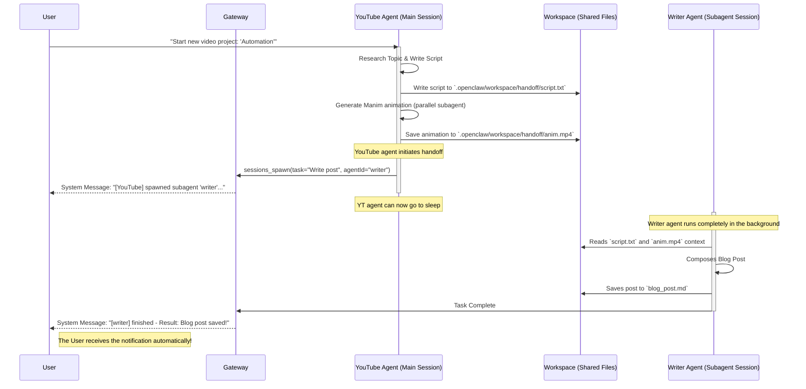

# Multi-Agent Communication & Automation Best Practices in OpenClaw

*Created at: 2026-02-22*


Based on thorough research of the OpenClaw codebase guidelines (`session-tool.md`, `multi-agent.md`, and existing architecture artifacts), here is an analysis of your problem and the best practices for truly automated multi-agent workflows.

## The Problem You're Experiencing

You mentioned:
> *"I have challenges when multi-agents communication, either `sessions_send` failed, or even `sessions_send` succeeded, the agent need to pick up in the next active session, so there is no automatically work among them, I have to trigger a chat to active the new session."*

**Why this happens with `sessions_send`:**
1. `sessions_send` is designed for **synchronous short queries** (ping-pong messaging).
2. It has a `timeoutSeconds` (default 30s). If Agent B takes longer than 30s to finish, Agent A times out and continues its work.
3. Agent B processes the message in the background. When Agent B finishes, it sends a "reply-back" to Agent A.
4. However, if Agent A isn't currently active (the session went idle), Agent A receives the message in its session history but **does not wake up to act on it automatically**. You have to manually trigger a chat to wake Agent A up so it reads the new messages.

---

## Best Practice 1: Use `sessions_spawn` Instead for Task Handoff

For tasks where one agent does work and another agent needs to take over, do **not** use `sessions_send`. Instead, use **`sessions_spawn`**.

**How `sessions_spawn` fixes your issue:**
1. It is **asynchronous** and non-blocking. Agent A calls `sessions_spawn(task="do X", agentId="AgentB")` and immediately continues.
2. A new isolated session is created just for Agent B to do this sub-task.
3. When Agent B is fully done, the OpenClaw gateway **automatically announces** the final outcome back to the original requester's chat channel.
4. This means you get a completion notification in your channel automatically, without needing to wake up Agent B or Agent A.

**Example task flow:**
- User -> Agent A: "Write a blog post."
- Agent A: `sessions_spawn(task="Research topic", agentId="Researcher")`
- *Agent A goes to sleep.*
- Researcher (Agent B) does the work.
- Gateway automatically posts to your channel: `[Researcher] finished - Result: Here is the research...`
- You or a Cron job can then trigger the next step.

## Best Practice 2: The Orchestrator + Shared State Pattern (Zero Manual Activation)

If you want a **fully automated supply chain** where Agent A finishes -> Agent B picks it up -> Agent C publishes, you need a mechanism that doesn't rely on holding sessions open.

The most robust way to do this in OpenClaw is **Shared Files + Cron/Heartbeat**.

### 1. Shared State (`STATUS_BOARD.md` or `handoff` directory)
Instead of agents messaging each other directly, they write to a shared workspace folder.
- When Agent A finishes a script, it writes it to `~/.openclaw/workspace/handoff/script_ready.md`.
- Agent A writes `Status: Pending Review` inside the file.

### 2. Cron Jobs (Automated Triggers)
To prevent you from manually triggering chats, give your Orchestrator agent or the receiving agent a **Cron tool**.
Cron jobs run in an isolated session at a specific interval and can use `sessions_spawn` to wake up other agents.

- **Setup a Cron job to run every hour.**
- The Orchestrator agent runs, checks the `handoff` directory.
- It sees `script_ready.md`.
- It automatically calls `sessions_spawn(task="Review this script", agentId="Reviewer")`.

### 3. HEARTBEAT.md
If you don't want to use Cron, you can use `HEARTBEAT.md`.
During any active session, OpenClaw re-reads `HEARTBEAT.md` every ~30 minutes. You can put a checklist there:
```markdown
# HEARTBEAT.md
- [ ] Check `handoff/` folder for new work.
- [ ] If work is found, use `sessions_spawn` to delegate it to the appropriate agent.
```

## Summary Checklist for your agents:

1. **Stop using `sessions_send` for long tasks.** If it takes more than a few seconds, it's a sub-task. Use `sessions_spawn`.
2. **Configure Config file.** Ensure your `openclaw.json` allows spawning:
   ```json
   "agents": {
     "list": [
       {
         "id": "agentA",
         "subagents": {
           "allowAgents": ["agentB", "agentC"]
         }
       }
     ]
   }
   ```
3. **Persist State.** Instruct your agents to write their final output to a `.md` file in the workspace rather than returning it in a chat message. 
4. **Use Cron.** Add `cron` to your agent's tools to periodically check the shared files and trigger the next step automatically.

---

## Scenario: The YouTube -> Writer Pipeline

Here is exactly how this workflow operates, utilizing `sessions_spawn` and the Orchestrator/Shared State pattern.

**Goal:** Provide an automated, start-to-finish workflow where the YouTube agent generates a script and creates an animation, which is then passed to the Writer agent to compose a blog post, without manual human triggering.

### Configuration (`openclaw.json`)
```json5
"agents": {
  "list": [
    {
      "id": "youtube",
      "subagents": {
        // Allows YouTube agent to spawn sub-tasks acting as the Writer agent!
        "allowAgents": ["youtube", "writer"] 
      }
    },
    { "id": "writer" }
  ]
}
```

### The Workflow Diagram



### The Result
- **No manual intervention:** Once you give the initial prompt, the workflow runs to completion.
- **No deadlocks:** The Writer agent does not miss a message if its main session is asleep, because it is spun up cleanly in the background specifically for this task via `sessions_spawn`.
- **Clean contexts:** The YouTube agent's main chat window doesn't get flooded with the formatting and details of the blog post, and you get the final alert directly in your active UI.
