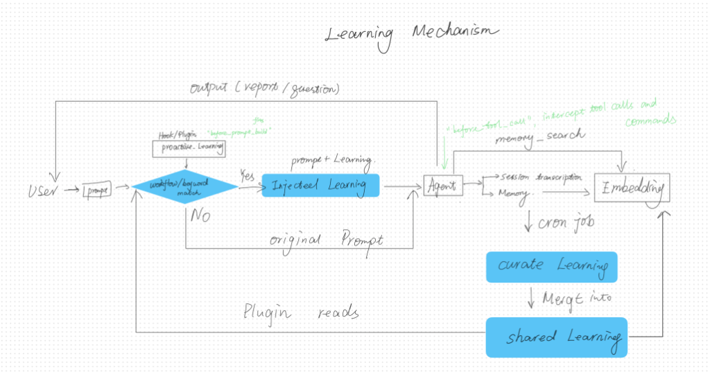

# Proactive Learning: Phase-Aware Knowledge Injection for Multi-Agent Systems

*Created: 2026-02-24 | Status: ✅ Implemented & Live*

---

## 1. Problem

### 1.1 Core Issue

Multi-agent systems have **no mechanism to proactively guide agent behavior** based on accumulated experience. Agents repeat the same mistakes across sessions because there's no feedback loop from past failures to future actions.

### 1.2 Specific Production Problems

| Problem | Impact |
|:---|:---|
| **No dynamic learning loop** | Agent discovers "Python 3.14 breaks Cairo" on Monday, makes the same mistake on Tuesday |
| **`memory_search` is reactive, not proactive** | Agent must *ask* for help. If it doesn't search, it doesn't know |
| **LLM-based retrieval is unreliable** | Embedding search returns fragmented chunks — a 293-line SKILL gets split into 6 pieces, agent sees fragments instead of a complete rule set |
| **Context window limitation** | Putting all learnings in SOUL.md wastes tokens every turn, even when irrelevant (rendering rules during topic selection) |
| **Suggestions, not enforcement** | Even when rules ARE loaded, the agent treats them as suggestions. "Use .venv/bin/python" in SOUL.md doesn't stop `python3 -m manim` from running |
| **No user preference capture** | User corrects "use dark background" → never encoded anywhere → agent repeats the light background mistake |

### 1.3 Root Causes

**① Knowledge is passive — only applies when the agent explicitly asks**

```
Agent runs → makes mistakes → gets corrected → learnings saved to memory
Next session → knowledge exists but agent doesn't call memory_search
→ same mistakes → same corrections → repeat forever

The knowledge is THERE. But unless the agent explicitly searches
with the right query, it never influences behavior.
```

**② Memory docs grow large and compete for context window**

As learnings accumulate, MEMORY.md and SOUL.md grow into large files that reload every turn. When an agent's workflow spans multiple phases (topic → design → render → production), rules from unrelated phases become **noise** — rendering rules compete with story arc rules for context window space, diluting the signal.

**③ All guidance is suggestion, not enforcement**

Everything in the agent's context — SOUL.md, MEMORY.md, injected knowledge — is a *suggestion*. The agent may follow it, may not. There is no mechanism to **enforce** critical rules at each stage of the agent lifecycle. When the agent runs `python3 -m manim` instead of `.venv/bin/python -m manim`, no amount of prompting guarantees correct behavior.

---

## 2. Insights

### ① Proactive injection + a learning loop closes the passive knowledge gap

The agent doesn't need to *ask* for knowledge — it should receive it automatically. A plugin hook (`before_prompt_build`) injects curated rules **before the agent even starts thinking**. Combined with a cron-based curation loop that feeds agent experiences back into the rule files, knowledge becomes self-improving.

Pre-curated, coherent rule files also beat search fragments. A curated document delivers complete knowledge without relying on search quality.

### ② Phase-aware keyword matching eliminates context noise

Simple keyword matching (`"render" in prompt → inject render rules`) is deterministic, instant, and $0. It injects **only the domains relevant to the current phase**, keeping unrelated rules out of the context window.

Scanning **agent messages** (not just user messages) catches phase transitions. When the user says "yes", the agent's previous message contains keywords like "let's render."

**No match = no injection** — prompt stays clean.

### ③ Mechanical tool interception guarantees enforcement

A `before_tool_call` hook that **rewrites commands** is more reliable than any amount of prompting. If the agent tries `python3 -m manim`, the hook silently rewrites it to `.venv/bin/python -m manim`. This is a guarantee, not a suggestion.

---

## 3. Methods

### Architecture



```
shared_learnings/yt_*.md ──→ Plugin reads ──→ Injects into prompt ──→ Agent runs
         ↑                                                                │
         │                                                                ↓
         └──── COO curates ←── memory index ←── session transcripts ←────┘
```

---

### ① Proactive Injection + Learning Loop

**Plugin** (`before_prompt_build`): Reads `yt_*.md` curated files → injects matching domains as `prependContext`.

**COO cron** (8 AM daily, STEP 3 of `coo-daily-summary`):
1. Read 5 most recent youtube session transcripts
2. Read all 7 `yt_*.md` curated files
3. Identify: technical discoveries, Jing's preferences, process fixes
4. Update `yt_*.md` — merge, dedup, new contradicts old → **new wins**
5. Report changes to `#daily-digest`

This creates the **closed loop**: agent runs → transcripts saved → COO curates → rules updated → plugin injects → agent improves.

---

### ② Phase-Aware Keyword Matching

7 domains with keywords, matching on prompt + last 3 messages (agent AND user):

| Domain | Keywords | Curated File |
|:---|:---|:---|
| `story_arc` | topic, story, arc, narrative, P-I-M-R | `yt_story_arc_rules.md` |
| `voiceover` | voiceover, script, 金句, 语气, 文案 | `yt_voiceover_rules.md` |
| `design` | design, layout, font, component, visual, card | `yt_design_rules.md` |
| `scene_spec` | scene, spec, card, terminal, animation | `yt_scene_spec_rules.md` |
| `render` | render, manim, python, venv, .venv | `yt_render_rules.md` |
| `production` | audio, ffmpeg, concat, mix, ding, swish | `yt_production_rules.md` |
| `sharing` | deliver, share, upload, discord, send | `yt_sharing_rules.md` |

**Example:**
```
Turn 1:  "start the story arc"        → story_arc ✅ → inject 1 domain
Turn 6:  Agent: "scene spec design?"   → scene_spec ✅ + design ✅ → inject 2
Turn 13: Agent: "Let's render?"        → render ✅ → inject 1 domain
Turn 32: "pick topic for next video"   → NO match → clean prompt, 0 injected
```

---

### ③ Mechanical Tool Enforcement

`before_tool_call` intercepts `run_command` and mutates parameters:

```json
{
  "youtube": {
    "env": { "DISPLAY": ":0" },
    "rewrite": {
      "python3 -m manim": ".venv/bin/python -m manim",
      "python -m manim": ".venv/bin/python -m manim"
    }
  }
}
```

---

## 4. Results

### Root Cause → Solution Mapping

| Root Cause | Solution | Mechanism |
|:---|:---|:---|
| ① Knowledge is passive | Proactive injection + daily learning loop | Plugin injects curated rules; COO curates daily |
| ② Context window noise | Phase-aware keyword matching | Only matched domains injected; no match = clean prompt |
| ③ Suggestions, not enforcement | Mechanical `before_tool_call` | Commands rewritten; env vars injected silently |

### Live Test

```
Turn 32: [INJECT] SKIP (no keyword match)                              ← solves ②
Turn 35: [INJECT] ✅ domains=[story_arc,production,sharing] lines=100  ← solves ①
```

### Cost

| Component | Cost | Frequency |
|:---|:---|:---|
| Plugin (injection + enforcement) | **$0** | every turn |
| COO curation | **$0** (subscription) | daily |
| Memory indexing | ~0.4¢ | cron |

### Risks

| Risk | Mitigation |
|:---|:---|
| Keyword miss (~20%) | Agent still has `memory_search` as fallback |
| Over-injection | Extra context < missed rules |
| Rigid taxonomy | Expand domains as workflows grow |

---

## Appendix: Implementation Files

| File | Purpose |
|:---|:---|
| [index.ts](file:///Users/jingshi/openclaw/extensions/proactive-learning/index.ts) | Plugin (310 lines, 2 hooks, 0 LLM calls) |
| [jobs.json](file:///Users/jingshi/.openclaw/cron/jobs.json) | COO cron with STEP 3 curation |
| `~/.clawdbot/shared_learnings/yt_*.md` | 7 curated domain rule files |
| `~/.clawdbot/proactive-learning-debug.log` | Debug log |
