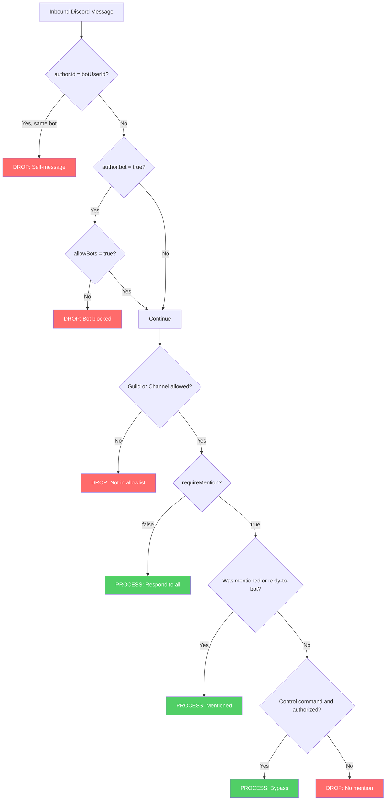
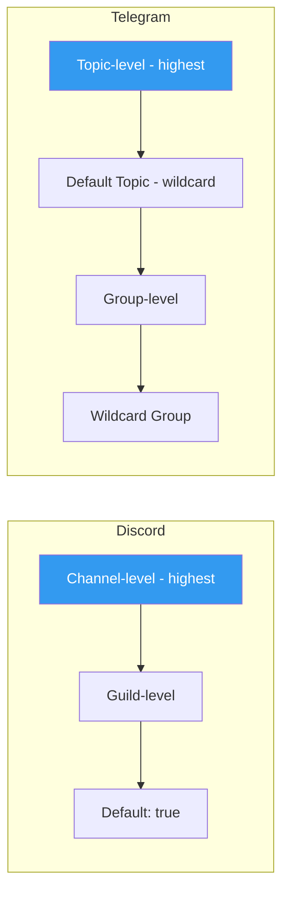
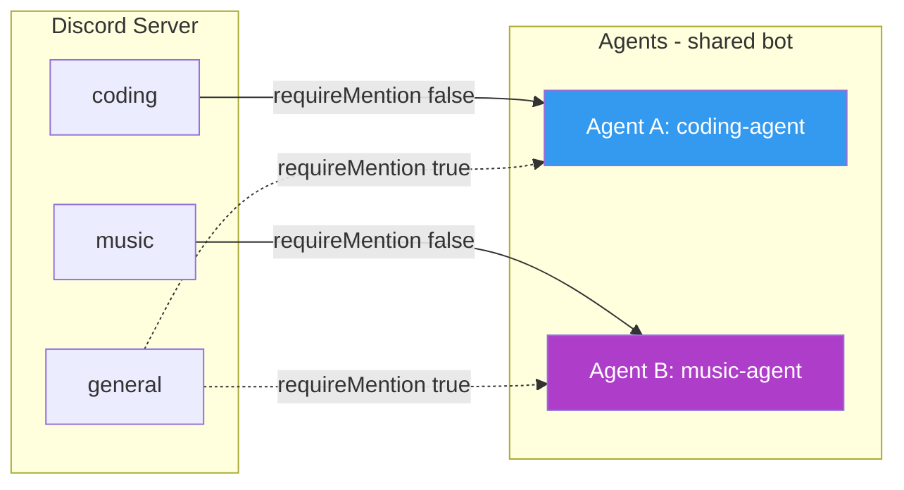
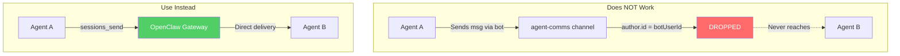

# requireMention Deep Dive: Mention Gating in Multi-Agent Discord

## Problem

When running **multiple agents on a single Discord bot**, two critical issues arise:

1. **Noise in group channels** — Without gating, every agent responds to every message, creating chaos
2. **Silent agents in shared channels** — Agents sharing one bot token **cannot see each other's messages** because Discord's self-message filter drops them before any config is evaluated

> [!CAUTION]
> The self-message filter (`author.id === botUserId → drop`) executes **before** `requireMention` is checked. This means `requireMention: false` does **not** enable inter-agent communication through Discord when agents share one bot.

---

## Insights

### What `requireMention` Does

`requireMention` is a **boolean configuration flag** that controls whether an agent should only respond to messages where it was explicitly `@mentioned`.

**Core logic** in [mention-gating.ts](file:///Volumes/Motus_SSD/mac_mini/ClawdBot_Github/openclaw/src/channels/mention-gating.ts):

```typescript
const shouldSkip = requireMention && canDetectMention && !effectiveWasMentioned;
```

- `true` → Agent **ignores** messages unless `@mentioned`, implicitly mentioned (reply), or a control command bypass is triggered
- `false` → Agent **responds to all** messages in that channel

### The Self-Message Trap

**Root cause** in [message-handler.preflight.ts](file:///Volumes/Motus_SSD/mac_mini/ClawdBot_Github/openclaw/src/discord/monitor/message-handler.preflight.ts#L124-L127):

```typescript
if (params.botUserId && author.id === params.botUserId) {
    // Always ignore own messages to prevent self-reply loops
    return null;  // ← Drops BEFORE requireMention is ever checked
}
```

When Agent A sends a message via the shared bot, Agent B receives the event but sees `author.id === botUserId` (same bot!) and **silently drops it**.

---

## Method

### Discord Preflight Pipeline



### Configuration Cascade (Most Specific Wins)

`requireMention` can be set at multiple levels. Resolution follows a **most-specific-first** pattern:



**Discord resolution** (`resolveDiscordGroupRequireMention`):

| Priority | Config Path | Example Key |
|----------|-------------|-------------|
| 1 (highest) | `guilds.<id>.channels.<channel>.requireMention` | `"#coding"` |
| 2 | `guilds.<id>.requireMention` | `"*"` |
| 3 (default) | hardcoded | `true` |

**Telegram resolution** (`resolveTelegramRequireMention`):

| Priority | Config Path | Example Key |
|----------|-------------|-------------|
| 1 (highest) | `groups.<chatId>.topics.<topicId>.requireMention` | `"12345"` |
| 2 | `groups."*".topics.<topicId>.requireMention` | wildcard fallback |
| 3 | `groups.<chatId>.requireMention` | `"-100123456"` |
| 4 | `groups."*".requireMention` | wildcard default |

---

## Application Scenarios

### Scenario 1: Dedicated Channels per Agent (Recommended)

Each agent owns specific channels and ignores the rest.

```json
// Agent A (coding-agent) openclaw.json
{
  "channels": {
    "discord": {
      "guilds": {
        "*": {
          "requireMention": true,
          "channels": {
            "#coding": { "requireMention": false }
          }
        }
      }
    }
  }
}

// Agent B (music-agent) openclaw.json  
{
  "channels": {
    "discord": {
      "guilds": {
        "*": {
          "requireMention": true,
          "channels": {
            "#music": { "requireMention": false }
          }
        }
      }
    }
  }
}
```



### Scenario 2: Agent-to-Agent Communication

> [!WARNING]
> Agents sharing one Discord bot **cannot** communicate through Discord messages due to the self-message filter. Use these alternatives instead.



**Working alternatives:**

| Method | How | Best For |
|--------|-----|----------|
| `sessions_send` | Direct gateway message delivery | Point-to-point agent comms |
| `sessions_spawn` | Spawn a new agent session with context | Delegating subtasks |
| Separate bot tokens | Each agent gets own Discord bot | True Discord-based agent chat |
| Webhooks | Different author identity | Workaround for self-filter |

### Scenario 3: Telegram Group with Topics

```json
{
  "channels": {
    "telegram": {
      "groups": {
        "-100123456": {
          "requireMention": true,
          "topics": {
            "42": { "requireMention": false }
          }
        }
      }
    }
  }
}
```

Bot responds freely in topic `42` but requires `@mention` everywhere else in that group.

### Scenario 4: Mention Bypass for Control Commands

Even with `requireMention: true`, authorized users can execute control commands (e.g., `/status`, `/config`) without mentioning the bot — handled by `resolveMentionGatingWithBypass`:

```typescript
const shouldBypassMention =
    isGroup &&
    requireMention &&
    !wasMentioned &&
    !hasAnyMention &&
    allowTextCommands &&
    commandAuthorized &&
    hasControlCommand;
```

---

## Key Source Files

| File | Purpose |
|------|---------|
| [mention-gating.ts](file:///Volumes/Motus_SSD/mac_mini/ClawdBot_Github/openclaw/src/channels/mention-gating.ts) | Core `shouldSkip` logic + bypass |
| [group-mentions.ts](file:///Volumes/Motus_SSD/mac_mini/ClawdBot_Github/openclaw/src/channels/plugins/group-mentions.ts) | Config cascade resolution (Discord + Telegram) |
| [message-handler.preflight.ts](file:///Volumes/Motus_SSD/mac_mini/ClawdBot_Github/openclaw/src/discord/monitor/message-handler.preflight.ts) | Full Discord preflight pipeline + self-message filter |
| [types.discord.ts](file:///Volumes/Motus_SSD/mac_mini/ClawdBot_Github/openclaw/src/config/types.discord.ts) | Discord config types (`DiscordGuildChannelConfig`, `DiscordGuildEntry`) |
| [ack-reactions.ts](file:///Volumes/Motus_SSD/mac_mini/ClawdBot_Github/openclaw/src/channels/ack-reactions.ts) | Ack reactions behavior influenced by `requireMention` |
