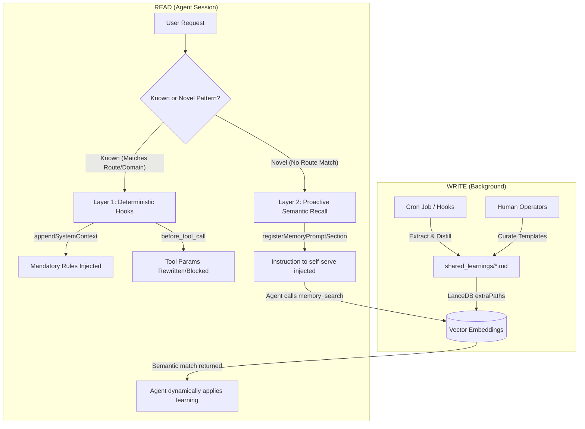

# Knowledge Flywheel V2 Architecture

## Problem
OpenClaw's proactive-learning plugin excels at **deterministic rule enforcement**. When an agent encounters a known failure pattern, the plugin uses keyword and route matching to mechanically inject rules and rewrite tool calls. 

However, this system suffers from the **"Novelty Gap"**. When an agent faces a failure pattern it hasn't seen before, the deterministic hooks fail to match. The agent gets zero help from the knowledge base, even if `shared_learnings/*.md` contains tangentially related insights that could solve the problem. Agents forget to actively use the `memory_search` tool unless explicitly prompted, leading to hallucinations or repeated failures on solvable edge cases.

## Insights
1. **Semantic Search Already Exists:** OpenClaw's built-in memory system already uses LanceDB and embedding-based semantic retrieval (via `memory_search`). Furthermore, the `shared_learnings/` directory is already inside its indexed scope (`extraPaths`). Building a massive new PostgreSQL/pgvector database is redundant infrastructure.
2. **The `registerMemoryPromptSection` API is Prime Real Estate:** The most effective place to teach an agent a new behavioral protocol is immediately after its `## Skills` block in the system prompt.
3. **Hybrid is Better than Replacement:** We don't need to throw away the deterministic hooks. We can stack them. Deterministic hooks handle *known* constraints via `appendSystemContext`, while a new semantic retrieval protocol handles *novel* situations by commanding the agent to self-serve via `memory_search`.

## Method (Knowledge Flywheel V2)

### Architecture Visualization



### Before vs. After Comparison

| Dimension | Flywheel V1 (Deterministic Only) | Flywheel V2 (Hybrid Strategy) |
|-----------|----------------------------------|-------------------------------|
| **Known Patterns** | ✅ Instantly injected via keyword/route | ✅ Instantly injected via keyword/route |
| **Novel Patterns** | ❌ Agent gets no help (Novelty Gap) | ✅ Agent commanded to search semantic memory |
| **System Prompt Layout** | ⚠️ Rules appended to the very bottom | ✅ Protocol in prime slot (after `## Skills`) |
| **Agent Autonomy** | ⚠️ Relied on agent spontaneously remembering to search | ✅ Explicit protocol guarantees proactive search |
| **Infrastructure Needed** | None (Filesystem) | None (Leverages built-in LanceDB + extraPaths) |
| **Promotion Pipeline** | N/A | Semantic search logs reveal recurring issues that humans can promote to deterministic Layer 1 routes |

---

We will upgrade the existing `proactive-learning` plugin using a **Dual-Layer Injection Strategy**, leveraging the upstream `registerMemoryPromptSection` API to hijack the agent's default memory behavior.

### 1. The Write Loop (Existing + Enhanced)
- **Daily Cron:** Continues to automatically extract and distill logs into `.md` files using Gemini 2.0 Flash.
- **Human Curation:** `yt_*` rules continue to use human-instructed templates augmented by LLMs.
- **Background Indexing:** The native LanceDB system silently embeds these files via the `extraPaths` config.

### 2. Layer 1: Deterministic Injection (Existing)
The plugin keeps its `before_prompt_build` and `before_tool_call` hooks. If a task matches a known domain (e.g., `youtube`, `story_arc`), the strict, non-negotiable rules are appended to the system prompt (`appendSystemContext`) and mechanical tool rewriting is enforced.

### 3. Layer 2: Proactive Semantic Recall (New)
The plugin will call `api.registerMemoryPromptSection(builder)` during registration. This **overwrites** the default `memory-core` prompt section with a custom protocol that explicitly connects the agent to the Knowledge Flywheel.

When building the system prompt, OpenClaw will now inject this directly after the `## Skills` section:

```typescript
api.registerMemoryPromptSection(({ availableTools, citationsMode }) => {
  const lines: string[] = [];
  if (!availableTools.has("memory_search")) return lines;

  lines.push("## Memory & Institutional Knowledge Protocol");
  
  // Preserve default memory behavior
  lines.push("Before answering about prior work, decisions, or dates: run memory_search on MEMORY.md + memory/*.md.");
  
  // NEW: The Knowledge Flywheel Protocol
  lines.push(
    "When facing a novel failure pattern, a tricky task, or if you are unsure how to proceed:",
    "1. Always check shared_learnings/*.md via memory_search for related patterns.",
    "2. If a matching learning exists, treat it as MANDATORY institutional policy.",
    "3. If learning contradicts your default behavior, the learning takes precedence.",
    "4. If no match exists, proceed with your best judgment."
  );

  if (citationsMode !== "off") {
    lines.push("Citations: include Source: <path#line> when it helps the user verify memory snippets.");
  }
  
  lines.push("");
  return lines;
});
```

## Result
By combining deterministic hooks with semantic self-service, the Knowledge Flywheel V2 achieves:
*   **100% Coverage:** Known patterns get instant, token-efficient injection. Novel patterns trigger the agent to perform semantic searches, bridging the novelty gap.
*   **Zero New Infrastructure:** We leverage the existing LanceDB pipeline and cron jobs, avoiding the cost and complexity of PostgreSQL/pgvector.
*   **Prominent Behavioral Enforcement:** By hijacking the exclusive `registerMemoryPromptSection` slot, the retrieval protocol sits in the highest-attention zone of the LLM's system prompt (immediately following tool definitions), guaranteeing the agent actually runs `memory_search` when confused.
*   **Natural Promotion Pipeline:** Automatically extracted insights (noisy but broad) are found via semantic search. When human operators notice recurring semantic queries, they can promote those `.md` files into deterministic Route Maps for permanent Layer 1 enforcement.
