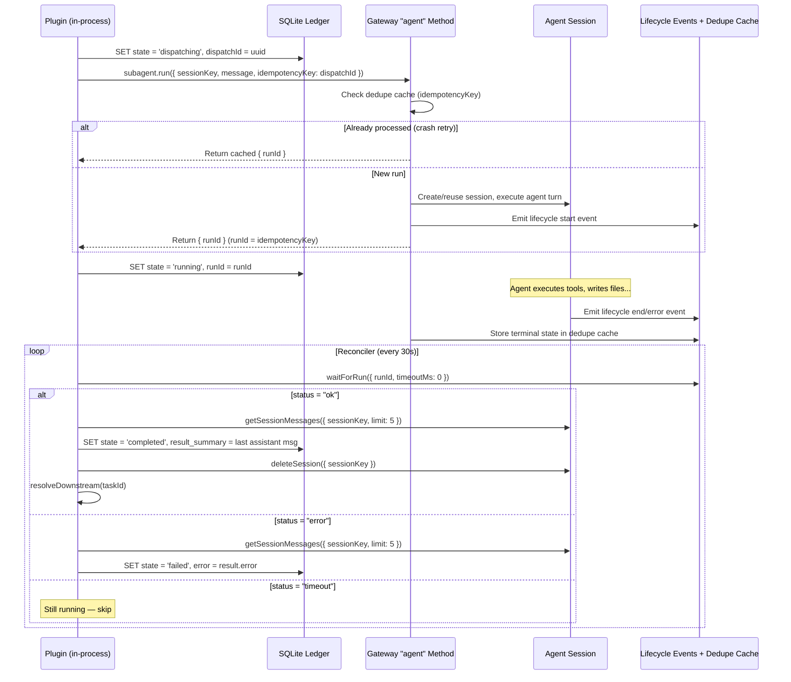

# Task Management Plugin: Source-Grounded Design

> **Date:** 2026-03-28
> **Status:** Final synthesis — incorporates corrections from both prior documents
> **Builds on:** [Synthesized Best Practices](./2026-03-28_synthesized_task_management_best_practices.md), [Corrected Architecture](./2026-03-28_corrected_task_management_architecture.md)
> **Method:** Every API claim verified against `SourceCode/openclaw/` as of 2026-03-28

---

## 1. Executive Summary

A task management plugin for OpenClaw that uses a SQLite ledger, dispatches work via `api.runtime.subagent.run()`, and resolves completion via `waitForRun()` polling.

**Key design decisions, each grounded in source verification:**

1. **`subagent.run()` is the dispatch primitive.** It calls the `"agent"` gateway method, can create sessions implicitly, and returns a `runId`. It does NOT register with the subagent registry and does NOT trigger `subagent_ended`. This is fine — `waitForRun()` works independently via the lifecycle event bus and gateway deduplication cache.

2. **`waitForRun()` is the completion authority.** It races lifecycle events against the gateway dedupe cache. It works for plugin-initiated runs without the subagent registry. Default timeout is 30s; we use `timeoutMs: 0` for instant polling in the reconciler.

3. **`idempotencyKey` provides dispatch deduplication.** When passed to `subagent.run()`, it becomes the `runId` and is cached in the gateway dedupe map. If the plugin retries a dispatch after a crash, the gateway returns the cached result instead of running the task twice. This simplifies the `dispatching → running` recovery significantly.

4. **The plugin must own session cleanup.** Since `subagent.run()` bypasses the subagent registry (and its sweeper/archiver), sessions created by this plugin are never automatically cleaned up. The plugin calls `deleteSession()` after capturing results.

5. **SQLite via `node:sqlite` for storage.** Already used by `memory-core` and `memory-host-sdk`. No new native dependencies. WAL mode, FTS5, and complex schemas are precedented in the codebase.

6. **Dispatch is in Phase 1.** A task ledger without execution is a TODO list. The entire value is autonomous dispatch + reliable completion tracking.

---

## 2. What the Plugin API Provides (Verified)

### Available and Used

| API | Purpose in This Plugin | Source |
|-----|----------------------|--------|
| `api.registerTool(factory, opts)` | Register the `goals` tool | `src/plugins/types.ts:1678` |
| `api.on("before_prompt_build", handler)` | Inject task board into heartbeat prompts via `appendSystemContext` | `src/plugins/types.ts:2337` |
| `api.on("gateway_start", handler)` | Startup reconciliation | `src/plugins/types.ts:2426` |
| `api.runtime.subagent.run(params)` | Dispatch tasks — calls `"agent"` gateway method, returns `{ runId }` | `src/gateway/server-plugins.ts:306` |
| `api.runtime.subagent.waitForRun(params)` | Poll completion — races lifecycle events + dedupe cache, returns `{ status }` | `src/gateway/server-plugins.ts:349` |
| `api.runtime.subagent.getSessionMessages(params)` | Read session transcript to extract result summary | `src/gateway/server-plugins.ts:298` |
| `api.runtime.subagent.deleteSession(params)` | Clean up task sessions after completion | `src/gateway/server-plugins.ts:370` |
| `api.runtime.state.resolveStateDir()` | Get `~/.openclaw` for SQLite DB location | `src/plugins/runtime/types-core.ts:104` |
| `api.pluginConfig` | Read validated plugin config from `openclaw.yaml` | Plugin loader validates against `configSchema` |

### Available but Deferred

| API | Use Case | Phase |
|-----|----------|-------|
| `api.on("subagent_ended", handler)` | Fast-path completion for spawned-worker adapter | Phase 3 |
| `api.runtime.system.enqueueSystemEvent()` | Wake a session for escalation | Phase 3 |
| `api.runtime.system.requestHeartbeatNow()` | Trigger immediate heartbeat after escalation | Phase 3 |
| `api.registerGatewayMethod(name, handler)` | Expose task-graph status to external callers | Phase 4 |

### Not Available on Plugin API

| Capability | Reality | Impact |
|------------|---------|--------|
| Generic `callGateway()` | Not on `api.runtime`. `callGatewayTool` exists on `plugin-sdk/browser-support` but is scoped to browser extensions. | Send/cron dispatch requires either `registerGatewayMethod` workaround or upstream SDK extension. Deferred to Phase 3+. |
| `sessions_spawn` from plugin code | The spawn lifecycle (registry, announcements, cleanup sweeper) is internal to `src/agents/subagent-spawn.ts`. Not exposed on `api.runtime`. | True spawned-worker sessions with registry tracking require a different adapter. Deferred to Phase 3. |

---

## 3. The Dispatch-Completion Loop (How It Actually Works)



### Why This Works Without `subagent_ended`

The `subagent_ended` hook only fires for runs tracked in the subagent registry (via `sessions_spawn`). Plugin-initiated `subagent.run()` calls bypass the registry entirely.

But `waitForRun()` doesn't use the registry either. It races two in-memory sources:
1. **Lifecycle event bus** (`agent-job.ts`) — subscribes to agent lifecycle events, caches results for 10 minutes
2. **Gateway deduplication cache** (`agent-wait-dedupe.ts`) — stores terminal states keyed by `agent:{idempotencyKey}`

Both are populated when the `"agent"` gateway method completes, regardless of whether the run was initiated by a plugin or by `sessions_spawn`.

### The `idempotencyKey` Guarantee

When `subagent.run()` is called with an `idempotencyKey`:
1. The gateway checks its dedupe cache for `agent:{key}` before processing
2. If found, returns the cached result immediately (no duplicate execution)
3. If not found, executes the run and caches the result
4. The `idempotencyKey` becomes the `runId`

This means: if the plugin crashes after calling `subagent.run()` but before persisting the `runId`, the reconciler can retry with the **same persisted `dispatchId`** as `idempotencyKey`:
- If the gateway is still running: the dedupe cache returns the cached result (no duplicate execution)
- If the gateway also restarted: the dedupe cache is cleared, so a fresh run starts (acceptable — the original run is lost anyway)

The key is that `dispatchId` is persisted to SQLite in the `dispatching` transition **before** calling `subagent.run()`. The reconciler's `redispatchStuckTask()` reuses this persisted `dispatchId` rather than generating a fresh UUID, preserving the deduplication guarantee across the crash window.

### Limitation: Dedupe Cache Is In-Memory

The gateway dedupe cache does not survive restarts. If the gateway restarts while a run is in-flight:
- The lifecycle event bus is cleared
- The dedupe cache is cleared
- `waitForRun({ timeoutMs: 0 })` will return `"timeout"` indefinitely for that `runId`

The reconciler handles this with a staleness threshold: if a task has been `running` for longer than `staleRunThresholdMs` (default: 10 minutes) and `waitForRun()` keeps returning `"timeout"`, the task is moved to `failed` with a "stale — gateway may have restarted" error and can be retried.

---

## 4. State Machine

```mermaid
stateDiagram-v2
    [*] --> pending : task created
    pending --> ready : all dependencies completed
    ready --> dispatching : dispatcher claims task (dispatchId generated)
    dispatching --> running : subagent.run() returns runId (fresh or re-dispatch)
    dispatching --> ready : subagent.run() threw and no persisted dispatchId to retry
    running --> completed : waitForRun returns "ok"
    running --> failed : waitForRun returns "error" OR stale timeout
    failed --> ready : retry (if retries remaining)
    completed --> [*]
    failed --> [*]
    cancelled --> [*]

    note left of waiting_user : Phase 2
    running --> waiting_user : approval gate (Phase 2)
    waiting_user --> ready : approved (Phase 2)
    waiting_user --> cancelled : rejected (Phase 2)
```

### Transition Rules

#### Phase 1 Transitions

| From | To | Condition | Side Effects |
|------|----|-----------|--------------|
| `pending` | `ready` | All `depends_on` tasks are `completed` | — |
| `ready` | `dispatching` | Dispatcher selects task | Write `dispatchId`, `sessionKey` to DB |
| `dispatching` | `running` | `subagent.run()` returns `runId` (fresh dispatch or startup re-dispatch reusing persisted `dispatchId`) | Write `runId` to DB |
| `dispatching` | `ready` | `subagent.run()` throws and no persisted `dispatchId` available for retry | Clear dispatch fields |
| `running` | `completed` | `waitForRun()` returns `"ok"` | Capture result, delete session, resolve downstream |
| `running` | `failed` | `waitForRun()` returns `"error"` OR stale threshold exceeded | Record error, increment `retryCount` |
| `failed` | `ready` | User calls `goals.retry(taskId)` AND `retryCount < maxRetries` | — |

#### Phase 2 Transitions (Deferred)

| From | To | Condition | Side Effects |
|------|----|-----------|--------------|
| `running` | `waiting_user` | Task has `approval_required = true` and run completed | Hold for user action |
| `waiting_user` | `ready` | User calls `goals.approve(taskId)` | — |
| `waiting_user` | `cancelled` | User calls `goals.reject(taskId)` | — |

### Invalid Transitions (Enforced by State Machine)

`pending → running`, `ready → completed`, `completed → ready`, `cancelled → ready`, etc. The state machine module rejects any transition not in the table above.

---

## 5. Session Lifecycle

Since `subagent.run()` bypasses the subagent registry, the plugin owns the full session lifecycle.

### Session Key Convention

Session keys **must** start with `agent:{agentId}:` to route to the correct agent. Without this prefix, `resolveSessionStoreKey()` (`src/gateway/session-utils.ts:685`) canonicalizes the key onto the default agent — breaking multi-agent dispatch.

```
agent:{agentId}:task-graph:{goalId}:{taskId}:{attempt}
```

Example: `agent:researcher:task-graph:goal-abc123:task-def456:1`

The `agentId` comes from the task's `agent_id` column. The attempt number ensures each retry gets a fresh session (no leftover context from failed runs).

```typescript
function buildSessionKey(task: Task): string {
  const agentId = task.agentId ?? "main";
  return `agent:${agentId}:task-graph:${task.goalId}:${task.id}:${task.retryCount + 1}`;
}
```

### Cleanup Rules

| Task Terminal State | Session Action | Rationale |
|--------------------|---------------|-----------|
| `completed` | Delete immediately after capturing `result_summary` | No need to keep successful worker sessions |
| `failed` (will retry) | Keep for debugging; delete on next attempt or after `sessionRetentionMs` | User may want to inspect what went wrong |
| `failed` (final) | Keep for `sessionRetentionMs` (default: 1 hour), then delete | Grace period for debugging |
| `cancelled` | Keep for `sessionRetentionMs`, then delete | Cancelled mid-execution may have useful partial output |

### Cleanup Sweep

The periodic reconciler also sweeps sessions for terminal tasks older than `sessionRetentionMs`:

```typescript
for (const task of store.getTerminalTasksWithSessions()) {
  if (Date.now() - task.updatedAtMs > sessionRetentionMs) {
    await api.runtime.subagent.deleteSession({
      sessionKey: task.sessionKey,
      deleteTranscript: true,
    });
    store.clearSessionKey(task.id);
  }
}
```

---

## 6. SQLite Schema

Using `node:sqlite` (Node 22+ built-in). Same module used by `memory-core` via `packages/memory-host-sdk/src/host/sqlite.ts`.

```sql
-- Goal instances (active workflows)
CREATE TABLE goals (
  id             TEXT PRIMARY KEY,
  name           TEXT NOT NULL,
  template_id    TEXT,
  state          TEXT NOT NULL DEFAULT 'pending',
  params         TEXT,              -- JSON: interpolated template params
  created_at_ms  INTEGER NOT NULL,
  updated_at_ms  INTEGER NOT NULL
);

-- Task instances (state machine entities)
CREATE TABLE tasks (
  id              TEXT PRIMARY KEY,
  goal_id         TEXT NOT NULL REFERENCES goals(id),
  parent_id       TEXT,             -- for stage grouping
  name            TEXT NOT NULL,
  state           TEXT NOT NULL DEFAULT 'pending',
  agent_id        TEXT NOT NULL DEFAULT 'main', -- target agent (used in session key routing)
  session_key     TEXT,             -- created session for this task+attempt
  dispatch_id     TEXT,             -- pre-dispatch correlation / idempotencyKey
  run_id          TEXT,             -- post-dispatch, from subagent.run() return
  depends_on      TEXT,             -- JSON array of task IDs
  task_message    TEXT NOT NULL,    -- the prompt sent to the agent
  extra_context   TEXT,             -- JSON: additional context for subagent
  result_summary  TEXT,             -- captured from session messages
  error           TEXT,
  retry_count     INTEGER NOT NULL DEFAULT 0,
  max_retries     INTEGER NOT NULL DEFAULT 2,
  approval_required INTEGER NOT NULL DEFAULT 0, -- Phase 2: approval gates
  created_at_ms   INTEGER NOT NULL,
  updated_at_ms   INTEGER NOT NULL
);

-- Execution history (audit trail, analytics)
CREATE TABLE task_runs (
  id              INTEGER PRIMARY KEY AUTOINCREMENT,
  task_id         TEXT NOT NULL REFERENCES tasks(id),
  goal_id         TEXT NOT NULL REFERENCES goals(id),
  run_id          TEXT,
  session_key     TEXT,
  attempt         INTEGER NOT NULL,
  state           TEXT NOT NULL,    -- lifecycle: 'running' on insert, updated to terminal on completion
  started_at_ms   INTEGER,
  ended_at_ms     INTEGER,
  duration_ms     INTEGER,
  error           TEXT,
  result_summary  TEXT
);

CREATE INDEX idx_tasks_goal ON tasks(goal_id);
CREATE INDEX idx_tasks_state ON tasks(state);
CREATE INDEX idx_task_runs_task ON task_runs(task_id);
CREATE INDEX idx_task_runs_goal ON task_runs(goal_id);
```

**Why not JSON files?** The `task_runs` audit trail enables analytics queries (time per goal, failure rates, retry patterns) that would require full-file parsing with JSON. SQLite with `node:sqlite` is already proven in this codebase.

**Why no token tracking columns?** Token usage is not available from `waitForRun()` or `getSessionMessages()`. If OpenClaw exposes token stats on the plugin API later, a migration can add those columns. Don't design for data you can't collect.

---

## 7. Plugin Structure

```
extensions/task-graph/
  openclaw.plugin.json
  package.json
  tsconfig.json
  index.ts                    # definePluginEntry — register tool + hooks
  src/
    db.ts                     # node:sqlite init, migrations, WAL mode
    store.ts                  # GoalStore: typed CRUD over SQLite
    store.types.ts            # TaskState, GoalState, Task, Goal, TaskRun types
    state-machine.ts          # Strict transition validation (whitelist approach)
    resolver.ts               # Dependency resolution: which tasks are ready?
    dispatcher.ts             # Dispatch loop: ready → dispatching → running
    reconciler.ts             # Startup + periodic: poll waitForRun, sweep sessions
    context-builder.ts        # Build extraSystemPrompt for dispatched tasks
    board.ts                  # Format goal/task status for display + heartbeat
    tools/
      goals-tool.ts           # Tool: run, status, retry, cancel, approve, reject
  tests/
    state-machine.test.ts
    resolver.test.ts
    reconciler.test.ts
    store.test.ts
    dispatcher.test.ts
    context-builder.test.ts
```

### Plugin Manifest

```json
{
  "id": "task-graph",
  "name": "Task Graph",
  "version": "0.1.0",
  "description": "Goal-first task management with reliable dispatch and completion tracking",
  "configSchema": {
    "type": "object",
    "additionalProperties": false,
    "properties": {
      "reconcileIntervalMs": {
        "type": "number",
        "description": "How often to poll running tasks and sweep sessions (ms)",
        "default": 30000
      },
      "staleRunThresholdMs": {
        "type": "number",
        "description": "Mark running tasks as failed after this duration with no completion signal (ms)",
        "default": 600000
      },
      "sessionRetentionMs": {
        "type": "number",
        "description": "Keep failed task sessions for debugging for this duration (ms)",
        "default": 3600000
      }
    }
  }
}
```

### Entry Point

```typescript
import path from "node:path";
import { definePluginEntry } from "openclaw/plugin-sdk/plugin-entry";
import { initDatabase } from "./src/db.js";
import { GoalStore } from "./src/store.js";
import { createDispatcher } from "./src/dispatcher.js";
import { createReconciler } from "./src/reconciler.js";
import { createGoalsTool } from "./src/tools/goals-tool.js";
import { formatBoardForHeartbeat } from "./src/board.js";

export default definePluginEntry({
  id: "task-graph",
  name: "Task Graph",
  description: "Goal-first task management with reliable dispatch and completion tracking",

  register(api) {
    const stateDir = api.runtime.state.resolveStateDir();
    const db = initDatabase(path.join(stateDir, "task-graph", "task-graph.db"));
    const store = new GoalStore(db);
    const config = api.pluginConfig ?? {};

    const reconcileIntervalMs = (config as any).reconcileIntervalMs ?? 30_000;
    const staleRunThresholdMs = (config as any).staleRunThresholdMs ?? 600_000;
    const sessionRetentionMs = (config as any).sessionRetentionMs ?? 3_600_000;

    const dispatcher = createDispatcher(store, api);
    const reconciler = createReconciler(store, api, dispatcher, {
      staleRunThresholdMs,
      sessionRetentionMs,
    });

    // Tool registration
    api.registerTool(
      (ctx) => createGoalsTool(store, dispatcher, ctx, api),
      { names: ["goals"] },
    );

    // Heartbeat injection: show ready/running tasks to the agent
    api.on("before_prompt_build", async (_event, ctx) => {
      if (ctx.trigger !== "heartbeat") return {};
      const board = store.getActiveBoardForAgent(ctx.agentId);
      if (!board) return {};
      return { appendSystemContext: formatBoardForHeartbeat(board) };
    });

    // Startup reconciliation
    api.on("gateway_start", async () => {
      await reconciler.onStartup();
    });

    // Periodic reconciliation — guarded against overlapping runs
    let reconciling = false;
    const timer = setInterval(async () => {
      if (reconciling) return;
      reconciling = true;
      try {
        await reconciler.onTick();
      } finally {
        reconciling = false;
      }
    }, reconcileIntervalMs);
    timer.unref?.();
  },
});
```

---

## 8. Core Module Designs

### Dispatcher

```typescript
// dispatcher.ts
export function createDispatcher(store: GoalStore, api: OpenClawPluginApi) {
  return {
    async dispatchReadyTasks(goalId: string): Promise<void> {
      const ready = store.getReadyTasks(goalId);

      for (const task of ready) {
        const dispatchId = crypto.randomUUID();
        const sessionKey = buildSessionKey(task);
        const context = buildTaskContext(store, task);

        // Step 1: Mark dispatching (durable — survives crash)
        // dispatchId is persisted so the reconciler can reuse it on retry
        store.transition(task.id, "dispatching", { dispatchId, sessionKey });

        try {
          // Step 2: Dispatch (idempotencyKey = dispatchId for dedup on retry)
          const { runId } = await api.runtime.subagent.run({
            sessionKey,
            message: task.taskMessage,
            extraSystemPrompt: context,
            idempotencyKey: dispatchId,
          });

          // Step 3: Mark running (durable)
          store.transition(task.id, "running", { runId });
          store.insertRun(task.id, task.goalId, {
            runId,
            sessionKey,
            attempt: task.retryCount + 1,
            state: "running",
            startedAtMs: Date.now(),
          });
        } catch (err) {
          // Dispatch failed — move back to ready, clear dispatchId
          store.transition(task.id, "ready", { error: String(err) });
        }
      }
    },

    // Re-dispatch a task that was stuck in "dispatching" after a crash.
    // Reuses the persisted dispatchId so the gateway deduplicates if the
    // original run actually completed during the crash window.
    async redispatchStuckTask(task: Task): Promise<void> {
      const context = buildTaskContext(store, task);
      try {
        const { runId } = await api.runtime.subagent.run({
          sessionKey: task.sessionKey!,
          message: task.taskMessage,
          extraSystemPrompt: context,
          idempotencyKey: task.dispatchId!, // reuse persisted dispatchId
        });
        store.transition(task.id, "running", { runId });
        store.insertRun(task.id, task.goalId, {
          runId,
          sessionKey: task.sessionKey!,
          attempt: task.retryCount + 1,
          state: "running",
          startedAtMs: Date.now(),
        });
      } catch (err) {
        // Still can't dispatch — move back to ready with fresh dispatchId next time
        store.transition(task.id, "ready", { error: String(err) });
      }
    },
  };
}

function buildSessionKey(task: Task): string {
  const agentId = task.agentId ?? "main";
  return `agent:${agentId}:task-graph:${task.goalId}:${task.id}:${task.retryCount + 1}`;
}
```

### Reconciler

```typescript
// reconciler.ts
export function createReconciler(
  store: GoalStore,
  api: OpenClawPluginApi,
  dispatcher: ReturnType<typeof createDispatcher>,
  opts: { staleRunThresholdMs: number; sessionRetentionMs: number },
) {
  async function reconcileRunningTasks(): Promise<void> {
    for (const task of store.getTasksByState("running")) {
      if (!task.runId) continue;

      const result = await api.runtime.subagent.waitForRun({
        runId: task.runId,
        timeoutMs: 0, // instant check
      });

      if (result.status === "timeout") {
        // Still running — check staleness
        const elapsed = Date.now() - task.updatedAtMs;
        if (elapsed > opts.staleRunThresholdMs) {
          store.transition(task.id, "failed", {
            error: `Stale: no completion signal after ${Math.round(elapsed / 1000)}s (gateway may have restarted)`,
          });
          store.finalizeRun(task.id, "failed", { error: "stale" });
        }
        continue;
      }

      // Terminal — capture result
      let summary: string | undefined;
      if (task.sessionKey) {
        try {
          const { messages } = await api.runtime.subagent.getSessionMessages({
            sessionKey: task.sessionKey,
            limit: 5,
          });
          summary = extractLastAssistantMessage(messages);
        } catch {
          // Session may already be gone — not fatal
        }
      }

      if (result.status === "ok") {
        store.transition(task.id, "completed", { resultSummary: summary });
        store.finalizeRun(task.id, "completed", { resultSummary: summary });
        await cleanupSession(api, task, opts.sessionRetentionMs);
        await resolveDownstream(store, task);
      } else {
        store.transition(task.id, "failed", {
          error: result.error ?? "unknown error",
          resultSummary: summary,
        });
        store.finalizeRun(task.id, "failed", {
          error: result.error,
          resultSummary: summary,
        });
      }
    }
  }

  async function reconcileDispatchingTasks(): Promise<void> {
    // Tasks stuck in "dispatching" with no runId — dispatch was interrupted.
    // Reuse the persisted dispatchId as idempotencyKey so the gateway
    // deduplicates if the original run actually completed during the crash.
    for (const task of store.getTasksByState("dispatching")) {
      if (!task.runId && task.dispatchId) {
        await dispatcher.redispatchStuckTask(task);
      } else if (!task.runId) {
        // No dispatchId persisted — can't deduplicate, just retry fresh
        store.transition(task.id, "ready");
      }
    }
  }

  async function sweepSessions(): Promise<void> {
    for (const task of store.getTerminalTasksWithSessions()) {
      const age = Date.now() - task.updatedAtMs;
      // Completed tasks: clean up immediately
      // Failed tasks: keep for sessionRetentionMs for debugging
      const threshold = task.state === "completed" ? 0 : opts.sessionRetentionMs;
      if (age > threshold) {
        try {
          await api.runtime.subagent.deleteSession({
            sessionKey: task.sessionKey!,
            deleteTranscript: true,
          });
        } catch {
          // Session may already be gone
        }
        store.clearSessionKey(task.id);
      }
    }
  }

  function recomputeGoalStates(): void {
    for (const goal of store.getActiveGoals()) {
      const tasks = store.getTasksForGoal(goal.id);
      const allTerminal = tasks.every(
        (t) => t.state === "completed" || t.state === "failed" || t.state === "cancelled",
      );
      if (allTerminal) {
        const anyFailed = tasks.some((t) => t.state === "failed");
        store.updateGoalState(goal.id, anyFailed ? "failed" : "completed");
      }
    }
  }

  return {
    async onStartup(): Promise<void> {
      await reconcileDispatchingTasks();
      await reconcileRunningTasks();
      recomputeGoalStates();
    },

    async onTick(): Promise<void> {
      await reconcileRunningTasks();
      recomputeGoalStates();
      await sweepSessions();
    },
  };
}
```

### Context Builder

```typescript
// context-builder.ts
export function buildTaskContext(store: GoalStore, task: Task): string {
  const lines: string[] = [];
  const goal = store.getGoal(task.goalId);

  lines.push("## Task Context (injected by task-graph plugin)");
  lines.push(`Goal: "${goal.name}"`);

  if (task.parentId) {
    const stage = store.getTask(task.parentId);
    lines.push(`Stage: "${stage?.name ?? task.parentId}"`);
  }

  // Dependency outputs — what predecessor tasks produced
  const deps = store.getCompletedDependencies(task.id);
  if (deps.length > 0) {
    lines.push("\nCompleted dependencies:");
    for (const dep of deps) {
      lines.push(`- ${dep.name}: ${dep.resultSummary ?? "(no summary)"}`);
    }
  }

  // Prior failure context — what went wrong last time
  const priorRuns = store.getTaskRuns(task.id);
  const lastFailed = priorRuns.filter((r) => r.state === "failed").at(-1);
  if (lastFailed) {
    lines.push(`\nPrior attempt FAILED (attempt ${lastFailed.attempt}):`);
    lines.push(`  Error: ${lastFailed.error ?? "unknown"}`);
    if (lastFailed.durationMs) {
      lines.push(`  Duration: ${Math.round(lastFailed.durationMs / 1000)}s`);
    }
  }

  // Sibling tasks — what's running in parallel
  const siblings = store.getSiblingTasks(task.id);
  if (siblings.length > 0) {
    lines.push("\nParallel tasks:");
    for (const s of siblings) {
      lines.push(`- ${s.name}: ${s.state}`);
    }
  }

  return lines.join("\n");
}
```

---

## 9. Tool Surface

Single `goals` tool with subcommands. Minimal for Phase 1, extensible later.

### Phase 1 Subcommands

| Subcommand | Description |
|------------|-------------|
| `goals.run(definition)` | Create a goal from an inline definition (JSON with name, tasks, dependencies). Instantiate tasks, resolve ready tasks, dispatch them. |
| `goals.status(goalId?)` | Show current goal/task status. If no goalId, show all active goals. |
| `goals.retry(taskId)` | Move a failed task back to `ready` for re-dispatch. |
| `goals.cancel(goalId or taskId)` | Cancel a goal or task. Cascades cancellation to dependent tasks. |

### Phase 2+ Subcommands (Deferred)

| Subcommand | Phase | Description |
|------------|-------|-------------|
| `goals.approve(taskId)` | P2 | Approve a `waiting_user` task |
| `goals.reject(taskId)` | P2 | Reject a `waiting_user` task |
| `goals.save(goalId, name)` | P2 | Save a goal as a reusable template |
| `goals.load(templateName, params)` | P2 | Run a goal from a saved template |
| `goals.history(goalId?)` | P3 | Show execution history with timing and failure rates |
| `goals.plan(description)` | P3 | Agent creates a goal definition programmatically |

### Status Output Format

```
Goal: Audio Analysis Pipeline [IN_PROGRESS] (started 5m ago)
  Stage 1: Preparation [COMPLETED]
    [completed] extract-audio        12s
    [completed] normalize-volume      8s
  Stage 2: Processing [IN_PROGRESS]
    [running]   transcribe           running (2m12s)
    [pending]   speaker-diarize      waiting on: transcribe
    [pending]   sentiment-analysis   waiting on: transcribe
  Stage 3: Synthesis [PENDING]
    [pending]   generate-report      waiting on: Stage 2
```

Plain text, no box drawing. Keeps token count low for heartbeat injection.

---

## 10. Phasing

### Phase 1: Dispatch + Recover

Build everything needed for autonomous task execution with reliable completion tracking.

**Includes:**
- SQLite store with `goals`, `tasks`, `task_runs` tables
- State machine with strict transition validation
- Dependency resolver (which tasks are `ready`?)
- Dispatcher using `subagent.run()` + `idempotencyKey`
- Reconciler: startup (`gateway_start`) + periodic (guarded `setInterval` with `.unref()`)
- Session cleanup (immediate for completed, retention window for failed)
- Stale run detection (tasks stuck in `running` past threshold)
- Context builder (goal context, dependency outputs, prior failures, sibling awareness)
- `goals.run()`, `goals.status()`, `goals.retry()`, `goals.cancel()`
- Heartbeat board injection via `before_prompt_build`

**Tests:**
- `state-machine.test.ts` — every valid/invalid transition pair
- `resolver.test.ts` — linear chains, fan-out, fan-in, diamond dependencies, cycle detection
- `reconciler.test.ts` — dispatching recovery, stale detection, session sweep
- `store.test.ts` — persistence round-trip (close + reopen DB)
- `dispatcher.test.ts` — dispatch flow, idempotency, crash recovery between dispatching and running
- `context-builder.test.ts` — dependency output injection, prior failure, sibling awareness

**Does NOT include:** Templates, approval gates, spawned-worker adapter, send/wake/cron dispatch, agent-created goals.

### Phase 2: Templates + Approvals

- TOML/JSON template definitions (format decided based on Phase 1 usage patterns)
- `goals.save()`, `goals.load()`
- `goals.approve()`, `goals.reject()`
- `waiting_user` state and approval gate logic
- Template parameter interpolation

### Phase 3: Spawned Worker Adapter + Escalation

- Second execution adapter using `sessions_spawn` path (if exposed on plugin API) or a tool-based workaround
- `subagent_ended` hook as fast-path completion for spawned workers
- `enqueueSystemEvent` + `requestHeartbeatNow` for failure escalation to parent agent
- `goals.history()` with timing aggregation from `task_runs`
- `goals.plan()` for agent-created goals

### Phase 4: External Integration

- `registerGatewayMethod("task-graph.status", ...)` for external status queries
- Cron-triggered goal reevaluation (if cron gateway methods become reachable)
- Cross-goal dependencies
- Token usage tracking (if exposed by plugin API)

---

## 11. Limitations and Honest Constraints

| Constraint | Impact | Mitigation |
|------------|--------|------------|
| `waitForRun()` dedupe cache is in-memory only | After gateway restart, running tasks appear stuck | Stale threshold detection moves them to `failed` for retry |
| No `subagent_ended` for plugin-initiated runs | No push-based completion notification | Polling via reconciler every 30s is acceptable latency |
| No `callGateway()` on plugin API | Can't dispatch via send/cron from plugin code | Phase 1 uses `subagent.run()` only; send/cron deferred |
| `subagent.run()` bypasses subagent registry | No automatic session cleanup, no completion announcements | Plugin owns cleanup via `deleteSession()` |
| `node:sqlite` requires Node 22+ | Not available on older Node versions | OpenClaw already requires Node 22+ |
| Reconciler polling interval (30s default) | Up to 30s delay between task completion and downstream dispatch | Acceptable for multi-step workflows; tunable via config |
| No token budget enforcement | Subagent can consume unbounded tokens | No mechanism available on plugin API; accept as known gap |

---

## 12. Git Pull Compatibility

Zero core source changes. Everything is user-space.

| Component | Location | Tracked? | Safe? |
|-----------|----------|----------|-------|
| Plugin code | `extensions/task-graph/` | User-managed, not in upstream | Yes |
| SQLite database | `~/.openclaw/task-graph/task-graph.db` | Runtime state | Yes |
| Config | `openclaw.yaml` `plugins.entries.task-graph.config` | User config | Yes |
| Core source | `src/` | Upstream | Untouched |

All APIs used are on the public plugin SDK surface or documented runtime helpers.

---

## 13. Corrections From Prior Documents

| Claim in Prior Documents | Reality | Source |
|--------------------------|---------|--------|
| "`subagent.run()` can only target existing sessions" | It creates sessions implicitly if they don't exist. The `"agent"` gateway method handles both new and existing sessions. | `src/gateway/server-methods/agent.ts:464` |
| "`subagent_ended` is the fast path for completion" | Only fires for `sessions_spawn` runs (subagent registry). Does NOT fire for `subagent.run()` calls. | `src/agents/subagent-registry-completion.ts:44-99` |
| "`callGateway` is available to extensions" | `callGatewayTool` is exported from `plugin-sdk/browser-support` — scoped to browser extension. Not a general plugin API. | `src/plugin-sdk/browser-support.ts:36` |
| "No SQLite in OpenClaw" | `node:sqlite` is used by `memory-core` and `memory-host-sdk` for vector storage, FTS5, embedding cache. | `packages/memory-host-sdk/src/host/sqlite.ts` |
| "Hooks silently swallow errors" | `handleHookError` processes and logs them. Not silent, but not rethrowing either. | `src/plugins/hooks.ts:280` |
| "Manifest should declare hooks/tools" | Runtime registration happens in `register()` function. Manifest only has metadata + `configSchema`. | Existing extension patterns |
| "`idempotencyKey` not discussed" | It's the single most important parameter for dispatch reliability — becomes the `runId`, provides gateway-level deduplication. | `src/gateway/server-methods/agent.ts:309,563` |
| "Token tracking in task_runs" | Token usage is not available from `waitForRun()` or `getSessionMessages()`. Can't collect what's not exposed. | Verified: no token fields in return types |
| "Session key `task-graph:{goalId}:...` routes to target agent" | Non-`agent:`-prefixed keys are canonicalized onto the default agent by `resolveSessionStoreKey()`. Session key must be `agent:{agentId}:task-graph:...` to route correctly. | `src/gateway/session-utils.ts:685-686` |
| "Reconciler moves dispatching tasks back to ready (losing dispatchId)" | The reconciler must reuse the persisted `dispatchId` as `idempotencyKey` when retrying, not generate a fresh UUID. Otherwise the gateway deduplication guarantee is lost across crash recovery. | Design v1 bug — prose and code disagreed |
