# Plugin-Only Task Orchestration Architecture for OpenClaw

> * **Date:** 2026-03-30 (updated after rebase to latest `origin/main`)
> * **Status:** Refined proposal — updated with latest Plugin SDK APIs
> * **Scope:** Plugin-only, no OpenClaw core changes
> * **Builds On:** [Task Dependency Graph for OpenClaw Multi-Agent Orchestration](./2026-03-26_task_dependency_graph_design.md)
> * **Goal:** Solve real workflow pain points discussed after v4: lost cross-agent handoff, manual nudging, long-running task stalls, duplicate downstream assignment, partial-progress recovery, and support both cross-agent and agent-internal workflows.

---

## 1. Why This Refined Proposal Exists

The 2026-03-26 design is strong in three areas:

1. A **persistent task store**
2. A **goal/task hierarchy**
3. A **non-LLM execution resolver** instead of freeform LLM scheduling

Those should stay.

But the broader v4 proposal is too optimistic in two areas:

1. It treats `send`, `wake`, `cron`, and `manual` as if they can be tracked as authoritatively as `spawn`
2. It assumes a final handoff contract is enough, even for long-running subagents that may stall before writing one

This refined design keeps the good parts and narrows the execution model to what OpenClaw can support reliably today through the plugin SDK.

---

## 2. Real Problems This Must Solve

### Pain Point A: Cross-Agent Handoff Gets Lost

Current flow:

`youtube` finishes video -> `writer` writes post -> `coo` sends Gmail to Jing

Today this often uses `sessions_send`, which creates message delivery but not a durable work item. If the receiving session is idle or the chain loses momentum, the user has to manually ask:

- "what's the update?"
- "did writer finish?"
- "coo, please continue"

### Pain Point B: Long-Running Tasks Stall

Example:

- `youtube` works for a long time
- it may partially finish script/assets/render prep
- it may stall or time out before clean completion

If the scheduler is naive, it may:

1. assume nothing happened
2. spawn a fresh `youtube` attempt
3. later assign `writer` or `coo` more than once

### Pain Point C: Distilled Context Is Not Guaranteed

If the system only depends on a final "handoff summary", and the agent never gets to write it, then progress is lost.

So we need:

1. authoritative completion signals where available
2. explicit checkpointing before completion
3. duplicate-prevention rules
4. retry/resume semantics based on attempts, not fresh restarts

### Pain Point D: Agent-Internal Workflows Need Structure Too

Not all orchestration is cross-agent.

A single specialist agent may have a complex internal flow with:

- stages
- approvals
- checkpoints
- optional parallel workers
- final assembly

If the orchestrator only models top-level agent-to-agent handoff, these internal workflows remain invisible and fragile.

So the design must cover two workflow classes:

1. **Cross-agent workflow**
   - one agent hands work to another agent
2. **Agent-internal workflow**
   - one agent owns a larger goal and may run staged or parallel sub-work inside it

---

## 3. Core Design Decision

### Reliable Execution Must Be `spawn`-First

For plugin-only orchestration, treat `sessions_spawn` as the only authoritative execution backend for agent work.

Why:

- `subagent_ended` gives a real completion signal
- cross-agent `sessions_spawn(agentId: "...")` uses the **target agent workspace**, so the child gets the target agent's own workspace/persona/instructions
- the plugin SDK can launch subagents directly and respond to completion hooks

By contrast:

- `sessions_send` is still routed messaging, not durable task execution
- `wake` is an attention signal, not proof of work start/completion
- `cron` is useful as a producer of tasks or system events, but not as an equally authoritative task execution backend

### Result

This design narrows the v4 dispatch model:

- **v1 authoritative execution:** `spawn`
- **v1 coordination helpers:** `manual`, `approval`, `notify`, `wake`
- **v1 non-authoritative helpers:** `send`, `cron`

In practice:

- `spawn` does the work
- `send` may notify or ask a short question
- `wake` tells an agent to check the board
- `cron` creates or wakes work, but does not replace task execution state

---

## 4. Hybrid Orchestration Model

The earlier v4 wording was too binary:

- pure deterministic resolver
- no LLM in scheduling

That is too rigid for real workflows.

The better split is:

- **Deterministic execution resolver** for state transitions and idempotency
- **LLM semantic advisor** for planning, interpretation, and recovery

### Why This Split Works Better

Rule-based logic is the right tool for:

- "are all blockers complete?"
- "is there already an active run?"
- "has this edge already fired?"
- "is retry allowed by policy?"
- "should downstream stay blocked?"

LLM reasoning is the right tool for:

- decomposing goals into tasks
- deciding whether a failed run should `restart` or `resume`
- extracting structured output from messy transcripts
- recommending next actions when the state is ambiguous
- summarizing partial progress into a cleaner checkpoint or handoff

### Architectural Principle

The LLM may **advise** what to do next.

The deterministic resolver decides whether the state machine is allowed to do it.

That preserves flexibility without sacrificing idempotency or duplicate-prevention.

### Hybrid Architecture

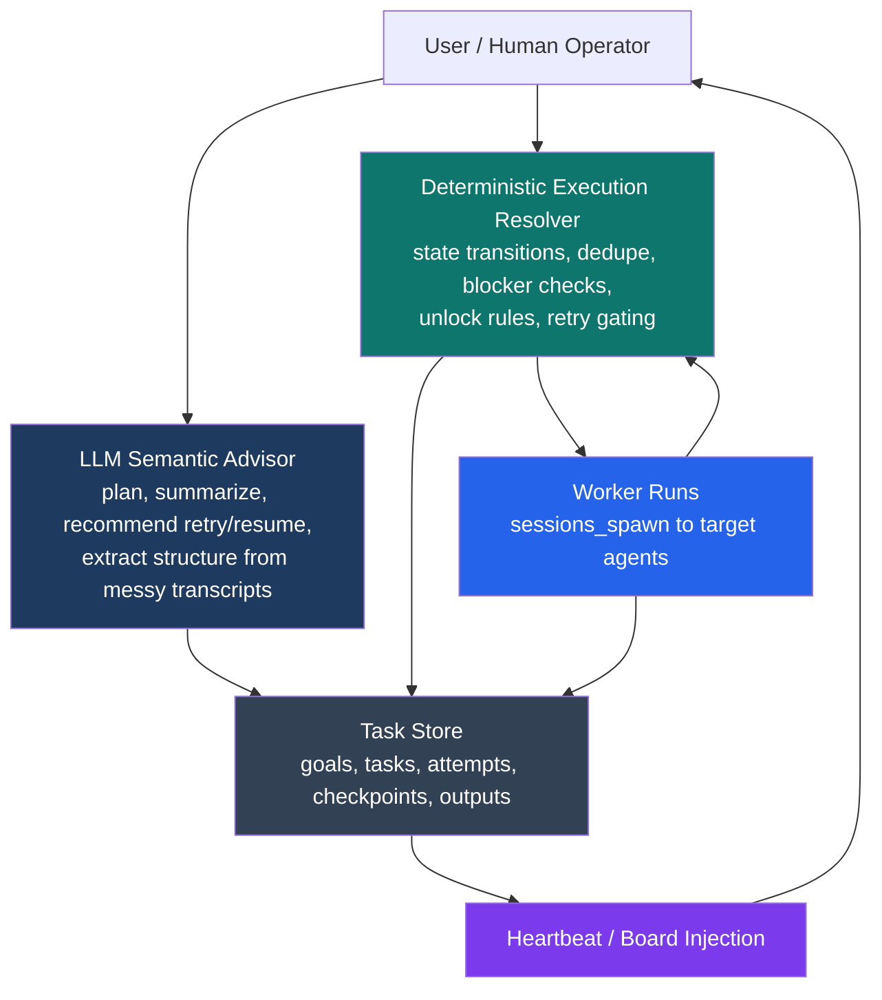

---

## 5. What Stays From the 2026-03-26 Design

These parts should be reused almost directly from the earlier proposal:

1. **Separate task store**
   - Correctly avoids overloading `SubagentRunRecord`
   - Supports cross-agent work and human-visible board state

2. **Goal/Task hierarchy**
   - Better than flat DAG-only design
   - Gives useful roll-up for stages and approval bottlenecks

3. **Deterministic execution resolver**
   - Correct direction for state transitions, dedupe, and gating
   - Should remain narrow and mechanical, not semantic

4. **Plugin-based implementation**
   - Validated by OpenClaw SDK surface: tool registration, hooks, heartbeat prompt injection, subagent runtime helpers

What changes is not the architecture foundation, but the reliability rules around execution, retries, and progress capture.

---

## 6. Single SOT Architecture

This document is intended to be the single source of truth for the plugin-only design.

### System Components

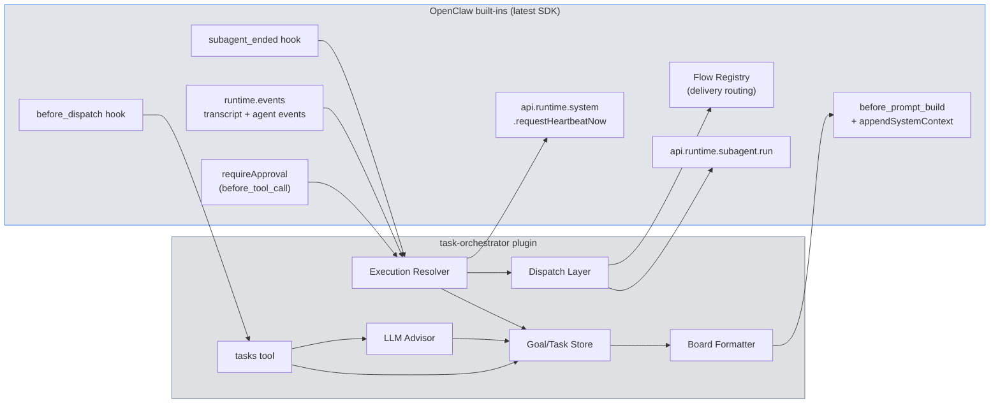

### Component Responsibilities

| Component | Responsibility | LLM? |
|---|---|---|
| `tasks` tool | human/agent interface for plan, board, checkpoint, handoff, retry | mixed |
| Goal/Task Store | persistence for goals, tasks, attempts, checkpoints, outputs | no |
| Execution Resolver | enforce state transitions and no-duplicate rules | no |
| LLM Advisor | planning, summarization, retry/resume recommendations, extraction | yes |
| Dispatch Layer | spawn target-agent work | no |
| Board Formatter | render visible state into heartbeat or user board | no |

---

## 7. Workflow Classes Covered by This Design

This architecture is intentionally general. It is not a YouTube-specific orchestration system.

It supports two first-class workflow patterns.

### Pattern A: Cross-Agent Workflow

Use this when responsibility moves across agents with different skills, personas, workspaces, or permissions.

Example shape:

```text
Agent A completes work
-> Agent B transforms or reviews it
-> Agent C publishes or communicates it
```

Typical uses:

- creator -> writer -> operations
- coder -> reviewer -> release manager
- researcher -> analyst -> publisher

### Pattern B: Agent-Internal Workflow

Use this when one specialist agent owns a larger objective that should still be broken into explicit stages, gates, and checkpoints.

Example shape:

```text
intake -> design -> approval -> execution -> assembly -> approval
```

Typical uses:

- media production
- multi-stage analysis
- document creation
- implementation + testing + packaging inside one specialist domain

### Key Architectural Claim

The same goal/task model should represent both patterns:

- a top-level goal may contain tasks assigned to different agents
- a sub-goal may represent staged work inside one agent domain
- both are tracked in the same store

### Visualization

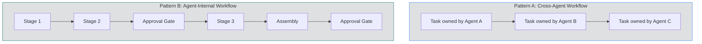

---

## 8. Refined Data Model

### 5.1 GoalRecord

Keep the existing `GoalRecord` concept from v4.

No major change needed, except:

- ensure goal status treats `completed + skipped` as terminal
- avoid a parent goal falling back to `pending` when children are actually done/skipped

### 5.2 TaskRecord

Keep the earlier shape, but narrow dispatch semantics and add attempt state.

```typescript
type TaskRecord = {
  id: string;
  parentId: string;
  name: string;
  task: string;
  blockedBy: string[];

  dispatch:
    | { mode: "spawn"; agentId: string; model?: string; thinking?: string; sandbox?: "inherit" | "require"; thread?: boolean }
    | { mode: "manual" }
    | { mode: "approval" }
    | { mode: "notify"; targetAgentId?: string; channel?: string }
    | { mode: "wake"; targetAgentId: string; reason?: string };

  status:
    | "pending"
    | "ready"
    | "dispatched"
    | "running"
    | "stalled"
    | "awaiting_approval"
    | "completed"
    | "failed"
    | "skipped";

  activeRunId?: string;
  activeSessionKey?: string;
  attemptCount: number;
  attempts: TaskAttemptRecord[];

  latestCheckpoint?: TaskCheckpointRecord;
  latestOutput?: TaskOutputRecord;

  priority: "low" | "normal" | "high" | "urgent";
  startedAt?: number;
  completedAt?: number;
  failureReason?: string;
  retryPolicy?: "manual_only";
  onUpstreamFailure: "skip" | "wait" | "continue";
};
```

### 5.3 Attempt Records

Do not overwrite prior runs.

```typescript
type TaskAttemptRecord = {
  attemptId: string;
  runId?: string;
  sessionKey?: string;
  status: "running" | "completed" | "failed" | "timeout" | "killed" | "stalled";
  startedAt: number;
  endedAt?: number;
  outputSummary?: string;
  failureReason?: string;
  transcriptPath?: string;
  artifactPaths?: string[];
};
```

### 5.4 Checkpoint Records

This is the key addition missing from v4.

```typescript
type TaskCheckpointRecord = {
  checkpointAt: number;
  phase: string;
  summary: string;
  artifactPaths?: string[];
  blocker?: string;
  progressPercent?: number;
  recommendedNextStep?: string;
};
```

### 5.5 Output / Handoff Record

```typescript
type TaskOutputRecord = {
  deliverableState: "partial" | "complete";
  summary: string;
  artifactPaths?: string[];
  blockingIssue?: string;
  recommendedNextStep?: string;
};
```

---

## 9. Reliability Rules

These are the real heart of the refined design.

### Rule 1: One Logical Task, Many Attempts

Never replace a task with a new task because of retry or stall.

- `create-video` remains the same logical task
- each run is an attempt under that task
- prior `runId`s remain as history

This prevents the system from "throwing away" previous work.

### Rule 2: At Most One Active Attempt Per Task

The scheduler must never spawn again if `activeRunId` already exists and the task is still `dispatched` or `running`.

This is the primary duplicate-prevention rule.

### Rule 3: Downstream Dispatch Happens Only Once Per Successful Edge

Dependents unlock only on a state transition:

`running -> completed`

Not because:

- time passed
- heartbeat saw no update
- user asked for status

This makes downstream assignment edge-triggered rather than polling-triggered.

### Rule 4: No Automatic Retry for Long Creative Tasks

For tasks like YouTube creation:

- timeout or stall should move task to `stalled` or `failed`
- retry should be explicit
- retry may be `restart` or `resume`

Do not auto-spawn a new creative run just because the old one appears slow.

### Rule 5: Completion Requires Structured Output

A spawned task cannot be treated as successful merely because the run ended.

It should complete only after one of:

1. the worker explicitly calls `tasks.handoff(...)`
2. the plugin extracts an acceptable terminal summary from the run transcript

If neither exists, mark it as `failed` or `needs_review`, not `completed`.

### Rule 6: Progress Should Be Captured Before Completion

Long-running tasks must checkpoint while running, not only at the end.

Without checkpoints, a stuck run can lose all distilled context.

---

## 10. Plugin Tool Surface

The v4 `goals` tool should be narrowed and strengthened.

### Proposed Tool: `tasks`

Actions:

- `run_goal`
- `plan_goal`
- `board`
- `checkpoint`
- `handoff`
- `approve`
- `reject`
- `retry`
- `claim`
- `notify`

### `tasks.checkpoint`

Used by a worker while still running.

```typescript
tasks.checkpoint({
  taskId: "create-video",
  phase: "render-started",
  summary: "Script finalized and assets assembled. Rendering has started.",
  artifactPaths: ["workspace/video/script_v3.md", "workspace/video/assets.json"],
  progressPercent: 70
})
```

### `tasks.handoff`

Used at terminal completion or controlled failure.

```typescript
tasks.handoff({
  taskId: "create-video",
  deliverableState: "complete",
  summary: "Final video exported and uploaded.",
  artifactPaths: ["workspace/video/final.mp4"],
  recommendedNextStep: "Writer should draft post from the final video and summary."
})
```

### Validation Rules

The plugin should reject weak task completion data.

Examples:

- `handoff` requires `summary`
- `handoff` requires `deliverableState`
- long-running task types may require `phase`
- completion may require artifact paths for configured task classes

This does not guarantee perfect reasoning, but it guarantees the system does not accept an empty handoff as success.

---

## 11. Resolver Behavior

### Event Sources

Use these authoritative plugin-visible signals:

1. `subagent_ended`
2. explicit tool calls: `checkpoint`, `handoff`, `approve`, `reject`, `retry`
3. heartbeat injection for visibility only
4. optional transcript / agent event listeners for observability and stall heuristics

### Execution Resolver vs LLM Advisor

The execution path should be explicitly split:

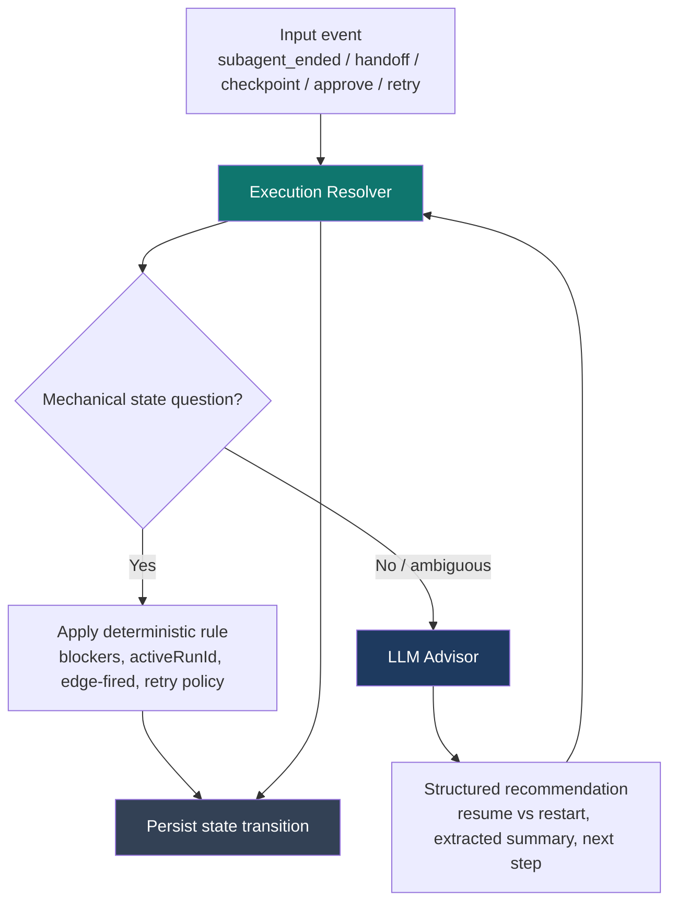

The LLM may return advice such as:

- "resume is better than restart"
- "this transcript implies script-complete and assets-prepared"
- "recommended next step is writer handoff"

But the execution resolver still enforces:

- only one active attempt
- no downstream unlock before success
- no retry unless policy allows it
- no duplicate edge firing

### Dispatch Logic

Uses the actual `SubagentRunParams` from the latest Plugin SDK:

```typescript
// Exact SDK type (src/plugins/runtime/types.ts):
// type SubagentRunParams = {
//   sessionKey: string;
//   message: string;
//   provider?: string;
//   model?: string;
//   extraSystemPrompt?: string;
//   lane?: string;
//   deliver?: boolean;
//   idempotencyKey?: string;   // <-- deduplication key
// };
// type SubagentRunResult = { runId: string };

async function dispatchTask(task: OrchestratorTaskRecord) {
  if (task.status !== "ready") return;
  if (task.activeRunId) return; // duplicate-prevention (Rule 2)
  if (task.dispatch.mode !== "spawn") return;

  const sessionKey = buildTaskSessionKey(task);
  const result = await api.runtime.subagent.run({
    sessionKey,
    message: buildTaskPrompt(task),
    deliver: false,                            // orchestrator controls delivery
    model: task.dispatch.model,
    extraSystemPrompt: buildTaskSystemPrompt(task), // inject checkpoint/handoff contract
    idempotencyKey: `orch-${task.id}-${task.attemptCount}`, // prevent double-spawn
  });

  const attempt = createAttempt(task, result.runId);
  task.activeRunId = result.runId;
  task.activeSessionKey = sessionKey;
  task.status = "running";
  task.attempts.push(attempt);
  persist();
}
```

### Completion Logic

Uses the actual `PluginHookSubagentEndedEvent` from the latest Plugin SDK:

```typescript
// Exact SDK type (src/plugins/types.ts):
// type PluginHookSubagentEndedEvent = {
//   targetSessionKey: string;
//   targetKind: "subagent" | "acp";
//   reason: string;
//   sendFarewell?: boolean;
//   accountId?: string;
//   runId?: string;
//   endedAt?: number;
//   outcome?: "ok" | "error" | "timeout" | "killed" | "reset" | "deleted";
//   error?: string;
// };

// Hook registration:
api.on("subagent_ended", async (event, ctx) => {
  await onSubagentEnded(event);
});

async function onSubagentEnded(event: PluginHookSubagentEndedEvent) {
  if (!event.runId) return;
  const task = store.findTaskByRunId(event.runId);
  if (!task) return;

  finalizeAttempt(task, event);

  if (event.outcome === "ok" && task.latestOutput) {
    task.status = "completed";
    task.activeRunId = undefined;
    task.activeSessionKey = undefined;
    resolveDependents(task);
    // Trigger heartbeat so orchestrating agent sees updated board
    api.runtime.system.requestHeartbeatNow({ reason: `task-completed:${task.id}` });
    persist();
    return;
  }

  if (event.outcome === "ok" && !task.latestOutput) {
    // Run ended cleanly but no structured handoff was written (Rule 5)
    task.status = "failed";
    task.failureReason = "Run ended without valid structured handoff";
    task.activeRunId = undefined;
    task.activeSessionKey = undefined;
    persist();
    return;
  }

  // Map SDK outcomes to orchestrator states
  task.status = event.outcome === "timeout" ? "stalled" : "failed";
  task.failureReason = event.error || event.reason || event.outcome || "unknown";
  task.activeRunId = undefined;
  task.activeSessionKey = undefined;
  api.runtime.system.requestHeartbeatNow({ reason: `task-${task.status}:${task.id}` });
  persist();
}
```

This avoids a dangerous anti-pattern:

- run ended
- no structured result
- scheduler still unblocks downstream

That must not happen.

---

## 12. Cross-Agent Example Flow

This example demonstrates the cross-agent pattern without making the design specific to any one domain.

### Example

```text
specialist-agent -> writer-agent -> operations-agent
```

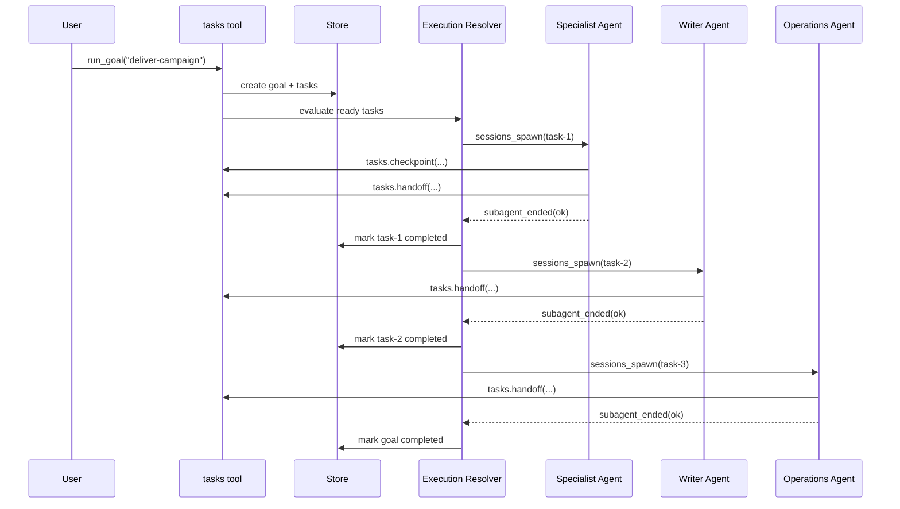

### Invariants

- downstream agent work starts only after upstream success
- each task has at most one active attempt
- retry belongs to the failed task, not the whole chain

---

## 13. Agent-Internal Workflow Example

This example demonstrates staged work inside one specialist domain.

The domain could be:

- media production
- document production
- implementation workflow
- research synthesis

### Example Shape

```text
intake
-> design
-> approval
-> execution
-> assembly
-> approval
```

### Visualization

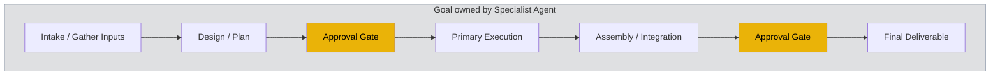

### Optional Multi-Worker Internal Parallelism

Inside a single agent-owned stage, some work can be parallelized with sub-workers.

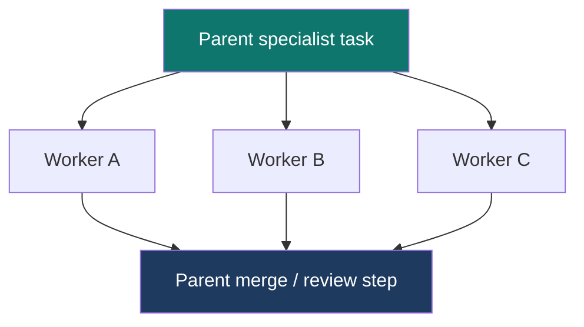

### Rules for Internal Parallelism

- use parallel workers only where outputs can be merged cleanly
- keep approvals and final assembly serialized
- leaf workers do not decide downstream unlocks
- parent task owns merge, review, and final handoff

This is how the same orchestration system covers both:

- external handoff between agents
- internal staged work inside one agent domain

---

## 14. Normal Execution Flow

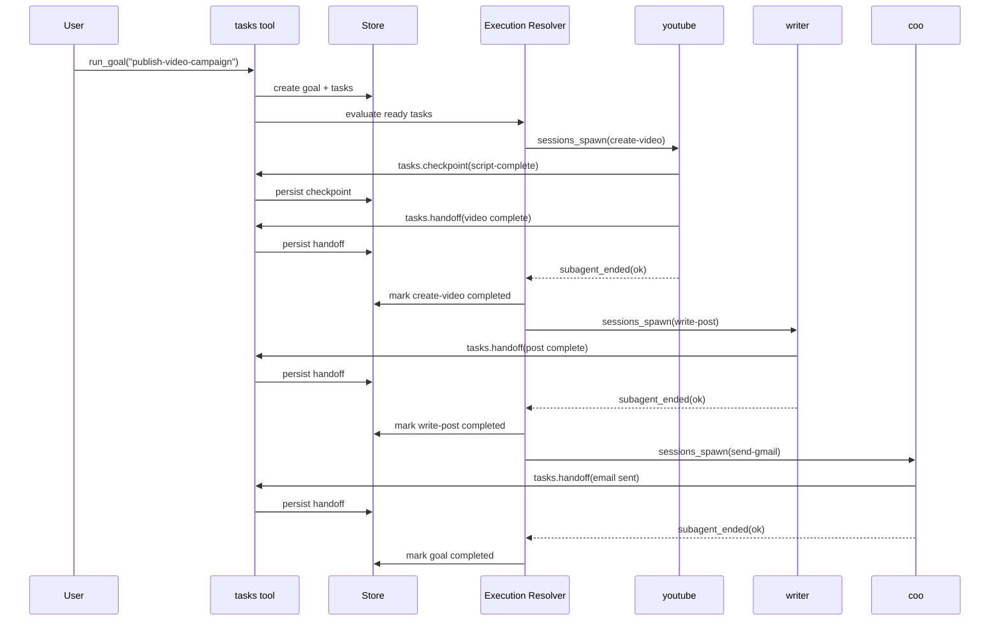

---

## 15. Checkpointing Strategy

### Why It Is Needed

A final handoff contract is not enough for long-running tasks.

If `youtube` stalls before completion, the plugin still needs:

- latest completed phase
- partial artifacts
- summary of progress
- best-known blocker

### Plugin-Only Feasibility

This can be done without core changes by:

1. giving workers a `tasks.checkpoint` tool
2. storing checkpoints in plugin state
3. optionally watching transcript updates or agent events for liveness

### Recommended Task Prompts

For long-running task classes, inject an explicit operating contract:

1. Start work
2. After each major milestone, call `tasks.checkpoint`
3. At completion, call `tasks.handoff`
4. If blocked, checkpoint the blocker before stopping

This is still cooperative, but much stronger than relying on memory or a final freeform answer.

### Suggested Milestones for YouTube

- `research-complete`
- `script-complete`
- `assets-prepared`
- `edit-started`
- `render-started`
- `exported`

---

## 16. Stall Detection

### Goal

Detect "still in progress but maybe stuck" without causing duplicate work.

### Signal Sources

Use plugin-visible signals only:

- latest checkpoint time
- transcript update time
- agent event activity
- run timeout / `subagent_ended outcome=timeout`

### State Semantics

- `running`: active run with recent activity
- `stalled`: active run had no progress signal for a configured threshold, or timed out
- `failed`: terminal failure

### Crucial Safety Rule

Heartbeat may mark a task as `stalled`.

Heartbeat may notify the user or wake an orchestrator.

Heartbeat must **not** auto-spawn a replacement run for high-cost tasks.

This is how we prevent "crazy repeated assignment."

---

## 17. Stall and Resume Flow

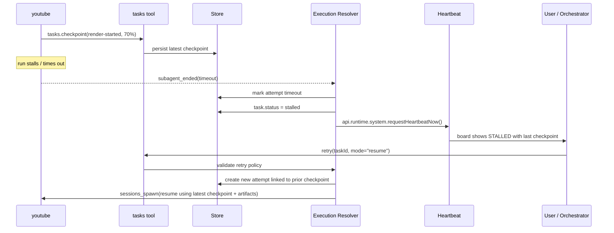

### No-Duplicate Guarantee

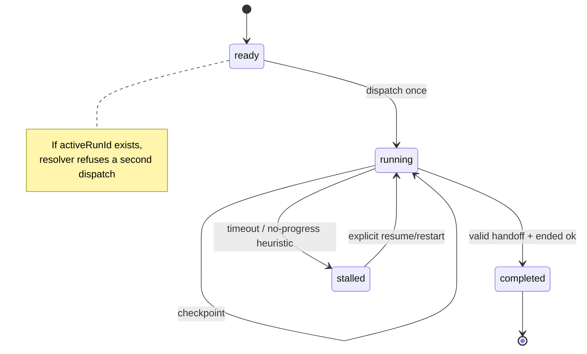

---

## 18. Human Intervention and Retry

### Retry Modes

Retries must be explicit and modeful:

- `restart`
- `resume`

### `restart`

- create a new attempt
- prior attempts remain history
- no prior progress is assumed valid

### `resume`

- create a new attempt
- inject latest checkpoint + artifacts + prior output summary into the new prompt
- tell the agent exactly what previous progress exists

### Example Resume Prompt Fragment

```text
Previous attempt summary:
- Phase reached: render-started
- Latest checkpoint: script and assets complete
- Artifacts:
  - workspace/video/script_v3.md
  - workspace/video/assets.json
- Failure mode: timed out during render

Resume from this state if possible. Do not restart from scratch unless the existing artifacts are unusable.
```

This is not perfect, but it is materially better than starting blind.

---

## 19. Example Mapping Guide

To apply this design, decide first which workflow class you are modeling.

### If the work crosses agents

Model it as:

- one top-level goal
- leaf tasks assigned to different agents
- dependencies between those tasks

### If the work stays inside one specialist domain

Model it as:

- one agent-owned sub-goal
- explicit stages, checkpoints, and approvals
- optional parallel worker tasks where appropriate

### If both happen together

Use nested goals:

- top-level goal for cross-agent flow
- sub-goal inside one agent domain for internal workflow

That is the intended general model.

---

## 20. Recommended Workflow for the Example Chain

### Goal: Publish Video Campaign

Children:

1. `create-video` -> `spawn(agentId: "youtube")`
2. `write-post` -> `spawn(agentId: "writer")`, blocked by `create-video`
3. `send-gmail` -> `spawn(agentId: "coo")`, blocked by `write-post`

### Execution Rules

#### `create-video`

- long-running
- checkpoint required
- retry policy: manual only
- no auto retry

#### `write-post`

- shorter
- final handoff required
- may use video output summary + artifacts from `create-video`

#### `send-gmail`

- shorter
- final handoff required
- may include generated post path and summary from `write-post`

### What the User Sees on the Board

```text
Goal: Publish Video Campaign

RUNNING   create-video   owner=youtube   phase=render-started   last checkpoint=18m ago
PENDING   write-post     owner=writer    blocked by=create-video
PENDING   send-gmail     owner=coo       blocked by=write-post
```

If YouTube stalls:

```text
Goal: Publish Video Campaign

STALLED   create-video   owner=youtube   last checkpoint=1h 12m ago
PENDING   write-post     owner=writer    blocked by=create-video
PENDING   send-gmail     owner=coo       blocked by=write-post
```

No duplicate writer or COO assignment occurs, because downstream unlock happens only on successful completion.

---

## 21. Board and Visibility Model

The board should be the operational surface for both humans and heartbeats.

### Board States

- `pending`: blocked by upstream
- `ready`: can dispatch now
- `running`: active attempt in progress
- `stalled`: active attempt timed out or has no progress signal
- `awaiting_approval`: needs human decision
- `completed`: valid handoff accepted
- `failed`: terminal failure without acceptable completion contract
- `skipped`: downstream skipped due to upstream policy

### Board Rendering Flow

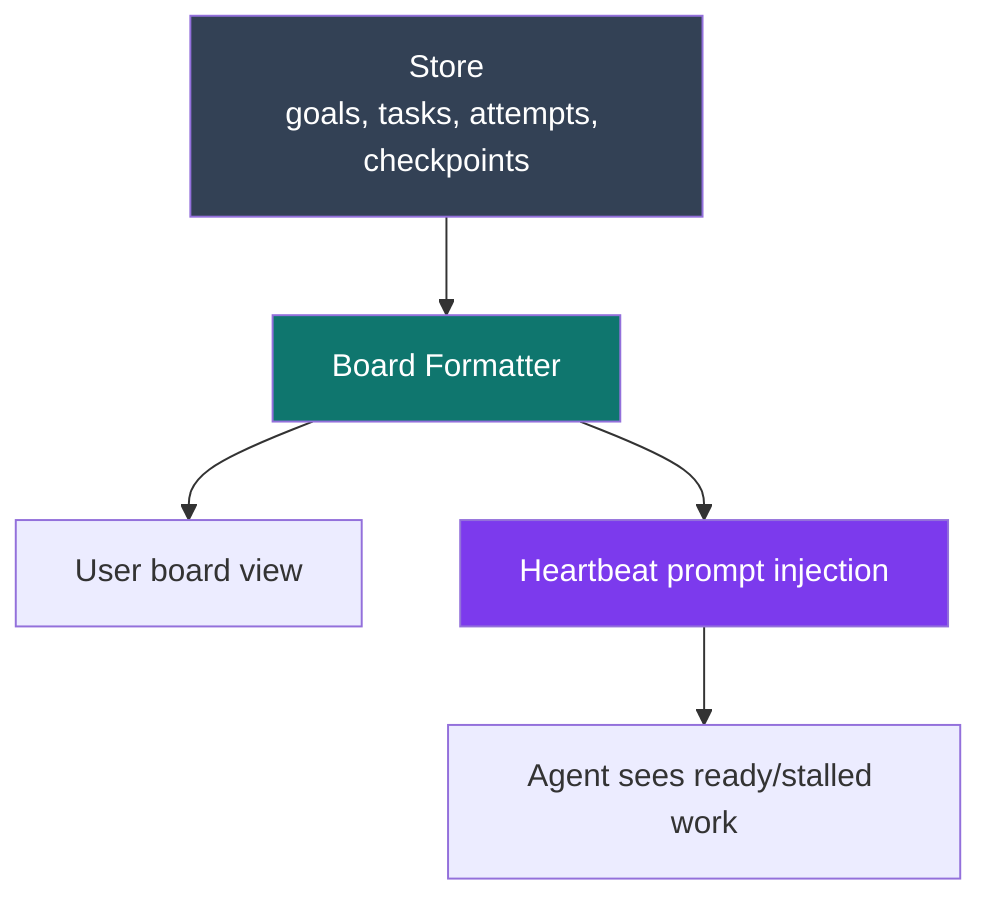

---

## 22. What OpenClaw Already Gives Us (Updated Post-Rebase)

This refined design intentionally leans on built-in OpenClaw strengths. After the 2026-03-30 rebase, the SDK surface is richer than the original proposal assumed.

### Core Primitives (unchanged, still foundational)

1. **`api.runtime.subagent.run(params)`** for isolated background work
   - `sessionKey`, `message`, `provider?`, `model?`, `extraSystemPrompt?`, `deliver?`, `idempotencyKey?`
   - Cross-agent spawn uses the target agent workspace
   - Returns `{ runId }` for tracking
2. **`subagent_ended` hook** as a reliable completion signal
   - `outcome`: `"ok" | "error" | "timeout" | "killed" | "reset" | "deleted"`
   - Includes `runId`, `targetSessionKey`, `error`, `endedAt`
3. **`before_prompt_build` + `appendSystemContext`** for board injection into agent system prompt
4. **`api.runtime.subagent.waitForRun(params)`** for blocking wait with timeout
5. **`api.runtime.subagent.getSessionMessages(params)`** for transcript inspection
6. **`api.runtime.events.onAgentEvent`** and **`onSessionTranscriptUpdate`** for observability

### New Primitives (landed in this rebase)

7. **`before_dispatch` hook** — intercept incoming messages before agent dispatch
   - Plugin can claim messages (e.g., "board", "status", "retry") and reply directly
   - Returns `{ handled: boolean; text?: string }`
8. **`requireApproval` in `before_tool_call`** — gate tool execution with user approval
   - Structured approval UI: `title`, `description`, `severity`
   - Configurable timeout behavior (`allow` or `deny`)
   - Resolution callback: `onResolution(decision)` with `"allow-once" | "allow-always" | "deny" | "timeout" | "cancelled"`
   - Directly usable for our `dispatch.mode: "approval"` task type
9. **`api.runtime.system.requestHeartbeatNow(opts)`** — trigger immediate heartbeat
   - **Correction:** this IS exposed to plugins via `api.runtime.system`
   - Accepts `{ reason?, agentId?, sessionKey?, coalesceMs? }`
   - Use after task state transitions to wake the orchestrating agent
10. **`api.runtime.system.runHeartbeatOnce(opts)`** — run a full heartbeat cycle immediately
    - Can override heartbeat config (e.g., `{ target: "last" }` for delivery to last active channel)
11. **Flow Registry** — lightweight SQLite-backed goal containers
    - `FlowRecord` with `flowId`, `ownerSessionKey`, `status`, `goal`, `notifyPolicy`
    - Auto-creates flows for spawned tasks; syncs flow status from task lifecycle
    - **One-Task Emergence:** routes child output through parent flow's delivery context
    - Useful for audit trail and delivery routing, not orchestration logic
12. **`before_install` hook** — security scanning for skill/plugin installs (not relevant to orchestration)

### Leveraging New Primitives

| New Feature | How Our Orchestrator Uses It |
|---|---|
| `before_dispatch` | Route "board", "status <taskId>", "retry <taskId>" commands directly to orchestrator |
| `requireApproval` | Implement `dispatch.mode: "approval"` without custom approval UI |
| `requestHeartbeatNow` | Wake orchestrating agent after task completion/failure/stall |
| Flow emergence | Let built-in handle delivery routing for spawned tasks |
| `idempotencyKey` | Pass `orch-{taskId}-{attemptN}` to prevent double-spawn |

This means the plugin is using OpenClaw's strongest primitives rather than fighting the framework, and the new hooks reduce implementation scope for approval gates, message routing, and heartbeat waking.

---

## 23. What OpenClaw Does Not Give Us Natively (Updated)

Even with the latest SDK, OpenClaw does **not** provide these out of the box:

1. **Dependency graph with `blockedBy` edges** — built-in `TaskRecord` has `parentTaskId` but no dependency-driven unlock logic
2. **Deterministic execution resolver** — no built-in state machine for blocker checks, dedupe gating, or edge-triggered downstream dispatch
3. **Attempt history under one logical task** — built-in overwrites task state; no append-only attempt records
4. **Structured progress checkpoints** — built-in has `progressSummary` (a single string), not structured `{ phase, artifacts, progressPercent }`
5. **Structured handoff validation** — built-in has `terminalSummary` (a string), no required fields or rejection of empty handoffs
6. **Retry semantics (`restart` vs `resume`)** — no built-in concept of resume-from-checkpoint with artifact injection
7. **Stall detection heuristics** — built-in marks `lost` via `cleanupAfter` timeout, but no active checkpoint-age-based stall detection
8. **LLM semantic advisor** — no built-in planning, recovery recommendation, or transcript-to-structure extraction

**Previously listed as gaps, now resolved:**

- ~~Heartbeat triggering from plugins~~ — `api.runtime.system.requestHeartbeatNow` is available
- ~~Approval gating~~ — `requireApproval` hook handles this
- ~~Message routing to orchestrator~~ — `before_dispatch` hook handles this

The remaining gaps are exactly what this plugin fills: the orchestration logic layer on top of OpenClaw's strong execution primitives.

---

## 24. Plugin-Only Feasibility Assessment (Updated)

### Can be done without core changes (confirmed with latest SDK)

- Goal/task store (own SQLite schema)
- Deterministic execution resolver
- `spawn`-based orchestration via `api.runtime.subagent.run` with `idempotencyKey`
- Board injection via `before_prompt_build` + `appendSystemContext`
- Heartbeat waking via `api.runtime.system.requestHeartbeatNow` (confirmed plugin-exposed)
- Structured checkpoints and handoffs (own `tasks` tool)
- Attempt history (own persistence)
- Duplicate-prevention with `activeRunId` + `idempotencyKey`
- Stall detection via `onSessionTranscriptUpdate` + checkpoint age heuristics
- Manual retry/resume with checkpoint injection via `extraSystemPrompt`
- LLM-assisted recovery and semantic extraction
- Approval gates via `requireApproval` in `before_tool_call` (no custom UI)
- Direct command routing via `before_dispatch` hook
- Delivery routing via built-in Flow Registry emergence

### Cannot be perfectly guaranteed without core changes

- Forcing every worker to checkpoint before it gets stuck
- Guaranteeing the model interprets injected resume context correctly
- Extracting perfect structured state from arbitrary freeform transcript text when no checkpoint/handoff was written

So the plugin can make the workflow **much more reliable**, but not mathematically perfect.

That is still a worthwhile improvement because the current pain is operational, not theoretical.

---

## 25. Recommended Implementation Phases (Updated)

### Phase 1: Safe Core

- Goal/task store (own SQLite schema)
- Board rendering via `before_prompt_build` + `appendSystemContext`
- `spawn`-only execution via `api.runtime.subagent.run` with `idempotencyKey`
- Deterministic execution resolver with `activeRunId` duplicate-prevention
- `subagent_ended` hook wired to resolver
- `requestHeartbeatNow` after state transitions

### Phase 2: Structured Reliability

- `tasks.handoff` tool action with required completion fields
- Attempt history (append-only `TaskAttemptRecord[]`)
- Retry with `restart` and `resume` (inject checkpoint into `extraSystemPrompt`)
- LLM advisor for transcript-to-structure extraction and retry recommendation
- `getSessionMessages` for transcript inspection on ambiguous completions

### Phase 3: Long-Run Safety

- `tasks.checkpoint` tool action
- Checkpoint-required task classes
- Stall detection heuristics (checkpoint age + `onSessionTranscriptUpdate` liveness)
- `runHeartbeatOnce` for immediate board delivery on stall

### Phase 4: Coordination Helpers

- Approval gates via `requireApproval` in `before_tool_call` (no custom UI needed)
- `before_dispatch` hook for routing board/status/retry commands directly to orchestrator
- Flow Registry integration for delivery routing and audit trail
- Notifications and wake-on-ready
- Cron as task producer / reminder, not execution truth source

---

## 26. Final Recommendation

Do **not** build the full original "all dispatch modes are equal" scheduler first.

Instead:

1. keep the task store
2. keep the goal/task hierarchy
3. keep the deterministic execution resolver for state transitions
4. narrow reliable execution to `sessions_spawn`
5. add an LLM advisor for planning, extraction, and recovery recommendations
6. add checkpoints and attempt history for long-running tasks
7. forbid automatic blind retry for creative work like YouTube production

This is the strongest plugin-only architecture that matches OpenClaw's real extension surface and directly addresses the pain points raised in discussion:

- lost cross-agent handoff
- manual nudging for updates
- stalled long-running tasks
- repeated assignment
- partial-progress loss

It preserves the best parts of the 2026-03-26 design while making the system operationally safer.

---

## Appendix A: Built-in Feature Analysis (2026-03-30 Rebase)

> **Context:** After rebasing onto `origin/main` (30 new remote commits), three new plugin hooks and two new built-in task/flow features landed. This appendix evaluates whether they replace, overlap with, or complement this custom orchestrator design.

### A.1 New Built-in Features Inventory

#### Flow Registry (commit `7590c22db7`)

A lightweight, SQLite-backed parent record system for grouping related tasks under a shared "flow."

```typescript
type FlowRecord = {
  flowId: string;
  ownerSessionKey: string;
  status: "queued" | "running" | "waiting" | "blocked" | "succeeded" | "failed" | "cancelled" | "lost";
  goal: string;
  currentStep?: string;
  notifyPolicy: "done_only" | "state_changes" | "silent";
  requesterOrigin?: { channel; to; threadId; ... };
  createdAt: number;
  updatedAt: number;
  endedAt?: number;
};
```

API: `createFlowRecord`, `createFlowForTask`, `getFlowById`, `listFlowRecords`, `updateFlowRecordById`, `syncFlowFromTask`, `deleteFlowRecordById`.

**Assessment:** Flows are flat, single-goal containers. No dependency graph, no task-to-task blocking, no attempt history. Useful for delivery routing and audit trail, not orchestration.

#### One-Task Emergence (commit `9d9cf0d8ff`)

Routes detached subagent task outputs back through the parent flow's owner context. When a task has a `parentFlowId`, its delivery uses `flow.ownerSessionKey` and `flow.requesterOrigin` instead of the child's own session.

**Assessment:** Solves "where does the reply go?" automatically. Our orchestrator can leverage this for free delivery routing instead of re-implementing it.

#### `requireApproval` in `before_tool_call` (commit `6ade9c474c`)

```typescript
requireApproval?: {
  title: string;
  description: string;
  severity?: "info" | "warning" | "critical";
  timeoutMs?: number;
  timeoutBehavior?: "allow" | "deny";
  pluginId?: string;
  onResolution?: (decision: PluginApprovalResolution) => Promise<void> | void;
};
// Resolutions: "allow-once" | "allow-always" | "deny" | "timeout" | "cancelled"
```

**Assessment:** Directly usable for our `dispatch.mode: "approval"` task type. Instead of building custom approval UI, we can gate tool execution through this hook and receive structured resolution callbacks.

#### `before_dispatch` Hook

```typescript
type PluginHookBeforeDispatchEvent = {
  content: string;
  body?: string;
  channel?: string;
  sessionKey?: string;
  senderId?: string;
  isGroup?: boolean;
  timestamp?: number;
};
type PluginHookBeforeDispatchResult = {
  handled: boolean;
  text?: string;
};
```

**Assessment:** Allows our plugin to intercept incoming messages before agent dispatch. Useful for routing "board", "status", "retry" commands directly to the orchestrator without the agent needing to interpret them.

#### `before_install` Hook

Security/policy hook for skill/plugin installation scanning. Can block installs or add findings.

**Assessment:** Not relevant to task orchestration. Useful for security plugins only.

#### Built-in Task Record (existing, enhanced)

```typescript
type TaskRecord = {
  taskId: string;
  runtime: "subagent" | "acp" | "cli" | "cron";
  status: "queued" | "running" | "succeeded" | "failed" | "timed_out" | "cancelled" | "lost";
  requesterSessionKey: string;
  parentFlowId?: string;        // NEW: links to flow
  parentTaskId?: string;        // nested hierarchy
  childSessionKey?: string;
  agentId?: string;
  runId?: string;
  progressSummary?: string;     // single string, not structured
  terminalSummary?: string;
  terminalOutcome?: "succeeded" | "blocked";
  // ... timestamps, delivery, cleanup
};
```

**Assessment:** Provides raw task state but lacks: `blockedBy` dependency edges, attempt history, structured checkpoints, handoff validation, retry semantics.

#### Runtime APIs (confirmed available)

| API | Status | Notes |
|-----|--------|-------|
| `runtime.subagent.run(params)` | Available | Spawn with provider/model override, idempotencyKey, deliver flag |
| `runtime.subagent.waitForRun(params)` | Available | Blocking wait with timeout |
| `runtime.subagent.getSessionMessages(params)` | Available | Transcript inspection |
| `runtime.subagent.deleteSession(params)` | Available | Cleanup |
| `subagent_ended` hook | Available | Outcome: ok/error/timeout/killed/reset/deleted |
| `api.runtime.system.requestHeartbeatNow(opts)` | **Available** | Exposed via `PluginRuntimeCore.system`; accepts `{ reason?, agentId?, sessionKey?, coalesceMs? }` |
| `api.runtime.system.runHeartbeatOnce(opts)` | **Available** | Full heartbeat cycle; can override config (e.g., `{ target: "last" }`) |
| `api.runtime.events.onAgentEvent` | Available | Subscribe to agent lifecycle events |
| `api.runtime.events.onSessionTranscriptUpdate` | Available | Subscribe to transcript changes (useful for stall heuristics) |

### A.2 Gap Analysis: Built-in vs This Design

| Capability | Built-in Provides | This Design Requires | Gap? |
|---|---|---|---|
| Task persistence | SQLite `TaskRecord` | SQLite with richer schema | **Yes** -- need `blockedBy`, attempts, checkpoints |
| Goal/flow grouping | `FlowRecord` (flat) | Nested goal hierarchy with sub-goals | **Yes** -- flows are single-level |
| Dependency graph | None | `blockedBy: string[]` with edge-triggered unlock | **Yes** -- core differentiator |
| Execution resolver | None | Deterministic state machine for dedupe/gating | **Yes** -- core differentiator |
| Duplicate prevention | None | `activeRunId` guard, one-attempt-per-task rule | **Yes** |
| Attempt history | Overwrites state | Append-only `TaskAttemptRecord[]` | **Yes** |
| Checkpoints | `progressSummary` (string) | Structured `TaskCheckpointRecord` with phase/artifacts | **Yes** |
| Handoff validation | `terminalSummary` (string) | Required fields: `deliverableState`, `summary`, `artifactPaths` | **Yes** |
| Retry semantics | None | `restart` vs `resume` with checkpoint injection | **Yes** |
| Stall detection | `lost` via `cleanupAfter` timeout | Active heuristics from checkpoint age + transcript activity | **Yes** |
| LLM advisor | None | Planning, extraction, recovery recommendations | **Yes** |
| Board injection | `requestHeartbeatNow` (plugin-exposed via `api.runtime.system`) + `appendSystemContext` | `before_prompt_build` + `appendSystemContext` + heartbeat wake | **Partial** -- board content is plugin-owned, but heartbeat triggering is built-in |
| Approval gates | `requireApproval` hook | `dispatch.mode: "approval"` | **No** -- can use built-in |
| Delivery routing | Flow emergence | Cross-agent reply routing | **No** -- can use built-in |
| Subagent lifecycle | `runtime.subagent.*` + `subagent_ended` | Spawn, wait, detect completion | **No** -- can use built-in |
| Message interception | `before_dispatch` hook | Route board/status commands to orchestrator | **No** -- can use built-in |

### A.3 Integration Recommendations

Build the custom orchestrator as designed, but leverage new built-in features to reduce implementation surface:

| Orchestrator Component | Strategy |
|---|---|
| **Task Store** | Own SQLite schema. Built-in `TaskRecord` lacks required fields. |
| **Goal Hierarchy** | Own implementation. `FlowRecord` is too flat for nested goals. |
| **Execution Resolver** | Own implementation. No built-in equivalent. |
| **LLM Advisor** | Own implementation. No built-in equivalent. |
| **Dispatch Layer** | Use `runtime.subagent.run`. Already planned. |
| **Completion Detection** | Use `subagent_ended` hook. Provides `outcome`, `runId`, `error`. |
| **Approval Gates** | Use `requireApproval` hook for `dispatch.mode: "approval"` tasks. Eliminates custom approval UI. |
| **Message Routing** | Use `before_dispatch` to intercept board/status/retry commands before agent dispatch. |
| **Delivery Routing** | Let built-in flow emergence handle reply routing for spawned tasks. Optionally create `FlowRecord` entries for audit trail. |
| **Board Injection** | Use `before_prompt_build` + `appendSystemContext` (same pattern as proactive-learning v3.2). Trigger via `api.runtime.system.requestHeartbeatNow` after state transitions. |
| **Checkpoint / Handoff** | Own `tasks` tool registration with `checkpoint` and `handoff` actions. |

### A.4 Conclusion

The new built-in features are **infrastructure scaffolding**, not an orchestration system. They solve delivery routing, raw task status tracking, and tool-level approval gating. They do **not** solve the core pain points this design addresses:

- Dependency-driven task unlocking
- Duplicate-prevention across attempts
- Checkpoint-based stall detection and resume
- Structured handoff validation
- Cross-agent workflow chains with edge-triggered downstream dispatch

**Verdict: proceed with custom plugin implementation.** Use built-in hooks (`requireApproval`, `before_dispatch`, `subagent_ended`, flow emergence, `requestHeartbeatNow`, `idempotencyKey`) to reduce scope, but the orchestrator's core value -- the execution resolver, dependency graph, attempt history, and checkpoint/handoff contracts -- must be plugin-owned.

> **Note:** Initial analysis incorrectly stated `requestHeartbeatNow` was not plugin-exposed. It IS available via `api.runtime.system.requestHeartbeatNow(opts)` and `api.runtime.system.runHeartbeatOnce(opts)`. This simplifies Phase 1 and Phase 3 of the implementation plan.
