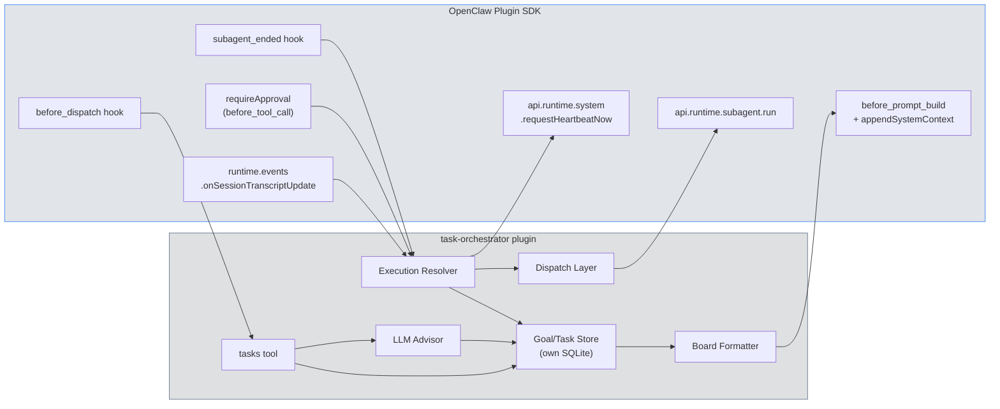
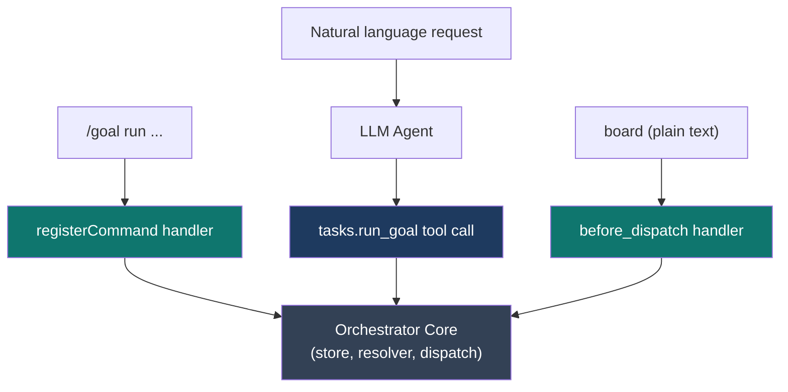
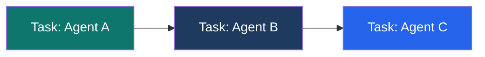
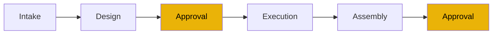
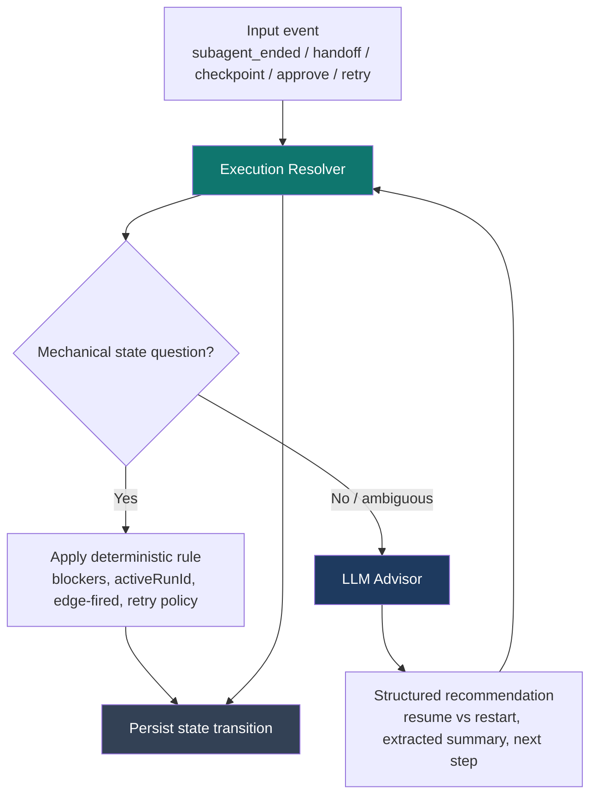
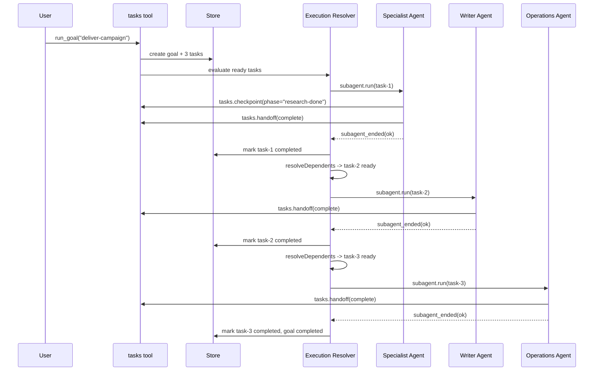
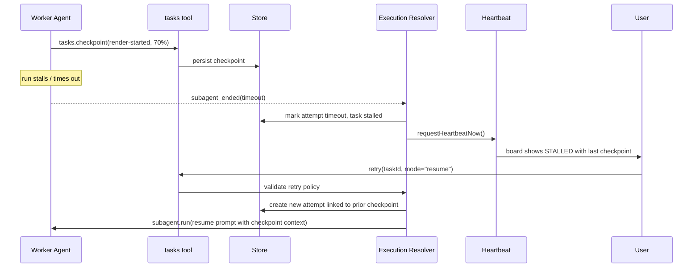
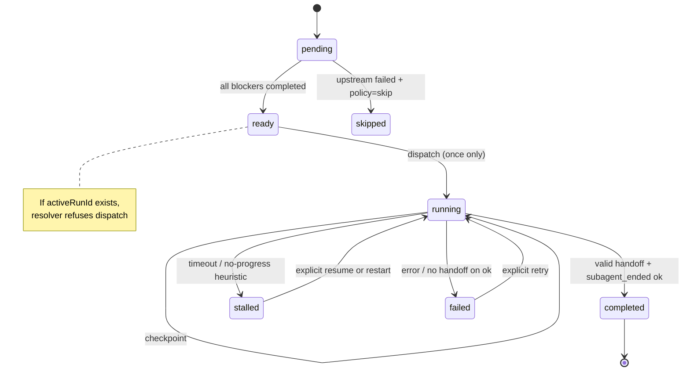

# Task Orchestrator Plugin for OpenClaw

> **Date:** 2026-03-30
> **Status:** Implementation-ready design
> **Scope:** Plugin-only — no OpenClaw core changes required
> **Runtime:** OpenClaw Plugin SDK (latest, verified 2026-03-30)

---

## 1. The Problem

Multi-agent systems built on OpenClaw suffer from five operational pain points that compound as workflow complexity grows.

### Pain Point A: Cross-Agent Handoff Gets Lost

A typical production chain looks like:

```text
specialist-agent finishes work -> writer-agent drafts content -> operations-agent publishes
```

Today this uses `sessions_send`, which creates message delivery but not a durable work item. If the receiving session is idle or the chain loses momentum, the operator must manually nudge:

- "what's the update?"
- "did writer finish?"
- "operations, please continue"

There is no authoritative signal that work crossed the boundary, no persistent record of the handoff, and no automatic downstream dispatch.

### Pain Point B: Long-Running Tasks Stall Silently

A specialist agent may work for extended periods (media production, deep research, complex implementation). If it stalls or times out:

1. No structured progress record exists
2. The system cannot distinguish "working slowly" from "stuck"
3. A naive scheduler may spawn a duplicate attempt
4. Downstream agents may be assigned work before the upstream actually finished

### Pain Point C: Progress Is Lost When Runs Fail

If the system depends only on a final "handoff summary" and the agent never gets to write one, all intermediate progress is lost. The next attempt starts from scratch even when 70% of the work was already done.

### Pain Point D: Duplicate Downstream Assignment

Without edge-triggered state transitions, heartbeat polling or user status queries can accidentally unlock downstream work multiple times. This leads to duplicate agent-to-agent assignments and wasted compute.

### Pain Point E: Agent-Internal Workflows Are Invisible

Not all orchestration is cross-agent. A single specialist may have a multi-stage internal workflow (intake, design, approval, execution, assembly). Without explicit structure, these stages are invisible, fragile, and impossible to resume after failure.

---

## 2. Core Insights

### Insight 1: Spawn Is the Only Reliable Execution Primitive

`sessions_spawn` (exposed as `api.runtime.subagent.run`) is the only execution backend that provides:

- An isolated agent session with the target agent's own workspace/persona/instructions
- A real completion signal via the `subagent_ended` hook
- A `runId` for tracking

By contrast:

- `sessions_send` is routed messaging, not durable task execution
- `wake` is an attention signal, not proof of work
- `cron` produces events, not task completion guarantees

**Decision:** treat `spawn` as the sole authoritative execution backend. Everything else is a coordination helper.

### Insight 2: Deterministic Resolver + LLM Advisor

Pure deterministic scheduling is too rigid for real workflows. Pure LLM scheduling sacrifices idempotency and duplicate-prevention.

The right split:

- **Deterministic execution resolver** handles state transitions, blocker checks, dedupe, edge-triggered unlock, and retry gating. No LLM.
- **LLM semantic advisor** handles goal decomposition, retry/resume recommendations, transcript extraction, and ambiguous recovery. Structured output only.

The LLM may **advise**. The resolver decides whether the state machine **allows** it.

### Insight 3: Checkpoints Before Completion

A final handoff contract is insufficient for long-running tasks. If the agent stalls before completion, the orchestrator needs:

- Latest completed phase
- Partial artifacts produced so far
- Summary of progress
- Known blockers

Checkpoints must be written **during** execution, not only at the end.

### Insight 4: One Task, Many Attempts

Never replace a failed task with a new task. Each retry is an attempt under the same logical task. Prior `runId`s, checkpoints, and artifacts remain as history. This prevents the system from discarding previous work and enables resume-from-checkpoint.

---

## 3. Architecture

### System Components



### Component Responsibilities

| Component | Responsibility | LLM? |
|---|---|---|
| `tasks` tool | Agent/human interface for plan, board, checkpoint, handoff, retry | Mixed |
| Goal/Task Store | Persistence for goals, tasks, attempts, checkpoints, outputs | No |
| Execution Resolver | Enforce state transitions, dedupe, blocker checks, unlock rules | No |
| LLM Advisor | Planning, summarization, retry/resume recommendations, extraction | Yes |
| Dispatch Layer | Spawn target-agent work via `api.runtime.subagent.run` | No |
| Board Formatter | Render visible state into heartbeat prompt or user board view | No |

---

## 4. Plugin SDK Surface Used

All types verified from source on 2026-03-30.

### 4.1 Subagent Spawn and Lifecycle

```typescript
// api.runtime.subagent.run — spawn isolated agent work
type SubagentRunParams = {
  sessionKey: string;          // target session identifier
  message: string;             // task prompt
  provider?: string;           // override provider
  model?: string;              // override model
  extraSystemPrompt?: string;  // inject checkpoint/handoff contract
  lane?: string;               // execution lane
  deliver?: boolean;           // whether to deliver result back
  idempotencyKey?: string;     // deduplication key
};
type SubagentRunResult = { runId: string };

// api.runtime.subagent.waitForRun — blocking wait
type SubagentWaitParams = { runId: string; timeoutMs?: number };
type SubagentWaitResult = { status: "ok" | "error" | "timeout"; error?: string };

// api.runtime.subagent.getSessionMessages — transcript inspection
type SubagentGetSessionMessagesParams = { sessionKey: string; limit?: number };
type SubagentGetSessionMessagesResult = { messages: unknown[] };

// api.runtime.subagent.deleteSession — cleanup
type SubagentDeleteSessionParams = { sessionKey: string; deleteTranscript?: boolean };
```

### 4.2 Subagent Completion Hook

```typescript
// api.on("subagent_ended", handler)
type PluginHookSubagentEndedEvent = {
  targetSessionKey: string;
  targetKind: "subagent" | "acp";
  reason: string;
  sendFarewell?: boolean;
  accountId?: string;
  runId?: string;
  endedAt?: number;
  outcome?: "ok" | "error" | "timeout" | "killed" | "reset" | "deleted";
  error?: string;
};
```

### 4.3 System Prompt Injection

```typescript
// api.on("before_prompt_build", handler)
type PluginHookBeforePromptBuildEvent = {
  prompt: string;
  messages: unknown[];
};
type PluginHookBeforePromptBuildResult = {
  systemPrompt?: string;
  prependContext?: string;
  prependSystemContext?: string;
  appendSystemContext?: string;  // append to system prompt (cacheable)
};
```

### 4.4 Message Interception

```typescript
// api.on("before_dispatch", handler)
type PluginHookBeforeDispatchEvent = {
  content: string;        // full message text
  body?: string;          // body after command parsing
  channel?: string;       // "telegram", "discord", etc.
  sessionKey?: string;
  senderId?: string;
  isGroup?: boolean;
  timestamp?: number;
};
type PluginHookBeforeDispatchResult = {
  handled: boolean;       // if true, skip default agent dispatch
  text?: string;          // plugin-defined reply when handled=true
};
```

**Use:** intercept "board", "status", "retry" commands and handle them in the plugin, bypassing the LLM entirely.

### 4.5 Tool Approval Gate

```typescript
// Part of api.on("before_tool_call", handler) result
type PluginHookBeforeToolCallResult = {
  params?: Record<string, unknown>;
  block?: boolean;
  blockReason?: string;
  requireApproval?: {
    title: string;
    description: string;
    severity?: "info" | "warning" | "critical";
    timeoutMs?: number;
    timeoutBehavior?: "allow" | "deny";
    pluginId?: string;  // set automatically by hook runner
    onResolution?: (decision: PluginApprovalResolution) => Promise<void> | void;
  };
};
type PluginApprovalResolution =
  | "allow-once"
  | "allow-always"
  | "deny"
  | "timeout"
  | "cancelled";
```

**Use:** implement approval gates for tasks with `dispatch.mode: "approval"`. The user is shown a structured approval prompt; the `onResolution` callback updates task state.

### 4.6 Heartbeat and Observability

```typescript
// api.runtime.system.requestHeartbeatNow — trigger immediate heartbeat wake
requestHeartbeatNow(opts?: {
  reason?: string;
  agentId?: string;
  sessionKey?: string;
  coalesceMs?: number;
}): void;

// api.runtime.system.runHeartbeatOnce — run full heartbeat cycle immediately
runHeartbeatOnce(opts?: {
  reason?: string;
  agentId?: string;
  sessionKey?: string;
  heartbeat?: { target?: string };  // e.g. { target: "last" }
}): Promise<HeartbeatRunResult>;

// api.runtime.events — subscribe to lifecycle events
onAgentEvent: (handler) => void;
onSessionTranscriptUpdate: (handler) => void;
```

### 4.7 Tool Registration

```typescript
// api.registerTool(tool, opts?)
type OpenClawPluginToolOptions = {
  name?: string;
  names?: string[];
  optional?: boolean;
};
```

### 4.8 Agent End Hook

```typescript
// api.on("agent_end", handler)
type PluginHookAgentEndEvent = {
  messages: unknown[];
  success: boolean;
  error?: string;
  durationMs?: number;
};
```

---

## 5. Data Model

### 5.1 GoalRecord

A goal is the top-level orchestration unit. It contains tasks and optional sub-goals.

```typescript
type GoalRecord = {
  id: string;
  name: string;
  description: string;
  status: "pending" | "running" | "completed" | "failed" | "cancelled";
  parentGoalId?: string;       // for nested goals
  taskIds: string[];
  createdAt: number;
  updatedAt: number;
  completedAt?: number;
  createdBy: string;           // agentId or "user"
  sourceWorkflowId?: string;   // template ID if instantiated from a workflow
  sourceWorkflowVersion?: number; // template version at instantiation time
};
```

Goal status is derived from child task statuses:

- All children `completed` or `skipped` -> goal `completed`
- Any child `failed` without recovery -> goal `failed`
- Any child `running` or `ready` -> goal `running`

### 5.2 OrchestratorTaskRecord

The orchestrator's own task record, separate from the built-in `TaskRecord`. This is the core data structure.

```typescript
type OrchestratorTaskRecord = {
  id: string;
  goalId: string;
  name: string;
  task: string;                // work description / prompt
  blockedBy: string[];         // task IDs that must complete first

  dispatch:
    | { mode: "spawn"; agentId: string; model?: string; thinking?: string }
    | { mode: "manual" }
    | { mode: "approval" }
    | { mode: "notify"; targetAgentId?: string; channel?: string }
    | { mode: "wake"; targetAgentId: string; reason?: string };

  status:
    | "pending"      // blocked by upstream
    | "ready"        // all blockers resolved, can dispatch
    | "dispatched"   // spawn initiated
    | "running"      // confirmed running (checkpoint or transcript activity)
    | "stalled"      // timeout or no-progress heuristic
    | "awaiting_approval"
    | "completed"    // valid handoff accepted
    | "failed"       // terminal failure
    | "skipped";     // downstream skipped due to upstream policy

  activeRunId?: string;
  activeSessionKey?: string;
  attemptCount: number;
  attempts: TaskAttemptRecord[];

  latestCheckpoint?: TaskCheckpointRecord;
  latestOutput?: TaskOutputRecord;

  priority: "low" | "normal" | "high" | "urgent";
  startedAt?: number;
  completedAt?: number;
  failureReason?: string;
  retryPolicy?: "manual_only" | "auto_once";
  onUpstreamFailure: "skip" | "wait" | "continue";
};
```

### 5.3 TaskAttemptRecord

Each execution attempt is preserved as immutable history. Prior runs are never overwritten.

```typescript
type TaskAttemptRecord = {
  attemptId: string;
  attemptNumber: number;
  runId?: string;
  sessionKey?: string;
  status: "running" | "completed" | "failed" | "timeout" | "killed" | "stalled";
  startedAt: number;
  endedAt?: number;
  outputSummary?: string;
  failureReason?: string;
  transcriptPath?: string;
  artifactPaths?: string[];
};
```

### 5.4 TaskCheckpointRecord

Written by workers during execution via `tasks.checkpoint`. Captures intermediate progress.

```typescript
type TaskCheckpointRecord = {
  checkpointAt: number;
  phase: string;               // e.g. "script-complete", "render-started"
  summary: string;
  artifactPaths?: string[];
  blocker?: string;
  progressPercent?: number;
  recommendedNextStep?: string;
};
```

### 5.5 TaskOutputRecord (Handoff)

Written by workers at completion via `tasks.handoff`. Required for a task to be marked `completed`.

```typescript
type TaskOutputRecord = {
  deliverableState: "partial" | "complete";
  summary: string;
  artifactPaths?: string[];
  blockingIssue?: string;
  recommendedNextStep?: string;
};
```

### 5.6 WorkflowTemplateRecord

A saved, reusable workflow blueprint. Running a template instantiates a live goal with pre-configured tasks.

```typescript
type WorkflowTemplateRecord = {
  id: string;                    // e.g. "youtube_flow"
  name: string;                  // human-readable: "YouTube Video Pipeline"
  description: string;
  variables: WorkflowVariable[]; // input slots filled at instantiation
  createdAt: number;
  updatedAt: number;
  version: number;               // incremented on each edit
  tags?: string[];               // e.g. ["video", "content"]
};

type WorkflowVariable = {
  name: string;                  // e.g. "topic"
  description: string;           // shown to user at instantiation
  required: boolean;
  defaultValue?: string;
};
```

### 5.7 WorkflowStepTemplateRecord

A single step within a workflow template. References other steps by `stepKey` (not runtime task IDs).

```typescript
type WorkflowStepTemplateRecord = {
  id: string;
  workflowId: string;           // FK to WorkflowTemplateRecord.id
  stepKey: string;               // stable key within this workflow, e.g. "script"
  name: string;                  // "Write Script"
  promptTemplate: string;        // supports {{variable}} interpolation
  blockedByKeys: string[];       // step keys that must complete first, e.g. ["intake"]
  dispatch:
    | { mode: "spawn"; agentId: string; model?: string; thinking?: string }
    | { mode: "manual" }
    | { mode: "approval" }
    | { mode: "notify"; targetAgentId?: string; channel?: string }
    | { mode: "wake"; targetAgentId: string; reason?: string };
  priority: "low" | "normal" | "high" | "urgent";
  retryPolicy?: "manual_only" | "auto_once";
  onUpstreamFailure: "skip" | "wait" | "continue";
  sortOrder: number;             // display ordering
};
```

---

## 6. Activation Boundary: When the Orchestrator Acts vs Stays Silent

The orchestrator is **strictly opt-in**. It never creates goals, spawns work, or intercepts messages unless explicitly triggered. Casual conversation passes through untouched.

### What Activates the Orchestrator

| Trigger | How It Fires | Example |
|---|---|---|
| Agent calls `tasks.run_goal(...)` | LLM decides to invoke the registered tool | "run a video campaign for topic X" |
| Agent calls `tasks.plan_goal(...)` | LLM decides to invoke the registered tool | "plan out the steps for deploying this" |
| User types a slash command | `api.registerCommand` — deterministic, bypasses LLM | `/goal run "publish video campaign"` |
| User types a direct command | `before_dispatch` matches a known pattern | "board", "status create-video", "retry task-1 resume" |
| A tracked subagent ends | `subagent_ended` hook matches a `runId` in the store | (automatic, internal) |
| A tracked worker calls `tasks.checkpoint` or `tasks.handoff` | LLM invokes the tool with a valid `taskId` | (worker agent during execution) |

### What Does NOT Activate the Orchestrator

| Input | What Happens |
|---|---|
| "who are you?" | `before_dispatch`: no pattern match, passes through. Agent handles normally. |
| "how's your day?" | Same — no tool invocation, no orchestrator involvement. |
| "tell me a joke" | Same. |
| "what tasks are running?" | Agent may voluntarily call `tasks.board` — but this is read-only, creates nothing. |
| Unrelated `subagent_ended` events | Hook checks `store.findTaskByRunId()` — returns null, exits immediately. |
| Unrelated tool calls | `before_tool_call` checks for matching approval tasks — returns nothing, no gate. |

### Design Principle: No Implicit Side Effects

```text
Normal conversation -> orchestrator is invisible (zero overhead)
Explicit task request -> agent calls tasks tool -> orchestrator activates
Direct command       -> before_dispatch intercepts -> orchestrator responds
Tracked run ends     -> subagent_ended fires -> orchestrator updates state
```

The board **is** injected into the system prompt via `before_prompt_build` when active goals exist. This is read-only context — it shows the agent what work is in progress but does not create, modify, or dispatch anything. If no goals exist, the board injection is skipped entirely (zero prompt overhead).

---

## 7. Dual-Path Trigger Model: Deterministic Commands + LLM Tool Calls

Users and agents interact with the orchestrator through two complementary paths. Both paths converge on the same store, resolver, and dispatch logic — they differ only in how the intent reaches the orchestrator.

### Path 1: Deterministic (Slash Commands + Direct Commands)

Registered via `api.registerCommand` and `before_dispatch`. No LLM interpretation involved. The user's intent maps directly to an orchestrator action.

```text
User types: /goal run "publish video campaign"
  -> registerCommand handler fires
  -> orchestrator creates goal + tasks
  -> resolver dispatches first ready task
  -> reply: "Goal created. Dispatching task-1 to youtube."
```

#### Slash Command Surface (`/goal`)

Registered via `api.registerCommand`. These bypass the LLM entirely — deterministic, instant, predictable.

| Command | Action |
|---|---|
| `/goal run "<description>"` | Create goal, auto-plan tasks (LLM plans, resolver executes) |
| `/goal plan "<description>"` | Create goal, show proposed plan for approval before execution |
| `/goal board` | Show current state of all active goals and tasks |
| `/goal status <taskId>` | Show detailed status of a specific task |
| `/goal retry <taskId> [restart\|resume]` | Retry a failed/stalled task |
| `/goal approve <taskId>` | Approve a task awaiting approval |
| `/goal reject <taskId>` | Reject a task awaiting approval |
| `/goal cancel <goalId>` | Cancel an active goal and all its tasks |
| `/goal run <templateId> [--var key=value ...]` | Instantiate a saved workflow template |

#### Workflow Template Commands (`/workflow`)

| Command | Action |
|---|---|
| `/workflow list` | List all saved workflow templates |
| `/workflow show <templateId>` | Show steps, variables, and dependency graph for a template |
| `/workflow save <templateId>` | Save the current goal's structure as a reusable template |
| `/workflow create "<name>"` | Create a new template interactively (LLM plans steps) |
| `/workflow edit <templateId>` | Edit an existing template (add/remove/reorder steps) |
| `/workflow delete <templateId>` | Delete a saved template |
| `/workflow export <templateId>` | Export template as JSON for backup/sharing |
| `/workflow import <path>` | Import a template from JSON file |

#### Direct Command Surface (via `before_dispatch`)

For channels or interfaces where slash commands are not available, the plugin also intercepts plain-text patterns:

| Pattern | Maps To |
|---|---|
| `board` or `task board` | `/goal board` |
| `status <taskId>` | `/goal status <taskId>` |
| `retry <taskId> [restart\|resume]` | `/goal retry <taskId> ...` |

#### Registration

```typescript
// Slash commands — deterministic, bypasses LLM
api.registerCommand({
  name: "goal",
  description: "Task orchestrator: manage goals, tasks, and workflows",
  handler: async (args, ctx) => {
    const parsed = parseGoalCommand(args);
    switch (parsed.action) {
      case "run":    return await runGoal(api, store, parsed.description, ctx);
      case "plan":   return await planGoal(api, store, parsed.description, ctx);
      case "board":  return formatBoard(store.listActiveGoals());
      case "status": return formatTaskDetail(store.findTaskByName(parsed.taskId));
      case "retry":  return await retryTask(api, store, parsed.taskId, parsed.mode);
      case "approve": return await approveTask(store, parsed.taskId);
      case "reject":  return await rejectTask(store, parsed.taskId);
      case "cancel":  return await cancelGoal(store, parsed.goalId);
      default:       return "Unknown action. Try: /goal run, plan, board, status, retry, approve, reject, cancel";
    }
  },
});

// Workflow template management — deterministic, bypasses LLM
api.registerCommand({
  name: "workflow",
  description: "Manage reusable workflow templates",
  handler: async (args, ctx) => {
    const parsed = parseWorkflowCommand(args);
    switch (parsed.action) {
      case "list":   return formatWorkflowList(store.listWorkflows());
      case "show":   return formatWorkflowDetail(store.getWorkflow(parsed.templateId));
      case "save":   return await saveGoalAsWorkflow(store, parsed.templateId, parsed.goalId);
      case "create": return await createWorkflowInteractive(api, store, parsed.name, ctx);
      case "edit":   return await editWorkflow(api, store, parsed.templateId, ctx);
      case "delete": return await deleteWorkflow(store, parsed.templateId);
      case "export": return exportWorkflowJson(store.getWorkflow(parsed.templateId));
      case "import": return await importWorkflowJson(store, parsed.path);
      default:       return "Unknown action. Try: /workflow list, show, save, create, edit, delete, export, import";
    }
  },
});

// Plain-text fallback — for channels without slash command support
api.on("before_dispatch", async (event) => {
  const content = event.content?.trim().toLowerCase();
  if (!content) return;

  if (content === "board" || content === "task board") {
    return { handled: true, text: formatBoard(store.listActiveGoals()) };
  }

  const statusMatch = content.match(/^status\s+(.+)$/);
  if (statusMatch) {
    const task = store.findTaskByName(statusMatch[1]);
    return { handled: true, text: task ? formatTaskDetail(task) : "Task not found." };
  }

  const retryMatch = content.match(/^retry\s+(\S+)(?:\s+(restart|resume))?$/);
  if (retryMatch) {
    const result = await retryTask(api, store, retryMatch[1], retryMatch[2]);
    return { handled: true, text: result };
  }

  return; // pass through to agent
});
```

### Path 2: LLM-Mediated (Tool Calls)

The agent has access to the `tasks` tool and may decide to invoke it based on natural language conversation. This is probabilistic — the LLM interprets user intent and decides whether to create a goal.

```text
User says: "Let's run a video campaign about AI agents"
  -> LLM reasons this is a multi-step workflow
  -> LLM calls tasks.run_goal({ description: "video campaign about AI agents" })
  -> orchestrator creates goal + tasks
  -> resolver dispatches first ready task
```

This path is valuable because:

- Users can describe work in natural language without knowing command syntax
- Agents can create sub-goals during their own execution
- The LLM can decompose vague objectives into structured task plans

This path is less reliable because:

- The LLM might handle the work directly instead of creating a goal
- The LLM might misinterpret the scope or create unnecessary goals for simple requests
- Different models may have different thresholds for when to invoke the tool

### When to Use Which Path

| Situation | Recommended Path | Why |
|---|---|---|
| You know exactly what goal to run | `/goal run "..."` | Deterministic, no LLM overhead |
| You want to see what's happening | `/goal board` | Instant, no token cost |
| You want to retry a stalled task | `/goal retry task-1 resume` | Deterministic, no misinterpretation |
| You describe a vague objective | Natural language | LLM decomposes into tasks |
| An agent delegates to another | `tasks.run_goal(...)` tool call | Agent-to-agent orchestration |
| Quick check from any channel | `board` (plain text) | Works even without slash commands |

### Both Paths Are Equal Citizens

Both paths call the same underlying functions. There is no "primary" or "secondary" path:



---

## 8. Reliability Rules

These rules are the heart of the design. They are enforced by the deterministic execution resolver, not the LLM.

### Rule 1: One Logical Task, Many Attempts

Never replace a task with a new task because of retry or stall. `create-video` remains the same logical task across all retry attempts. Prior `runId`s remain as history.

### Rule 2: At Most One Active Attempt Per Task

The resolver must never spawn again if `activeRunId` exists and the task is `dispatched` or `running`. This is the primary duplicate-prevention rule, reinforced by `idempotencyKey`.

### Rule 3: Downstream Dispatch Is Edge-Triggered

Dependents unlock only on a state transition `running -> completed`, not because time passed, heartbeat saw no update, or the user asked for status.

### Rule 4: No Automatic Retry for Long Creative Tasks

Timeout or stall moves the task to `stalled` or `failed`. Retry must be explicit and modal (`restart` or `resume`). The system never auto-spawns a replacement run for high-cost work.

### Rule 5: Completion Requires Structured Output

A spawned task cannot be treated as successful merely because the run ended. It must complete only after:

1. The worker explicitly calls `tasks.handoff(...)`, or
2. The plugin extracts an acceptable terminal summary from the run transcript

If neither exists, mark as `failed`, not `completed`.

### Rule 6: Progress Must Be Captured Before Completion

Long-running tasks must checkpoint while running, not only at the end. Without checkpoints, a stuck run loses all distilled context.

---

## 9. Workflow Classes

The same goal/task model represents both patterns.

### Pattern A: Cross-Agent Workflow

Responsibility moves across agents with different skills, personas, and workspaces.

```text
Agent A completes work -> Agent B transforms it -> Agent C publishes it
```

Modeled as one top-level goal with leaf tasks assigned to different agents, connected by `blockedBy` edges.



### Pattern B: Agent-Internal Workflow

One specialist agent owns a larger objective broken into explicit stages.

```text
intake -> design -> approval -> execution -> assembly -> approval
```

Modeled as one agent-owned sub-goal with explicit stages, gates, and checkpoints.



### Pattern C: Combined

Nested goals: top-level goal for cross-agent flow, sub-goal inside one agent domain for internal workflow.

---

## 10. Plugin Tool Surface

The plugin registers a single `tasks` tool with multiple actions.

### Actions

| Action | Who Calls It | Purpose |
|---|---|---|
| `run_goal` | Orchestrating agent or user | Create goal + tasks and begin execution |
| `run_workflow` | Any agent or user | Instantiate a saved workflow template with variables |
| `plan_goal` | LLM advisor | Decompose a high-level objective into tasks |
| `board` | Any agent or user | View current state of all goals and tasks |
| `checkpoint` | Worker agent (during execution) | Record intermediate progress |
| `handoff` | Worker agent (at completion) | Record structured output and complete task |
| `approve` | User or orchestrating agent | Approve a task awaiting approval |
| `reject` | User or orchestrating agent | Reject a task awaiting approval |
| `retry` | User or orchestrating agent | Retry a failed/stalled task (restart or resume) |
| `claim` | Agent | Claim a manual task |
| `notify` | Any | Send a notification about task state |

### `tasks.checkpoint` Example

```typescript
tasks.checkpoint({
  taskId: "create-video",
  phase: "render-started",
  summary: "Script finalized and assets assembled. Rendering has started.",
  artifactPaths: ["workspace/video/script_v3.md", "workspace/video/assets.json"],
  progressPercent: 70
})
```

### `tasks.handoff` Example

```typescript
tasks.handoff({
  taskId: "create-video",
  deliverableState: "complete",
  summary: "Final video exported and uploaded.",
  artifactPaths: ["workspace/video/final.mp4"],
  recommendedNextStep: "Writer should draft post from the final video and summary."
})
```

### Validation Rules

- `handoff` requires `summary` and `deliverableState`
- Long-running task types may require `phase` in checkpoints
- Completion may require artifact paths for configured task classes
- Empty handoffs are rejected

---

## 11. Execution Resolver

### Event Sources

The resolver reacts to these authoritative signals:

1. **`subagent_ended` hook** — run completion with `outcome` and `runId`
2. **Explicit tool calls** — `checkpoint`, `handoff`, `approve`, `reject`, `retry`
3. **Transcript activity** — via `onSessionTranscriptUpdate` for stall heuristics
4. **Heartbeat** — for board rendering only, never for state transitions

### Resolver vs LLM Advisor Split



The LLM may advise "resume is better than restart" or "this transcript implies script-complete." The resolver still enforces: only one active attempt, no downstream unlock before success, no retry unless policy allows, no duplicate edge firing.

### Dispatch Logic

```typescript
async function dispatchTask(task: OrchestratorTaskRecord) {
  // Rule 2: duplicate-prevention
  if (task.status !== "ready") return;
  if (task.activeRunId) return;
  if (task.dispatch.mode !== "spawn") return;

  const sessionKey = buildTaskSessionKey(task);
  const result = await api.runtime.subagent.run({
    sessionKey,
    message: buildTaskPrompt(task),
    deliver: false,
    model: task.dispatch.model,
    extraSystemPrompt: buildTaskSystemPrompt(task),  // inject checkpoint/handoff contract
    idempotencyKey: `orch-${task.id}-${task.attemptCount}`,  // prevent double-spawn
  });

  const attempt: TaskAttemptRecord = {
    attemptId: crypto.randomUUID(),
    attemptNumber: task.attemptCount + 1,
    runId: result.runId,
    sessionKey,
    status: "running",
    startedAt: Date.now(),
  };

  task.activeRunId = result.runId;
  task.activeSessionKey = sessionKey;
  task.status = "running";
  task.attemptCount += 1;
  task.attempts.push(attempt);
  persist();
}
```

### Completion Logic

```typescript
// Hook registration:
api.on("subagent_ended", async (event) => {
  if (!event.runId) return;
  const task = store.findTaskByRunId(event.runId);
  if (!task) return;

  // Finalize the current attempt
  const attempt = task.attempts.find((a) => a.runId === event.runId);
  if (attempt) {
    attempt.endedAt = event.endedAt ?? Date.now();
    attempt.status = mapOutcomeToAttemptStatus(event.outcome);
    attempt.failureReason = event.error || event.reason;
  }

  // Rule 5: completion requires structured output
  if (event.outcome === "ok" && task.latestOutput) {
    task.status = "completed";
    task.completedAt = Date.now();
    task.activeRunId = undefined;
    task.activeSessionKey = undefined;
    resolveDependents(task);  // Rule 3: edge-triggered unlock
    api.runtime.system.requestHeartbeatNow({ reason: `task-completed:${task.id}` });
    persist();
    return;
  }

  if (event.outcome === "ok" && !task.latestOutput) {
    // Run ended without structured handoff
    task.status = "failed";
    task.failureReason = "Run ended without valid structured handoff";
    task.activeRunId = undefined;
    task.activeSessionKey = undefined;
    persist();
    return;
  }

  // Map SDK outcomes to orchestrator states
  // Rule 4: timeout -> stalled, not auto-retry
  task.status = event.outcome === "timeout" ? "stalled" : "failed";
  task.failureReason = event.error || event.reason || event.outcome || "unknown";
  task.activeRunId = undefined;
  task.activeSessionKey = undefined;
  api.runtime.system.requestHeartbeatNow({ reason: `task-${task.status}:${task.id}` });
  persist();
});

function mapOutcomeToAttemptStatus(
  outcome?: string,
): TaskAttemptRecord["status"] {
  switch (outcome) {
    case "ok": return "completed";
    case "timeout": return "timeout";
    case "killed": return "killed";
    case "error":
    case "reset":
    case "deleted":
    default: return "failed";
  }
}
```

### Dependency Resolution

```typescript
function resolveDependents(completedTask: OrchestratorTaskRecord) {
  const dependents = store.findTasksBlockedBy(completedTask.id);
  for (const dep of dependents) {
    // Remove the completed task from blockers
    dep.blockedBy = dep.blockedBy.filter((id) => id !== completedTask.id);

    // If all blockers resolved, mark ready
    if (dep.blockedBy.length === 0 && dep.status === "pending") {
      dep.status = "ready";
      dispatchTask(dep);  // immediate dispatch attempt
    }
  }
  persist();
}
```

---

## 12. Board Injection

The board is injected into the agent system prompt via `before_prompt_build` + `appendSystemContext`, making task state visible to the orchestrating agent on every turn.

```typescript
api.on("before_prompt_build", async (event) => {
  const isFirstTurn = !event.messages || event.messages.length <= 1;
  const goals = store.listActiveGoals();
  if (goals.length === 0) return;

  const board = formatBoard(goals);

  return {
    appendSystemContext: [
      "<task-orchestrator-board>",
      board,
      "</task-orchestrator-board>",
    ].join("\n"),
  };
});
```

### Board Format Example

```text
## Active Goals

### Goal: Publish Video Campaign (running)

| Status   | Task         | Owner    | Phase           | Last Activity |
|----------|-------------|----------|-----------------|---------------|
| RUNNING  | create-video | youtube  | render-started  | 18m ago       |
| PENDING  | write-post   | writer   | blocked by: create-video |        |
| PENDING  | send-gmail   | coo      | blocked by: write-post   |        |
```

If stalled:

```text
| STALLED  | create-video | youtube  | render-started  | 1h 12m ago    |
```

---

## 13. Message Routing via `before_dispatch`

Plain-text command interception for channels without slash command support. Matches patterns like `board`, `status <id>`, `retry <id> resume` and handles them directly without LLM involvement.

Full implementation in Section 7 (Dual-Path Trigger Model).

---

## 14. Approval Gates via `requireApproval`

For tasks with `dispatch.mode: "approval"`, the plugin hooks `before_tool_call` to require user confirmation before critical tool execution:

```typescript
api.on("before_tool_call", async (event, ctx) => {
  // Find any task in "awaiting_approval" state that maps to this tool call
  const task = store.findApprovalTaskForTool(event.toolName, event.params);
  if (!task) return;

  return {
    requireApproval: {
      title: `Approve: ${task.name}`,
      description: `Task "${task.name}" requires approval before proceeding.\n${task.task}`,
      severity: "warning",
      timeoutMs: 300_000,  // 5 minutes
      timeoutBehavior: "deny",
      onResolution: async (decision) => {
        if (decision === "allow-once" || decision === "allow-always") {
          task.status = "ready";
          dispatchTask(task);
        } else {
          task.status = "failed";
          task.failureReason = `Approval ${decision}`;
        }
        persist();
      },
    },
  };
});
```

---

## 15. Stall Detection

### Signal Sources

Stall detection uses plugin-visible signals only:

- Latest checkpoint timestamp
- Transcript update activity via `api.runtime.events.onSessionTranscriptUpdate`
- Run timeout via `subagent_ended` with `outcome: "timeout"`

### Detection Logic

```typescript
// Periodic check (driven by heartbeat or cron)
function detectStalls() {
  const runningTasks = store.findTasksByStatus("running");
  const now = Date.now();

  for (const task of runningTasks) {
    const lastActivity = task.latestCheckpoint?.checkpointAt
      ?? task.startedAt
      ?? 0;
    const silentMs = now - lastActivity;
    const threshold = getStallThreshold(task);  // configurable per task class

    if (silentMs > threshold) {
      task.status = "stalled";
      api.runtime.system.requestHeartbeatNow({
        reason: `task-stalled:${task.id}`,
      });
      persist();
    }
  }
}
```

### Safety Rule

Stall detection may mark a task as `stalled` and notify the user. It must **never** auto-spawn a replacement run for high-cost tasks. Retry is always explicit.

---

## 16. Retry and Resume

### Retry Modes

| Mode | Behavior |
|---|---|
| `restart` | New attempt from scratch. No prior progress assumed valid. |
| `resume` | New attempt with latest checkpoint + artifacts injected into prompt. |

### Resume Prompt Injection

When `resume` is selected, the dispatch layer injects checkpoint context via `extraSystemPrompt`:

```typescript
function buildResumePrompt(task: OrchestratorTaskRecord): string {
  const cp = task.latestCheckpoint;
  if (!cp) return task.task;  // fallback to restart

  return [
    task.task,
    "",
    "--- Previous Attempt Context ---",
    `Phase reached: ${cp.phase}`,
    `Progress: ${cp.progressPercent ?? "unknown"}%`,
    `Summary: ${cp.summary}`,
    cp.artifactPaths?.length
      ? `Artifacts:\n${cp.artifactPaths.map((p) => `  - ${p}`).join("\n")}`
      : "",
    cp.blocker ? `Known blocker: ${cp.blocker}` : "",
    "",
    "Resume from this state if possible. Do not restart from scratch unless existing artifacts are unusable.",
  ].filter(Boolean).join("\n");
}
```

---

## 17. Sequence Flows

### Normal Cross-Agent Execution



### Stall and Resume Flow



### State Machine



---

## 18. Plugin Registration

### Entry Point

```typescript
const taskOrchestratorPlugin = {
  id: "task-orchestrator",
  name: "Task Orchestrator",
  description: "Persistent task graph with dependency resolution, checkpointing, and structured handoff.",

  register(api: OpenClawPluginApi) {
    const store = initStore(api);

    // Register the tasks tool
    api.registerTool(buildTasksTool(api, store));

    // Hook: completion detection
    api.on("subagent_ended", async (event) => {
      onSubagentEnded(api, store, event);
    });

    // Hook: board injection into agent system prompt
    api.on("before_prompt_build", async (event) => {
      return buildBoardInjection(store, event);
    });

    // Hook: direct command routing (board, status, retry)
    api.on("before_dispatch", async (event) => {
      return handleDirectCommands(api, store, event);
    });

    // Hook: approval gates
    api.on("before_tool_call", async (event, ctx) => {
      return handleApprovalGate(api, store, event, ctx);
    });

    // Hook: stall detection on agent end
    api.on("agent_end", async () => {
      detectStalls(api, store);
    });

    // Observability: transcript activity tracking
    api.runtime.events.onSessionTranscriptUpdate((update) => {
      updateLastActivityForSession(store, update);
    });
  },
};

export default taskOrchestratorPlugin;
```

---

## 19. Storage

### SQLite Schema

The plugin uses its own SQLite database, separate from the built-in task registry.

```sql
CREATE TABLE IF NOT EXISTS goals (
  id TEXT PRIMARY KEY,
  name TEXT NOT NULL,
  description TEXT NOT NULL,
  status TEXT NOT NULL DEFAULT 'pending',
  parent_goal_id TEXT,
  created_at INTEGER NOT NULL,
  updated_at INTEGER NOT NULL,
  completed_at INTEGER,
  created_by TEXT NOT NULL,
  source_workflow_id TEXT,               -- template ID if from workflow
  source_workflow_version INTEGER        -- template version at instantiation
);

CREATE TABLE IF NOT EXISTS tasks (
  id TEXT PRIMARY KEY,
  goal_id TEXT NOT NULL REFERENCES goals(id),
  name TEXT NOT NULL,
  task TEXT NOT NULL,
  blocked_by TEXT NOT NULL DEFAULT '[]',  -- JSON array of task IDs
  dispatch TEXT NOT NULL,                  -- JSON dispatch config
  status TEXT NOT NULL DEFAULT 'pending',
  active_run_id TEXT,
  active_session_key TEXT,
  attempt_count INTEGER NOT NULL DEFAULT 0,
  latest_checkpoint TEXT,                  -- JSON TaskCheckpointRecord
  latest_output TEXT,                      -- JSON TaskOutputRecord
  priority TEXT NOT NULL DEFAULT 'normal',
  started_at INTEGER,
  completed_at INTEGER,
  failure_reason TEXT,
  retry_policy TEXT,
  on_upstream_failure TEXT NOT NULL DEFAULT 'wait'
);

CREATE TABLE IF NOT EXISTS attempts (
  attempt_id TEXT PRIMARY KEY,
  task_id TEXT NOT NULL REFERENCES tasks(id),
  attempt_number INTEGER NOT NULL,
  run_id TEXT,
  session_key TEXT,
  status TEXT NOT NULL DEFAULT 'running',
  started_at INTEGER NOT NULL,
  ended_at INTEGER,
  output_summary TEXT,
  failure_reason TEXT,
  transcript_path TEXT,
  artifact_paths TEXT  -- JSON array
);

CREATE TABLE IF NOT EXISTS workflow_templates (
  id TEXT PRIMARY KEY,
  name TEXT NOT NULL,
  description TEXT NOT NULL DEFAULT '',
  variables TEXT NOT NULL DEFAULT '[]',  -- JSON array of WorkflowVariable
  created_at INTEGER NOT NULL,
  updated_at INTEGER NOT NULL,
  version INTEGER NOT NULL DEFAULT 1,
  tags TEXT NOT NULL DEFAULT '[]'        -- JSON array of strings
);

CREATE TABLE IF NOT EXISTS workflow_step_templates (
  id TEXT PRIMARY KEY,
  workflow_id TEXT NOT NULL REFERENCES workflow_templates(id) ON DELETE CASCADE,
  step_key TEXT NOT NULL,
  name TEXT NOT NULL,
  prompt_template TEXT NOT NULL,          -- supports {{variable}} interpolation
  blocked_by_keys TEXT NOT NULL DEFAULT '[]',  -- JSON array of step keys
  dispatch TEXT NOT NULL,                 -- JSON dispatch config
  priority TEXT NOT NULL DEFAULT 'normal',
  retry_policy TEXT,
  on_upstream_failure TEXT NOT NULL DEFAULT 'wait',
  sort_order INTEGER NOT NULL DEFAULT 0,
  UNIQUE(workflow_id, step_key)
);

CREATE INDEX IF NOT EXISTS idx_tasks_goal ON tasks(goal_id);
CREATE INDEX IF NOT EXISTS idx_tasks_status ON tasks(status);
CREATE INDEX IF NOT EXISTS idx_tasks_run ON tasks(active_run_id);
CREATE INDEX IF NOT EXISTS idx_attempts_task ON attempts(task_id);
CREATE INDEX IF NOT EXISTS idx_attempts_run ON attempts(run_id);
CREATE INDEX IF NOT EXISTS idx_workflow_steps ON workflow_step_templates(workflow_id);
```

---

## 20. Workflow Templates: Reusable Goal Blueprints

Workflow templates turn one-off goals into reusable, parameterized blueprints. Instead of re-describing a YouTube pipeline every time, you save it once and instantiate with variables.

### 20.1 Why Templates Live in SQLite (Not Files)

| Concern | SQLite | File-based (YAML/JSON) |
|---|---|---|
| Created/edited through conversation | Natural — `/workflow create`, `/workflow edit` | Requires file I/O, path resolution |
| Queryable | `SELECT * FROM workflow_templates WHERE tags LIKE '%video%'` | Requires scanning directory |
| Atomic updates | Single transaction | Read-modify-write with race potential |
| Already in our stack | Same DB as goals/tasks/attempts | Second persistence layer + sync |
| Portable/shareable | Via `/workflow export` / `/workflow import` | Native |
| Version-controllable | Export to JSON, commit to repo | Native |

SQLite is the primary store. Export/import covers the portability gap.

### 20.2 Template Instantiation Flow

When a user runs `/goal run youtube_flow --var topic="AI agents" --var style="documentary"`:

```text
1. Load WorkflowTemplateRecord where id = "youtube_flow"
2. Validate all required variables are provided
3. Create GoalRecord:
   - name: template.name
   - description: template.description with {{variables}} resolved
   - status: "pending"
   - source_workflow_id: "youtube_flow"  (traceability)
   - source_workflow_version: 3          (which version was used)
4. For each WorkflowStepTemplateRecord (ordered by sort_order):
   a. Resolve prompt_template: replace {{topic}} → "AI agents", {{style}} → "documentary"
   b. Map blocked_by_keys → actual task IDs (step_key lookup in this instantiation)
   c. Create OrchestratorTaskRecord:
      - goalId: new goal's ID
      - name: step.name
      - task: resolved prompt
      - blockedBy: resolved task IDs
      - dispatch: step.dispatch
      - priority: step.priority
      - retryPolicy: step.retry_policy
      - onUpstreamFailure: step.on_upstream_failure
      - status: "pending" (or "ready" if blockedBy is empty)
5. Run execution resolver → dispatch first ready tasks
```

### 20.3 Variable Interpolation

Templates use `{{variableName}}` placeholders in `prompt_template` fields. At instantiation, all variables are resolved before any task is created.

```typescript
// Template step prompt:
"Research {{topic}} and produce a detailed outline for a {{style}} video."

// After instantiation with { topic: "AI agents", style: "documentary" }:
"Research AI agents and produce a detailed outline for a documentary video."
```

**Rules:**
- Unresolved `{{variables}}` in required slots → instantiation fails with clear error
- Optional variables with defaults → use default if not provided
- Variables are text-only (no code execution, no nested templates)

### 20.4 Saving a Completed Goal as a Template

`/workflow save youtube_flow` captures the current goal's structure:

```text
1. Find the active (or most recent) goal
2. Extract its task list, dependency graph, and dispatch configs
3. Detect variable candidates from task prompts (LLM-assisted):
   - "Research AI agents" → suggest {{topic}} variable
   - User confirms or edits variables
4. Create WorkflowTemplateRecord + WorkflowStepTemplateRecords
5. Confirm: "Saved workflow 'youtube_flow' with 5 steps and 2 variables (topic, style)"
```

This is the fastest path — run a goal once, refine it, then save as a template for reuse.

### 20.5 LLM-Assisted Template Creation

`/workflow create "YouTube Video Pipeline"` uses the LLM to plan steps:

```text
1. LLM receives: "Design a reusable workflow template for: YouTube Video Pipeline"
2. LLM returns structured plan:
   - Steps with names, prompts, dependencies, dispatch configs
   - Suggested variables
3. Orchestrator presents the plan for user approval
4. User confirms or edits → saved to workflow_templates + workflow_step_templates
```

### 20.6 Template Versioning

Each edit increments the `version` field. Running goals track which version they were instantiated from:

```typescript
// GoalRecord gets two extra fields when instantiated from a template:
type GoalRecord = {
  // ... existing fields ...
  sourceWorkflowId?: string;      // "youtube_flow"
  sourceWorkflowVersion?: number; // 3
};
```

This enables:
- "Which version of the workflow did this goal use?"
- "Did the workflow change since the last run?"
- Rollback: re-run from an older version if the latest edit broke something

### 20.7 Example: YouTube Video Pipeline

```text
/workflow create "YouTube Video Pipeline"

Template: youtube_flow
Variables: {{topic}}, {{style}}, {{target_length}}

Steps:
  1. intake       → "Research {{topic}} for a {{style}} YouTube video"
                     dispatch: spawn → researcher, model: sonnet
                     blocked_by: (none)

  2. script       → "Write a {{style}} script about {{topic}}, target {{target_length}}"
                     dispatch: spawn → writer, model: opus
                     blocked_by: [intake]

  3. voiceover    → "Record voiceover from the approved script"
                     dispatch: spawn → voice-agent
                     blocked_by: [script]

  4. video_edit   → "Edit video with voiceover, b-roll, and graphics"
                     dispatch: spawn → video-editor
                     blocked_by: [voiceover]

  5. thumbnail    → "Design a thumbnail for: {{topic}}"
                     dispatch: spawn → designer
                     blocked_by: [intake]  (parallel with script)

  6. publish      → "Upload final video + thumbnail to YouTube"
                     dispatch: approval  (human reviews before publish)
                     blocked_by: [video_edit, thumbnail]
```

Running it:
```text
/goal run youtube_flow --var topic="AI agents" --var style="documentary" --var target_length="12 min"
```

Result: 6 tasks created, intake + thumbnail start immediately (no blockers), rest cascade as dependencies resolve.

### 20.8 Export/Import for Portability

```text
/workflow export youtube_flow
→ Saved to: workflows/youtube_flow_v3.json

/workflow import workflows/youtube_flow_v3.json
→ Imported workflow 'youtube_flow' (5 steps, 2 variables)
```

Export format is a self-contained JSON file:
```json
{
  "id": "youtube_flow",
  "name": "YouTube Video Pipeline",
  "version": 3,
  "variables": [
    { "name": "topic", "description": "Video topic", "required": true },
    { "name": "style", "description": "Video style", "required": false, "defaultValue": "educational" }
  ],
  "steps": [
    {
      "stepKey": "intake",
      "name": "Research",
      "promptTemplate": "Research {{topic}} for a {{style}} YouTube video",
      "blockedByKeys": [],
      "dispatch": { "mode": "spawn", "agentId": "researcher" },
      "priority": "normal",
      "sortOrder": 0
    }
  ]
}
```

---

## 21. Implementation Phases

### Phase 1: Safe Core

- SQLite goal/task store
- Board rendering via `before_prompt_build` + `appendSystemContext`
- `spawn`-only execution via `api.runtime.subagent.run` with `idempotencyKey`
- Deterministic execution resolver with `activeRunId` duplicate-prevention
- `subagent_ended` hook wired to resolver
- `requestHeartbeatNow` after state transitions
- Dependency resolution with `blockedBy` and edge-triggered unlock

### Phase 2: Structured Reliability

- `tasks.handoff` tool action with required completion fields
- Attempt history (append-only in `attempts` table)
- Retry with `restart` and `resume` (checkpoint injection via `extraSystemPrompt`)
- LLM advisor for transcript-to-structure extraction and retry recommendation
- `getSessionMessages` for transcript inspection on ambiguous completions

### Phase 3: Long-Run Safety

- `tasks.checkpoint` tool action
- Checkpoint-required task classes
- Stall detection heuristics (checkpoint age + `onSessionTranscriptUpdate` liveness)
- `runHeartbeatOnce` for immediate board delivery on stall

### Phase 4: Coordination Helpers

- Approval gates via `requireApproval` in `before_tool_call`
- `before_dispatch` hook for routing board/status/retry commands directly to orchestrator
- Notifications and wake-on-ready
- Cron as task producer / reminder, not execution truth source

### Phase 5: Workflow Templates

- `workflow_templates` and `workflow_step_templates` tables
- `/workflow create` with LLM-assisted step planning
- `/workflow save` to capture completed goal as template
- Variable interpolation engine (`{{variable}}` resolution)
- `/goal run <templateId> --var key=value` instantiation
- `run_workflow` tool action for LLM-mediated template instantiation
- Template versioning and source traceability on instantiated goals
- `/workflow export` / `/workflow import` for JSON portability

---

## 22. Worker Contract

Workers (spawned agents) must follow a cooperative protocol injected via `extraSystemPrompt`:

```text
You are executing a managed task. Follow this protocol:

1. Start work immediately on the task described below.
2. After each major milestone, call tasks.checkpoint with:
   - phase: short milestone name
   - summary: what was accomplished
   - artifactPaths: files produced so far
   - progressPercent: estimated completion
3. If you encounter a blocker, call tasks.checkpoint with the blocker field.
4. At completion, call tasks.handoff with:
   - deliverableState: "complete" or "partial"
   - summary: what was delivered
   - artifactPaths: final output files
   - recommendedNextStep: what should happen next
5. If blocked and unable to continue, call tasks.handoff with deliverableState="partial".

Do NOT skip the handoff. A run without a structured handoff is treated as failed.
```

This is cooperative (the LLM must follow it), but much stronger than relying on memory or freeform answers.

---

## 23. What This Plugin Provides That OpenClaw Does Not

| Capability | OpenClaw Built-in | This Plugin |
|---|---|---|
| Dependency graph with `blockedBy` | No | Yes — edge-triggered unlock |
| Deterministic execution resolver | No | Yes — state machine with dedupe |
| Attempt history | No (overwrites state) | Yes — append-only records |
| Structured checkpoints | `progressSummary` (string) | `{ phase, artifacts, progressPercent }` |
| Structured handoff validation | `terminalSummary` (string) | Required fields, rejection of empty handoffs |
| Retry semantics | No | `restart` vs `resume` with checkpoint injection |
| Stall detection | `lost` via cleanup timeout | Active heuristics from checkpoint age |
| LLM semantic advisor | No | Planning, recovery, transcript extraction |
| Cross-agent workflow chains | No | Dependency-driven pipeline orchestration |
| Board visibility | No | System prompt injection with live state |
| Reusable workflow templates | No | Saved blueprints with variables and versioning |

---

## 24. Limitations

These cannot be perfectly guaranteed without OpenClaw core changes:

- **Forcing every worker to checkpoint** — cooperative; the LLM may forget or stall before writing one
- **Guaranteeing resume context is interpreted correctly** — the model may ignore or misinterpret injected checkpoint context
- **Extracting perfect structure from freeform transcripts** — LLM extraction from arbitrary text is approximate

The plugin makes multi-agent workflows **much more reliable**, but not mathematically perfect. The improvement is operational and material — addressing real daily pain points, not theoretical edge cases.
