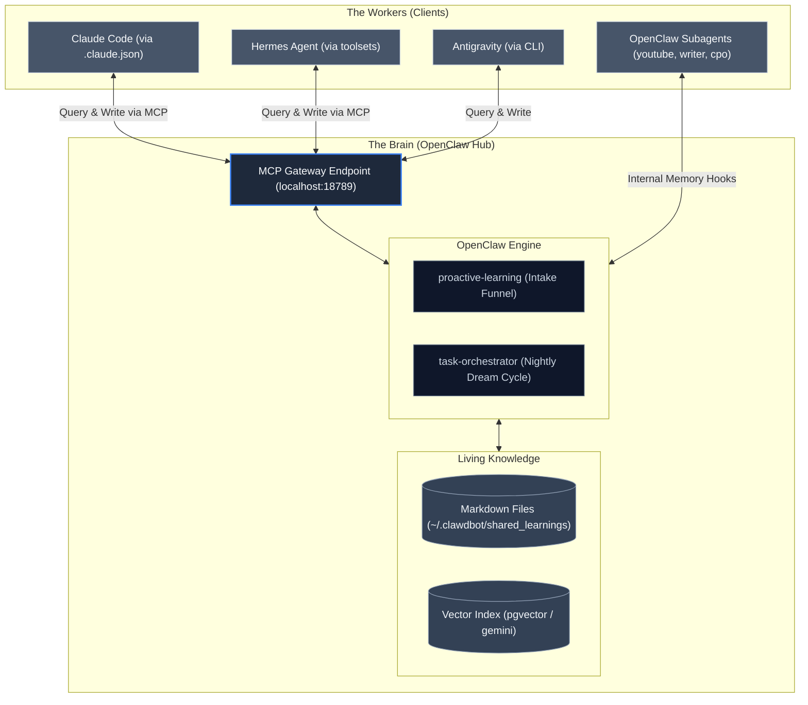

# Digital Me: The Living Knowledge Vision

This document outlines the architectural blueprint for the "Digital Me" – a single, compounding source of truth for personal digital assets that spans across all AI agents. It embraces the philosophy that your memory, knowledge, and preferences should not be trapped inside individual LLM contexts, but instead governed as a unified, living ecosystem.

## 1. The Core Philosophy (The "Brain/Worker" Paradigm)

The fundamental shift in this architecture is separating the **Brain** (which stores, structures, and serves knowledge) from the **Workers** (which act upon knowledge). 

*   **The Hub (OpenClaw):** Acts as the central nervous system. It does not just perform tasks; it manages the physical knowledge base, runs regular indexing and semantic consolidation ("Dream Cycles"), and exposes this knowledge programmatically.
*   **The Workers (Claude Code, Hermes Agent, Antigravity, Subagents):** Specialized task runners. When assigned a task, they ping the Hub to retrieve past context, execute the work, and then report back to the Hub to permanently store any new learnings or solutions.

### Architecture Topology

## 2. Inspired by GBrain Principles

While inspired by systems like "GBrain", the Digital Me vision is heavily grounded in our own native `proactive-learning` and `task-orchestrator` extensions running on OpenClaw. We replicate the success of external systems by transplanting five core primitives into our ecosystem:

### I. Separation of Storage and Index
*   **Storage:** The ultimate source of truth is a directory of physical, human-readable Markdown files (e.g., `~/.clawdbot/shared_learnings/`).
*   **Index:** A local `pgvector` or local embeddings layer managed by OpenClaw's memory plugin ensures fast semantic retrieval.

### II. The Universal MCP Gateway
*   OpenClaw exposes an active **Model Context Protocol (MCP)** server (e.g., on a local port).
*   Any agent (Claude Code via `.claude.json`, Hermes Agent via toolsets, Antigravity) simply targets this MCP endpoint. The entire system is perfectly framework-agnostic. OpenClaw serves the Brain, everything else consumes it.

### III. The Playbook (Behavioral Conditioning)
*   Agents must be conditioned. A global `SKILLPACK.md` or system prompt instructs every worker on the strict "Read First, Write After" lifecycle:
    1. **READ**: Before touching code or generating a solution, query the central space via MCP.
    2. **EXECUTE**: Apply the context.
    3. **WRITE**: Explicitly document generalized solutions, architectural decisions, and preferences as new Markdown assets in the central space.

### IV. Asynchronous Evolution (The Dream Cycle)
*   Instead of static cron jobs, the `task-orchestrator` plugin within OpenClaw runs detached background threads. While the user sleeps, these orchestrator tasks automatically fetch the daily logs, resolve dangling citations, extract new cross-referenced concepts, and consolidate the digital memory graph.

### V. Intake Funnels
*   The `proactive-learning` extension acts as the funnel, automatically capturing key discoveries from daily conversational and operational flows and committing them gracefully into the structured Markdown repository.

## 3. The Compounding Effect - standardizing your own personal Cloud API for your agents!
When implemented, this ecosystem ensures you never start from zero. Every solved bug, every written PR, and every discussed architecture decision is automatically documented into "Digital Me". Over time, the centralized brain becomes deeply attuned to your exact coding practices, life details, and problem-solving preferences, making all attached agents radically smarter in your domain.

### The Living Knowledge (via proactive-learning) - Cross-platform living knowledge!
OpenClaw exposes MCP memory tools (search_memory, inject_learning). Now, Hermes can learn something today, and Claude Code can magically remember it tomorrow because they both query the exact same endpoint.

### The Project Manager (via task-orchestrator) - Cross-platform project manager!
OpenClaw exposes MCP task tools (tasks.plan_goal, tasks.checkpoint). You can give a massive goal to Antigravity, Antigravity can break it down, put the sub-tasks into your central SQLite database, and Hermes can pick up Task #2 while Claude Code works on Task #3! 

