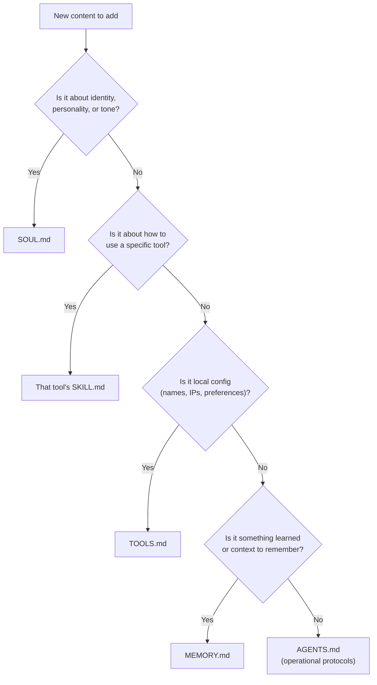

# Best Practices: Writing OpenClaw Workspace Files

A comprehensive guide to keeping `AGENTS.md`, `SOUL.md`, `MEMORY.md`, `TOOLS.md`, and `SKILL.md` clean, non-overlapping, and token-efficient.

> [!IMPORTANT]
> **The overarching philosophy:** Files are the source of truth — the agent only "remembers" what gets written to disk. These workspace files form a cohesive system where AGENTS.md is the playbook, SOUL.md is the personality, MEMORY.md is the long-term brain, TOOLS.md is the local environment map, and Skills teach new capabilities.

---

## The Mental Model

| File | Analogy | Core Question | Loaded |
|:---|:---|:---|:---|
| **SOUL.md** | Personality & values | *"What kind of person are you?"* | Every turn |
| **AGENTS.md** | Employee handbook | *"How does this workplace run?"* | Every turn (incl. subagents) |
| **MEMORY.md** | Personal notebook | *"What do I know / need to remember?"* | Main session only |
| **TOOLS.md** | Post-it notes on your desk | *"What are my local setup quirks?"* | Every turn |
| **SKILL.md** | Training manual (per tool) | *"How do I use this specific tool?"* | When skill is active |

> [!WARNING]
> Everything except `MEMORY.md` and `SKILL.md` is injected **every turn**. Overlap = wasted tokens on every single API call.

---

## Decision Flowchart

When adding new content, use this to find the right file:



---

## AGENTS.md — The Operating Manual

The **most important file** — loaded at the start of every session (including subagent sessions). This is the agent's playbook.

### What Goes In It

| Section | Content |
|:---|:---|
| **Session startup routine** | Read `SOUL.md` → `USER.md` → recent `memory/YYYY-MM-DD.md`. "Don't ask permission. Just do it." |
| **Memory rules** | Two-layer system: daily logs for raw notes, `MEMORY.md` for curated long-term memory. `MEMORY.md` only loads in main/private session (never in group contexts — security). |
| **"Write it down" rules** | Mental notes don't survive sessions. If someone says "remember this" → write to file. Lessons learned → document them. |
| **Safety boundaries** | Safe to do freely: read files, explore, search web. Ask first: emails, tweets, anything external. `trash > rm`. |
| **Group chat behavior** | When to speak vs. stay silent. "Participate, don't dominate." Don't respond to every message. |
| **Heartbeat behavior** | What to check during proactive polls (emails, calendar). When to stay quiet (`HEARTBEAT_OK`). |
| **Platform formatting** | "Discord/WhatsApp: no markdown tables." "Wrap Discord links in `<>` to suppress embeds." |

### Best Practices

- Keep it **practical and action-oriented** — instructions, not philosophy
- Make it yours over time — the template is a starting point
- The agent should feel empowered to **update AGENTS.md itself** when it learns lessons

### ❌ Does NOT Belong Here

| Content | Move To | Why |
|:---|:---|:---|
| Personality traits, tone, values | `SOUL.md` | Identity, not procedure |
| "Preferred voice: Nova" | `TOOLS.md` | Local environment config |
| Discord API examples, embeds format | `discord/SKILL.md` | Tool-specific documentation |
| "Use sag for storytelling" | `sag/SKILL.md` | Tool-specific recommendation |

---

## SOUL.md — WHO You Are

The agent's persona, tone, and boundaries. Loaded every session.

### What Goes In It

- **Core identity**: Communication style, personality traits, values
- **Boundaries**: Private things stay private. Ask before acting externally. Never send half-baked replies to messaging surfaces.
- **Vibe**: "Be the assistant you'd actually want to talk to."

### Key Principles (from the template)

- Be genuinely helpful, not performatively helpful — skip "Great question!"
- Have opinions — an assistant with no personality is just a search engine
- Be resourceful before asking — try to figure it out first
- Earn trust through competence

### Best Practices

- **Target: <200 tokens** — this is pure identity, not procedures
- The agent can evolve this file over time, but **should tell the user** when it does
- If you swapped to a completely different operational setup, SOUL.md should still make sense

```markdown
# Good ✅
- Concise, opinionated, never sycophantic
- Resourceful before asking
- Private things stay private

# Bad ❌ (these belong elsewhere)
- "Use trash instead of rm" → AGENTS.md (operational rule)
- "Discord: no markdown tables" → discord/SKILL.md
- "Camera: living-room → wide angle" → TOOLS.md
```

---

## MEMORY.md — Curated Long-Term Memory

Optional (not auto-created). Represents the agent's distilled, long-term memory — separate from daily logs.

### Key Rules

| Rule | Detail |
|:---|:---|
| **Main session only** | Never loaded in shared contexts (Discord, group chats) — for security |
| **Curated, not raw** | Daily files (`memory/YYYY-MM-DD.md`) = raw notes; `MEMORY.md` = distilled wisdom |
| **Agent-maintained** | During heartbeats, periodically review recent daily files → update MEMORY.md |
| **Pruned regularly** | Remove outdated info that's no longer relevant |

### What Goes In It

```markdown
# Good ✅
- Key decisions made ("Chose PostgreSQL over MongoDB for project X")
- User preferences ("User prefers dark mode UIs")
- Project context ("Migrating from REST to GraphQL, started Feb 2026")
- Lessons learned ("Always check git status before branching")
- Important durable facts

# Bad ❌
- Operational rules → AGENTS.md
- Tool documentation → SKILL.md
- Day-to-day running context → memory/YYYY-MM-DD.md
- Secrets (unless explicitly asked to keep them)
```

### Best Practices

- Think of it like a human reviewing their journal and updating their mental model
- Old items → `memory/archive.md` to reduce per-session token cost
- Write clear, descriptive notes — the memory system supports **vector search** (semantic queries across MEMORY.md and `memory/*.md`), so clarity helps retrieval
- Before auto-compaction, OpenClaw triggers a silent flush to remind the agent to write durable memories — cooperate with that system

---

## TOOLS.md — Your Local Environment Cheat Sheet

**Guidance only** — does not control tool availability (that's `tools.allow`/`tools.deny` in config). This is the agent's notes about your specific environment.

### What Goes In It

- Camera names and locations
- SSH hosts and aliases
- Preferred TTS voices
- Speaker/room names and device nicknames
- Anything environment-specific

### Example

```markdown
### Cameras
- living-room → Main area, 180° wide angle
- front-door → Entrance, motion-triggered

### SSH
- home-server → 192.168.1.100, user: admin

### TTS
- Preferred voice: "Nova" (warm, slightly British)
- Default speaker: Kitchen HomePod
```

### Best Practices

- **Keep separate from Skills** — skills are shared/portable; TOOLS.md is your personal setup that shouldn't leak if you share skills
- The agent should **update this itself** when it discovers new local details
- Think of it as a cheat sheet, not a comprehensive manual

### ❌ Does NOT Belong Here

| Content | Move To | Why |
|:---|:---|:---|
| How to use the TTS API | `sag/SKILL.md` | That's tool documentation |
| "Always ask before sending emails" | `AGENTS.md` | Operational rule |
| Behavioral guidelines | `AGENTS.md` or `SOUL.md` | Not environment config |

---

## SKILL.md — Teaching the Agent New Capabilities

Skills live in `skills/` folders. Each skill is a directory with a `SKILL.md` containing YAML frontmatter + instructions.

### Required Minimum

```yaml
---
name: my-skill-name
description: What this skill does
---
```

### Optional Frontmatter Keys

| Key | Type | Purpose |
|:---|:---|:---|
| `homepage` | string | URL for the skill's website |
| `user-invocable` | bool | Expose as a slash command (default: `true`) |
| `disable-model-invocation` | bool | Exclude from model prompt (default: `false`) |
| `command-dispatch` | `tool` | Bypass the model, dispatch directly to a tool |
| `command-tool` | string | Which tool to invoke for direct dispatch |
| `allowed-tools` | list | Which tools this skill can use |
| `metadata` | JSON | Gating and configuration (single-line JSON) |

### Gating (Load-Time Filters)

Use `metadata` to auto-filter skills based on environment readiness:

```yaml
metadata: { "openclaw": { "requires": { "bins": ["uv"], "env": ["GEMINI_API_KEY"], "config": ["browser.enabled"] }, "primaryEnv": "GEMINI_API_KEY" } }
```

- `requires.bins` — required binaries on PATH
- `requires.env` — required environment variables
- `requires.config` — required truthy config values

### Best Practices

- Use `{baseDir}` in instructions to reference the skill folder path
- **Keep descriptions concise** — injected into system prompt; each skill costs ~97 chars + name/description in tokens
- Gate skills properly so they only load when the environment supports them
- Treat third-party skills as untrusted code — read them before enabling
- Override order: workspace skills > managed skills > bundled skills (by name)
- For multi-agent setups: per-agent skills → `<workspace>/skills`, shared skills → `~/.openclaw/skills`

### ❌ Does NOT Belong Here

| Content | Move To | Why |
|:---|:---|:---|
| "Your Discord server ID is 12345" | `TOOLS.md` | Local environment config |
| "Check Discord during heartbeats" | `AGENTS.md` | Operational protocol |
| "Be concise in group chats" | `AGENTS.md` or `SOUL.md` | Behavioral guideline |

---

## Other Important Files

| File | Purpose | Notes |
|:---|:---|:---|
| **USER.md** | Who the user is: name, pronouns, timezone, preferences, pet peeves | "You're learning about a person, not building a dossier." |
| **IDENTITY.md** | Name, creature type, vibe, emoji, avatar | Created during the bootstrap ritual |
| **HEARTBEAT.md** | Short checklist for periodic heartbeat runs | Keep small to limit token burn. If empty, OpenClaw skips heartbeat. |
| **BOOTSTRAP.md** | One-time first-run ritual | Deleted after the agent figures out who it is |

---

## Common Overlap Fixes

Content that commonly ends up in the **wrong** file:

| Content | Currently In | Should Be In | Reason |
|:---|:---|:---|:---|
| "Don't exfiltrate data" | AGENTS.md | **SOUL.md** | Core value, not procedure |
| `trash > rm` | AGENTS.md | **SOUL.md** | Safety value |
| Discord formatting rules | AGENTS.md | **discord/SKILL.md** | Tool-specific |
| Voice storytelling tip | AGENTS.md | **sag/SKILL.md** | Tool-specific |
| WhatsApp formatting | AGENTS.md | **whatsapp/SKILL.md** | Tool-specific |
| Camera names | *(sometimes SKILL.md)* | **TOOLS.md** | Local environment config |

---

## Token Impact

Since `SOUL.md`, `AGENTS.md`, and `TOOLS.md` load **every turn**, keeping them lean matters:

```
10-turn conversation with 500 tokens of overlap across files:
  → 500 tokens × 10 turns = 5,000 wasted tokens per conversation
```

Moving tool-specific content to `SKILL.md` means you **only pay when that skill is active** — potentially saving thousands of tokens per session.

---

## TL;DR

> **SOUL** = who · **AGENTS** = how · **MEMORY** = what · **TOOLS** = where · **SKILL** = how-to-use-X

When in doubt, ask: *"Would this make sense if I swapped to a completely different personality (SOUL) or a different local setup (TOOLS)?"* If yes, it doesn't belong in that file.
