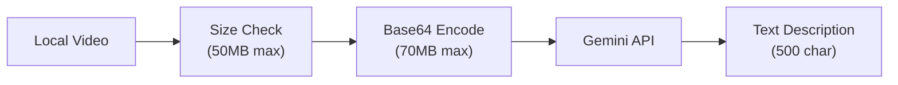

# Video Analysis Understanding

How OpenClaw/ClawdBot analyzes local large videos.

## Pipeline Overview



## Key Limits

| Limit | Value |
| :--- | :--- |
| Max Video | **50 MB** |
| Max Base64 | **70 MB** |
| Timeout | **120 sec** |
| Output | **500 chars** |

## No Frame Extraction

OpenClaw sends the **entire video as base64** to Gemini's native video API:

```typescript
// providers/google/video.ts
inline_data: {
  mime_type: "video/mp4",
  data: videoBuffer.toString("base64")
}
```

**Why?**
- Gemini processes video natively (~1 FPS internally)
- Better temporal understanding than frame snapshots
- No ffmpeg dependency needed

## Token Usage

| Duration | ~Tokens |
| :--- | :--- |
| 1 min | 1,000 |
| 10 min | 10,000 |
| 1 hour | 60,000 |

**Cost saving**: Output trimmed to 500 chars → minimal output tokens.

## Provider

Only **Google/Gemini** supports video currently:
- Model: `gemini-3-flash-preview`
- Endpoint: `generativelanguage.googleapis.com/v1beta`
